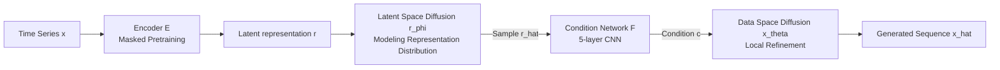

# Latent-to-Data Cascaded Diffusion Models for Unconditional Time Series Generation

**Conference**: ICLR 2026  
**OpenReview**: [https://openreview.net/forum?id=nAyeE7cAS0](https://openreview.net/forum?id=nAyeE7cAS0)  
**Code**: To be confirmed  
**Area**: Time Series Generation / Diffusion Models  
**Keywords**: Unconditional Time Series Generation, Cascaded Diffusion, Latent Space Diffusion, Data Space Diffusion, Representation Learning  

## TL;DR
Ours proposes L2D-Diff—a cascaded (latent-to-data) dual-space framework that decomposes unconditional time series generation into two steps: modeling the high-level representation distribution in latent space and using these representations as conditions to guide the refinement of local details in data space, thereby balancing representation consistency and local fidelity.

## Background & Motivation
**Background**: Synthetic Time Series Generation (TSG) is critical for privacy protection, data augmentation, and anomaly detection. GANs were previously mainstream but suffered from training instability and mode collapse; recently, Diffusion Models (DDPM) have taken over due to superior generation quality and stable training.

**Limitations of Prior Work**: Existing diffusion methods are constrained by "single-space" approaches—**latent space diffusion** (TimeLDM, LDT) models compressed representations and excels at capturing high-level semantic structures, but information bottlenecks in the encoder discard fine-grained temporal details, losing fidelity. **Data space diffusion** (Diffusion-TS, FourierDiffusion) performs denoising directly on original sequences, providing precise local details but struggling to fully model complex high-level representation distributions.

**Key Challenge**: Real-world time series often exhibit **multi-modal distributions** (e.g., datasets with class labels showing significant cross-class differences). There is a need to capture diverse high-level distributions while preserving local temporal fidelity—a balance difficult for single-space models to achieve.

**Goal**: To perform unconditional TSG without relying on any external conditions (e.g., text) while simultaneously achieving global representation consistency and local fidelity.

**Core Idea**: **Shift from "unconditional diffusion in data space" to "latent-to-data conditional diffusion"**—first learn the representation distribution via latent space diffusion, and then feed the sampled latent codes as conditions into the data space diffusion. Thus, unconditional generation is reformulated as a conditional generation problem, using a divide-and-conquer strategy where both branches perform their respective roles.

## Method

### Overall Architecture
L2D-Diff consists of two cascaded collaborating diffusion/denoising branches: the latent space branch models high-level representation distributions, and the data space branch reconstructs full-resolution sequences conditioned on the latent codes. A latent-to-data conditioning mechanism injects latent codes into the data space denoising process. During training, three components (encoder-decoder masked pretraining → latent space diffusion → data space conditional diffusion) are optimized separately. During inference, a representation $\hat{r}_0$ is sampled from noise in the latent space, which then acts as a condition to drive the sampling of the final sequence $\hat{x}_0$ from noise in the data space.

### Key Designs

**1. Masked Pretraining for Latent Space: Ensuring compact and informative representations.** Given input $x \in \mathbb{R}^{D\times L}$, a masked modeling pretraining task compresses it into a fixed-length low-dimensional representation $r \in \mathbb{R}^d$ ($d \ll L\times D$). Parts of the tokens are randomly obscured using a binary mask $m$ to get $x_{\text{masked}}$. The encoder $E$ produces $r_{\text{masked}}=E(x_{\text{masked}})$, and the decoder $D$ reconstructs the original sequence. The loss is calculated only on the masked positions: $L_{\text{pretraining}}=\|m\odot(x-D(E(x_{\text{masked}})))\|_2^2$. Implementation uses the TS2Vec CNN as the encoder, a default latent dimension of 8, and a mask rate of 50%, ensuring $r$ carries stable high-level temporal semantics.

**2. Latent Space Diffusion for Representation Distribution: Solving "multi-modality" in low-dimensional space.** After encoding $r_0=E(x)$, standard DDPM forward noise addition is applied: $r_s=\sqrt{\bar\alpha_s}r_0+\sqrt{1-\bar\alpha_s}\epsilon$. The denoising network $r_\phi$ is trained to predict the clean representation directly, with loss $L_{\text{latent}}=\mathbb{E}_{r_0,\epsilon,s}\|r_0-r_\phi(r_s,s)\|^2$. Operating in a low-dimensional space makes capturing multi-modal distributions efficient and robust.

**3. Latent-to-data Condition Injection: Reformulating unconditional generation.** This is the pivotal design—sampling $\hat{r}$ from the learned latent distribution and feeding it as condition $c=r$ into the data space diffusion. Consequently, "unconditional TSG" is re-expressed as "representation-conditioned generation." The condition network $F$ (a 5-layer CNN) projects the latent code into a guidance signal compatible with data space denoising, modulating each denoising step so local refinement aligns with global structures.

**4. Data Space Conditional Diffusion for Local Refinement: Completing fine-grained series under latent guidance.** The data space denoising network $x_\theta$ receives noise input $x_k$, timestep $k$, and condition signal $F(c)$ at each step $k$, optimizing the data prediction strategy: $L_{\text{data}}=\mathbb{E}_{x_0,\epsilon,k}\|x_0-x_\theta(x_k,k,F(c))\|^2$. With the global structure secured by the latent code, the data branch focuses on local details and residual uncertainty, enhancing local fidelity while ensuring overall consistency.

### Inference Workflow
Inference follows a two-stage sampling process: first, starting from $\hat{r}_S\sim\mathcal{N}(0,I)$ in latent space, iterating via reverse steps:

$$\hat{r}_{s-1}=\frac{\sqrt{\alpha_s}(1-\bar\alpha_{s-1})}{1-\bar\alpha_s}r_s+\frac{\sqrt{\bar\alpha_{s-1}}(1-\alpha_s)}{1-\bar\alpha_s}r_\phi(r_s,s)+\sigma_s\epsilon$$

until $s=1$ to obtain the sampled representation $\hat{r}_0$. Then, setting condition $c=\hat{r}_0$ and starting from $\hat{x}_K\sim\mathcal{N}(0,I)$ in data space, iterating via symmetric reverse steps $\hat{x}_{k-1}=\frac{\sqrt{\alpha_k}(1-\bar\alpha_{k-1})}{1-\bar\alpha_k}x_k+\frac{\sqrt{\bar\alpha_{k-1}}(1-\alpha_k)}{1-\bar\alpha_k}x_\theta(x_k,k,F(c))+\sigma_k\epsilon$ until $k=1$ to output the final sequence $\hat{x}_0$. Both diffusion stages use $K=100$ steps and linear variance scheduling.

## Key Experimental Results

### Main Results (Contextual-FID, lower is better, 11 datasets)
The evaluation covers unimodal (Stock/Energy/ETTh/Riverflow) and multi-modal (7 classification datasets with labels) data. Selected representative results:

| Method | Stock | Energy | ECG5000 | Arabic Digits | Character Traj. | Average Rank |
|---|---|---|---|---|---|---|
| **L2D-Diff** | **0.31** | **0.53** | **0.11** | **1.29** | **0.28** | **1.45** |
| FourierDiffusion | 0.21 | 0.48 | 0.32 | 1.26 | 3.58 | 3.55 |
| FourierFlow | 1.15 | 0.38 | 0.98 | 2.84 | 5.07 | 5.36 |
| Diffusion-TS | 0.49 | 0.82 | 1.95 | 1.66 | 3.57 | — |
| TimeGAN | 0.88 | 0.87 | 3.88 | 4.73 | 3.97 | — |

L2D-Diff achieves an average rank of 1.45, significantly outperforming all baselines according to Friedman + Conover tests. The second-best, FourierDiffusion, scored only 3.55. The advantage is particularly pronounced in multi-modal datasets.

### Ablation Study (Stock / Character Trajectories)

| Variant | Stock C-FID | Stock DS | CharTraj C-FID | CharTraj DS |
|---|---|---|---|---|
| **L2D-Diff (full)** | **0.310** | **0.048** | **0.284** | **0.179** |
| Latent-space only | 3.682 | 0.204 | 1.829 | 0.355 |
| Data-space only | 0.385 | 0.049 | 2.368 | 0.380 |

### Key Findings
- **Dual spaces are indispensable**: Removing either branch leads to significant degradation. The relative importance varies by data—the data space branch is more critical for short sequences (Stock, L=24), while the latent space branch is more vital for multi-modal long sequences (Character Trajectories, 20 classes), confirming the complementarity of "Global Representation + Local Fidelity."
- **t-SNE Visualization**: On the 20-class Character Trajectories, L2D-Diff reproduces the diversity of each mode, whereas baselines like FourierDiffusion/Diffusion-TS/TimeGAN often only capture the distribution center.
- The authors treat DS/PS as secondary metrics (sensitive to model settings and data scale), prioritizing C-FID.

## Highlights & Insights
- **Ingenious Reformulation**: Converting "unconditional generation" into "conditional generation" via latent codes allows the two diffusion processes to manage separate tasks—a classic divide-and-conquer approach. This is the first application of latent↔data cascading for unconditional TSG.
- **Independence from External Conditions**: Unlike T2S and other schemes requiring text assistance, this method relies purely on self-learned representation distributions for guidance, making it simpler and more efficient.
- **IB Theory Support**: The use of an Information Bottleneck perspective to explain why the latent space manages global semantics while the data space focuses on local details provides a theoretical grounding for empirical designs.

## Limitations & Future Work
- The cascaded structure involves two diffusion models plus an encoder-decoder, requiring two sequential sampling rounds during inference, which results in higher overhead and latency compared to single-space models.
- Sensitivity of key hyperparameters like latent dimension (default 8) and mask rate (50%) to different datasets requires manual tuning; an adaptive mechanism is lacking.
- Authors admit DS/PS metrics are unstable, relying primarily on C-FID as a single main metric; robustness across multiple metrics could be further strengthened.
- The encoder directly adopts the TS2Vec pretrained CNN, limiting latent space quality to this representation; the potential for end-to-end joint optimization hasn't been fully explored.

## Related Work & Insights
- **Representation-conditioned generation in Vision/Graph**: RCG (using pretrained image encoders for representation distribution before conditioning image generation), its graph data extensions, and EDDPM (unifying space encoding/decoding) are close relatives of the latent-to-data idea. However, temporal consistency and multi-channel correlation in time series present unique challenges.
- **Two Streams of Unconditional TSG**: Data space (Diffusion-TS, FourierDiffusion, ImagenTime, TransFusion) vs. latent space (TimeLDM, LDT)—Ours seeks to combine the strengths of both.
- **Inspiration**: When a generation problem requires both "global structure" and "local details" that are difficult to obtain in a single space, the cascaded paradigm of "distribution setup in low-dim space + conditional refinement in high-dim space" is worth migrating to other sequential modalities like audio, trajectories, or sensors.

## Rating
- Novelty: ⭐⭐⭐⭐ First systematic application of latent-to-data cascaded diffusion for unconditional TSG with clear reformulation logic.
- Experimental Thoroughness: ⭐⭐⭐⭐ 11 datasets + multiple baselines + significance tests + ablation/visualization, covering uni/multi-modality; however, heavily reliant on C-FID.
- Writing Quality: ⭐⭐⭐⭐ Motivation, Comparison Table (Table 1), framework diagrams, and IB interpretation are well-structured and easy to read.
- Value: ⭐⭐⭐⭐ The dual-space complementary paradigm is simple and effective, offering insights for privacy/augmentation in TSG and cross-modal migration.

<!-- RELATED:START -->

## Related Papers

- [\[ICLR 2026\] A Study of Posterior Stability in Time-Series Latent Diffusion](a_study_of_posterior_stability_in_time-series_latent_diffusion.md)
- [\[ICLR 2026\] TEDM: Elucidated Diffusion Models for Time Series Forecasting](tedm_time_series_forecasting_with_elucidated_diffusion_models.md)
- [\[ICML 2026\] Latent Laplace Diffusion for Irregular Multivariate Time Series](../../ICML2026/time_series/latent_laplace_diffusion_for_irregular_multivariate_time_series.md)
- [\[NeurIPS 2025\] Synthetic Series-Symbol Data Generation for Time Series Foundation Models](../../NeurIPS2025/time_series/synthetic_series-symbol_data_generation_for_time_series_foundation_models.md)
- [\[ICLR 2026\] TrajFlow: Nationwide Pseudo GPS Trajectory Generation with Flow Matching Models](trajflow_nation-wide_pseudo_gps_trajectory_generation_with_flow_matching_models.md)

<!-- RELATED:END -->
