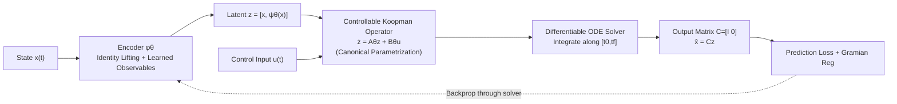

# Learning Koopman Representations with Controllability Guarantees

**Conference**: ICLR 2026  
**OpenReview**: [https://openreview.net/forum?id=jITPFROpWN](https://openreview.net/forum?id=jITPFROpWN)  
**Code**: [https://github.com/KYMiao/Controllable-Koopman](https://github.com/KYMiao/Controllable-Koopman)  
**Area**: Time Series / Dynamical Systems Learning (System Identification and Control)  
**Keywords**: Koopman Operator, Controllability, Neural ODE, System Identification, Model Predictive Control (MPC), Data Efficiency  

## TL;DR
This work encodes "controllability" as a **structural prior** directly into Koopman representation learning. By parameterizing latent linear operators with a new controllable canonical form, the learned Neural ODE model is **controllable by construction**, enabling accurate fitting and direct MPC application even under data scarcity.

## Background & Motivation
- **Background**: Learning nonlinear dynamical models from data is central to control design. Deep methods (Neural State-Space Models, RNNs, Neural ODEs) offer high expressivity for fitting complex trajectories, while Koopman methods approximate nonlinear dynamics as linear in a "lifted space," allowing the direct application of linear control tools like MPC.
- **Limitations of Prior Work**: Purely prediction-oriented models, despite fitting trajectories well, are often **unsuitable for control**—nonlinear structures hinder MPC and lack guarantees for closed-loop properties (stability, safety). Nearly all identification methods **focus solely on trajectory fitting**, leaving structural properties for post-hoc validation.
- **Key Challenge**: A critical control prior is **controllability**, which guarantees the existence of control strategies to drive a system from any initial state to any target state. However, encoding controllability during training is difficult: verifying it for nonlinear systems requires checking complex rank conditions on infinite Lie brackets. Existing works either add the Kalman rank condition as a loss (which neither guarantees nor reflects true controllability) or remain purely theoretical without computational methods.
- **Goal**: To develop a model that is **both accurately predictive and guaranteed to be controllable by construction**, treating controllability as an inductive bias to narrow the search space rather than a post-hoc patch.
- **Core Idea**: **[Controllability as a Prior]** Instead of learning dynamics directly in the original state space, the method learns linear representations in a Koopman latent space. It proves that "latent linear model controllability $\implies$ original nonlinear system controllability" and hard-codes this property into network weights via **controllable canonical form parametrization**. Combined with Gramian regularization to shape the "degree of controllability," the model is trained as an end-to-end Neural ODE.

## Method

### Overall Architecture
The system is modeled as a Neural ODE in Koopman form: an encoder $\phi_\theta$ lifts the state $x$ to latent variables $z=[x,\ \psi_\theta(x)]$ (using identity lifting for the first $n$ dimensions to preserve the original state). The latent space follows linear dynamics $\dot z = A_\theta z + B_\theta u$, and a fixed output matrix $C=[I_n\ \ 0]$ decodes it back to $\hat x = Cz$. The entire pipeline (encoder + controllable Koopman operator + differentiable ODE solver) is trained end-to-end. Crucially, $A_\theta, B_\theta$ are not learned freely but are constrained by a canonical form to ensure controllability.

### Key Designs

**1. Equating "Output Controllability" to "Verifiable State-Output Controllability":** The paper distinguishes between State-Output Controllability (SOC, driving latent states to drive outputs) and Output-Output Controllability (OOC, driving original outputs to target outputs). Lemma 1 proves that under identity lifting, **OOC and SOC are equivalent** within the latent set $Z:=\phi(\mathbb R^n)$. Theorem 1 provides a verifiable criterion: the system is OOC if and only if the controllability matrix $\mathcal C = C[B_\theta\ \ A_\theta B_\theta\ \cdots\ A_\theta^{N-1}B_\theta]$ has full rank. This transforms "model controllability" from a theoretical concept into an algebraic condition applicable to networks.

**2. Controllable Canonical Form Parametrization:** Theorem 2 provides a hard construction: a canonical controllable pair $(A^c_\theta, B^c_\theta)$ is defined where $A^c_\theta$ has 0/1 elements in the first $n-1$ rows (with 1s on the super-diagonal) and $B^c_\theta$ has 0s in the first $n-1$ rows and 1 in the $n$-th. After a **learnable similarity transformation** $P_\theta=\mathrm{diag}(P_1,P_2)$, the actual operators are:

$$A_\theta = P_\theta A^c_\theta P_\theta^{-1}, \qquad B_\theta = P_\theta B^c_\theta.$$

Since similarity transformations preserve controllability, $(A_\theta,B_\theta)$ remains OOC regardless of how $P_\theta$ or the free elements are trained. $P_\theta$ provides the necessary expressivity that a raw canonical form lacks.

**3. Gramian Regularization for "Degree of Controllability":** Controllability alone is insufficient if driving the system requires extreme energy. The paper uses the finite-horizon output Gramian $W^y_T=\int_0^T (Ce^{A_\theta\tau}B_\theta)(Ce^{A_\theta\tau}B_\theta)^\top d\tau$ to measure the excitation of physical states. A small $\lambda_{\min}$ implies "hard-to-drive" directions, while a large condition number $\kappa$ suggests ill-posed optimization. The regularization term is:

$$R_{\mathrm{gram}}(A_\theta,B_\theta)=\frac{1}{\lambda_{\min}(W^y_T)+\gamma}\ \kappa(W^y_T),$$

encouraging balanced and well-conditioned controllability across all directions.

**4. End-to-End Loss & MPC Deployment:** The training objective is $\min_\theta L_{\mathrm{pred}}(\theta)+\lambda_{\mathrm{gram}}R_{\mathrm{gram}}$. The prediction loss $L_{\mathrm{pred}}$ is evaluated over a **full rollout** rather than single steps, with weights $w(t)$ focusing on early errors while considering the entire interval. For deployment, the continuous model is discretized via Zero-Order Hold (ZOH) into $(A^d_\theta,B^d_\theta)$. MPC is then formulated as a **convex Quadratic Program (QP)** over the linear surrogate, ensuring fast solving and convergence.

## Key Experimental Results

### Main Results (Prediction Accuracy vs. Data Volume)
On three nonlinear benchmarks (Mountain Car, Pendulum, Cartpole), the prediction MSE of MLP, DKO (Deep Koopman Operator), and the proposed method was compared across data ratios (1% to 100%):

| Environment | Method | 1% | 5% | 10% | 30% |
|------|------|------|------|------|------|
| Mountain Car | DKO | 0.0200 | 0.00022 | 0.00016 | — |
| Mountain Car | **Ours** | **0.0032** | **0.00019** | **0.00011** | — |
| Pendulum | DKO | 1.5347 | 0.1079 | 0.0390 | 0.0086 |
| Pendulum | **Ours** | **0.3747** | **0.0318** | **0.0114** | **0.0061** |
| Cartpole | DKO | 0.1306 | 0.01452 | 0.007585 | 0.00064 |
| Cartpole | **Ours** | **0.0095** | **0.0024** | **0.001153** | **0.000571** |

Ours significantly leads when data is <30%. Performance is comparable to DKO with sufficient data, but Ours maintains the **controllability guarantee** that DKO lacks.

### Control Performance (MPC Input Cost)

| Environment | Task | Data | DKO Cost | Ours Cost | Relative Gain |
|------|------|------|----------|----------|-------|
| Mountain Car | Swing-up | 1% | Fail | 186.59 | — |
| Mountain Car | Swing-up | 5% | 297.51 | 165.21 | 44.5% ↓ |
| Pendulum | Swing-up | 5% | Fail | 100.25 | — |
| Pendulum | Swing-up | 10% | 239.2 | 43.50 | 81.8% ↓ |
| Cartpole | Balance | 30% | Fail | 19.61 | — |

Under data scarcity, DKO often results in infeasible MPC (Fail) due to inaccurate/uncontrollable models, while Ours completes tasks with significantly lower input energy.

### Key Findings
- Controllability is a powerful inductive bias: it **improves data efficiency, accelerates convergence, and stabilizes predictions**.
- Discrete MLPs struggle with continuous dynamics, leading to rapid error accumulation in rollouts.
- Continuous-time formulation allows models to handle irregular sampling and operate at control frequencies different from training frequencies without retraining.

## Highlights & Insights
- **"Prior as Pruning"**: The method treats controllability as a structural prior that prunes the search space (illustrated in Figure 1), transforming a property meant for downstream control into a lever for training efficiency.
- **Theoretical Closure**: The chain from OOC equivalence (Lemma 1) to verifiable rank criteria (Theorem 1) to hard construction (Theorem 2) provides a rigorous "differentiable parametrization" instead of a weak loss penalty.
- **Similarity Transform**: The use of $P_\theta$ is crucial; it restores expressivity to the rigid canonical form while preserving the invariant controllability property.

## Limitations & Future Work
- **Multi-input Complexity**: Parametrizing multi-input controllability via Brunovský decomposition is more complex, and performance degrades faster under data scarcity in multi-input settings.
- **Classic Benchmarks**: Experiments primarily focus on Pendulum/Cartpole; more large-scale validation on high-dimensional real-world systems is needed.
- **Controllability $\neq$ Stability/Safety**: This work only hard-codes controllability. Other closed-loop properties like stability or safety must be handled separately (as in Fan et al. 2024).

## Related Work & Insights
- **Koopman Representation**: Traditional DMD relies on predefined bases; recent neural approaches (Lusch 2018) focus on prediction but ignore structural properties. This work is among the few to embed controllability "by construction."
- **Controllability Priors**: Unlike Han et al. (2020) which uses a soft loss or Choi et al. (2024) which offers purely theoretical analysis, this work provides a computationally feasible hard constraint.
- **Insight**: Encoding "hard-to-verify" structural properties (controllability, observability, stability) into differentiable weight parametrizations is a powerful paradigm for injecting control theory priors into deep models.

## Rating
- **Novelty**: ⭐⭐⭐⭐⭐ First to provide OOC controllable canonical forms for Koopman learning and embed it "by construction."
- **Experimental Thoroughness**: ⭐⭐⭐⭐ Systematic validation across efficiency and control, though benchmarks remain somewhat classic.
- **Writing Quality**: ⭐⭐⭐⭐⭐ Precise progression from motivation to theoretical construction.
- **Value**: ⭐⭐⭐⭐⭐ High engineering and theoretical value for learning-based control by ensuring prediction accuracy and controllability simultaneously.

<!-- RELATED:START -->

## Related Papers

- [\[ICLR 2026\] Learning Recursive Multi-Scale Representations for Irregular Multivariate Time Series Forecasting](learning_recursive_multi-scale_representations_for_irregular_multivariate_time_s.md)
- [\[ICLR 2026\] TSPulse: Tiny Pre-Trained Models with Disentangled Representations for Rapid Time Series](tspulse_tiny_pre-trained_models_with_disentangled_representations_for_rapid_time.md)
- [\[NeurIPS 2025\] Learning Time-Scale Invariant Population-Level Neural Representations](../../NeurIPS2025/time_series/learning_time-scale_invariant_population-level_neural_representations.md)
- [\[ICML 2026\] Learning Long Range Spatio-Temporal Representations over Continuous Time Dynamic Graphs with State Space Models](../../ICML2026/time_series/learning_long_range_spatio-temporal_representations_over_continuous_time_dynamic.md)
- [\[ICLR 2026\] Can we generate portable representations for clinical time series data using LLMs?](can_we_generate_portable_representations_for_clinical_time_series_data_using_llm.md)

<!-- RELATED:END -->
