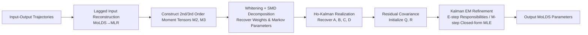

# Learning Mixtures of Linear Dynamical Systems via Hybrid Tensor-EM Method

**Conference**: ICLR 2026  
**OpenReview**: [https://openreview.net/forum?id=1GkzDABbME](https://openreview.net/forum?id=1GkzDABbME)  
**Code**: To be confirmed  
**Area**: Time Series / Dynamical System Identification  
**Keywords**: Mixture of Linear Dynamical Systems (MoLDS), Tensor Method of Moments, Simultaneous Matrix Diagonalization (SMD), Kalman EM, Neural Data Modeling  

## TL;DR
This paper proposes a hybrid Tensor-EM framework for learning "Mixtures of Linear Dynamical Systems (MoLDS)." It utilizes a tensor method of moments based on Simultaneous Matrix Diagonalization (SMD) for globally consistent initialization, followed by a full Kalman filter-smoother EM for local refinement. This approach balances global identifiability with statistical optimality and marks the first successful application of MoLDS to real neural data from non-human primates.

## Background & Motivation
**Background**: Linear Dynamical Systems (LDS) are foundational tools for modeling high-dimensional time series, particularly neural data. However, a single LDS struggle to capture heterogeneity—trajectories under different experimental conditions often exhibit distinct dynamics. MoLDS treats each trajectory as coming from one of several latent LDS components, enabling the simultaneous recovery of the number of subsystems, their parameters, and mixture weights. This structure is naturally suited for neural experiments involving "many trials and multiple conditions."

**Limitations of Prior Work**: MoLDS is difficult to deploy in complex, noisy real-world scenarios. Previous learning approaches follow two complementary but imperfect paths: (1) Tensor methods of moments rearrange high-order moments into structured tensors for decomposition, offering global identifiability guarantees but suffering from poor moment estimation under real-world noise; (2) Likelihood-based methods like EM are flexible but extremely sensitive to initialization and prone to poor local minima, a problem exacerbated by the high-dimensional parameter space and multi-modal likelihood surface of MoLDS.

**Key Challenge**: Global identifiability (Tensor) and statistical efficiency (EM) are traditionally difficult to achieve simultaneously—pure tensor methods lack precision under high noise, while randomly initialized EM is unstable and converges slowly.

**Goal**: To construct a robust and efficient MoLDS learning pipeline that reliably recovers parameters in difficult scenarios (limited data, high noise, poor component separation) and proves applicable to real neural data analysis.

**Core Idea**: **A hybrid strategy of "Tensor for global initialization + Kalman EM for local refinement."** A tensor method is used to push the estimation into the "region of attraction" of the maximum likelihood estimate, allowing EM to converge to statistical optimality. Innovations include replacing the Robust Tensor Power Method (RTPM) with SMD for more stable decomposition and providing a principled initialization for noise parameters $(Q, R)$, which was missing in previous tensor approaches.

## Method

### Overall Architecture
MoLDS models $N$ input-output trajectories, each generated by one of $K$ latent LDS components. Component labels $z_i\sim\text{Multinomial}(p_{1:K})$ are unknown. The objective is to recover mixture weights and LDS parameters $\{p_k,(A_k,B_k,C_k,D_k,Q_k,R_k)\}$ (identifiable up to permutation and similarity transformations). The pipeline consists of two stages: **Stage 1: Tensor Initialization** provides globally consistent weights and system matrix estimates, including an intermediate step to initialize noise parameters from residual covariances. **Stage 2: EM Refinement** uses Kalman filtering and smoothing to push all parameters toward statistical optimality.

### Key Designs

**1. Reforming MoLDS as MLR to expose mixture structures in high-order moments**: Direct tensor decomposition of LDS is challenging. This paper employs a "lagged input representation" to rewrite MoLDS as Mixture of Linear Regression (MLR). By concatenating inputs and their histories into augmented covariates, the LDS impulse responses (Markov parameters) become regression vectors for each component. Consequently, the mixture structure appears in the second- and third-order cross-moments of input-output data, accessible via spectral tensor tools. Unbiased estimates of moments are constructed as:

$$M_2=\frac{1}{2|N_2|}\sum_{j\in N_2}\tilde y_j^2\big(v_j\otimes v_j-I_d\big),\quad M_3=\frac{1}{6|N_3|}\sum_{j\in N_3}\tilde y_j^3\big(v_j^{\otimes3}-E(v_j)\big),$$

where $v_j$ is the normalized lagged input, $\tilde y_j$ is the output, $I_d, E$ are Stein-type correction terms, and $N_2, N_3$ are disjoint sample subsets to ensure unbiasedness.

**2. Utilizing SMD for whitened tensor decomposition to improve robustness**: A whitening transform $W$ is estimated from $M_2$ to transform the third-order moment into a symmetric orthogonally decomposable tensor:

$$\hat T=M_3(W,W,W)=\sum_{k=1}^{K}p_k\,\alpha_k^{\otimes3},$$

where $\alpha_k$ represents the whitened regression vectors (scaled Markov parameters). This decomposition is unique up to permutation and sign, providing $\{\alpha_k, p_k\}$. Crucially, the authors replace the **Robust Tensor Power Method (RTPM)** used in prior work with **Simultaneous Matrix Diagonalization (SMD)**. SMD simultaneously diagonalizes tensor slices, offering greater numerical stability and noise robustness—traits essential for high-noise neural data. Following this, **Ho-Kalman realization** is used to solve for state-space matrices $(\hat A_k,\hat B_k,\hat C_k,\hat D_k)$ from the recovered Markov parameters.

**3. Initializing noise parameters to bridge the two stages**: Pure tensor methods cannot recover process/observation noise $(Q_k,R_k)$ as they do not enter the moment structure. This paper uses the system matrices from the tensor stage to calculate residuals for each trajectory, providing a principled initial value $(\hat Q_k^{(0)},\hat R_k^{(0)})$ based on residual covariance. This step fills a gap in previous tensor-based methodologies and is vital for the Kalman EM to proceed correctly.

**4. Responsibility-weighted full Kalman EM refinement**: The refinement stage generalizes classical mixture EM to MoLDS. In the E-step, "trajectory-level responsibilities" are calculated using the Kalman filter likelihood for each component:

$$\gamma_{i,k}^{(t)}=\frac{\exp\!\big(\log\hat p_k^{(t)}+\log p(y_{i}\mid u_{i},\hat\theta_k^{(t)})\big)}{\sum_{k'}\exp\!\big(\log\hat p_{k'}^{(t)}+\log p(y_{i}\mid u_{i},\hat\theta_{k'}^{(t)})\big)},$$

Subsequently, a Kalman smoother computes responsibility-weighted sufficient statistics $S_k^{(t)}$. In the M-step, all LDS parameters (including $Q, R$) are updated via closed-form MLE, and mixture weights are updated as $\hat p_k=\frac1N\sum_i\gamma_{i,k}$. Unlike the alternating minimization (hard assignment) often seen in MLR literature, this soft assignment handles uncertainty under noise appropriately.

## Key Experimental Results

### Main Results (Synthetic + Real Neural Data)

| Scenario | Setting | Methods Compared | Conclusion |
|---|---|---|---|
| Simple Synthetic MoLDS | $K=3$, $n=2$, $m=p=1$ | SMD-Tensor vs RTPM-Tensor | SMD achieves lower Markov error in **91%** of $(N,T)$ configurations with more stable trends. |
| Complex Synthetic MoLDS | $K=6$, $n=3$, $m=p=2$, $D=0$ | Tensor-EM vs Pure Tensor vs Random EM | Tensor-EM achieves both the lowest Markov and weight errors, requiring far fewer iterations than Random EM. |
| Area2 Neural Data | Monkey S1, 65 units→6 PC, 8-direction center-out | Tensor-EM / Random-EM / Pure Tensor | BIC on validation set identifies **3 components**; unsupervised clustering aligns highly with "direction-supervised LDS." |
| PMd Neural Data | Monkey PMd, 16 PC, Sequential reach | Tensor-EM / Random-EM | Validation set selects **4 components**; components specialize in different movement directions with distinct impulse response profiles. |

### Ablation Study and Comparative Findings

| Metric | Pure Tensor | Random EM | Tensor-EM (Ours) |
|---|---|---|---|
| Markov Parameter Error | Medium (degraded by noise) | High with high variance | **Lowest** |
| Mixture Weight Error | Medium | Worst | **Lowest** |
| Convergence Iterations | — | High | **Low** |
| Stability across runs | — | Poor | **Stable** (Tensor init reduces stochasticity) |

### Key Findings
- **Initialization is decisive**: Random EM often gets trapped in local minima with high variance on complex MoLDS; tensor initialization places it in the region of attraction, leading to higher accuracy and faster convergence.
- **SMD > RTPM**: In high-noise MoLDS/neural data settings, the numerical robustness of SMD provides a systemic advantage.
- **Real-world applicability and interpretability**: On Area2 data, unsupervised trial clustering from Tensor-EM is nearly identical to "direction-supervised LDS," with highly similar impulse responses. Unsupervised SLDS fails to provide meaningful across-trial clustering, highlighting MoLDS's focus on "inter-trial heterogeneity" rather than "intra-trial switching."

## Highlights & Insights
- **Methodologically integrates global identifiability with statistical optimality**: Rather than just stacking two methods, it completes the missing $(Q,R)$ initialization, allowing tensor outputs to feed cleanly into a full Kalman EM.
- **SMD over RTPM is a simple but critical engineering/theoretical choice**: It resolves the robustness bottleneck of tensor decomposition, directly benefiting high-noise real-world data.
- **Transition from synthetic to real neural data**: Previous MoLDS tensor works were almost exclusively validated on synthetic data. This work is one of few attempts to apply it to non-human primate cortical recordings and align it with supervised baselines, providing a tool to analyze whether neural populations reuse shared latent dynamics across conditions.

## Limitations & Future Work
- **Strong structural assumptions**: Relies on standard conditions such as persistent excitation of inputs, controllability/observability, and sufficient component separation; performance may degrade if real data violates these (e.g., highly overlapping components).
- **Aggregate parameter error is a coarse metric**: Since $A, B, C$ can change under similarity transforms without altering dynamics, the authors acknowledge that aggregate error is less precise than Markov parameter error.
- **Component number $K$** still requires searching via BIC/NLL rather than end-to-end determination; PMd data with continuous directions requires binning approximations.
- **Linearity assumption**: MoLDS assumes each short trajectory is well-described by a single linear LDS. For data with strong nonlinearities or within-trial regime switches, SLDS/dLDS remains more appropriate; the methods are complementary.

## Related Work & Insights
- **Mixture Model Genealogy**: MoG and MLR capture heterogeneity but lack explicit temporal structure. MoLDS connects to these via lagged inputs and MLR, inheriting spectral tensor and optimization tools while retaining dynamical modeling power.
- **LDS Variations**: SLDS and dLDS focus on regime switches/transitions within a single long trajectory. MoLDS focuses on "multiple independent short trajectories each belonging to one LDS," targeting a different scope.
- **Tensor + EM Paradigm**: MLR literature (e.g., Yi 2016) has proven the effectiveness of "Tensor Init + Alternating Minimization." This work upgrades this to the more complex MoLDS and replaces hard-assignment alternating minimization with full Kalman EM using probabilistic responsibilities.

## Rating
- **Novelty**: ⭐⭐⭐⭐ — While individual innovations (SMD, $(Q,R)$ init, full Kalman EM) are incremental, successfully bridging the two MoLDS learning paths and applying them to real neural data is a solid contribution.
- **Experimental Thoroughness**: ⭐⭐⭐⭐ — Includes systematic $(N,T,K)$ sweeps on synthetic data and comparisons against supervised LDS/SLDS on real data; logic is complete, though limited to two neural datasets.
- **Writing Quality**: ⭐⭐⭐⭐ — Clear progression from motivation to method to validation; algorithms and formulas are well-presented, though some details (moment construction, Ho-Kalman) are deferred to the appendix.
- **Value**: ⭐⭐⭐⭐ — Provides a reliable and interpretable tool for "heterogeneous dynamics modeling" in neuroscience; the methodology is transferable to other latent variable time-series models.

<!-- RELATED:START -->

## Related Papers

- [\[ICLR 2026\] Tensor learning with orthogonal, Lorentz, and symplectic symmetries](tensor_learning_with_orthogonal_lorentz_and_symplectic_symmetries.md)
- [\[ICML 2026\] Embedding Hybrid Systems into Continuous Latent Vector Fields](../../ICML2026/time_series/embedding_hybrid_systems_into_continuous_latent_vector_fields.md)
- [\[ICLR 2026\] Learning Linear State-Space Models with Sparse System Matrices](learning_linear_state-space_models_with_sparse_system_matrices.md)
- [\[ICLR 2026\] SONATA: Synergistic Coreset Informed Adaptive Temporal Tensor Factorization](sonata_synergistic_coreset_informed_adaptive_temporal_tensor_factorization.md)
- [\[ICLR 2026\] Weight-Space Linear Recurrent Neural Networks](weight-space_linear_recurrent_neural_networks.md)

<!-- RELATED:END -->
