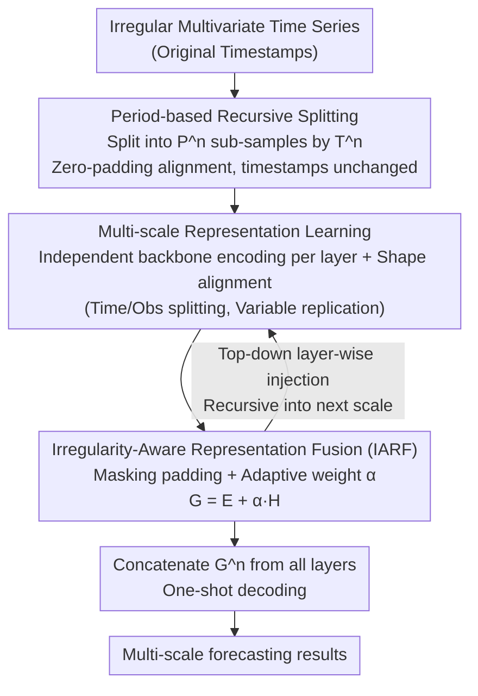

# Learning Recursive Multi-Scale Representations for Irregular Multivariate Time Series Forecasting

**Conference**: ICLR 2026  
**arXiv**: [2602.21498](https://arxiv.org/abs/2602.21498)  
**Code**: [Available](https://github.com/Ladbaby/PyOmniTS)  
**Area**: Time Series  
**Keywords**: Irregular Time Series, Multi-scale Modeling, Recursive Splitting, Sampling Pattern Preservation, Forecasting

## TL;DR

The authors propose ReIMTS, which preserves the original sampling patterns of irregular multivariate time series (IMTS) through period-based recursive splitting (rather than resampling). Combined with an irregularity-aware representation fusion mechanism for multi-scale modeling, it achieves an average improvement of 27.1% across six IMTS backbones as a plug-in.

## Background & Motivation

**Background**: Irregular multivariate time series (IMTS) are ubiquitous in scenarios such as healthcare and meteorology, characterized by non-uniform observation intervals and misaligned observation timestamps across different variables. 

**Limitations of Prior Work**: The sampling pattern itself contains crucial information; for example, in an ICU, the transition from intensive monitoring to sparse monitoring reflects a patient recovering from a critical to a stable condition. Existing multi-scale approaches face two core issues:
- **Methods for regular time series** (e.g., Scaleformer, TimeMixer, Pathformer) assume uniform sampling, making them inapplicable to IMTS.
- **IMTS-specific multi-scale methods** (e.g., Warpformer, Hi-Patch, HD-TTS) rely on **resampling** to obtain coarse-grained sequences, which destroys original sampling patterns. For instance, in PhysioNet'12, the "dense-to-sparse" sampling pattern of Bilirubin is disrupted after downsampling.

**Key Insight**: Sampling pattern information (e.g., the shift between urgent and routine monitoring) is vital for clinical decisions and should be preserved.

## Method

### Overall Architecture

ReIMTS is a plug-and-play multi-scale framework compatible with most encoder-decoder IMTS models. At each scale level, it recursively splits samples into sub-samples with shorter periods based on time intervals while keeping the original timestamps of all observations intact. Global and local representations are injected layer-by-layer from top to bottom using level-specific backbone encoders and an irregularity-aware fusion module, providing a multi-scale perspective without destroying sampling patterns. The data flow follows a top-down chain: "Recursive Splitting → Layer-wise Encoding and Shape Alignment → IARF Fusion (Recursive Injection) → Concatenated Decoding."

### Key Designs

**1. Period-based Recursive Splitting: Preserving Sampling Patterns vs. Resampling**

**Design Motivation**: Existing IMTS multi-scale methods use resampling (downsampling) to obtain coarse-grained sequences, which erases semantically meaningful sampling patterns. ReIMTS adopts splitting based on time periods: at scale level $n$, samples are divided into $P^n = T^1/T^n$ sub-samples according to a time period $T^n$. The key is that splitting is based on **real-world time durations** (e.g., 12 hours, 24 hours) rather than the number of observations. Splitting by observation count would cause sub-samples to correspond to inconsistent real-time spans, disrupting temporal semantics. By splitting by time periods, original timestamps are fully preserved, using only zero-padding for alignment. For example, in PhysioNet'12, Level 1 covers the full 48 hours, Level 2 splits it into two 24-hour sub-samples, and Level 3 into four 12-hour sub-samples, forming a global-to-local multi-scale perspective while keeping the sampling time of each observation constant.

**2. Multi-scale Representation Learning: Independent Encoding and Downward Shape Alignment**

**Mechanism**: Each scale level utilizes an independent backbone encoder $\mathcal{F}^n_{\text{enc}}$ to encode its sub-samples, resulting in $\mathbf{E}^n = \mathcal{F}^n_{\text{enc}}(\mathbf{S}^n)$. Encoded latent representations are categorized into three types: temporal representations $\mathbf{E}^n_{\text{time}} \in \mathbb{R}^{P^n \times L^n \times D}$, variable representations $\mathbf{E}^n_{\text{var}} \in \mathbb{R}^{P^n \times V \times D}$, and observation representations $\mathbf{E}^n_{\text{obs}} \in \mathbb{R}^{P^n \times L^n \times V \times D}$. To inject the global representation $\mathbf{H}^n$ from the previous layer into the next, shape matching is required: splitting operations are applied to temporal/observation representations, and replication is used for variable representations. This transforms $\mathbf{H}^n$ into a shape aligned with the local representation $\mathbf{E}^{n+1}$ of the subsequent layer.

**3. Irregularity-Aware Representation Fusion (IARF): Distinguishing Observations from Padding**

**Function**: After shape alignment, temporal/observation representations still contain zero-padded positions. Direct addition would treat padding noise as signal. IARF utilizes a binary mask $\mathbf{M}^{n+1}$ to identify real observations versus padding in the lower scale. For temporal/observation representations, padding is masked via $\mathbf{H}^n_{\text{IMTS}} = \mathbf{H}^n \cdot \mathbf{M}^{n+1}$. For variable representations, since irregularity information is already encoded by the IMTS backbone, $\mathbf{H}^n_{\text{IMTS}} = \mathbf{H}^n$ is used directly. An adaptive weight $\alpha = \text{ReLU}(\text{FF}(\mathbf{H}^n_{\text{IMTS}}))$ is calculated via a lightweight scoring layer to fuse global information: $\mathbf{G}^{n+1} = \mathbf{E}^{n+1} + \alpha \mathbf{H}^n_{\text{IMTS}}$. This ensures global context only affects real observations, preventing padding values from contaminating lower-level representations.

### Loss & Training

At the lowest scale level $N$, the decoder concatenates all fused representations for one-shot decoding, $\hat{\mathbf{Z}} = \mathcal{F}_{\text{dec}}(\text{Concat}(\{\mathbf{G}^n\}_{n=1}^N))$. This allows final predictions to leverage information from global to local scales. The model is trained using MSE loss, calculated only for the $Y_Q$ prediction queries within the prediction window: $\mathcal{L} = \frac{1}{Y_Q} \sum_{j=1}^{Y_Q} (\hat{z_j} - z_j)^2$. Optimization runs for a maximum of 300 epochs with an early stopping patience of 10.

## Key Experimental Results

### Main Results

Evaluated across 5 IMTS datasets (MIMIC-III/IV, PhysioNet'12, Human Activity, USHCN) and 26 baseline methods.

| Backbone Model | Original MSE (×10⁻¹) | +ReIMTS MSE (×10⁻¹) | Avg. Gain |
| :--- | :--- | :--- | :--- |
| PrimeNet | 9.04/6.25/7.93/26.84/4.57 | 4.76/3.58/3.01/0.82/1.71 | **↑62.3%** |
| mTAN | 8.51/5.09/3.75/0.89/5.65 | 6.37/4.04/3.51/0.89/1.70 | ↑24.3% |
| TimeCHEAT | 4.41/2.50/3.27/0.68/1.73 | 4.40/2.02/2.90/0.52/1.62 | ↑12.1% |
| GRU-D | 4.75/5.97/3.25/1.76/2.42 | 4.67/3.91/3.25/0.51/1.89 | ↑25.8% |
| GraFITi | 4.08/2.39/2.85/0.43/1.71 | 4.07/1.79/2.83/0.42/1.66 | ↑6.3% |

Comparison with other multi-scale IMTS methods (using GraFITi as backbone):

| Method | MIMIC-III | MIMIC-IV | PhysioNet'12 | Human Activity | USHCN |
| :--- | :--- | :--- | :--- | :--- | :--- |
| Warpformer | 4.09 | 2.42 | 2.88 | 0.54 | 1.77 |
| HD-TTS | 4.17 | 2.36 | 2.83 | 0.50 | 1.66 |
| Hi-Patch | 4.35 | 2.36 | 3.11 | 0.48 | 2.34 |
| **Ours (ReIMTS)** | **4.07** | **1.79** | **2.83** | **0.42** | **1.66** |

### Ablation Study

| Variant | MIMIC-III | MIMIC-IV | PhysioNet'12 | Human Activity | USHCN |
| :--- | :--- | :--- | :--- | :--- | :--- |
| ReIMTS (Full) | **4.07** | **1.79** | **2.83** | **0.42** | **1.66** |
| rp sample (No splitting) | 4.99 | 1.92 | 2.83 | 0.45 | 1.69 |
| rp split (Split by obs count) | 5.02 | 2.36 | 3.20 | 0.61 | 2.31 |
| rp IARF (Fusion -> Addition) | 4.20 | 1.84 | 2.79 | 0.47 | 1.89 |
| w/o IARF (No fusion) | 4.77 | 2.07 | 3.06 | 0.54 | 1.69 |

### Key Findings

- **Period-based splitting** (ReIMTS) significantly outperforms splitting by observation count (rp split), with a gap as high as 0.65 on USHCN.
- Classic models (e.g., mTAN, GRU-D) can outperform more recent models when augmented with ReIMTS.
- **Efficiency**: When using the GraFITi backbone, ReIMTS achieves the fastest training speed and lowest GPU memory consumption, outperforming Warpformer, HD-TTS, and Hi-Patch.

## Highlights & Insights

1. **Pattern-Preserving Multi-Scale Design**: Instead of resampling, it uses period-based recursive splitting, which is simple yet effective.
2. **Plug-and-Play Compatibility**: Highly versatile, adapting to most encoder-decoder IMTS models.
3. **Revitalizing Older Methods**: Improvements of 62.3% for PrimeNet and 25.8% for GRU-D suggest that multi-scale modeling was a critical missing piece for these architectures.
4. **Efficiency Advantage**: By leveraging lightweight backbones like GraFITi, it achieves both optimal accuracy and efficiency.

## Limitations & Future Work

- Lack of theoretical explanation when combining ODE-based models with ReIMTS.
- The fusion mechanism is not directly compatible with the noisy latent representations of diffusion models.
- Choice of period lengths requires manual specification (dataset settings are provided in the appendix); adaptive selection is a potential direction.
- Only forecasting tasks were validated; other downstream tasks like classification remain unexplored.

## Related Work & Insights

- **Relation to tPatchGNN and PrimeNet**: These can be viewed as single-scale special cases of ReIMTS.
- Multi-scale methods for regular time series like Scaleformer destroy sampling information due to resampling.
- **Insight**: For other tasks involving irregular data (e.g., event sequences, point processes), multi-scale approaches that preserve original temporal information may be equally beneficial.

## Rating

- **Novelty**: ⭐⭐⭐⭐ (The period-based splitting concept is simple and effective; IARF fusion is well-designed.)
- **Experimental Thoroughness**: ⭐⭐⭐⭐⭐ (5 datasets, 26 baselines, 6 backbones, complete ablation and efficiency analysis.)
- **Writing Quality**: ⭐⭐⭐⭐ (Motivation is clear, diagrams are intuitive, and comparisons are detailed.)
- **Value**: ⭐⭐⭐⭐ (Plug-and-play design is highly practical; open-sourced in PyOmniTS.)

<!-- RELATED:START -->

## Related Papers

- [\[ICLR 2026\] Reliable Probabilistic Forecasting of Irregular Time Series via Marginal Consistent Flows](reliable_probabilistic_forecasting_of_irregular_time_series_through_marginalizat.md)
- [\[ICLR 2026\] Time-Gated Multi-Scale Flow Matching for Time-Series Imputation](time-gated_multi-scale_flow_matching_for_time-series_imputation.md)
- [\[ICML 2026\] Latent Laplace Diffusion for Irregular Multivariate Time Series](../../ICML2026/time_series/latent_laplace_diffusion_for_irregular_multivariate_time_series.md)
- [\[ICLR 2026\] pyrregular: A Unified Framework for Irregular Time Series, with Classification Benchmarks](pyrregular_a_unified_framework_for_irregular_time_series_with_classification_ben.md)
- [\[ICLR 2026\] Learning Koopman Representations with Controllability Guarantees](learning_koopman_representations_with_controllability_guarantees.md)

<!-- RELATED:END -->
