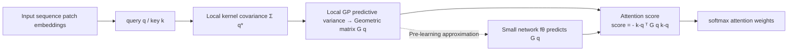

# Local Geometry Attention for Time Series Forecasting under Realistic Corruptions

**Conference**: ICLR 2026  
**OpenReview**: [https://openreview.net/forum?id=NCQPCxN7ds](https://openreview.net/forum?id=NCQPCxN7ds)  
**Code**: [https://github.com/dongbeank/LGA](https://github.com/dongbeank/LGA)  
**Area**: Time Series Forecasting / Robust Attention / Gaussian Process  
**Keywords**: Local Geometry Attention, Gaussian Process, Mahalanobis distance, Robustness benchmark, PatchTST  

## TL;DR
By using local Gaussian Processes, the attention scoring is transformed from Euclidean dot-product to a "query-adaptive negative Mahalanobis distance." This prevents Transformers from being biased by outliers under realistic corruptions like spikes or level-shifts. Simultaneously, the first statistically grounded robustness benchmark for time series, TSRBench, is proposed.

## Background & Motivation
**Background**: Transformers have achieved strong performance in time series forecasting through models like PatchTST. However, standard attention uses a globally uniform dot-product similarity, treating all inputs equally. Time series data possess unique **local geometric structures**—periodic patterns naturally cluster in the key-query embedding space, and local data distributions are non-uniform. This "attention geometry" is a critical feature absent in images or text.

**Limitations of Prior Work**: (1) Standard dot-product attention cannot adapt to local statistical changes. Encountering realistic corruptions like sensor spikes or level shifts, outliers receive high attention scores, biasing the prediction. (2) Existing "robust attention" mechanisms (e.g., MoM, Elliptical) are designed for vision or language and rely on global kernel assumptions; when applied to time series, they often perform worse than standard attention. (3) At the evaluation level, while vision has ImageNet-C, time series lacks a standard robustness benchmark. Current research often uses synthetic adversarial attacks, which do not reflect realistic data degradation.

**Key Challenge**: Time series corruptions specifically destroy the "local geometry." Standard attention lacks the mechanism to model local geometry, and there is no benchmark to cleanly evaluate this robustness—especially considering the dilemma where the test set ground truth must be clean while real data lacks Precise anomaly labels.

**Goal**: To fill both gaps simultaneously—a geometry-aware attention mechanism resilient to corruptions and a statistically grounded, reproducible robustness evaluation framework.

**Core Idea**: **Use the predictive variance of a local Gaussian Process as a proxy for data density**. A local geometric matrix $G(q)$ is estimated at the query $q$, and the attention score is defined as the negative Mahalanobis distance $-(k-q)^\top G(q)(k-q)$. Dense regions have small variance and high scores, while sparse regions (outliers) have large variance and low scores, naturally suppressing anomalies.

## Method

### Overall Architecture
The theoretical chain of LGA is established in three steps: first, use **local kernel covariance** to capture the local geometry of the data manifold; next, connect it to a **local Gaussian Process** (GP) to obtain predictive variance reflecting data density; finally, derive **geometry-aware attention scores** from the negative variance. Since directly calculating the geometric matrix for every query requires traversing all keys (computationally infeasible), LGA utilizes a small network $f_\theta$ to pre-learn the prediction of the geometric matrix directly from the query, decoupling expensive geometric estimation from training and inference.

### Key Designs

**1. Local Kernel Covariance: Encoding Manifold Geometry into Matrices**—Unlike traditional global GPs that use a uniform kernel, LGA constructs a local covariance matrix for each target point $x_*$ (corresponding to query $q_*$). It treats the difference between key and query as a feature $\phi(k_i)=k_i-q_*$, and uses Gaussian kernel weights $\omega_i(x_*)=K(k_i,q_*)/\sum_j K(k_j,q_*)$ to compute the weighted outer product: $\Sigma(x_*)=\sum_i \omega_i(x_*)(k_i-q_*)(k_i-q_*)^\top$. Keys closer to the query receive higher weights, so this decay-weighted covariance matrix approximates the inverse metric tensor on the data manifold, encoding "what it looks like near the query" into $\Sigma$.

**2. Local GP Turning Variance into a Density Proxy**—This is the theoretical pivot of the paper. A local GP is established at $x_*$ where all observed outputs are zero. Its predictive variance for a new point $k$ is $\sigma^2_{q_*}(k)=(k-q_*)^\top G(x_*)(k-q_*)$, where $G(x_*)=\sigma^2[\Sigma(x_*)+\sigma^2 I]^{-1}$. The properties of GPs dictate that **predictive variance is small where data is dense and large where it is sparse**. Thus, the negative predictive variance $-\sigma^2_{q_*}(k)$ serves perfectly as the "data density around $k$ from the perspective of $q_*$." Outliers in sparse regions are naturally suppressed due to high variance and low density.

**3. Geometry-Aware Scoring = Negative Mahalanobis Distance = Geodesic Distance Approximation**—Based on the previous step, LGA defines similarity as $\mathrm{score}(q,k)=-(k-q)^\top G(q)(k-q)$, which is a negative squared Mahalanobis distance adaptive to local geometry, followed by a softmax to obtain weights. The authors further provide a Riemannian geometry interpretation: on a data manifold with metric tensor $G$, the first-order Taylor expansion of the geodesic distance within a neighborhood is $(k-q)^\top G(q)(k-q)$. Thus, the score can be interpreted as a "negative squared geodesic distance approximation," where $G(q)$ is an empirical estimate of the local Riemannian metric tensor at the query point, allowing attention to be distributed along the manifold curvature rather than through crude Euclidean similarity.

**4. Pre-learning Approximation for Real-world Feasibility**—Calculating $G(q)$ for every query using the original formula requires accessing all keys, which is too costly for large models. LGA trains a small network $G(q)\approx f_\theta(q)$ to predict the geometric matrix directly from the query (with an independent network for each attention head) and approximates the target matrix as a diagonal matrix for tractability. The training data consists of two parts: $S_{real}$ sampled from actual queries during training, and $S_{gen}$ randomly generated to cover a wider representation space. The loss is the MSE between the predicted and true $G_{true}$. This pre-learning strategy strips expensive geometric estimation from the main model, keeping LGA training speeds comparable to standard attention.

**5. TSRBench: A Statistically Grounded Corruption Benchmark**—To fill the evaluation gap, the authors constructed two types of standardized corruptions: **spike** (asymmetric exponential spike) and **level shift** (sustained level shift). The occurrence of corruption events is controlled by a Poisson process with rate $\lambda$, and duration is sampled from a geometric distribution. Crucially, corruption magnitudes are not set arbitrarily—they are calibrated using the DSPOT extremal algorithm according to significance levels $q$, ensuring the injected noise is "statistically significant but realistic." Five increasing severity levels are set via the triplet $(\lambda,p,q)$, and **while the input is corrupted, the ground truth for the prediction horizon remains clean**, isolating the impact of input corruption on forecasting.

## Key Experimental Results

Datasets: Weather / Electricity / ETT(h1/h2/m1/m2), input length 512. LGA is embedded into PatchTST to create **PatchLGA**, compared against PatchTST, TimeMixer, CATS, and iTransformer.

### Main Results: MSE under Combined Corruption (Average across horizons {96,192,336,720})

| Dataset | Severity | PatchLGA | PatchTST | TimeMixer |
|---|---|---|---|---|
| ETTm1 | 0 (Clean) | **0.351** | 0.352 | 0.360 |
| ETTm1 | 3 | **0.519** | 0.614 | 0.594 |
| ETTm1 | 5 | **0.734** | 0.839 | 0.837 |
| Weather | 5 | **0.454** | 0.491 | 0.576 |
| ETTh2 | 5 | **0.404** | 0.427 | 0.459 |

On clean data (severity 0), PatchLGA is on par with PatchTST, indicating that LGA **does not compromise original predictive power**. The advantage increases with severity; at level 5 on ETTm1, the MSE decreases by 12.3%, and on Weather, it is 21.2% lower than TimeMixer.

### Ablation Study: Comparison with Other Robust Attentions (Average MSE on ETTm1)

| Severity | SDP (Std) | MoM | Elliptical | LGA |
|---|---|---|---|---|
| 3 | 0.614 | 0.670 | 0.722 | **0.519** |
| 4 | 0.695 | 0.871 | 0.755 | **0.617** |
| 5 | 0.839 | 1.016 | 0.880 | **0.734** |

Robust attention mechanisms successful in CV/NLP (MoM, Elliptical) actually **perform worse than standard attention** on corrupted time series. Only LGA, specifically designed for time series local structure, exhibits minimal degradation. In terms of efficiency, LGA training speed is close to SDP, with GPU memory (4.6 GiB) significantly lower than MoM (16 GiB).

### Performance Across Attention Architectures (ETTm1 Combined Corruption, level 5 MSE)

| Architecture | Attention Type | LGA | SDP |
|---|---|---|---|
| PatchTST | Temporal Self-Attention | **0.734** | 0.839 |
| CATS | Cross-Attention | **1.037** | 1.102 |
| iTransformer | Channel Attention | **1.266** | 1.309 |

### Key Findings
- LGA provides the largest and most stable gains for temporal self-attention. For CATS, the peak improvement reaches 17.1% but is less stable (as cross-attention acts on linearly embedded noisy inputs). iTransformer shows modest but stable gains because global linear embedding disrupts local periodic geometry.
- PatchLGA better utilizes longer historical contexts for accurate predictions under noise (input length experiments).

## Highlights & Insights
- **Leveraging the "Variance=Density" GP Property as an Anomaly Suppressor**: Negative predictive variance naturally assigns low scores to sparse regions (anomalies) without an explicit anomaly detection module. Robustness is a byproduct of geometric scoring.
- **Theoretical Trio**: Local kernel covariance → Local GP predictive variance → Riemannian geodesic distance approximation. This connects an engineering modification of attention to manifold geometry, giving $G(q)$ a clear identity as an "empirical estimate of the local metric tensor."
- **Pre-learning Decoupling** downgrades the $O$ complexity explosion of "inverting per query" to a single forward pass of a small network—a critical engineering trade-off for practical deployment.
- **TSRBench Resolves Evaluation Dilemma**: By corrupting inputs while keeping prediction targets clean, combined with DSPOT statistical grounding, it is much closer to real sensor failures than simple jitter or adversarial attacks.

## Limitations & Future Work
- The target geometric matrix is approximated as a **diagonal matrix** (assuming independence between local feature dimensions), which might lose correlations between dimensions and under-represent strongly coupled multivariate sequences.
- The geometric matrix relies on a pre-learning network; the generalization of $f_\theta$ (especially to query distributions unseen during training) depends on the sampling quality of $S_{gen}$.
- TSRBench only covers two types of standardized corruptions; real-world degradations like missing values, drift trends, or multi-source overlaps are not yet included.
- Primarily validated on PatchTST-like patchified architectures; and its adaptability to non-patch, pure linear, or frequency-domain models requires further evidence.

## Related Work & Insights
- **Theoretical Interpretation of Attention**: Viewing attention as mutual covariance of related GPs (Bui 2024), Bayesian inference using symmetric kernel GP posteriors (SGPA, Chen & Li 2023), suppressing outlier keys using RKDE+MoM (Han 2023), or hyper-ellipsoidal neighborhoods (Elliptical, Nielsen 2024)—LGA differs by explicitly modeling **local** geometry rather than relying on global kernel assumptions.
- **Robustness Benchmarks**: ImageNet-C established the multi-severity general corruption evaluation paradigm for CV, and NLP has similar work. Time series has long relied on synthetic adversarial attacks; TSRBench introduces "realistic degradation + statistical grounding" to the field.
- **Insight**: When domain-specific data has unique geometric/structural priors (like local periodic clustering in time series), it is better to encode that structure directly into the similarity metric rather than applying robust methods from other domains. GP predictive variance as a density/confidence proxy is a transferable, lightweight tool.

## Rating
- **Novelty**: ⭐⭐⭐⭐ Mapping local GP predictive variance to Riemannian geodesic distance for attention scoring is novel and self-consistent; TSRBench fills a gap in time series evaluation.
- **Experimental Thoroughness**: ⭐⭐⭐⭐ Covers six datasets, five severity levels, three attention architectures, various robust attentions, and efficiency trade-offs.
- **Writing Quality**: ⭐⭐⭐⭐ Progression from kernel covariance to geodesic distance is logical; visualizations (toy data, attention weight comparison) are intuitive.
- **Value**: ⭐⭐⭐⭐ Robustness to realistic corruption is a major pain point for time series deployment. The method is plug-and-play (replacing SDP) and the benchmark is reproducible, offering high utility to the community.

<!-- RELATED:START -->

## Related Papers

- [\[ICLR 2026\] Are Global Dependencies Necessary? Scalable Time Series Forecasting via Local Cross-Variate Modeling](are_global_dependencies_necessary_scalable_time_series_forecasting_via_local_cro.md)
- [\[ICLR 2026\] GARLIC: Graph Attention-based Relational Learning of Multivariate Time Series in Intensive Care](garlic_graph_attention-based_relational_learning_of_multivariate_time_series_in_.md)
- [\[ICLR 2026\] Extreme Weather Nowcasting via Local Precipitation Pattern Prediction](extreme_weather_nowcasting_via_local_precipitation_pattern_prediction.md)
- [\[ICLR 2026\] Decentralized Attention Fails Centralized Signals: Rethinking Transformers for Medical Time Series](decentralized_attention_fails_centralized_signals_rethinking_transformers_for_me.md)
- [\[CVPR 2025\] L2GTX: From Local to Global Time Series Explanations](../../CVPR2025/time_series/l2gtx_from_local_to_global_time_series_explanations.md)

<!-- RELATED:END -->
