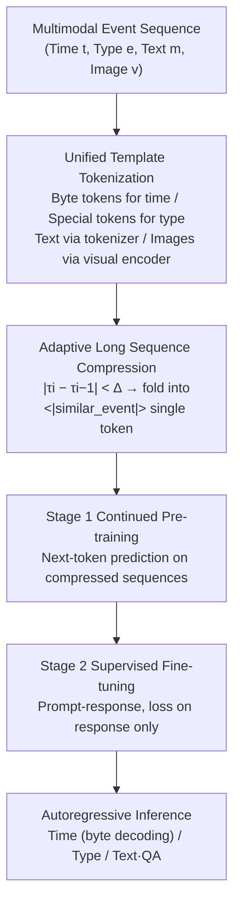

# Long-range Modeling and Processing of Multimodal Event Sequences

**Conference**: ICLR 2026  
**OpenReview**: [https://openreview.net/forum?id=Krxt7wCnig](https://openreview.net/forum?id=Krxt7wCnig)  
**Code**: [https://github.com/JichuLi/MM-TPP](https://github.com/JichuLi/MM-TPP)  
**Area**: Time Series / Temporal Point Processes / Multimodal Event Modeling  
**Keywords**: Temporal Point Process, Multimodal LLM, Long-context, Sequence Compression, Qwen2.5-VL  

## TL;DR
MM-TPP extends Temporal Point Processes (TPP) from "Time + Type + Text" to a full multimodal generation framework including "Time + Type + Text + Image." By employing adaptive sequence compression based on time-interval similarity, it fits long sequences involving thousands of events and tens of thousands of tokens into a fixed context window, outperforming SOTA TPP baselines in both prediction accuracy and long-form analytical report generation.

## Background & Motivation
**Background**: Temporal Point Processes (TPP) are classic tools for modeling asynchronous event sequences in continuous time. From early RNN-based models like RMTPP and NHP to Transformer-based THP and SAHP, and more recently LLM-integrated TPP-LLM and Language-TPP, capabilities have continuously expanded. Language-TPP was the first to incorporate "textual descriptions" as part of the event modeling, using byte-level token encoding for timestamps and templates to structure each event, achieving joint prediction of time, type, and text.

**Limitations of Prior Work**: Real-world event sequences are increasingly **multimodal**. Video Danmaku (bullet comments) contain timestamps, comment text, and associated video frames; traffic accident records include audio and surveillance images. However, existing TPP models (including Language-TPP) are limited to a single text modality. They **cannot encode images, nor can they generate text conditioned on images**, let alone perform deep multimodal reasoning on event dynamics.

**Key Challenge**: Integrating images into event sequences leads to **sequence length explosion**. A single image sliced by ViT into hundreds of patch tokens causes the total length $N$ to inflate rapidly when every event carries an image. The $O(N^2)$ complexity of Transformer self-attention becomes a fatal bottleneck, preventing the model from perceiving the full history and hindering the generation of coherent analytical reports that require long-range dependencies (e.g., summarizing a long Danmaku stream).

**Goal**: Construct a unified framework where TPP can simultaneously process four modalities—time, type, text, and image—and generate rich text while modeling ultra-long event histories within a fixed context window.

**Core Idea**: **[Unified Multimodal Template + Time Similarity Compression]** — Use Qwen2.5-VL as a backbone to tokenize four-modality events into a unified sequence. Dense events with "similar time intervals" are folded into a single `<|similar_event|>` special token, trading "inter-event compression" for a significantly longer effective history.

## Method

### Overall Architecture
MM-TPP is built upon the multimodal large model Qwen2.5-VL, following a sequence-to-sequence paradigm. Given a multimodal event history $(t_i, e_i, m_i, v_i)_{i=1}^N$ (time, type, text, image), it autoregressively predicts the time, type, and text content of future events. The pipeline consists of three steps: tokenizing each event using a unified template (images via visual encoder, others via special tokens), compressing dense events into a fixed window based on temporal similarity, and two-stage training (continued pre-training on compressed sequences followed by supervised fine-tuning on downstream tasks).

### Key Designs

**1. Unified Four-Modality Tokenization Template**: This design enables a VLM to simultaneously understand time, type, text, and images. MM-TPP designs encoding methods for each modality and concatenates them into a sequence processable by the language model using a structured template. Timestamps follow the byte-level strategy of Language-TPP, where 32-bit intervals are split into 4 bytes mapped to 256 special tokens `<|byte_0|>`...`<|byte_255|>` for compact precision. Event types use discrete tokens like `<|type_0|>`...`<|type_5|>`. Textual descriptions use the built-in Qwen2.5-VL tokenizer. **Image processing is critical**: pixels are not hard-converted to tokens; instead, an `<|image_pad|>` placeholder is inserted. At runtime, images pass through a visual encoder to obtain embeddings aligned with the placeholders. This achieves deep vision-text-time fusion while keeping the token sequence clean. Each event is wrapped with `<|start_of_event|>` and `<|end_of_event|>`, with internal modalities marked by prefixes like `<|time_start|>`, `<|type_start|>`, `<|text_start|>`, and `<|vision_start|>`.

**2. Adaptive Sequence Compression based on Temporal Similarity**: This is the core innovation. Observations indicate that real event streams (e.g., video comments) often arrive in bursts or cycles where adjacent intervals are highly similar. Defining the interval as $\tau_i = t_i - t_{i-1}$, the difference between current and previous intervals is compared: if $|\tau_i - \tau_{i-1}| < \Delta$, event $i$ is considered temporally similar to $i-1$ and is replaced by a single `<|similar_event|>` token rather than its full template. This compresses dense events involving hundreds of tokens into a few special tokens while preserving critical events with unique temporal features. This **inter-event sequence-level** compression differs from common **intra-event representation-level** compression (like token pruning/merging in MLLMs via spatial redundancy), as TPP components carry dense semantics where deletion breaks logic. Empirically, a 4096-token budget increases the average number of accommodated events from 113 to 292 (up to 2008).

**3. Two-Stage Training + LoRA Fine-Tuning**: Training follows two stages. Stage 1 is continued pre-training on large-scale token sequences constructed from multimodal templates to perform standard next-token prediction. The goal $L_{\text{stage1}}(\theta) = -\frac{1}{L}\sum_{i=1}^{L}\log p_\theta(x_i \mid x_{<i})$ makes the model adapt to the new format and understand tokens like `<|similar_event|>` and `<|type_X|>`. Stage 2 is supervised fine-tuning (SFT) using prompt-response pairs. Prompts contain compressed history and task instructions (e.g., `<|time_prediction|>`, `<|type_prediction|>`, or natural language questions), with the loss applied only to the response: $L_{\text{stage2}}(\theta) = -\frac{1}{R}\sum_{j=1}^{R}\log p_\theta(r_j \mid \text{Prompt}, r_{<j})$. Training is completed with LoRA on a single RTX 4090 using Qwen2.5-VL-3B. During inference, byte tokens are decoded into float intervals, category tokens yield types, and language tokens are used for text or QA.

## Key Experimental Results

### Main Results

Evaluated on two multimodal TPP datasets (DanmakuTPP and TAXI-PRO, a new NYC taxi multimodal version), using RMSE↓ for time and ACC↑ for type:

| Model | Danmaku RMSE↓ | Danmaku ACC%↑ | TAXI-PRO RMSE↓ | TAXI-PRO ACC%↑ |
|---|---|---|---|---|
| NHP | 5.4540 | 30.74 | 0.4494 | 75.93 |
| THP | 5.4001 | 24.64 | 0.3736 | 75.31 |
| TPP-LLM | 5.3035 | 24.59 | 0.3336 | 71.09 |
| Language-TPP | 5.3845 | 22.62 | 0.3376 | 75.27 |
| **MM-TPP** | **5.2987** | 27.62 | **0.3310** | **77.56** |

MM-TPP achieves the lowest RMSE on both datasets and leads across all metrics on TAXI-PRO. On DanmakuTPP, type ACC significantly outperforms Language-TPP (27.62 vs 22.62). On 8 closed DanmakuTPP-QA tasks, MM-TPP consistently outperforms a fine-tuned Qwen2.5-VL-3B. Its narrative quality in two open-ended report generation tasks also exceeds existing MLLMs.

### Ablation Study

| Variant | Danmaku RMSE↓ | Danmaku ACC%↑ | TAXI-PRO RMSE↓ | TAXI-PRO ACC%↑ |
|---|---|---|---|---|
| **MM-TPP (3B, All Modalities)** | 5.2987 | **27.62** | 0.3310 | **77.56** |
| MM-TPP (text only) | 5.4654 | 23.64 | 0.3388 | 76.70 |
| MM-TPP (7B) | **5.0533** | 26.98 | 0.3337 | 76.16 |
| Uncompressed | 5.5551 | 25.87 | — | — |

Compression hyperparameter $\Delta$: The default 0.2 is optimal; $\Delta=0.05$ results in under-compression, while $\Delta=0.5$ over-compresses by merging heterogeneous events, leading to a drop in RMSE/ACC. Reducing context from 4096 to 2048 also results in performance degradation.

### Key Findings
- **Compression captures long-range dependency**: The compressed version increases capacity from 113 to 292 events (max 2008), with RMSE 5.2987 vs. 5.5551 uncompressed. PPL is lower for all sequence lengths compared to the uncompressed version. A "random event drop" baseline performs significantly worse, proving that **preserving temporal causality is as important as extending context**.
- **Visual information provides gain**: Under controlled event counts, full-modality MM-TPP outperforms the text-only variant, following complementary value in images for time and type prediction.
- **Larger models are not always better**: The 7B model is significantly better only on DanmakuTPP time RMSE; for other metrics, the 3B model performs better, likely due to overfitting on simpler tasks.

## Highlights & Insights
- **Promoting text generation as a first-class citizen in TPP**: Traditional TPP only predicts "when and what." MM-TPP elevates "generating vision-conditioned long-form analysis/reports" to the same status, moving TPP from a pure predictor to a reasoner that explains event streams.
- **Targeted compression motivation**: Correctly identifies the fundamental difference in redundancy between TPP and images—images have spatial redundancy for intra-event pruning, while TPP data is semantically dense. The "inter-event temporal similarity folding" is cost-effective and fits the bursty nature of event streams.
- **Lightweight and reproducible**: Uses a 3B base + LoRA + single 4090; contributes the TAXI-PRO benchmark with map tiles and natural language descriptions.

## Limitations & Future Work
- **Lack of image generation**: Due to Qwen2.5-VL limitations, future events only yield time, type, and text. Omni-modal models like Chameleon are potential future directions.
- **Single compression strategy**: Hard folding based only on interval similarity might merge events with significant content differences. Adaptive hybrid compression is left for future work.
- **Type prediction SOTA gaps**: Although RMSE is top-tier, type ACC on DanmakuTPP is still lower than NHP (30.74) or S2P2 (31.48), suggesting limits to multimodal fusion for discrete types.
- **Threshold sensitivity**: $\Delta$ and context length require searching across different datasets.

## Related Work & Insights
- **TPP Genealogy**: Progressed from RNN-based (RMTPP, NHP) to Transformer-based (THP, SAHP) to LLM-based (TPP-LLM, Language-TPP). This work is a direct multimodal extension of Language-TPP.
- **Covariate TPP**: Earlier works used structured covariates (demographics, geography) or unstructured text (TF-IDF, BERT embeddings). MM-TPP unifies images and text as unstructured covariates in a generative TPP.
- **Efficient MLLM**: Contrasts with intra-event representation compression (ToMe, pruning), highlighting the suitability of inter-event sequence-level compression for TPP structures.
- **Insight**: For long sequence modeling with heavy multimodal attachments (logs, surveillance, medical series), "folding homogeneous segments by business similarity while keeping turning points" is more effective than general token pruning.

## Rating
- **Novelty**: ⭐⭐⭐⭐ — First to integrate images into generative TPP; the "inter-event similarity compression" is well-aligned with the domain logic.
- **Experimental Thoroughness**: ⭐⭐⭐⭐ — Comprehensive ablation studies and a new benchmark; minor penalty as type prediction did not reach global SOTA.
- **Writing Quality**: ⭐⭐⭐⭐ — Clear chain of motivation-challenge-method with effective framing and diagrams.
- **Value**: ⭐⭐⭐⭐ — Provides a practical, low-barrier paradigm for multimodal long-event sequence modeling.

<!-- RELATED:START -->

## Related Papers

- [\[NeurIPS 2025\] WaLRUS: Wavelets for Long-range Representation Using SSMs](../../NeurIPS2025/time_series/walrus_wavelets_for_long-range_representation_using_ssms.md)
- [\[ICML 2026\] FRACTAL: State Space Model with Fractional Recurrent Architecture for Computational Temporal Analysis of Long Sequences](../../ICML2026/time_series/fractal_ssm_with_fractional_recurrent_architecture_for_computational_temporal_an.md)
- [\[ICML 2026\] Learning Long Range Spatio-Temporal Representations over Continuous Time Dynamic Graphs with State Space Models](../../ICML2026/time_series/learning_long_range_spatio-temporal_representations_over_continuous_time_dynamic.md)
- [\[ICLR 2026\] The Forecast After the Forecast: A Post-Processing Shift in Time Series](the_forecast_after_the_forecast_a_post-processing_shift_in_time_series.md)
- [\[ICLR 2026\] Towards Multimodal Time Series Anomaly Detection with Semantic Alignment and Condensed Interaction](towards_multimodal_time_series_anomaly_detection_with_semantic_alignment_and_con.md)

<!-- RELATED:END -->
