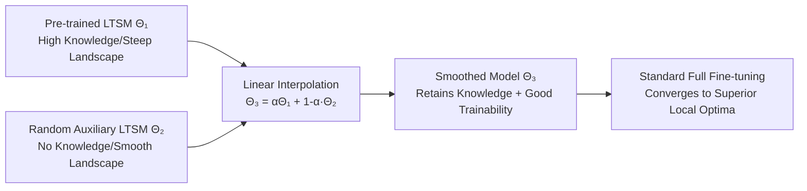

# Lost in the Non-convex Loss Landscape: How to Fine-tune the Large Time Series Model?

**Conference**: ICLR 2026  
**OpenReview**: [https://openreview.net/forum?id=8o4t5DHaE1](https://openreview.net/forum?id=8o4t5DHaE1)  
**Code**: [https://github.com/Meteor-Stars/SFF](https://github.com/Meteor-Stars/SFF)  
**Area**: Time Series / Large Time Series Model Fine-tuning  
**Keywords**: Large Time Series Model (LTSM), loss landscape smoothing, weight interpolation, fine-tuning, sharp minima  

## TL;DR
By linearly interpolating the weights of a pre-trained large time series model with a randomly initialized "sparring" model, the smooth loss landscape of the latter is used to "level out" the sharp, non-convex landscape of the former. This allows full fine-tuning to truly benefit from pre-training without increasing any memory or computational overhead.

## Background & Motivation
**Background**: Large Time Series Models (LTSMs) follow the trajectory of Large Language Models—offering flexible context lengths, cross-domain generalization, task universality, and scalability. Models like Timer, TimesFM, and MOMENT have surpassed specialized models in forecasting, imputation, and anomaly detection, showing strong zero-shot performance.

**Limitations of Prior Work**: Both theory and empirical evidence point to an awkward phenomenon: large-scale pre-training pushes models toward **sharp minima** within highly non-convex loss landscapes. Visualizing the loss landscape of Timer on exchange rate data reveals significant local "bumps," indicating poor trainability. Consequently, direct full fine-tuning (FF) often yields the lowest training loss but suffers from higher test loss than training from scratch (TFS), leading to severe overfitting. Gains from pre-training are wasted, and performance may even degrade as more data becomes available.

**Key Challenge**: Pre-trained models possess "knowledge" but are "hard to train" (steep landscapes), while randomly initialized models are "easy to train" (smooth landscapes) but "lack knowledge" (their minimum loss is much higher than pre-trained versions). Conventional FF, Linear Probing (LP), or LP-FF cannot smooth this non-convex landscape and thus fail to converge stably to better local optima.

**Goal**: To "reshape" the steep loss landscape of pre-trained models into a smoother version to restore trainability, without destroying pre-trained knowledge or introducing additional overhead.

**Core Idea**: **"Borrowing smoothness" from the smooth loss landscape of randomly initialized models** — By performing linear weight interpolation between a randomly initialized auxiliary LTSM and the pre-trained LTSM, a "smoothed model" is obtained that retains pre-trained knowledge while inheriting good trainability for subsequent full fine-tuning.

## Method

### Overall Architecture
Smoothed Full Fine-tuning (SFF) consists of two steps: (1) Construct an auxiliary model $\Theta_2$ with the same architecture as the pre-trained LTSM using Kaiming/Xavier initialization, which naturally resides in a smoother, more convex loss region; (2) Linearly mix the pre-trained weights $\Theta_1$ and auxiliary weights $\Theta_2$ using an interpolation coefficient $\alpha$ to obtain $\Theta_3 = \alpha\Theta_1 + (1-\alpha)\Theta_2$, then perform standard fine-tuning on $\Theta_3$. This "smoothing" is implemented with just a few lines of PyTorch weight interpolation before fine-tuning, requiring zero extra VRAM or FLOPs.

### Key Designs

**1. Leveling Sharp Minima while Preserving Flat Regions: Dual Mechanisms of Interpolation**
The authors characterize landscape steepness using the maximum eigenvalue of the Hessian $\lambda_{\max}(\nabla^2 L)$, where large eigenvalues denote sharp minima (sensitive to perturbations) and small eigenvalues denote flat minima (better generalization). Using a local quadratic approximation along the interpolation path, the Hessian at the interpolated point is a convex combination of the endpoints: $\nabla^2 L(\Theta_3) \approx \alpha\nabla^2 L(\Theta_1) + (1-\alpha)\nabla^2 L(\Theta_2)$. Since $\lambda_{\max}(\nabla^2 L(\Theta_2))$ for the auxiliary model is much smaller than the pre-trained model, for sharp minima we have $\lambda_{\max}(\nabla^2 L(\Theta_3)) < \lambda_{\max}(\nabla^2 L(\Theta_1))$, leveling the surface and allowing parameters to escape "bad" basins. Conversely, if pre-trained weights already lie in a flat region ($\le\tau$), the combination $\le\alpha\tau + (1-\alpha)\tau = \tau$ ensures the flat region is preserved. This ensures SFF only modifies steep areas without harming pre-existing flat regions. The authors also compare this perturbation to the momentum mechanism in Adam: random weight interpolation provides a "push" to help parameters escape sharp basins.

**2. Theoretical Basis for the Smoothness of Random Initialization**
SFF utilizes random initialization as a "smoothness source" because Kaiming/Xavier initializations inherently produce smooth landscapes. The authors quantify smoothness using the ratio of the Hessian trace to the Frobenius norm: $\frac{\mathrm{Tr}(H)}{\|H\|_F} = \frac{\sum\lambda_i}{\sqrt{\sum\lambda_i^2}} \gg 1$. A ratio much larger than 1 implies that eigenvalues are mostly positive and uniformly distributed, rather than being dominated by extreme outliers ($\lambda \le \tau$). This corresponds to a "valley-like" smooth geometry dominated by positive curvature, where most descent directions have low curvature and stable optimization. This analysis elevates "random initialization smoothness" from an empirical observation to an interpretable criterion.

**3. Interpolation Coefficient $\alpha$: Balancing Smoothness and Knowledge**
The interpolation is applied to both the backbone and the linear head: $f(X, \Theta_3) = G(X, \alpha\Phi_1 + (1-\alpha)\Phi_2)^T(\alpha W_{head1} + (1-\alpha)W_{head2})$. The objective is to minimize the MSE loss $\arg\min \sum_{(X_i,Y_i) \in D} L(f(X_i, \alpha\Theta_1 + (1-\alpha)\Theta_2), Y_i)$. $\alpha$ directly controls the amount of pre-trained knowledge retained. Experiments show that $\alpha \approx 0.85$ yields the best zero-shot performance: it provides sufficient smoothing perturbation without diluting the pre-trained knowledge. This relatively high optimal value confirms that SFF acts as a "gentle perturbation" rather than a "major reset."

## Key Experimental Results

### Main Results (TSF on Timer, Lookback 96, MSE, varying data ratios)

| Dataset | SFF(25%) | FF(25%) | TFS(25%) | SFF(100%) | FF(100%) | TFS(100%) |
|---|---|---|---|---|---|---|
| Exchange | **0.0805** | 0.0865 | 0.1441 | **0.0800** | 0.0910 | 0.0981 |
| ETTh1 | **0.3506** | 0.3550 | 0.3788 | **0.3547** | 0.3709 | 0.3600 |
| ETTm1 | **0.2980** | 0.3049 | 0.3330 | **0.2954** | 0.3128 | 0.3093 |
| Weather | **0.1440** | 0.1472 | 0.1627 | **0.1443** | 0.1612 | 0.1526 |
| Traffic | **0.3488** | 0.3582 | 0.3688 | **0.3551** | 0.3599 | 0.3609 |

Across 9 public datasets, SFF reduces MSE by an average of 3% (up to 6.5%) compared to FF. Furthermore, while FF often plateaus or degrades as data increases, SFF shows stable performance gains.

### Ablation Study (Other LTSMs, TSF Lookback 96, MSE)

| Dataset | TimesFM-SFF | TimesFM-FF | MOMENT-SFF | MOMENT-FF | MOIRAI-SFF | MOIRAI-FF |
|---|---|---|---|---|---|---|
| ETTh1 | **0.3955** | 0.4382 | **0.4287** | 0.4454 | **0.448** | 0.501 |
| Weather | **0.0865** | 0.0885 | **0.1673** | 0.1682 | **0.166** | 0.173 |
| Traffic | — | — | — | — | **0.476** | 0.497 |

SFF improves over FF by 11.45% / 8.31% on TimesFM / MOMENT on average. It consistently outperforms FF across UniTS, MOIRAI, Chronos, TTMs, and Sundial, covering encoder-only, decoder-only, encoder-decoder, and MLP-only architectures from 3.8GB to 3MB scales. Compared to LP/LPFF, average MSE is reduced by 7.17% to 41.57%.

### Key Findings
- **Pre-training Overfitting is Real**: In many cases, FF for TimesFM/MOMENT performs worse than TFS, confirming the "hard to train" hypothesis; SFF outperforms both.
- **Wasted Sample Efficiency**: Pre-trained LTSMs can match or exceed full-data TFS performance using only 10%–25% of the data, but FF fails to convert this potential into fine-tuning gains; SFF benefits continuously from more data.
- **Knowledge is Preserved**: Both SFF and FF converge within the first epoch, indicating that interpolation does not destroy pre-trained knowledge, yet SFF converges to a lower MSE.
- **Zero-shot Improvements**: Smoothed models show improved zero-shot performance across 7 datasets (Timer +6.13%, TimesFM +35.75% avg); $\alpha \approx 0.85$ is optimal for MOIRAI, Chronos, TTMs, and Sundial.
- **Robust to Initialization**: Standard initializations (Kaiming/Xavier) provide consistent gains, and SFF is insensitive to random seeds.
- **Effective for Anomaly Detection**: On 250 datasets, SFF yields significantly higher prediction MSE on anomalous segments than FF and TFS (higher is better for detection), leading in "Wins" across 6 groups.

## Highlights & Insights
- **Attributing Fine-tuning Difficulty to Geometry**: Instead of modifying optimizers or adding regularization, the authors use an intuitive tool (random models) to reshape the landscape, providing a novel perspective.
- **Zero Cost**: The core operation is a simple weight interpolation before fine-tuning, requiring no additional memory or compute.
- **Theoretical-Empirical Loop**: Theoretical arguments regarding Hessian eigenvalues/ratios explain "why it is smooth" and "why flat regions remain intact," which are validated by landscape visualizations and experiments on eight LTSMs.
- **Broad Universality**: Gains are observed across 8 representative LTSMs, 4 architectural types, model scales spanning three orders of magnitude, and tasks including TSF, anomaly detection, imputation, and zero-shot forecasting.

## Limitations & Future Work
- The parameter $\alpha$ is a critical hyperparameter; while the paper suggests an empirical optimal of $\alpha \approx 0.85$, it lacks a mechanism for adaptive selection across different models/tasks.
- The theory relies on a local quadratic approximation and Hessian convex combinations along the interpolation path; the generalizability to high-dimensional non-convex surfaces requires further discussion.
- Whether random initialization always resides in a flat region across all architectures is primarily supported by traces of Kaiming/Xavier; coverage of broader initialization schemes is limited.
- Experiments focus on forecasting and anomaly detection; effectiveness on more complex downstream tasks (e.g., long-range dependency modeling, multimodal time series) remains to be verified.

## Related Work & Insights
- **Fine-tuning Strategies**: FF / LP / LP-FF (Kumar et al.) are direct baselines; SFF outperforms them by smoothing before fine-tuning.
- **Optimizing for Flat Minima**: Methods like SAM and SWA are motivated by similar goals; SFF consistently outperforms them in the appendix.
- **Weight Averaging/Interpolation**: Fundamentally different from Model Soups (Wortsman et al.) or interpolation in continual learning, which interpolate between multiple "trained" models for ensemble/anti-forgetting. SFF uses a random model to smooth a single pre-trained model's landscape for training.
- **Inspiration**: When pre-training makes fine-tuning harder, consider low-cost weight operations to restore trainability via landscape geometry—a strategy potentially transferable to LLMs and Vision Transformers.

## Rating
- **Novelty**: ⭐⭐⭐⭐ Attributing LTSM fine-tuning difficulty to sharp minima and using random weight interpolation to smooth it is a novel perspective.
- **Experimental Thoroughness**: ⭐⭐⭐⭐ Covers 8 LTSMs, 4 architectures, multiple tasks (TSF, AD, imputation, zero-shot), various seeds, and data ratios, supported by visualization and convergence analysis.
- **Writing Quality**: ⭐⭐⭐⭐ Clear motivation-theory-method-experiment cycle; Hessian proofs align well with figures.
- **Value**: ⭐⭐⭐⭐ Zero-overhead, plug-and-play, and highly universal; provides practical value for deploying LTSMs.

<!-- RELATED:START -->

## Related Papers

- [\[ICLR 2026\] MMPD: Diverse Time Series Forecasting via Multi-Mode Patch Diffusion Loss](mmpd_diverse_time_series_forecasting_via_multi-mode_patch_diffusion_loss.md)
- [\[AAAI 2026\] A Theoretical Analysis of Detecting Large Model-Generated Time Series](../../AAAI2026/time_series/a_theoretical_analysis_of_detecting_large_model-generated_time_series.md)
- [\[ICLR 2026\] Semantic-Enhanced Time-Series Forecasting via Large Language Models](semantic-enhanced_time-series_forecasting_via_large_language_models.md)
- [\[NeurIPS 2025\] How Foundational are Foundation Models for Time Series Forecasting?](../../NeurIPS2025/time_series/how_foundational_are_foundation_models_for_time_series_forecasting.md)
- [\[ICLR 2026\] TimeOmni-1: Incentivizing Complex Reasoning with Time Series in Large Language Models](timeomni-1_incentivizing_complex_reasoning_with_time_series_in_large_language_mo.md)

<!-- RELATED:END -->
