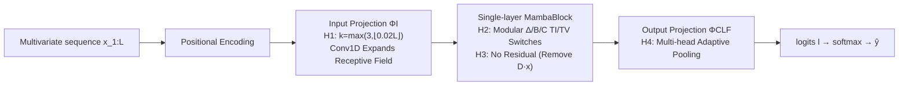

# MambaSL: Exploring Single-Layer Mamba for Time Series Classification

**Conference**: ICLR 2026  
**OpenReview**: [https://openreview.net/forum?id=YDl4vqQqGP](https://openreview.net/forum?id=YDl4vqQqGP)  
**Code**: To be confirmed (Paper promises to release all checkpoints)  
**Area**: Time Series Classification / State Space Models  
**Keywords**: Mamba, Selective SSM, Time Series Classification, UEA, Single-layer Architecture  

## TL;DR
By using only a **single-layer Mamba** and applying minimal modifications to the selective SSM and projection layers based on four TSC-specific hypotheses (H1–H4), this work re-evaluates 20 strong baselines across all 30 UEA datasets fairly, achieving a statistically significant SOTA.

## Background & Motivation
- **Background**: SSMs (especially Mamba) have proven to be effective alternatives to Transformers in language, video, and time series forecasting (TSF). However, in **time series classification (TSC)**, their intrinsic capabilities have rarely been studied in isolation, with CNNs and Transformers remaining dominant.
- **Limitations of Prior Work**: (1) TSCMamba, the only prior work using Mamba for TSC, mixes in feature engineering like ROCKET and CWT, **masking Mamba's own contribution**; (2) Vanilla Mamba was previously rated as a weak TSC backbone simply because it was not tuned properly, rather than due to architectural flaws.
- **Key Challenge**: TSC benchmarks themselves are unreliable—evaluations often use only UEA subsets (missing long/high-dimensional data), use TSF models as baselines without re-tuning (underestimating them), and suffer from poor reproducibility (TS2Vec/GPT4TS dropped >9%p in re-tests). This makes it impossible to judge "whether Mamba actually works."
- **Goal**: To justify Mamba through two lines of inquiry—**architecture** and **evaluation protocol**. This involves proving a single-layer Mamba can be a strong TSC backbone and establishing a reproducible benchmark covering all 30 UEA datasets with unified hyperparameter tuning and public checkpoints.
- **Core Idea**: Instead of **stacking depth or adding feature engineering**, the time-variance of Mamba's selective SSM is decomposed into adjustable knobs, combined with four targeted modifications: expanding receptive fields, removing residuals, and adaptive pooling, allowing a single-layer Mamba to achieve SOTA on its own.

## Method

### Overall Architecture
MambaSL retains the classic three-stage TSC pipeline—input projection $\Phi_I$, feature extractor $\Phi_{FE}$, and output projection $\Phi_{CLF}$—but applies minimal changes to each based on hypotheses: the input projection expands the convolutional receptive field based on sequence length (H1), the feature extractor uses a **modular selective SSM** (H2) with residuals removed (H3), and the output projection is replaced with **multi-head adaptive pooling** (H4). The entire structure consists of only one Mamba block.

### Key Designs
**1. H1 — Adaptive Expansion of Input Projection Receptive Field based on Sequence Length**: Common time series models implement $\Phi_I$ as a 1-D convolution with a fixed kernel $k=3$, but Mamba's gating units use this projection to modulate SSM output; insufficient input context becomes a bottleneck. The authors scale the kernel size proportional to sequence length: $k = \max(k_{\min}, \lfloor \lambda L \rfloor)$, with $k_{\min}=3, \lambda=0.02$, and stride=1 (fixing stride to isolate the effect of kernel size). This provides long, densely sampled sequences with local context proportional to their length.

**2. H2 — Modular Selective SSM with Time-Variance Switches**: This is the core insight. Original selective SSMs make $\Delta_t, B_t, C_t$ all input-dependent (time-variant, TV). The authors clarify their different roles—$\Delta$ controls **temporal update rates** (similar to DTW aligning local speeds), $B$ is **input-to-state channel routing**, and $C$ is **state-to-output readout**. TV $B/C$ introduces cross-channel mixing, while many time series are nearly Linear Time-Invariant (LTI). Three binary switches $\theta_\Delta, \theta_B, \theta_C \in \{0,1\}$ determine if each parameter is TI or TV: $\Delta_t^{(j)\star}=(1-\theta_\Delta)\Delta^{(j)}+\theta_\Delta\,\phi_\Delta(\tilde x_t)^{(j)}$, and similarly for $B/C$. This yields $2^3=8$ configurations, allowing "TV vs. TI" to be a tunable hyperparameter per dataset. Empirically, simpler (LTI-leaning) configurations often perform better, contradicting the "TV-always-best" conclusion from Mamba's language modeling roots.

**3. H3 — Removing Residual Connections to Force State Evolution**: Residuals aid optimization in deep networks but offer marginal gains in shallow ones (as seen with InceptionTime). In a single-layer setting, residuals/skips might bypass the SSM, weakening representation learning. The authors remove the skip connection term $D^{(j)}\tilde x_t^{(j)}$ from the feature output, setting $f_t^{(j)} = C_t s_t^{(j)}$, forcing logits to rely entirely on hidden states $s_t^{(j)}$. (Note: Mamba's official implementation enables $D$ by default; the authors make it adjustable).

**4. H4 — Multi-head Adaptive Pooling with Time-dependent Weighting**: Mean/max pooling either treat all timestamps equally or trust a single strongest point, ignoring data-specific temporal importance—lethal for recurrent models (e.g., an early "g" sequence may look like "a"). Authors use $N_h$ independent gating heads to score each timestamp $g_{t,h}=w_h^\top f_t + b_h$, take the max across heads $g_t = \max_h g_{t,h}$, and normalize via softmax to get weights $\alpha_t = \exp(g_t)/\sum_i \exp(g_i)$. The final logit is $l=\sum_{t=1}^L \alpha_t l_t$. This generalizes pooling—uniform $\alpha_t$ is mean pooling, while sharp $\alpha_t$ approximates max pooling; it is lighter than attention pooling and explores diverse patterns via multiple heads.

## Key Experimental Results
Evaluation covers **all 30 UEA multivariate datasets** (lengths 8–17,984, dimensions 2–1,345, samples 12–25,000), with ~200 hyperparameter searches per model across 20 baselines.

### Main Results

| Model Category | Representative Method | Avg. Accuracy All 30 (%) |
|---|---|---|
| Mamba-based | **MambaSL (Ours)** | **79.82** |
| Mamba-based | TSCMamba | 78.40 |
| Shape-based | InterpGN | 77.70 |
| Non-DL | HC2 | 76.87 |
| CNN-based | ModernTCN | 76.94 |
| Transformer | iTransformer | 74.80 |
| Vanilla Mamba | — | 74.24 |

MambaSL achieves the best average accuracy and average rank across both the 10-dataset subset and all 30 datasets, **outperforming the runner-up TSCMamba by 1.41%p**. Wilcoxon signed-rank tests confirm statistical significance (p<0.05) against all models except HC2 (p=0.56, though HC2 ranks only 8th overall).

### Ablation Study (Removing H1–H4, All 30 Avg. Acc / Avg. Rank)

| Configuration | avg.acc | avg.rank | Significance p |
|---|---|---|---|
| **MambaSL (Full)** | 79.80 | 2.43 | — |
| w/o H1 (k=3) | 80.22 | 2.53 | 0.217 |
| w/o H2 (TV only) | 77.08 | 5.93 | 0.000 |
| w/o H3 (with residual D) | 79.16 | 3.50 | 0.071 |
| w/o H4 (Fully Connected) | 77.72 | 4.87 | 0.003 |
| only H2 | 77.94 | — | 0.011 |
| vanilla Mamba | 74.24 | — | 0.000 |

Detailed TV ablation (Table 2): Among 8 $\theta_\Delta/\theta_B/\theta_C$ configurations, **none is universally optimal, but full TI (all ✗) generally outperforms full TV (all ✓)**.

### Key Findings
- **H2 is the primary contributor**: Removing modular TV (keeping only full TV) drops accuracy from 79.8 to 77.08 and rank from 2.43 to 5.93, showing the largest impact.
- **"Less is More"**: Simpler LTI-leaning configurations are often better, challenging the Mamba paper's conclusion that "TV is always optimal" for language modeling—TSC requires explicit modeling of time-invariance.
- **Protocol Value**: Through proper re-tuning alone, TSF-origin models (DLinear/PatchTST/iTransformer) improved by an average of 3.04%p, indicating that prior TSC literature significantly underestimated these baselines.
- UMAP visualizations show MambaSL clustering between DL and non-DL methods, inheriting advantages from both.

## Highlights & Insights
- **A Model for "Subtraction"**: By avoiding feature engineering and deep stacking, a single-layer Mamba achieves SOTA through four targeted adjustments, cleanly isolating Mamba's intrinsic capability for TSC.
- **Turning "Time-Variance" into Interpretable Knobs**: Explicitly separating the roles of $\Delta$ (temporal rate) vs. $B/C$ (spatial routing) and using switches to toggle TI/TV per dataset provides diagnostic value.
- **Refined Benchmark**: Testing on the full 30 UEA datasets with unified tuning and public checkpoints reveals systematic underestimation of TSF-origin baselines in TSC literature; the reproducibility contribution stands on its own.

## Limitations & Future Work
- **Per-dataset Hyperparameter Tuning**: The 8 TV configurations, kernel sizes, and pooling must be searched per dataset; no universal optimal configuration exists, increasing deployment search costs.
- **Validated only on UEA**: It remains unclear if single-layer conclusions generalize to larger scales, the univariate UCR collection, or long-range forecasting tasks.
- **Unclear Boundary for "TI is better"**: The authors admit ZOH discretization keeps $\Delta$ and $B/C$ somewhat coupled; a finer theoretical analysis of the TI/TV boundary is needed.
- On small, fixed-length test sets like AF/ER/PEMS, fully-connected readouts remained better, suggesting adaptive pooling's advantage depends on data scale and diversity.

## Related Work & Insights
- **vs. TSCMamba**: Both use Mamba for TSC, but TSCMamba incorporates ROCKET/CWT feature engineering. MambaSL deliberately purifies the architecture to isolate Mamba's contribution and outperforms it by 1.41%p.
- **vs. Mamba in TSF (TimeMachine/S-Mamba)**: These works use bidirectional scanning along the channel axis to mitigate scanning order sensitivity; MambaSL sticks to temporal state updates and single-layer unidirectional scanning.
- **Inspiration**: Decomposing large model components (like TV in selective SSMs) into interpretable, task-switchable modules and combining this with fair benchmarks is an excellent example of "Minimal Modification + Strong Evaluation"—a useful template for porting SSMs to new domains.

## Rating
- **Novelty**: ⭐⭐⭐⭐ — Not for inventing new modules, but for the counter-intuitive "Modular TV + Single-layer Subtraction" perspective and empirically refuting the full-TV conclusion of the original Mamba.
- **Experimental Thoroughness**: ⭐⭐⭐⭐⭐ — Full 30 UEA, 20 baselines, ~200 tuning runs per model, Wilcoxon tests + per-hypothesis ablation + TV refinement + UMAP + public checkpoints; solid and reproducible.
- **Writing Quality**: ⭐⭐⭐⭐ — Hypothesis-driven (H1–H4) narrative is clear; the role clarification for $\Delta/B/C$ is educational and well-supported by formulas.
- **Value**: ⭐⭐⭐⭐ — Provides a strong TSC backbone while simultaneously improving benchmark reproducibility, offering dual practical value to the community.

<!-- RELATED:START -->

## Related Papers

- [\[ICLR 2026\] TimeSliver: Symbolic-Linear Decomposition for Explainable Time Series Classification](timesliver_symbolic-linear_decomposition_for_explainable_time_series_classificat.md)
- [\[ICLR 2026\] pyrregular: A Unified Framework for Irregular Time Series, with Classification Benchmarks](pyrregular_a_unified_framework_for_irregular_time_series_with_classification_ben.md)
- [\[ICLR 2026\] Repurposing Foundation Model for Generalizable Medical Time Series Classification](repurposing_foundation_model_for_generalizable_medical_time_series_classificatio.md)
- [\[ICML 2026\] Generalizing Multi-scale Time-Series Modeling with a Single Operator](../../ICML2026/time_series/generalizing_multi-scale_time-series_modeling_with_a_single_operator.md)
- [\[AAAI 2026\] A Unified Shape-Aware Foundation Model for Time Series Classification](../../AAAI2026/time_series/a_unified_shape-aware_foundation_model_for_time_series_class.md)

<!-- RELATED:END -->
