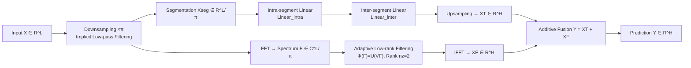

# MixLinear: Extreme Low Resource Multivariate Time Series Forecasting with 0.1K Parameters

**Conference**: ICLR 2026  
**OpenReview**: [https://openreview.net/forum?id=QUj0KuCumD](https://openreview.net/forum?id=QUj0KuCumD)  
**Code**: To be confirmed  
**Area**: Time Series Forecasting / Lightweight Models  
**Keywords**: Long-term time series forecasting, Parameter-efficient, Frequency domain filtering, Low-rank decomposition, Edge deployment  

## TL;DR
MixLinear employs a dual-pathway linear architecture of "temporal segmentation for local trends + frequency adaptive low-rank filtering for global trends," reducing long-term time series forecasting (LTSF) model parameters to only **0.1K (45–176)** while achieving accuracy comparable to or better than mainstream lightweight models on 8 benchmarks.

## Background & Motivation
- **Background**: Long-term time series forecasting (LTSF) has been dominated by Transformer-based models (e.g., PatchTST, TimesNet), which offer high precision but require millions of parameters and massive computation, making them unsuitable for resource-constrained scenarios like embedded devices and edge sensors.
- **Limitations of Prior Work**: The authors argue that parameter explosion is not a "necessary cost" of performance but a **structural inefficiency in representation strategy**. Mainstream architectures use the same mechanism to capture both high-frequency local fluctuations and low-frequency global trends, despite these signals having completely different statistical properties.
- **Key Challenge**: Local features (short-term fluctuations) are inherently suited for **temporal domain** characterization via temporal locality, while global structures (long-term trends, seasonality) exhibit sparsity in the **frequency domain**. Forcing a unified architecture to model both leads to parameter redundancy. Existing "divide and conquer" attempts are incomplete: DeepGate decomposes the sequence but still uses heavy modules for both paths; FITS is efficient in the frequency domain but struggles to fit sharp local changes using global frequency components, requiring disproportionate coefficients that offset spectral compression gains.
- **Goal**: Design a framework that effectively models both global and local patterns while being extremely parameter-efficient.
- **Key Insight**: **"Process each pattern in its most natural domain"**—local trends are extracted via temporal segmentation, and global trends via frequency domain adaptive low-rank filtering, followed by additive fusion.

## Method

### Overall Architecture
MixLinear is a **dual-pathway linear architecture** that feeds the input $X\in\mathbb{R}^{L\times C}$ into two complementary paths for additive fusion: $Y=F_{\text{segment}}(X;\Theta_s)+F_{\text{frequency}}(X;\Theta_f)$. The temporal path handles piecewise linear decomposition for local trends, while the frequency path performs low-rank spectral compression for global trends. Additive (rather than multiplicative) fusion maintains the independence of representations in both domains while allowing joint optimization and avoiding gradient instability.

### Key Designs

**1. Temporal Segment Trend Extraction: Reduction from $O(n^2)$ to $O(n)$ via factorized linear decomposition.** The input is first downsampled by factor $\pi$ to obtain $X_{\text{down}}\in\mathbb{R}^{(L/\pi)\times C}$. This step acts as an implicit low-pass filter, attenuating high-frequency noise while preserving trends. The downsampled sequence is divided into $M$ non-overlapping segments of length $r=L/(\pi M)$. The core consists of **two complementary linear transforms to decouple correlation structures**: the intra-segment transform $h^{(s)}_{\text{intra}}=\text{Linear}_{\text{intra}}(x^{(s)})$ compresses $r$ samples into a $d$-dimensional summary to capture waveform information like local slopes and short cycles; the inter-segment transform $H_{\text{inter}}=\text{Linear}_{\text{inter}}(H_{\text{intra}})$ models cross-segment dependencies on stacked segment embeddings to capture slow drifts and segment-level periodicity. This intra/inter decoupling requires only $dr+dM+d+M$ parameters, reducing complexity from quadratic to linear while preserving hierarchical temporal structures.

**2. Frequency Adaptive Low-rank Spectral Filtering: Extreme compression via rank constraint $n_z=2$.** FFT is applied to the downsampled sequence to obtain the spectrum $F=\text{FFT}(X_{\text{down}})\in\mathbb{C}^{(L/\pi)\times C}$. Traditional methods learn a full-size $(L/\pi)\times(L/\pi)$ complex filter, which is parameter-heavy and prone to overfitting. MixLinear uses **low-rank factorization** to parameterize the frequency transform as a rank-$n_z$ operator: $\Phi(F)=U(VF)$, where $U\in\mathbb{C}^{(L/\pi)\times n_z}$ and $V\in\mathbb{C}^{n_z\times(L/\pi)}$ with $n_z\ll L/\pi$. This projects the spectrum of each segment into a shared ultra-low-dimensional latent space before reconstruction via adaptive bases $U$. Setting $n_z=2$ forces the representation to concentrate on dominant frequency patterns, leveraging the low-rank structure of natural signals in the frequency domain. This path requires only $4rn_z$ real parameters before returning to the temporal domain $X_F\in\mathbb{R}^{H\times C}$ via iFFT and upsampling.

**3. Dual-domain Additive Fusion + Complexity Analysis.** The outputs from both paths are directly summed for the final prediction, keeping their domain-specific representations independent and jointly differentiable. The overall time complexity is dominated by the frequency domain FFT at $O(n\log n)$ (where $n=L/\pi$), and the space complexity is linear $O(n)$. Compared to the $O(L^2)$ time and memory of self-attention, this represents an order-of-magnitude improvement, enabling the model to handle much longer sequences on edge devices without linear computational explosion.

## Key Experimental Results

### Main Results (8 LTSF benchmarks, look-back 720, 4 prediction steps, comparing MACs and MSE; RPD denotes relative MSE improvement over SparseTSF)

| Model | Parameters | Performance |
|-------|------------|-------------|
| **MixLinear (Ours)** | **0.1K (45–176)** | Exchange max +16.2% RPD, ETTh1 +5.3%, ETTh2 +3.7%; lowest MACs |
| SparseTSF (2024) | 1K | Baseline (RPD=0) |
| FITS (2024) | 10K (max 10,512) | Inferior to MixLinear on most steps |
| DLinear (2023) | Million-level | Mostly negative RPD |
| PatchTST (2023) | G-level MACs | Similar accuracy but orders of magnitude higher compute |
| TimesNet (2023) | TG-level MACs | RPD generally significantly negative |

- **Parameters**: Reduced by **11–81%** compared to SparseTSF, and **94–98%** compared to FITS. The longest configuration (look-back/horizon 720) uses only 176 parameters, while FITS requires 10,512.
- **Compute**: On ETTh1 (step 720), MACs are 196.56K, lower than SparseTSF (277.20K, +41.32%) and FITS (292.32K, +48.98%). For high-dimensional Traffic (862 channels, step 720), MACs are 24.2M, also the lowest.

### Ablation Study (Step 720, removal of a single pathway)

| Variant | ETTh1 MSE | ETTh2 MSE | Electricity MSE | Traffic MSE |
|---------|-----------|-----------|------------------|--------------|
| w/o Filtering (Temporal Only) | 0.425 | 0.389 | 0.245 | 0.528 |
| w/o Segment (Frequency Only) | 0.474 | 0.411 | 0.245 | 0.478 |
| **MixLinear (Dual-pathway)** | **0.423** | **0.380** | **0.209** | **0.452** |

### Key Findings
- **Complementarity**: Temporal segmentation is more critical for low-dimensional datasets (ETTh1/ETTh2, where w/o Filtering > w/o Segment), while frequency low-rank filtering is more critical for high-dimensional datasets (Electricity/Traffic, where w/o Segment > w/o Filtering). The full MixLinear performs best across all scenarios.
- **Inference Speed**: Speedups up to **3.2×** in low-dimensional settings (Exchange: 0.25ms vs SparseTSF: 0.80ms) and up to **2.58×** in high-dimensional settings (Electricity: 2.05ms vs FITS: 4.77ms).
- The dual-pathway adds only marginal overhead (Exchange 224.64K vs single pathway 207.36K MACs), primarily from FFT/iFFT.

## Highlights & Insights
- **Clear "Division of Labor"**: Translates the signal processing common sense of "local = temporal, global = frequency sparse" into a minimalist dual-linear architecture that is conceptually clear and interpretable.
- **The 0.1K Parameter Extreme**: Pushes the efficiency-accuracy curve to an unprecedented point, competing with K-level and M-level models with only dozens to a hundred parameters, making a strong case for edge deployment.
- **Low-rank Frequency Filtering**: Using a rank constraint of $n_z=2$ to force the model to learn only dominant frequency patterns is the key lever for extreme parameter compression.

## Limitations & Future Work
- **Absolute Accuracy Ceiling**: As a minimalist linear model, its accuracy may still fall behind large models in scenarios requiring complex non-linear modeling; the paper emphasizes "comparable accuracy with significantly higher efficiency" rather than absolute SOTA.
- **Hyperparameter Sensitivity**: Parameters like downsampling factor $\pi$, segment count $M$, and rank $n_z$ need dataset-specific tuning; robustness discussions are somewhat limited.
- **Simplified Additive Fusion**: Whether simple summation is optimal for all data or if better lightweight fusion methods exist remains to be explored.
- **LTSF Task Only**: Transferability to other time series tasks like anomaly detection, imputation, or classification has not yet been verified.

## Related Work & Insights
- **Lineage of Linear Forecasting Models**: DLinear proved that simple linear layers can outperform Transformers; FITS pursued pure frequency domain routes for extreme compression; SparseTSF used sparsification to reduce parameters. MixLinear explicitly decouples "temporal segmentation" and "frequency low-rank" into two paths, absorbing the advantages of both.
- **Insight**: Beyond chasing absolute SOTA, "parameter efficiency/deployability" is an undervalued but practical research dimension. Processing signals with different statistical properties in their most natural representation domains can be more elegant and efficient than stacking uniform heavy modules.

## Rating
- **Novelty**: ⭐⭐⭐⭐ — While the dual-domain idea is not entirely new (paved by DLinear/FITS), the specific combination of "temporal segmentation + frequency low-rank" and the 0.1K parameter extreme provide a clear incremental contribution.
- **Experimental Thoroughness**: ⭐⭐⭐⭐ — Comparison across 8 benchmarks, 5 strong baselines, and multiple dimensions (Params/MACs/Inference Time/Ablation) covering both low and high dimensions is solid.
- **Writing Quality**: ⭐⭐⭐ — The methodology description occasionally uses "promotional" language (e.g., "unprecedented", "sophisticated"), and some terminology is slightly ornate, but the overall structure is clear and the charts are well-executed.
- **Value**: ⭐⭐⭐⭐ — Offers direct practical value for edge/embedded time series forecasting, with persuasive parameter efficiency results.

<!-- RELATED:START -->

## Related Papers

- [\[ICLR 2026\] PHAT: Modeling Period Heterogeneity for Multivariate Time Series Forecasting](phat_modeling_period_heterogeneity_for_multivariate_time_series_forecasting.md)
- [\[ICLR 2026\] Towards Robust Real-World Multivariate Time Series Forecasting: A Unified Framework](towards_robust_real-world_multivariate_time_series_forecasting_a_unified_framewo.md)
- [\[ICLR 2026\] CPiRi: Channel Permutation-Invariant Relational Interaction for Multivariate Time Series Forecasting](cpiri_channel_permutation-invariant_relational_interaction_for_multivariate_time_se.md)
- [\[ICLR 2026\] Learning Recursive Multi-Scale Representations for Irregular Multivariate Time Series Forecasting](learning_recursive_multi-scale_representations_for_irregular_multivariate_time_s.md)
- [\[ICLR 2026\] Extreme Weather Nowcasting via Local Precipitation Pattern Prediction](extreme_weather_nowcasting_via_local_precipitation_pattern_prediction.md)

<!-- RELATED:END -->
