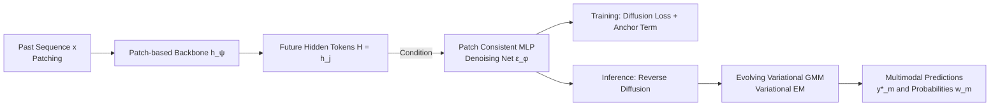

# MMPD: Diverse Time Series Forecasting via Multi-Mode Patch Diffusion Loss

**Conference**: ICLR 2026  
**OpenReview**: [https://openreview.net/forum?id=NEUgHT8dvH](https://openreview.net/forum?id=NEUgHT8dvH)  
**Code**: [https://github.com/Thinklab-SJTU/MMPD](https://github.com/Thinklab-SJTU/MMPD)  
**Area**: Time Series Forecasting / Diffusion Models / Loss Function Design  
**Keywords**: Time series forecasting, Diffusion loss, Multimodal forecasting, Patch-based Backbone, Variational Gaussian Mixture, Probabilistic forecasting  

## TL;DR
The training loss is upgraded from MSE, which assumes the future follows a unimodal Gaussian distribution, to a **MMPD loss** parameterized by a diffusion process. It serves as a plug-and-play module attached to any patch-based time series backbone, enabling the prediction of multiple probabilistic futures with diverse shapes from the same historical input.

## Background & Motivation
**Background**: Recent years have seen a proliferation of backbone architectures in time series forecasting—including sparse attention, trend-seasonal decomposition, frequency-domain enhancement, patching, and cross-channel modeling. However, the vast majority of models still rely on regression losses like MSE (or MAE) during training.

**Limitations of Prior Work**: The paper identifies the fundamental limitations of MSE from a probabilistic perspective. When assuming $p_\theta(y|x)=\mathcal{N}(y; f_\theta(x), \sigma^2 I)$ and maximizing log-likelihood, the objective reduces to MSE. Thus, **training with MSE is equivalent to implicitly assuming the future follows an independent Gaussian with a predictable mean and fixed variance**. This imposes four limitations: ① Unimodal Gaussians cannot describe scenarios where one history leads to multiple possible futures; ② Predictions at different steps are assumed independent, whereas real sequences are highly correlated across steps; ③ Variance is constant, but real uncertainty evolves over time; ④ Gaussians are symmetric, but real distributions are often asymmetric (e.g., non-negative rainfall).

**Key Challenge**: No matter how sophisticated the backbone is, if the loss function restricts the future distribution to a simple parametric form, the model's expressive power is capped. Previous attempts to modify the loss (e.g., DTW is hard to scale; Negative Binomial/Student-T/Mixture distributions) still rely on **manually pre-defined distribution families**, limiting their ability to model complex distributions.

**Goal**: Design a backbone-agnostic, learnable loss that can capture any complex future distribution and naturally support "multimodal and multiple future" predictions.

**Core Idea**: **Incorporate the projection head into the loss**—decoupling the forecasting network into a backbone $h_\psi$ and a projector $g_\phi$, and treating the lightweight projector as part of a "trainable loss" $\min_{\phi,\psi}\text{Loss}_\phi(H, y)$. This perspective mirrors how a learnable discriminator guides a generator in adversarial losses. Within this framework, **parameterizing this loss with a diffusion process** allows the model to escape the constraints of Gaussian assumptions.

## Method

### Overall Architecture
Any patch-based backbone segments the historical sequence into patches and outputs hidden tokens $H=\{h_j\}_{j=1}^l$ corresponding to future patches. MMPD does not modify the backbone but treats these tokens as conditions for a diffusion process. During training, the backbone is optimized using a diffusion denoising objective (plus an anchor term for deterministic forecasting). During inference, a reverse diffusion sampling process is executed, while an evolving variational GMM is fitted in real-time to output multiple multimodal predictions with associated probabilities.

### Key Designs

**1. Redefining Projector as Diffusion Loss: Rethinking loss from a probabilistic view.** This is the foundation of the work. The authors first prove that MSE is equivalent to assuming the future is an independent Gaussian with fixed variance. By decoupling the network into $f_\theta(x)=g_\phi(h_\psi(x))$, they note that the backbone contains the majority of parameters and is the core of optimization, while the lightweight projector $g_\phi$ can be "included in the loss," forming a composite trainable loss $\min_{\phi,\psi}\text{Loss}_\phi(H,y)$. MSE is a special case: $\text{MSE}_\phi(H,y)=\frac{1}{\tau}\|y-g_\phi(H)\|_2^2$. By viewing the projector as an auxiliary module guiding backbone optimization, it can be replaced with a **conditional diffusion process**. Using future tokens as conditions and the denoising objective as the loss implicitly models an arbitrarily complex $p_\theta(y|x)$.

**2. Patch Consistent MLP: Maintaining consistency across lightweight denoisers.** A naïve approach would be to split the noisy sequence $y_k$ into patches and use an MLP to independently denoise each patch conditioned on token $h_j$ (common in vision tokens). However, independent MLPs only model the **marginal distributions** $p(p_j|x)$ rather than the **joint distribution** of all future patches, leading to discontinuities during sampling. The authors extend the AdaLN-MLP (from DiT blocks) into a Patch Consistent MLP. When denoising the $j$-th patch, the condition vector fuses four components:
$$c^k_j = \text{token}_j + \text{step}_k + \text{prev}^k_j + \text{next}^k_j$$
where $\text{prev}^k_j, \text{next}^k_j$ are linear projections of the $r$ **adjacent noisy patches**. This "neighbor-aware" design ensures continuity between patches. Ablations show that with $r=0$ (independent MLP), the Top-3 MSE is even worse than standard MSE, while $r=1$ significantly improves results.

**3. Anchor Trick: Seamless integration of deterministic prediction.** Many scenarios still require a deterministic forecast (the traditional role of MSE), but repeated diffusion sampling to calculate mean/median is computationally expensive. The authors observe that in the diffusion target $y_k=\sqrt{\bar\alpha_k}y_0+\sqrt{1-\bar\alpha_k}\epsilon$, if $y_{k^*}=0$ at some step $k^*$, the noise reduces to a scaled negative ground truth $\epsilon=-\frac{\sqrt{\bar\alpha_{k^*}}}{\sqrt{1-\bar\alpha_{k^*}}}y_0$. By treating $(0,\{h_j\},k^*)$ as an "anchor input for deterministic prediction," they formulate a joint objective:
$$L=\lambda\|\epsilon-\epsilon_\phi(y_k,\{h_j\},k)\|_2^2+(1-\lambda)\Big\|\tfrac{\sqrt{\bar\alpha_{k^*}}}{\sqrt{1-\bar\alpha_{k^*}}}y_0+\epsilon_\phi(0,\{h_j\},k^*)\Big\|_2^2$$
Default $\lambda=0.99$, and $k^*$ is chosen such that $\bar\alpha_{k^*}\approx0.5$. After training, the deterministic prediction is obtained in a single step via $-\frac{\sqrt{1-\bar\alpha_{k^*}}}{\sqrt{\bar\alpha_{k^*}}}\epsilon_\phi(0,\{h_j\},k^*)$, **bypassing expensive diffusion iterations** without any structural changes.

**4. Evolving Variational GMM: Extracting interpretable multimodality from implicit distributions.** The $p_\theta(y|x)$ obtained via diffusion is an implicit distribution without an analytical form. Traditional methods rely on sampling and calculating statistics, which fails to describe multi-peaked distributions. The authors assume the true distribution is multimodal: $q(y_0|x)=\sum_{m=1}^M w_m\delta(y_0-y^*_m)$. Plugging this into forward diffusion, the distribution at step $k$ becomes a Gaussian Mixture $q(y_k|x)=\sum_m w_m\mathcal{N}(y_k;\sqrt{\bar\alpha_k}y^*_m,(1-\bar\alpha_k)I)$. Based on this, they design an **evolving variational GMM** synchronized with reverse diffusion. At each step $k$, variational EM is performed on generated samples $\{y^k_n\}$, guided by priors from the forward process. Upon completion, the GMM directly provides $M$ modal predictions and their probabilities, with the number and structure of modes adaptively inferred from the data.

## Key Experimental Results

Datasets: ETTh1/ETTm1/ETTh2/ETTm2, WTH, ECL, Traffic, and a newly constructed Dynamic dataset (17 complex dynamical system signals). Evaluation uses Top-K MSE/MAE ($K=3$, using the minimum error among the top-3 most probable modes), alongside MSE and CRPS for deterministic and probabilistic forecasting.

### Main Results (Comparison of Loss Functions, Table 1)
The backbone used is a patch-based decoder-only Transformer.

| Loss Type | Representative Method | Multimodal Support | Performance Summary |
|---|---|---|---|
| Deterministic | MSE / MAE | No | Strong deterministic, no multimodality |
| Parametric | Gaussian / Student-T | No | Student-T is the strongest CRPS baseline |
| Parametric Mixture | Mix | Partial | Multimodal but fixed number of modes |
| **Ours** | **MMPD** | **Yes** | **Leading in Top-3 MSE/MAE across the board** |

- Only Mix and MMPD capture multimodality, with MMPD consistently outperforming Mix in Top-3 MSE/MAE (as Mix uses pre-defined mixture components while MMPD learns from data).
- For deterministic forecasting (MSE), MMPD is comparable to the MSE loss; for probabilistic forecasting (CRPS), it matches the strongest Student-T baseline.

### Cross-backbone Generalization (Table 2)
MMPD was compared against MSE and Mix across three backbones: Crossformer, SegRNN, and MaskAE. MMPD's multimodal capability significantly exceeds MSE and Mix across all backbones. Notably, Mix is prone to outliers due to its log-normal components, leading to infinite CRPS values (especially on SegRNN), while MMPD remains stable.

### Ablation Study & Key Findings
- **Neighbor Range $r$** (Patch Consistent MLP): $r=0$ results in poor multimodal predictions; $r=1$ significantly reduces Top-3 MSE/MAE, while further increases yield diminishing returns—verifying that "neighbor-awareness" is crucial.
- **Balance Weight $\lambda$**: Performance is robust across a wide range of $\lambda$ (default 0.99).
- **Multimodal Inference vs. Post-processing**: The evolving variational GMM's Top-3 MSE/MAE (0.301/0.207) outperforms post-processing schemes like Random, Post-KMeans, or Post-GMM—indicating that online evolution during sampling is more accurate than offline clustering.

## Highlights & Insights
- **Fresh perspective on "Loss"**: Incorporating the projector into the loss and viewing it as a "learnable auxiliary module" allows powerful distribution modelers like diffusion to serve as loss functions.
- **Plug-and-play and Backbone-agnostic**: The loss can be swapped into any patch-based model to grant multimodal capabilities without structural changes, applicable to both supervised and foundation models.
- **Clever Anchor Trick**: Achieving deterministic prediction in one step through an anchor point avoids the contradiction between deterministic and diffusion objectives while eliminating sampling overhead.
- **Inferred vs. Presupposed Multimodality**: Modes and structures are inferred adaptively by the variational GMM, offering more flexibility than pre-defined mixture distributions and better aligning with real-world "one-history-multiple-futures" scenarios.

## Limitations & Future Work
- **Inference Cost**: Although deterministic prediction is accelerated by the anchor trick, multimodal prediction still requires reverse diffusion sampling and step-wise variational EM, which is more expensive than standard MSE inference.
- **Hyperparameters and Priors**: Parameters like max modes $M$, range $r$, and anchor $k^*$ need to be set. While robust, the universality of default values across different domains remains to be seen.
- **Univariate Focus**: The loss is calculated independently per channel. Explicit cross-channel joint multimodality modeling is not yet addressed.

## Related Work & Insights
- **Probabilistic/Distribution Forecasting**: MMPD is a natural extension of work like DeepAR and Student-T, moving from pre-defined parametric families to non-parametric implicit distributions via diffusion.
- **Time Series Diffusion**: Unlike standalone models like CSDI, MMPD treats diffusion as a **loss** that can be attached to any backbone.
- **Visual Token Diffusion**: The concept of denoising tokens (e.g., MAR) inspired patch diffusion, but MMPD addresses the unique requirement of temporal patch consistency.

## Rating
- **Novelty**: ⭐⭐⭐⭐⭐ The re-framing of the projection head as a loss and the adaptive multimodal inference are highly original.
- **Experimental Thoroughness**: ⭐⭐⭐⭐ Evaluated on 8 datasets and 4 backbones with comprehensive metrics.
- **Writing Quality**: ⭐⭐⭐⭐⭐ Clear derivation from probabilistic perspectives with intuitive illustrations.
- **Value**: ⭐⭐⭐⭐ Direct utility for risk-aware forecasting (e.g., trading) and provides a reusable paradigm for learnable loss modules.

<!-- RELATED:START -->

## Related Papers

- [\[ICLR 2026\] TEDM: Elucidated Diffusion Models for Time Series Forecasting](tedm_time_series_forecasting_with_elucidated_diffusion_models.md)
- [\[ICLR 2026\] Routing Channel-Patch Dependencies in Time Series Forecasting with Graph Spectral Decomposition](routing_channel-patch_dependencies_in_time_series_forecasting_with_graph_spectra.md)
- [\[ICLR 2026\] PMDformer: Patch-Mean Decoupling Information Transformer for Long-term Forecasting](pmdformer_patch-mean_decoupling_information_transformer_for_long-term_forecastin.md)
- [\[ICLR 2026\] Lost in the Non-convex Loss Landscape: How to Fine-tune the Large Time Series Model?](lost_in_the_non-convex_loss_landscape_how_to_fine-tune_the_large_time_series_mod.md)
- [\[ICLR 2026\] Rating Quality of Diverse Time Series Data by Meta-learning from LLM Judgment](rating_quality_of_diverse_time_series_data_by_meta-learning_from_llm_judgment.md)

<!-- RELATED:END -->
