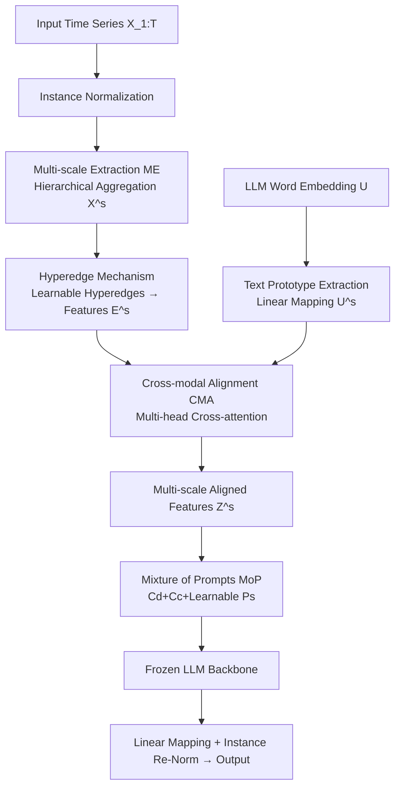

# Multi-Scale Hypergraph Meets LLMs: Aligning Large Language Models for Time Series Analysis

**Conference**: ICLR 2026  
**OpenReview**: [https://openreview.net/forum?id=SbBX2dCw3y](https://openreview.net/forum?id=SbBX2dCw3y)  
**Code**: To be confirmed  
**Area**: Time Series Analysis / LLM Cross-modal Alignment  
**Keywords**: LLM4TS, Multi-scale Alignment, Hypergraph, Mixed Prompts, Time Series Forecasting  

## TL;DR
MSH-LLM supplements time series with semantics using "learnable hyperedges," aligns temporal features to LLM lexical prototypes across multiple scales via cross-modal attention, and activates the temporal reasoning of LLMs through "Mixture of Prompts," achieving SOTA performance on 27 datasets across 5 task categories.

## Background & Motivation
- **Background**: Utilizing frozen LLMs (e.g., LLaMA, GPT-2) as backbones for time series analysis has become mainstream. The core challenge is aligning "natural language" and "time series" modalities—either by reprogramming input series (Time-LLM) or injecting context via prompts (AutoTimes).
- **Limitations of Prior Work 1 (Semantic Misalignment)**: Natural language possesses a naturally rich and distinctive multi-scale semantic space (word → phrase → sentence), whereas semantics carried by individual time points are extremely sparse. Existing methods rely on patch segmentation to supplement semantics, but **simple partitioning introduces noise and models group-wise interactions only on a single scale using predefined rules**, failing to discover implicit interactions.
- **Limitations of Prior Work 2 (Lack of Reasoning)**: Pre-trained LLMs do not naturally possess the knowledge and reasoning capacity to interpret time series patterns. Existing prefix prompt/self-prompt methods provide only single-type prompts and fail to utilize multi-scale temporal features, **making it difficult to truly comprehend time series patterns**.
- **Key Challenge**: Both language and time series have multi-scale structures (words/phrases/sentences vs. daily/weekly seasonal patterns), yet almost all existing LLM4TS works perform only single-scale alignment, neglecting this structural correspondence and underutilizing LLM capabilities.
- **Goal**: To develop the **first multi-scale alignment** framework for time series analysis—simultaneously enriching multi-scale temporal semantics, completing cross-modal alignment across scales, and activating LLM reasoning for multi-scale temporal patterns.
- **Key Insight**: **[Learnable Hypergraph for Semantics]** uses learnable hyperedges to capture group-wise interactions in a data-driven manner (replacing predefined rules). **[Multi-scale Cross-modal Alignment]** facilitates cross-attention between hyperedge features and text prototypes at every scale. **[Mixture of Prompts]** feeds three complementary prompt types (learnable, data-dependent, and capability-enhancing) into the LLM.

## Method

### Overall Architecture
MSH-LLM utilizes a **frozen** LLM for general time series analysis. First, input series and LLM embeddings are mapped to "multi-scale temporal features" and "multi-scale text prototypes." A hyperedge mechanism supplements temporal group-wise semantics to obtain multi-scale hyperedge features. The Cross-modal Alignment (CMA) module then aligns hyperedge features to text prototypes at each scale. Finally, the Mixture of Prompts (MoP) mechanism concatenates three prompt types to feed into the frozen LLM, with the output processed via linear mapping and Instance Re-Normalization.

### Key Designs

**1. Multi-scale Extraction (ME): Establishing hierarchical structures for both modalities.** For the temporal side, reversible instance normalization is followed by aggregation functions (1D convolution or average pooling) to obtain downsampled features: $X^s = \text{Agg}(X^{s-1}; \theta^{s-1}) \in \mathbb{R}^{N^s \times D}$, where length $N^s = \lfloor N^{s-1}/l^{s-1} \rfloor$ is determined by window $l^{s-1}$. For the language side, large word embeddings $U \in \mathbb{R}^{V \times P}$ are linearly compressed into text prototypes $U^1 \in \mathbb{R}^{V' \times P}$ ($V' \ll V$, filtering noise). Scale-by-scale linear mapping $U^s = \text{Linear}(U^{s-1}; \lambda^{s-1})$ ensures prototypes correspond to word/phrase/sentence-level semantics for subsequent alignment.

**2. Hyperedge Mechanism: Data-driven supplementation of multi-scale temporal semantics.** Multi-scale features are treated as nodes. At each scale, learnable embeddings—hyperedge $E^s_{hyper} \in \mathbb{R}^{M^s \times D}$ and node $E^s_{node} \in \mathbb{R}^{N^s \times D}$—are initialized. Scale-specific incidence matrices are constructed: $U^s_1 = \tanh(E^s_{node}\beta)$, $U^s_2 = \tanh(E^s_{hyper}\phi)$, $H^s = \text{Linear}(\text{ReLU}(U^s_1 (U^s_2)^\top))$. TopK sparsification is applied to $H^s$ (limiting each node to $\eta$ hyperedges) for noise resistance. Hyperedge features are computed as $e^s_i = \text{Avg}(\sum_{x^s_j \in N(e^s_i)} x^s_j)$. This mechanism **discovers implicit group-wise interactions via learnable parameters and non-linear transformations** rather than predefined rules.

**3. Cross-modal Alignment (CMA): Aligning time series to language at each scale.** Multi-head cross-attention is applied at scale $s$, where **hyperedge features act as queries and text prototypes act as keys/values**: $Q^s_j = E^s W^s_{q,j}$, $K^s_j = U^s W^s_{k,j}$, $V^s_j = U^s W^s_{v,j}$, yielding aligned features $Z^s_j = \text{softmax}(Q^s_j (K^s_j)^\top / \sqrt{d}) V^s_j$. This provides a rich multi-scale representation $\{Z^1, \dots, Z^S\}$ expressed via linguistic prototypes.

**4. Mixture of Prompts (MoP): Three complementary prompt types to activate LLM reasoning.** MoP injects three types simultaneously: **Learnable Prompts** $C_l = \{P^1, \dots, P^S\}$ (soft prompts per scale learning temporal dynamics); **Data-dependent Prompts** $C_d = \text{LLMs}(\text{tokenizer}(\pi, \tau, \mu))$ (data description $\pi$, task description $\tau$, and multi-scale statistics $\mu$); **Capability-enhancing Prompts** $C_c = \text{LLMs}(\text{tokenizer}(\phi, \varphi, \psi))$ (Chain-of-Thought $\phi$, focus-enhancing emotional manipulation $\varphi$, and reasoning methodology $\psi$). The final input is $O = \text{LLMs}([C_d, C_c, [P^1, Z^1], \dots, [P^S, Z^S]])$.

## Key Experimental Results
Evaluation across 27 real-world datasets and 5 task categories (long/short-term forecasting, classification, few-shot, zero-shot) against 19 advanced baselines.

### Main Results (Long-term Forecasting, MSE/MAE, averaged across horizons)

| Dataset | MSH-LLM | S2IP-LLM | Time-LLM | FPT | iTransformer | DLinear |
|---|---|---|---|---|---|---|
| Weather | **0.217/0.254** | 0.223/0.259 | 0.231/0.269 | 0.237/0.271 | 0.305/0.335 | 0.249/0.300 |
| Electricity | **0.159/0.253** | 0.163/0.258 | 0.165/0.261 | 0.167/0.263 | 0.203/0.298 | 0.166/0.264 |
| Traffic | **0.381/0.283** | 0.406/0.287 | 0.408/0.291 | 0.414/0.295 | 0.384/0.295 | 0.434/0.295 |
| ETTh1 | **0.402/0.420** | 0.405/0.426 | 0.414/0.435 | 0.418/0.431 | 0.451/0.462 | 0.419/0.439 |
| ETTm2 | **0.252/0.311** | 0.257/0.319 | 0.272/0.332 | 0.264/0.328 | 0.272/0.331 | 0.276/0.341 |

Compared to LLM4TS methods, MSH-LLM reduces error by 4.10%/3.72% (MSE/MAE) on average; compared to recent Transformers, by 8.54%/6.45%; and compared to linear models, by 7.48%/5.58%.

### Ablation Study (Traffic, MSE/MAE)

| Variant | H=96 | H=192 | H=336 |
|---|---|---|---|
| Full MSH-LLM | **0.365/0.270** | **0.372/0.281** | **0.385/0.279** |
| -w/o $C_l$ (w/o Learnable) | 0.373/0.272 | 0.379/0.289 | 0.400/0.293 |
| -w/o $C_d$ (w/o Data-dep) | 0.368/0.273 | 0.383/0.286 | 0.405/0.292 |
| -w/o $C_c$ (w/o Cap-enh) | 0.375/0.272 | 0.392/0.282 | 0.391/0.284 |
| -w/o MoP (w/o All) | 0.399/0.283 | 0.403/0.290 | 0.409/0.295 |
| G.6 (Replace with GPT-2 first 6 layers) | 0.393/0.295 | 0.404/0.297 | 0.411/0.316 |

### Key Findings
- **Multi-scale alignment yields gains**: SOTA performance across almost all tasks; on short-term M4, SMAPE was 11.659 (vs. AutoTimes 11.831); on UEA classification, the average was 75.38% (vs. FPT 74%).
- **Benefits for few-shot/zero-shot**: With only 5% training data, MSE decreased by 10.47% on average compared to S2IP-LLM/Time-LLM; zero-shot M4↔M3/M3↔M4 saw a 10.23% SMAPE reduction—confirming that multi-scale structures and MoP better mobilize LLM knowledge when data is scarce.
- **MoP components are indispensable**: Removal of any prompt type leads to performance drops, with the "w/o MoP" variant performing worst.
- **Scaling law adherence**: LLaMA-7B (32 layers) > first 12 layers > GPT-2 Small > GPT-2 first 6 layers, suggesting larger backbones facilitate better cross-modal alignment.

## Highlights & Insights
- **Robust observation on multi-scale nature**: Establishing that both language and time series are multi-scale and lifting alignment to that level is a natural and well-systematized advancement.
- **Learnable hyperedges vs. predefined rules**: Using TopK sparsification and data-driven hypergraph learning captures implicit group-wise interactions more effectively than fixed patches.
- **Strategic CMA direction**: Using temporal hyperedges as queries to "probe" lexical prototypes essentially re-expresses temporal data with linguistic semantics, reinforcing the "semantic enrichment" motive.
- **Systematic prompt engineering**: MoP differentiates prompt roles (dynamic learning vs. context providing vs. reasoning activation), with ablation studies proving their complementarity.

## Limitations & Future Work
- **Hyperparameter sensitivity**: Parameters such as scale count $S$, hyperedge count $M^s$, TopK threshold $\eta$, and aggregation window $l^s$ require tuning; cost of adaptation to new datasets is not fully discussed.
- **Interpretability**: The hypergraph structure is learned in a black-box manner; while visualized, it lacks quantitative explanations of exactly what patterns are captured at each scale.
- **Inference overhead**: Although the backbone is frozen, the computational and memory costs of 32-layer LLaMA-7B combined with multi-scale prompts remain high compared to lightweight baselines.
- **Heuristic prompt design**: The mechanism of "emotional manipulation" prompts for enhancing focus is unclear, and its generalizability remains unverified.

## Related Work & Insights
- **Intra-modal Learning** (BERT/GPT-3, TS self-supervision) is limited by a lack of large-scale pre-training data and unified objectives, making universal TS foundation models hard to train—motivating the shift to LLM4TS.
- **Cross-modal Learning**: Existing works like FPT, aLLM4TS, Time-LLM, and AutoTimes typically ignore hierarchical multi-scale structures, which MSH-LLM addresses.
- **Multi-scale TS Analysis**: Unlike previous works (e.g., Pyraformer, Pathformer) that use fixed rules or segmentation, this work introduces learnable hyperedges.
- **Insight**: The "hierarchical structure → data-driven group-wise interaction → multi-scale alignment" paradigm is a reusable template for any modal alignment involving semantic enrichment.

## Rating
- **Novelty**: ⭐⭐⭐⭐ First work on multi-scale alignment for TS; the combination of learnable hyperedges, multi-scale CMA, and MoP is conceptually novel.
- **Experimental Thoroughness**: ⭐⭐⭐⭐⭐ Extensive evaluation across 27 datasets and 5 tasks with 19 baselines and solid ablation studies.
- **Writing Quality**: ⭐⭐⭐⭐ Clear logical flow from motivation to method; however, the explanation for some prompt designs (e.g., emotional) is slightly weak.
- **Value**: ⭐⭐⭐⭐ Significant advantages in data-scarce scenarios; the multi-scale alignment paradigm offers a new direction for the LLM4TS community.

<!-- RELATED:START -->

## Related Papers

- [\[ICLR 2026\] Semantic-Enhanced Time-Series Forecasting via Large Language Models](semantic-enhanced_time-series_forecasting_via_large_language_models.md)
- [\[ICLR 2026\] TimeOmni-1: Incentivizing Complex Reasoning with Time Series in Large Language Models](timeomni-1_incentivizing_complex_reasoning_with_time_series_in_large_language_mo.md)
- [\[AAAI 2026\] FreqCycle: A Multi-Scale Time-Frequency Analysis Method for Time Series Forecasting](../../AAAI2026/time_series/freqcycle_a_multi-scale_time-frequency_analysis_method_for_time_series_forecasti.md)
- [\[ICLR 2026\] Time-Gated Multi-Scale Flow Matching for Time-Series Imputation](time-gated_multi-scale_flow_matching_for_time-series_imputation.md)
- [\[ICML 2026\] Building Social World Models with Large Language Models](../../ICML2026/time_series/building_social_world_models_with_large_language_models.md)

<!-- RELATED:END -->
