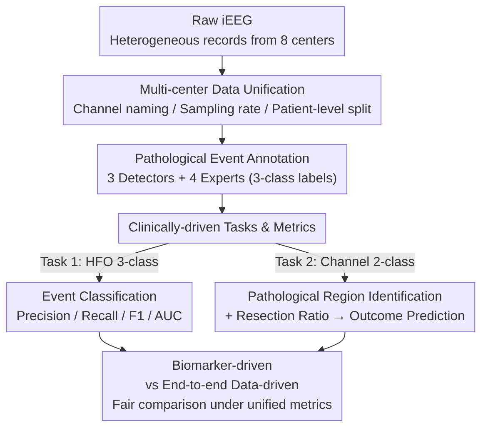

# Omni-iEEG: A Large-Scale, Comprehensive iEEG Dataset and Benchmark for Epilepsy Research

**Conference**: ICLR 2026  
**arXiv**: [2602.16072](https://arxiv.org/abs/2602.16072)  
**Code**: [omni-ieeg.github.io/omni-ieeg](https://omni-ieeg.github.io/omni-ieeg/)  
**Area**: Time Series / Neuroscience  
**Keywords**: intracranial EEG, epilepsy, high-frequency oscillations, benchmark, dataset

## TL;DR

This paper constructs the Omni-iEEG dataset (302 patients, 178 hours of high-resolution intracranial EEG recordings), defines standardized benchmark tasks and evaluation metrics based on clinical priors, and demonstrates that end-to-end modeling can match or surpass traditional biomarker-based methods in epilepsy surgical planning.

## Background & Motivation

**Background**: Epilepsy affects over 50 million people worldwide. Approximately 30% of patients have drug-resistant epilepsy, where surgical resection of the Epileptogenic Zone (EZ) is the optimal solution for achieving seizure-freedom. Intracranial EEG (iEEG) is the gold standard for EZ localization.

**Limitations of Prior Work**: Existing public iEEG datasets (Open iEEG, Zurich, HUP, SourceSink) suffer from three major issues: (1) Heterogeneous formats—inconsistent sampling rates, channel naming, and metadata; (2) Lack of standardized benchmarks—different studies use varying evaluation schemes, making results incomparable; (3) Scarcity of pathological event annotations—expert annotations for key biomarkers like HFOs are rarely public.

**Key Challenge**: Machine learning methods are typically validated on small-scale, single-center datasets, leaving generalization in question. Furthermore, the neuroscience field lacks a unified evaluation platform to impartially measure the clinical value of different methods.

**Goal**: To integrate data from 8 epilepsy centers, verified by board-certified epilepsy experts with unified metadata, to construct the Omni-iEEG dataset and benchmark. This work releases 36K+ expert-annotated pathological events, defines two primary and three exploratory tasks, and provides comprehensive baselines ranging from biomarker-driven to end-to-end data-driven approaches.

## Method

### Overall Architecture

Omni-iEEG is not a single model but a benchmark infrastructure spanning from raw signals to clinical decision-making, divided into three layers: the data layer unifies heterogeneous iEEG from 8 centers into a comparable format; the task layer translates "EZ localization" into quantifiable classification tasks using clinical priors; and the model layer accommodates both biomarker-driven and end-to-end data-driven baselines. Raw iEEG segments can either follow the traditional "HFO detection + event classification" pipeline or be fed directly into end-to-end models for channel-wise pathology identification, allowing fair comparison under the same evaluation metrics.

### Key Designs

**1. Multi-center Data Unification: Removing the "format heterogeneity" barrier**

Existing public iEEG datasets are fragmented with inconsistent sampling rates, naming, and metadata, making cross-center training nearly impossible. This work integrates 302 patients and 178 hours of recordings from 8 centers, including UCLA (50 patients), Children’s Hospital of Michigan (135), University Hospital Zurich (20), Hospital of the University of Pennsylvania (58), and NIH/JHH/UMF (39). Board-certified experts unified channel naming, SOZ/resection zone annotations, and surgical outcome reports. Non-standard channels (reference, EKG, stimulation) and flat/noisy signals were filtered. All data were resampled to 1000 Hz after preprocessing (e.g., bipolar montage). The dataset is split 60%/40% at the patient level, balanced by source, surgical outcome, and recording modality to prevent center-specific shortcuts. This foundational unification makes cross-center generalization results reliable for the first time.

**2. Pathological Event Annotation: Crystallizing "expert consensus" into trainable labels**

High-Frequency Oscillations (HFO, 80–500 Hz) are key biomarkers for EZ localization, but distinguishing pathological from physiological HFOs relies heavily on manual effort, with public annotations being almost non-existent. This paper generated candidate events using three detectors (STE, MNI, Hilbert). Four board-certified experts then labeled each candidate into three categories: artifact, pathological HFO co-occurring with spikes (spkHFO), and non-pathological HFO. A total of 36,177 events were annotated (9,288 artifacts, 7,709 non-spkHFO, 19,180 spkHFO). Inter-rater agreement was high, with Fleiss' $\kappa = 0.925$ and pairwise Cohen’s $\kappa$ between 0.88–0.94, providing strong supervisory signals for event-level classification.

**3. Clinically-driven Tasks & Metrics: Aligning evaluation with surgical reality**

The benchmark defines two primary tasks. Task 1 is pathological event classification, performing a 3-class classification (spkHFO / non-spkHFO / artifact) on individual HFO candidates, measured by macro-averaged Precision, Recall, F1, and AUC. Task 2 is pathological brain region identification, performing a 2-class classification (pathological vs. normal) at the channel level. Labels are defined by SOZ channels in seizure-free patients and corresponding non-resected channels. To bridge channel identification with clinical outcomes, the Resection Ratio (RR) is defined as the proportion of model-predicted pathology scores within resected channels: $RR = \sum_{c \in \text{resected}} s_c \big/ \sum_{c \in \text{all}} s_c$. This metric evaluates whether the regions the model deems pathological were actually resected, assessing patient-level surgical outcome prediction. This design emphasizes that AUC alone is insufficient; models must maintain high Recall (avoiding missing pathology) and Specificity (avoiding over-resection).

## Key Experimental Results

### Main Results

**Task 1: Pathological Event Classification**

| Model | Precision | Recall | F1 | AUC |
|------|-----------|--------|----|-----|
| LSTM+Attention | 0.735 | 0.736 | 0.734 | 0.911 |
| PatchTST Transformer | 0.776 | 0.769 | 0.773 | 0.931 |
| TimesNet | 0.759 | 0.773 | 0.765 | 0.922 |
| **PyHFO-Omni** | **0.803** | **0.811** | **0.806** | **0.939** |

**Task 2: Pathological brain region identification**

| Model | Channel Precision | Channel Recall | Channel F1 | Channel Specificity | Channel AUC | Outcome AUC |
|------|---------------|-------------|---------|-----------------|----------|----------|
| eHFO | 0.605 | 0.647 | 0.620 | 0.410 | 0.661 | 0.452 |
| PyHFO-Omni | 0.580 | 0.699 | 0.564 | 0.695 | 0.735 | **0.744** |
| SEEG-NET | 0.579 | 0.717 | 0.526 | 0.605 | 0.785 | 0.595 |
| CLAP (Audio Pretrained) | 0.594 | 0.700 | 0.601 | 0.782 | 0.768 | 0.677 |
| **TimeConv-CNN** | **0.626** | **0.745** | **0.647** | **0.823** | **0.806** | 0.738 |

### Ablation Study

**Cross-dataset Generalization (Leave-one-out HFO Classification)**

| Excluded Dataset | Precision | Recall | F1 |
|------------|-----------|--------|----|
| Open-iEEG | 0.696 | 0.689 | 0.623 |
| Zurich | 0.734 | 0.752 | 0.742 |
| HUP | 0.697 | 0.765 | 0.722 |
| SourceSink | 0.711 | 0.741 | 0.722 |

**Segment Length Ablation (TimeConv-CNN)**

| Segment Length | Precision | Recall | F1 | Specificity | AUC |
|--------|-----------|--------|----|-------------|-----|
| 30 s | 0.577 | 0.707 | 0.544 | 0.659 | 0.773 |
| **1 min** | **0.608** | **0.761** | **0.610** | **0.748** | **0.823** |
| 2 min | 0.592 | 0.747 | 0.564 | 0.668 | 0.805 |

### Key Findings

1. **End-to-End Models ≈ Traditional Biomarkers**: TimeConv-CNN's surgical outcome prediction AUC (0.738) is close to the HFO-based PyHFO-Omni (0.744), but it significantly outperforms in channel identification AUC (0.806).
2. **Feasibility of Cross-domain Transfer**: The audio-pretrained CLAP model, after fine-tuning, achieved competitive performance in iEEG classification (Channel AUC 0.768), suggesting that iEEG may contain "audible" biomarker features.
3. **Failure of Single-center Model Generalization**: Event-level models trained on single-center datasets show significant performance drops on the multi-center benchmark.
4. **1-Minute Segments are Optimal**: Compared to 30s and 2min, 1-minute segments provide the best balance between information density and feature stability.

## Highlights & Insights

- **First Comprehensive Epilepsy iEEG Benchmark**: Unified formats, metadata, annotations, and evaluation standards solve long-standing reproducibility issues in the field.
- **"Audible" Biomarkers**: YAMNet labeled iEEG signals from SOZ channels as "helicopter" sounds, while non-SOZ channels never received this label—this cross-modal finding is highly inspiring.
- **TimeConv-CNN Architecture**: Uses 1D temporal convolutions to compress 60,000 time-point time-frequency representations before using a CNN to capture joint features, efficiently processing kHz-level long iEEG segments.
- **Clinically-driven Evaluation Philosophy**: Emphasizes that AUC is insufficient; Recall (avoiding missing pathology), Specificity (avoiding over-resection), and surgical outcome prediction must be monitored simultaneously.

## Limitations & Future Work

- Subjectivity remains in spkHFO annotation, despite high inter-rater agreement ($\kappa > 0.9$).
- While covering 8 centers, the dataset is still primarily North American, lacking demographic diversity.
- Category imbalance persists as SOZ channels are far fewer than non-SOZ channels.
- Unsupervised methods exploring graph structures and inter-channel correlations were not explored.
- Risk of over-reliance on models—necessitating clinical expert involvement in the decision process.

## Related Work & Insights

- **Public iEEG Datasets**: Datasets like Open iEEG (Zhang et al., 2025) and Zurich HFO (Fedele et al., 2017) have disparate formats; this paper's unification work serves as vital infrastructure.
- **HFO Biomarkers**: Gotman (2010) and Frauscher et al. (2018) established the clinical value of HFOs for EZ localization, though distinguishing pathological types remains challenging.
- **Audio-EEG Cross-domain**: The successful transfer of CLAP suggests that neural and acoustic signals share underlying representational structures, warranting further exploration.

## Rating

⭐⭐⭐⭐

This paper makes a solid contribution to dataset construction, benchmark design, and cross-domain analysis. The 302 multi-center patients, 36K expert annotations, unified pipeline, and comprehensive baseline comparisons establish essential public infrastructure for the epilepsy iEEG field. The CLAP cross-domain transfer and the "audible" biomarker discovery are particularly novel.

<!-- RELATED:START -->

## Related Papers

- [\[ICLR 2026\] Battery Fault: A Comprehensive Dataset and Benchmark for Battery Fault Diagnosis](battery_fault_a_comprehensive_dataset_and_benchmark_for_battery_fault_diagnosis.md)
- [\[ICML 2026\] FactoryNet: A Large-Scale Dataset toward Industrial Time-Series Foundation Models](../../ICML2026/time_series/factorynet_a_large-scale_dataset_toward_industrial_time-series_foundation_models.md)
- [\[NeurIPS 2025\] CausalDynamics: A Large-Scale Benchmark for Structural Discovery of Dynamical Causal Models](../../NeurIPS2025/time_series/causaldynamics_a_large-scale_benchmark_for_structural_discovery_of_dynamical_cau.md)
- [\[ICLR 2026\] Multi-Scale Hypergraph Meets LLMs: Aligning Large Language Models for Time Series Analysis](multi-scale_hypergraph_meets_llms_aligning_large_language_models_for_time_series.md)
- [\[ICCV 2025\] VLRMBench: A Comprehensive and Challenging Benchmark for Vision-Language Reward Models](../../ICCV2025/time_series/vlrmbench_a_comprehensive_and_challenging_benchmark_for_vision-language_reward_m.md)

<!-- RELATED:END -->
