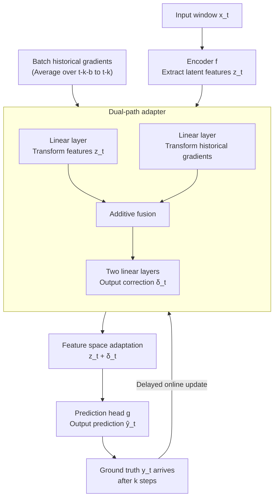

# Online Time Series Prediction Using Feature Adjustment

**Conference**: ICLR 2026  
**arXiv**: [2509.03810](https://arxiv.org/abs/2509.03810)  
**Code**: [Yes](https://github.com/xiannanhuang/ADAPT-Z)  
**Area**: Time Series  
**Keywords**: Online learning, distribution shift, feature space adaptation, delayed feedback, time series forecasting

## TL;DR

This paper proposes ADAPT-Z (Automatic Delta Adjustment via Persistent Tracking in Z-space), shifting the adaptation target of online time series forecasting from model parameter updates to feature space correction. By using a lightweight adapter to fuse current features with historical gradients, it addresses the delayed feedback issue in multi-step forecasting and consistently outperforms existing online learning methods across 13 datasets.

## Background & Motivation

Time series forecasting faces the core challenge of **distribution shift**: data distributions change continuously during deployment. Existing online learning methods revolve around two questions: (1) which parameters to update, and (2) how to update them.

Limitations of Prior Work:

- **Parameter Selection Bias**: Most methods update the last layer or introduce small adapter modules, which may not be the optimal choice for adapting to distribution shifts.
- **Delayed Feedback**: In multi-step forecasting (e.g., predicting 24 steps ahead), ground truth for time $t$ arrives only at $t+24$. Updates based on delayed gradients may be unreliable.
- **Training-Deployment Mismatch**: Samples are randomly shuffled during training, whereas data arrives chronologically during deployment.

**Key Insight**: Surface-level distribution shifts originate from changes in underlying latent factors (e.g., economic conditions, temperature). A model can be decomposed into an encoder $f$ (extracting latent factor features $z$) and a prediction head $g$. Correcting feature $z$ corresponds more directly to the root cause of distribution shift than correcting model parameters.

## Method

### Overall Architecture

ADAPT-Z decomposes a pre-trained forecasting model into an encoder $f$ and a prediction head $g$. During the deployment phase, rather than modifying model parameters, it seeks a feature correction term $\delta_t$ such that the corrected features fed into the prediction head approximate the ground truth, i.e., $g(z_t + \delta_t) \approx y_t$, where $z_t = f(x_t)$. This $\delta_t$ is generated online by a lightweight adapter that observes both the current features $z_t$ and recent historical gradients, continuously learning via $k$-step delayed online gradient descent to calibrate predictions under distribution shift.

### Key Designs

**1. Feature Space Adaptation Paradigm: Shifting the adaptation target from parameters to features**

Traditional online time series forecasting updates model parameters (last layer or extra adapters), but there is a gap between parameters and the root cause of distribution shift. ADAPT-Z directly patches the feature space. A naive implementation is feature-space Online Gradient Descent (fOGD), treating $\delta$ as a constant to be optimized along delayed gradients: $\delta_{t+1} = \delta_t - \eta \frac{\partial (g(z_{t-k} + \delta_{t-k}) - y_{t-k})^2}{\partial \delta_{t-k}}$, where $k$ is the forecasting horizon. It has two inherent flaws—multi-step delays make gradients outdated, and the optimal correction $\delta_t$ should vary with the current context $z_t$ rather than being a fixed constant. However, even this simple fOGD matches or exceeds complex parameter-updating methods on many datasets, suggesting that "feature correction" itself is a viable direction.

**2. Dual-path adapter: Separating and merging features and historical gradients**

To make $\delta_t$ a function of context, the network should ingest both current features $z_t$ and historical gradients. However, their magnitudes differ significantly. ADAPT-Z uses a dual-path structure: one linear layer independently transforms the current feature $z_t$, and another transforms historical gradients. The two outputs are summed and passed through two linear layers to produce the final $\delta_t$. Independent linear transformations scale the two signals to comparable levels, ensuring the result preserves both "current context" and "gradient direction" information.

**3. Batch historical gradients: Reducing variance via small windows**

Gradients from a single sample can have high variance, causing jitter in the correction. ADAPT-Z uses batch averaging: given a batch size $b$ and horizon $k$, it uses the average gradient of loss over the window from $t-k-b$ to $t-k$ as the historical gradient input. The $k$-step offset ensures the ground truth is available, while averaging dampens noise.

**4. Delayed online update: Updating the adapter when ground truth arrives**

In multi-step forecasting, ground truth for time $t$ arrives at $t+k$. Therefore, deployment uses online gradient descent with a $k$-step delay. Specifically, historical gradients, features, and model outputs are cached at each time step. When ground truth for $t$ arrives, the system retrieves state from $t-k$ to compute loss and update the adapter parameters and the last linear layer of the prediction head. Caching ensures the feedback corresponds to the correct prediction.

### Loss & Training

The base model is first pre-trained offline using standard MSE. During deployment, the adapter parameters and the last linear layer are updated online. The paper also provides an enhanced version: fine-tuning the base model and training the adapter on the training set (for 3 epochs) before deployment to inject "learning to adapt" capabilities. The data split is 60% training / 10% validation / 30% testing, which is more aligned with real-world deployment than the 25/5/70 split often used in previous work.

## Key Experimental Results

### Main Results

Evaluated on 13 datasets (4 ETT, 4 PEMS, weather, solar, traffic, electricity, exchange) using 3 base models (iTransformer, SOFTS, TimesNet) with horizons 12/24/48.

| Dataset | Original | fOGD | DSOF | SOLID | ADCSD | Proceed | **ADAPT-Z** | Gain |
|-------|------|------|------|-------|-------|---------|------------|------|
| ETTm1 | 0.2211 | 0.2178 | 0.2647 | 0.2166 | 0.2169 | 0.2168 | **0.1937** | 12.42% |
| solar | 0.1084 | 0.1074 | 0.1038 | 0.1083 | 0.1075 | 0.1083 | **0.0948** | 12.61% |
| traffic | 0.4075 | 0.4068 | 0.4060 | 0.4070 | 0.4070 | 0.4079 | **0.3689** | 9.49% |
| PEMS04 | 0.1288 | 0.1263 | 0.1465 | 0.1291 | 0.1280 | 0.1290 | **0.1223** | 5.05% |
| weather | 0.1575 | 0.1573 | 0.1975 | 0.1573 | 0.1564 | 0.1575 | **0.1481** | 5.98% |

ADAPT-Z achieved state-of-the-art results across all 13 datasets. Notably, the DSOF method performed worse than the original model on some datasets.

### Ablation Study

Enhanced version results using training set fine-tuning:

| Version | ETTh1 | ETTm1 | PEMS03 | solar | traffic |
|------|-------|-------|--------|-------|---------|
| ADAPT-Z (Val set only) | 0.2626 | 0.1954 | 0.0974 | 0.0940 | 0.3314 |
| Version1 (Fine-tune + Online) | 0.2625 | 0.1948 | 0.0936 | 0.0885 | 0.3197 |
| Version2 (Fine-tune + Frozen) | 0.2680 | 0.2104 | 0.0945 | 0.1141 | 0.3224 |

Feature position analysis (iTransformer): Performance remains stable when using outputs from different layers as features, but consistently degrades if modifying the input directly. On average, the output of the first Transformer block is optimal.

### Key Findings

- **Surprising performance of fOGD**: Simply performing gradient descent in feature space ranked second on many datasets, proving that feature correction is the correct direction.
- **"Learning to Adapt" in frozen version**: Version 2 reduces error without any online updates, indicating the model learns to utilize information from previous batches to self-adapt through training.
- **Training-Testing style mismatch**: Existing training methods shuffle samples independently, whereas deployment data is sequential. Future work should consider sample order during training.

## Highlights & Insights

1. **Paradigm Shift**: Moves from "which parameters to update" to "which features to correct," directly addressing the root cause of distribution shift.
2. **Simple and Powerful Baseline**: fOGD outperforms most complex methods, challenging conventional assumptions in the field.
3. **"Learning to Adapt" Phenomenon**: Reveals that training with gradient information can provide models with intrinsic adaptive capabilities.
4. **Practicality**: Lightweight adapter + plug-and-play design, compatible with various forecasting models.

## Limitations & Future Work

- The data split (60/10/30) differs from previous work (25/5/70), which might affect the online performance of baselines.
- The choice of feature position (which block's output) lacks theoretical guidance and currently relies on empirical results.
- Only point forecasting models were tested; adaptation for probabilistic models remains unexplored.
- The "Learning to Adapt" phenomenon deserves deeper theoretical analysis.

## Related Work & Insights

- Comparison with DSOF, SOLID, etc.: These methods update adapter/last-layer parameters, whereas ADAPT-Z updates the feature space.
- The dual-stream EMA strategy of FSNet and the direct fitting strategy of ELF represent different directional attempts.
- Insight: In the fields of online learning and test-time training (TTT), feature correction may be an overlooked superior solution.

## Rating

- Novelty: ⭐⭐⭐⭐ (Novel feature space adaptation paradigm; "learning to adapt" finding is interesting)
- Experimental Thoroughness: ⭐⭐⭐⭐ (13 datasets, 3 base models, multiple comparisons, and ablations)
- Writing Quality: ⭐⭐⭐⭐ (Clear reasoning, convincing motivation, detailed related work)
- Value: ⭐⭐⭐⭐ (Provides a new perspective and simple, effective solution for online time series forecasting)

<!-- RELATED:START -->

## Related Papers

- [\[ICLR 2026\] ST-HHOL: Spatio-Temporal Hierarchical Hypergraph Online Learning for Crime Prediction](st-hhol_spatio-temporal_hierarchical_hypergraph_online_learning_for_crime_predic.md)
- [\[ICLR 2026\] Delta-XAI: A Unified Framework for Explaining Prediction Changes in Online Time Series Monitoring](delta-xai_a_unified_framework_for_explaining_prediction_changes_in_online_time_s.md)
- [\[ICLR 2026\] Relational Feature Caching for Accelerating Diffusion Transformers](relational_feature_caching_for_accelerating_diffusion_transformers.md)
- [\[ICLR 2026\] ResCP: Reservoir Conformal Prediction for Time Series Forecasting](rescp_reservoir_conformal_prediction_for_time_series_forecasting.md)
- [\[ICLR 2026\] Extreme Weather Nowcasting via Local Precipitation Pattern Prediction](extreme_weather_nowcasting_via_local_precipitation_pattern_prediction.md)

<!-- RELATED:END -->
