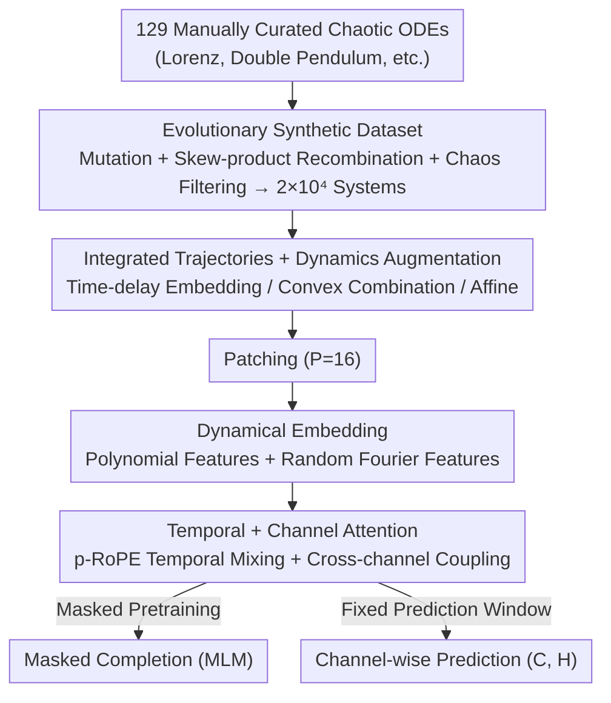

# Panda: A Pretrained Forecast Model for Chaotic Dynamics

**Conference**: ICLR 2026  
**OpenReview**: [https://openreview.net/forum?id=DgnsohAUMn](https://openreview.net/forum?id=DgnsohAUMn)  
**Code**: https://github.com/abao1999/panda  
**Area**: Time Series / Science Machine Learning / Chaotic Dynamics  
**Keywords**: Chaotic system prediction, Pretrained foundation model, Channel attention, Synthetic data, Emergent capability

## TL;DR
This paper uses an evolutionary algorithm to "create" 20,000 new chaotic ordinary differential equations (ODEs) as a synthetic training set. Combined with a patch Transformer (Panda) featuring channel attention and dynamical embedding, it achieves zero-shot prediction of unseen chaotic systems and even high-dimensional PDEs after pretraining only on low-dimensional ODEs, demonstrating neural scaling laws specific to dynamical systems.

## Background & Motivation
**Background**: Using data-driven methods to predict chaotic systems (turbulence, neural activity, double pendulums, etc.) has long been a challenge in Scientific Machine Learning (SciML). Existing approaches fall into two categories: "local" specialized models trained for a single system—learning only the numerical propagator behind one trajectory, essentially in-distribution generalization; and time-series foundation models (Chronos, TimesFM, Time-MOE, etc.), pretrained on massive but dynamics-poor general time-series libraries.

**Limitations of Prior Work**: Chaotic systems are extremely sensitive to errors; any small deviation is exponentially amplified over time, making long-range prediction theoretically impossible. Local models must be retrained for every new system and fail to generalize to unseen equations. Although general time-series foundations can be applied zero-short, their performance on dynamical systems is "only comparable to ordinary time-series tasks" because their causal decoders tend to "parrot" segments from the context, leading to overconfidence and poor point-prediction accuracy on out-of-distribution tasks.

**Key Challenge**: Dynamical systems require **cross-domain generalization**—the ability to predict **unseen new equations**. This necessitates a "global" model that possesses both extensive background dynamical knowledge and the ability to locally adapt to new systems. However, training such a model is hindered by two factors: (1) the lack of a sufficiently large, diverse, and **verifiably chaotic** dataset of equations; (2) the absence of dynamical inductive biases (strong channel coupling, invariant measures, etc.) in general time-series architectures.

**Goal**: Split the problem into two sub-problems—how to **generate** massive amounts of truly chaotic training data and how to **design** an architecture that encodes dynamical systems theory.

**Key Insight**: The authors draw from dynamical systems theory: (a) Takens' Embedding Theorem suggests that time-delay copies of low-dimensional observations preserve the topological structure of the attractor, which naturally fits patch-based time-series tokens; (b) variables in a system are coupled via deterministic differential equations rather than statistical correlation, necessitating explicit channel attention; (c) eDMD / Koopman operators approximate nonlinear dynamics using polynomial features, inspiring the lifting of patches into polynomial + Fourier feature spaces.

**Core Idea**: Use an evolutionary algorithm to breed 20,000 new chaotic ODEs from 129 known systems to serve as synthetic data, then pretrain a dynamics-aware patch Transformer on purely simulated data, turning "chaos prediction" into a zero-shot transferable foundation task.

## Method

### Overall Architecture
The workflow of Panda consists of two main lines: on the **data side**, an evolutionary algorithm is used to discover new chaotic systems at scale and integrate them into trajectories; on the **model side**, an encoder-only multivariate patch Transformer performs masked pretraining + short-range prediction on these trajectories. The input is a multivariate trajectory $\mathcal{T}\in\mathbb{R}^{C\times T}$, which is patched and projected before passing through alternating "temporal attention + channel attention" layers. The prediction head outputs channel-wise predictions of fixed length $H$; the same architecture also supports masked completion as an auxiliary output. The entire pipeline forms a top-down chain from "data creation" to "prediction":

### Key Designs

**1. Evolutionary Synthetic Chaotic Dataset: Creating 20,000 True Chaotic Systems via Mutation and Skew-product Recombination**

To address the lack of large-scale, truly chaotic training sets, the authors frame the generation of new equations as an evolutionary search process. The **foundational population** consists of 129 low-dimensional chaotic ODEs $\dot{x}=f_\theta(x,t)$ from literature, with parameters and initial values manually tuned to chaotic regimes. **Mutation** adds Gaussian noise to parameters $\theta'_a\sim\mathcal{N}(\theta_a,\sigma)$. **Recombination** utilizes an asymmetric skew-product coupling to merge two parent systems:

$$\dot{x}=f_a(x,t),\qquad \dot{y}=\kappa_b f_b(y,t)+\kappa_a f_a(x,t)$$

where $f_a$ is the drive and $f_b$ is the response. The scaling factor is the inverse RMS norm $\kappa=1/\sqrt{\mathbb{E}\|f(x,t)\|^2}$. This coupling **preserves chaos** under appropriate scales because the response system either synchronizes to the chaotic drive or remains chaotic itself. The crucial step is **Filtering**: after integration via a 5th-order implicit Runge-Kutta method, a suite of attractor tests is performed—first removing transient systems that converge to fixed points or diverge, then using the chaos 0-1 test to distinguish quasi-periodicity from true chaos, a proximity test to remove limit cycles, a power spectrum test to remove trajectories with only a few spikes, and the Rosenstein estimator to ensure a positive maximum Lyapunov exponent. Finally, KPSS and ADF tests verify stationarity. This posterior filtering distinguishes Panda from similar works that randomly perturb equations or combine terms from a library: Panda verifies the existence of unique attractors. The resulting $2\times10^4$ new systems maintain a wide range of cross-generational invariants (maximum Lyapunov exponent, fractal dimension), indicating high population diversity.

**2. Dynamical Embedding: Lifting Patches into Koopman-style Observables using Polynomial + Random Fourier Features**

Standard patches via linear projection lose the nonlinear structure of dynamical systems. The authors concatenate each patch token $P\in\mathbb{R}^{C\times P}$ with **random polynomial features** and **random Fourier features** (RFF) before lifting them to $d_{model}$. Polynomial features involve products over randomly sampled $d$-tuple indices $I$: $\Phi_{c,i}(P)=\prod_{j=1}^d P_{c,I_j}$ (degree $d\in\{2,3\}$); RFF uses random $W,b\sim\mathcal{N}(0,\sigma^2)$ to compute $F(P)=[\sin(PW+b)\;\cos(PW+b)]$. The total embedding is $E(P)=[P\;\Phi(P)\;F(P)]$, with $P+N_{poly}+N_{rff}=512$. This design draws from eDMD's approximation of Koopman operators and next-generation reservoir computing, which uses polynomial features to predict chaos: "lifting" nonlinear dynamics into a high-dimensional space where attention operates on coordinates closer to linear observables.

**3. Temporal Attention + Channel Attention: Capturing Deterministic Dependencies via Cross-channel Coupling**

Since variables in chaotic systems are coupled by differential equations rather than statistical correlations, univariate (channel-independent) architectures are disadvantaged (as confirmed in Section 5.2). Panda builds on PatchTST by alternatingly inserting two types of attention: **Temporal Attention** treats the channel dimension as a batch and performs self-attention with p-RoPE (wavelength 500, $p=75\%$) over $T/P$ patches; **Channel Attention** transposes the token sequence and performs position-agnostic self-attention, treating channels as a set: $\text{ChannelAttn}(\mathcal{T}_P)=\text{SelfAttention}(\mathcal{T}_P^\top)$. Each temporal layer is followed by a channel layer, then feed-forward residuals, GeLU, and RMSNorm. This channel attention allows the model, despite being **trained only on 3D ODEs**, to generalize to systems of arbitrary dimensions—in circuit experiments, the advantage of Panda over Chronos-SFT increases with coupling strength, forming a clear Pareto frontier.

**4. Masked Pretraining + Encoder-only Fixed-window Architecture: Optimizing Short-range Accuracy for "Weather" rather than "Climate"**

The authors deliberately avoid causal decoders (which "parrot" context and are overconfident out-of-distribution) in favor of an encoder-only, fixed-window architecture focused on short-range point-wise accuracy—referred to as "predicting the weather" rather than "predicting the climate" in SciML. In addition to direct prediction, pretraining includes **Masked Language Modeling (MLM)-style completion**: randomly masking patches for reconstruction to force the model to learn dynamical continuity. Ablations show that both channel attention and MLM pretraining provide significant gains; however, the interaction between MLM and dynamical embedding is subtle—polynomial embedding helps without MLM but slightly decreases performance with it, and while MLM hurts autoregressive rollout, dynamical embedding improves it. Thus, the final model utilizes polynomial embedding (PolyEmbed) to balance long-range prediction.

## Key Experimental Results

### Main Results
Zero-shot prediction results on $9.3\times10^3$ held-out chaotic systems, comparing Panda (21M) against time-series foundation models of similar or larger scale:

| Task / Comparison | Metric | Panda | Best Baseline | Conclusion |
|--------|------|------|----------|------|
| Zero-shot Unseen Chaotic Systems | sMAPE / MAE | Best | Chronos-SFT / TimesFM 200M | Comprehensive lead across various windows and metrics |
| Real Experimental Data (Pendulum/C. elegans/Circuits) | sMAPE | Better than Chronos-SFT | Chronos-SFT | Generalizes despite noise, missing data, and non-stationarity |
| Zero-shot PDE (KS / von Kármán) | Point-wise MAE | Better than FNO / DeepONet | FNO, DeepONet | Predicts flame front merging and vortex shedding without seeing PDEs |

Long-range distribution metrics (KL divergence, lower is better, Panda Gain $\Delta\%$ over best baseline):

| Prediction Window $L_{pred}$ | Panda KL | Chronos-20M-SFT | $\Delta\%$ |
|------|------|------|------|
| 512 | 3.93 | 4.72 | +16.7% |
| 1024 | 4.72 | 5.09 | +7.3% |
| 2048 | 5.63 | 5.62 | +0.0% |
| 3072 | 6.14 | 5.93 | −3.5% |

In Spectral Hellinger distance $H^2$, Panda maintains a steady lead of 10–17% across various windows.

### Ablation Study

| Configuration | Key Indicator | Description |
|------|---------|------|
| Full (PolyEmbed) | Best Long-range | Channel Attention + MLM + Poly Embedding |
| w/o Channel Attention | Significant Drop | Loss of inter-variable coupling modeling |
| w/o MLM Pretraining | Significant Drop | Impaired short-range accuracy |
| w/o Dynamical Embed | Higher Rollout Error | Degraded autoregressive extrapolation |
| MLM + PolyEmbed Both | Slight Drop | Complex interaction requiring trade-offs |

### Key Findings
- **Channel Attention contributes most**: Its advantage grows with coupling strength, making it the key to generalizing to real-world nonlinear coupling.
- **Diversity Scaling Law**: Fixing the total number of time points while varying "unique systems vs. initial conditions," zero-shot error decreases monotonically with the **number of unique systems**. This differs from traditional scaling laws based on total data volume, echoing Pesin’s Theorem (marginal info from extra trajectories on the same attractor diminishes; new systems bring new topology).
- **Emergent PDE Capability**: Training only on low-dimensional ODEs but predicting high-dimensional PDEs suggests that cross-channel attention learns transferable dynamical propagators.
- **Interpretable Internal Representations**: When fed dual-frequency sines, the row entropy of attention rollouts exhibits multi-scale **nonlinear resonance** structures (absent in the univariate ablation); attention maps show structures like Toeplitz, block, or selectors, indicating the model performs global transformations rather than simple numerical integration.

## Highlights & Insights
- **Data Generation as a Core Contribution**: Evolutionary generation + rigorous attractor testing ensures the training set is **truly chaotic** rather than just perturbed samples. This is the foundation of zero-shot generalization—the quality of data determines the quality of the inductive bias.
- **Compiling Dynamical Theory into Architecture**: Takens Theorem → patches, Koopman/eDMD → polynomial Fourier embedding, deterministic coupling → channel attention. Each component has a clear dynamical motivation.
- **Diversity Scaling Law** is highly valuable: It suggests that in scientific domains, "how many different systems been seen" is more critical for generalization than "how many data points been seen," guiding future synthetic data generation.
- **Emergent PDE Prediction** is the most remarkable finding: Low-dimensional ODE training → high-dimensional PDE zero-shot prediction suggests that chaotic predictability may have cross-dimensional common structures.

## Limitations & Future Work
- **Regression to the Mean**: Like most Transformer foundations trained with short-range losses, Panda's point prediction degrades and KL gain turns negative in sufficiently long windows ($L_{pred}\geq2048$). Chronos, due to its tokenization + cross-entropy, "parrots" unstable periodic orbits from the context, performing better on ultra-long distribution metrics.
- **Low-dimensional Training Bias**: Although PDE capabilities emerge, the training distribution is still confined to low-dimensional ODEs. Coverage of higher-dimensional, more turbulent, or stochastic/noisy dynamics remains limited.
- **Indirect Comparison with DynaMix**: The contemporaneous DynaMix uses a Mixture-of-Experts RNN and captures long-range geometry better, but experimental settings and data structures differ. Results here focus on Transformer-based foundations.
- **Improvements**: Extending skew-product recombination to more general nonlinear couplings, introducing stochastic/PDE systems into the training distribution, or using losses aligned with long-range geometry (rather than pure short-range) to mitigate mean regression.

## Related Work & Insights
- **vs. Chronos / TimesFM / Time-MOE (General Foundations)**: These are trained on general libraries lacking dynamical structure and are mostly univariate causal decoders. Panda is trained on discovered chaotic systems with multivariate channel attention, providing inductive biases for strong coupling and invariant measures, leading to higher zero-shot accuracy.
- **vs. DynaMix (Contemporaneous Work)**: DynaMix is a zero-shot reconstruction model for dynamical systems based on Almost-Linear RNN experts, using the same seed pool as this paper. Panda differs through richer data generation (discovering new chaotic flows) and the emergent PDE capabilities of its patch Transformer architecture.
- **vs. Equation Perturbation / Library-based Generation**: Those methods do not verify if systems have unique attractors. Panda uses a full suite of attractor tests for posterior filtering, resulting in "truer" and more diverse chaotic systems.
- **vs. FNO / DeepONet (PDE Operators)**: These require full training on target PDEs. Panda predicts nonlinear phenomena in KS and von Kármán vortex streets zero-shot, highlighting the generalization advantage of cross-channel attention.

## Rating
- Novelty: ⭐⭐⭐⭐⭐ Evolutionary chaos generation + dynamics-aware architecture + emergent PDE prediction; highly novel and self-consistent.
- Experimental Thoroughness: ⭐⭐⭐⭐⭐ Verified via 9,300 held-out systems, real experimental data, PDEs, scaling laws, and attention interpretability.
- Writing Quality: ⭐⭐⭐⭐ Clear mapping between theory and architecture, though some details are scattered in the appendix.
- Value: ⭐⭐⭐⭐⭐ Provides an empirical paradigm for scientific pretraining: "data diversity is more important than data volume."

<!-- RELATED:START -->

## Related Papers

- [\[ICLR 2026\] Quadratic Direct Forecast for Training Multi-Step Time-Series Forecast Models](quadratic_direct_forecast_for_training_multi-step_time-series_forecast_models.md)
- [\[ICLR 2026\] Brain-Semantoks: Learning Semantic Tokens of Brain Dynamics with a Self-Distilled Foundation Model](brain-semantoks_learning_semantic_tokens_of_brain_dynamics_with_a_self-distilled.md)
- [\[ICLR 2026\] CauKer: Classification Time Series Foundation Models Can Be Pretrained on Synthetic Data](cauker_classification_time_series_foundation_models_can_be_pretrained_on_synthet.md)
- [\[ICLR 2026\] Towards Generalizable PDE Dynamics Forecasting via Physics-Guided Invariant Learning](towards_generalizable_pde_dynamics_forecasting_via_physics-guided_invariant_lear.md)
- [\[ICLR 2026\] GTM: A General Time-series Model for Enhanced Representation Learning](gtm_a_general_time-series_model_for_enhanced_representation_learning_of_time-series.md)

<!-- RELATED:END -->
