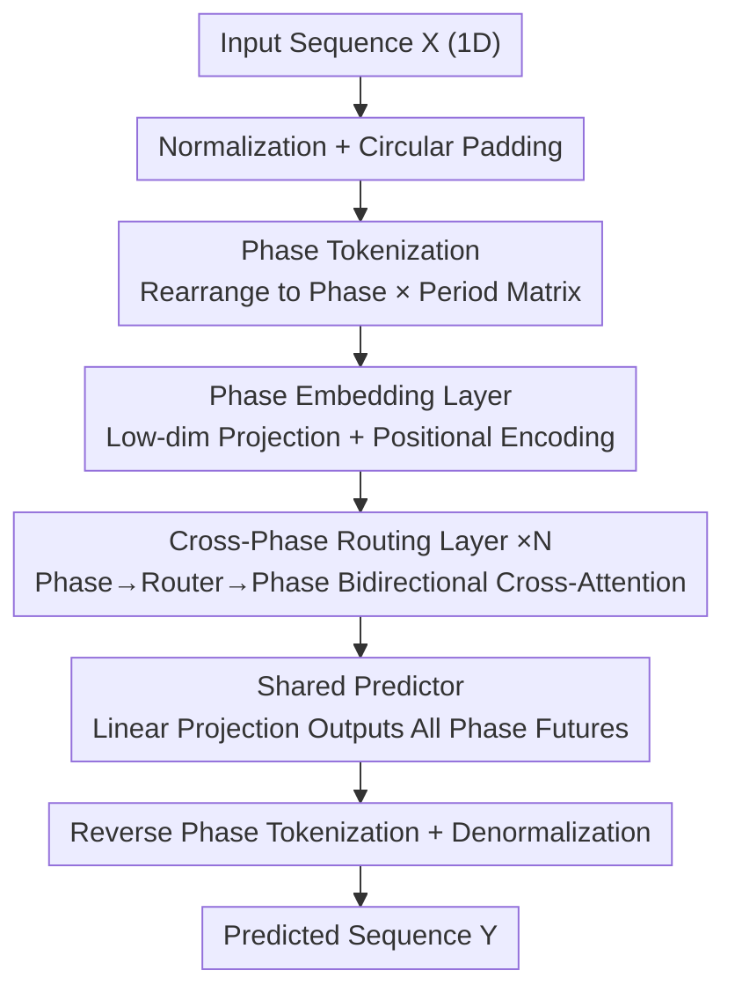

# PhaseFormer: From Patches to Phases for Efficient and Effective Time Series Forecasting

**Conference**: ICLR 2026  
**OpenReview**: [https://openreview.net/forum?id=Lk9SqMQzhX](https://openreview.net/forum?id=Lk9SqMQzhX)  
**Code**: https://github.com/neumyor/PhaseFormer_TSL  
**Area**: Time Series Forecasting  
**Keywords**: Periodic modeling, phase tokens, lightweight forecasting, routing attention, efficiency-effectiveness tradeoff

## TL;DR
To address the issue of exploding parameter counts and computational costs in long-term forecasting caused by the drift of periodic patterns in patch tokens, this paper adopts a "phase perspective." It aggregates values at the same offset positions across cycles into tokens, proving that they are more stable and lower-dimensional than patches. Based on this, PhaseFormer is designed with only approximately 1k parameters, achieving SOTA accuracy across seven benchmarks while reducing FLOPs by about 99.99%.

## Background & Motivation

**Background**: Periodicity is the core inductive bias of time series. Recent mainstream approaches (e.g., PatchTST, Crossformer) divide sequences into **patches** aligned with periods and use Transformers to model intra-cycle and inter-cycle correlations between patch tokens, pushing forecasting accuracy to high levels.

**Limitations of Prior Work**: These patch-based methods are difficult to scale efficiently on large-scale, complex datasets (e.g., Traffic, Electricity), incurring high parameter counts and computational overhead. The authors provide the first explicit explanation for **why patch-level processing is inherently inefficient**: in real-world scenarios, cycle patterns continuously drift due to external factors (e.g., new roads, schedule adjustments), causing the shape of patches within the same period to change over the timeline. To accommodate such widened distributions, models are forced to construct high-dimensional representation spaces, leading to inflated parameters and computation, while also suffering from poor generalization to out-of-distribution samples.

**Key Challenge**: Patch tokens bundle "adjacent observations within a complete cycle," thereby **inheriting the entire variability of the cycle's morphology**. Once the cycle drifts, the patch representation drifts with it. There is a fundamental conflict between effectiveness and efficiency under this representation.

**Goal**: To find a token representation that is both stable and low-dimensional, allowing the model to predict accurately and quickly with minimal parameters.

**Key Insight**: The authors propose a **phase perspective**—instead of looking at "what a cycle looks like," they look at "how values at the same offset position (phase) across consecutive cycles evolve." The intuition is that the traffic flow at the "morning peak hour" of a day is highly stable when viewed across weeks (across cycles), far more stable than the "shape of the entire morning peak curve."

**Core Idea**: Use **phase tokens instead of patch tokens** to characterize periodicity, rewriting "step-by-step prediction" as "phase-by-phase prediction." The authors verify two key properties of phase tokens (global stationarity + low dimensionality) using real-world data and use perturbation theory to prove their structural invariance under cycle drift, providing a basis for extremely lightweight modeling.

## Method

### Overall Architecture

PhaseFormer adopts a channel-independent paradigm (processing each variable independently, omitting the channel dimension). Given an input sequence $X \in \mathbb{R}^{L_{in}}$, the goal is to predict the future $Y \in \mathbb{R}^{L_{out}}$. The essence of the pipeline is: **first rearrange the 1D sequence into a 2D "phase × period" matrix**, making each row a phase token across cycles; **then use lightweight routers in a low-dimensional space to enable efficient communication between phases**; **finally, use a shared linear predictor across all phases to output the future for all phases at once**, and transform back to a 1D sequence. Since the phase space itself is low-dimensional and stable, the number of routers $M$ and the hidden dimension $d$ can be set to very small fixed values, compressing the overall parameter count to approximately 1k.

### Key Designs

**1. Phase Tokenization: Aggregating Same-Offset Values into Stable Low-Dimensional Tokens**

This is the foundation of the work, addressing the pain point that "patches inherit full-cycle variability." Let the period length be $L_{phase}$ (automatically estimated via frequency domain analysis and fixed throughout). To ensure the input length is a multiple of $L_{phase}$, the sequence is first circularly padded to $P_{in} \cdot L_{phase}$, where $P_{in} = \lceil L_{in}/L_{phase} \rceil$. It is then reshaped into a phase-period matrix $X_{phase} \in \mathbb{R}^{L_{phase} \times P_{in}}$, where $X_{phase}[\ell, p]$ is the observation of the $\ell$-th phase in the $p$-th cycle. Thus, **each row (a phase token) records the "evolution of the same timestamp over cycles,"** rather than the "shape of a cycle segment."

The authors support this choice with two insights from real data. **Insight 1 (Global vs. Local Stationarity)**: t-SNE shows patch token distributions drift over time with only local coherence, whereas phase tokens form compact, long-term stable clusters. Using Maximum Mean Discrepancy $\mathrm{MMD}^2(P,Q) = \mathbb{E}_{x,x' \sim P}[k(x,x')] + \mathbb{E}_{y,y' \sim Q}[k(y,y')] - 2\mathbb{E}_{x \sim P, y \sim Q}[k(x,y)]$ ($k$ is an RBF kernel) to measure distribution differences across weeks, the average MMD in phase space is much smaller than in patch space, indicating closer distributions and better generalization. **Insight 2 (Low-Dimensional Subspace)**: PCA shows that only 2 principal components can explain over 90% of the variance in phase tokens, whereas patch tokens require over 11 dimensions. The authors also use perturbation theory to provide Theorem 1: under periodic pattern transformation $S$, the subspace structure corresponding to phase tokenization remains **approximately invariant** (exactly invariant without noise), while patch tokenization exhibits non-vanishing structural shifts. This "stability + low dimensionality" allows subsequent modules to work with minimal $M$ and $d$.

**2. Cross-Phase Routing Layer: Compressing $O(L_{phase}^2)$ Self-Attention to Linear using Routers**

Performing full pairwise self-attention on all phase tokens is costly. This design leverages the "inherently low-dimensional phase space" by introducing a set of learnable routers $R \in \mathbb{R}^{M \times d}$ ($M$ is much smaller than the number of phases) as information relay stations, splitting interaction into two cross-attention steps. **Phase→Router Aggregation**: Routers act as queries, and phases act as keys/values: $Q_r = RW^{agg}_Q, K_z = \tilde{Z}W^{agg}_K, V_z = \tilde{Z}W^{agg}_V$. Contextualized routers $H = \mathrm{MHA}(Q_r, K_z, V_z)$ are obtained via multi-head attention, **selectively compressing** information scattered across phases into compact routers. **Router→Phase Distribution**: Conversely, phases act as queries, and routers act as keys/values: $Q_z = \tilde{Z}W^{dist}_Q, K_r = HW^{dist}_K, V_r = HW^{dist}_V$, and $Z_{attn} = \mathrm{MHA}(Q_z, K_r, V_r)$, **selectively re-injecting** aggregated cross-phase information back into each phase. Through this "two-hop" path, each phase indirectly attends to all other phases, restoring phase-level resolution while enforcing cross-phase consistency. This is similar to the router idea in Perceiver/Crossformer, but the contribution here is the **explicit utilization of the low-rank structure of phase-aligned tokens**—because the phase space is low-dimensional, a few routers suffice, reducing the quadratic cost of self-attention to linear relative to sequence length. Ablations prove this is more accurate and efficient than FullAttention and significantly better than LinearMixing or direct prediction.

**3. Phase Embedding + Shared Predictor: Low-Dimensional Projection for Denoising and Shared Parameters for Regularization**

The embedding layer maps each phase token $X_{phase}[\ell, :]$ via a linear mapping $f_\theta$ ($\theta \in \mathbb{R}^{P_{in} \times d}$) to $d$ dimensions: $Z = f_\theta(X_{phase}) \in \mathbb{R}^{L_{phase} \times d}$, extracting effective components from original observations contaminated by perturbations. A learnable phase positional encoding $\tilde{Z} = Z + E_{pos}$ is added to distinguish phase order. The prediction end is a linear mapping $g_\phi$ ($\phi \in \mathbb{R}^{d \times P_{out}}$) with **shared parameters** across all phases, $Y_{phase} = g_\phi(Z_{attn}) \in \mathbb{R}^{L_{phase} \times P_{out}}$, outputting multi-step futures for all phases at once. Finally, reverse tokenization and denormalization yield $Y$. The shared predictor minimizes trainable parameters and forces consistent predictions across phases, acting as a regularizer to improve generalization—one of the keys to the model needing only ~1k parameters.

### Complexity
The end-to-end time complexity of PhaseFormer is $O(N((L_{phase}+M)d^2 + ML_{phase}d) + d(L_{in} + L_{out}))$, where $N$ is the number of routing layers. Since the low dimensionality of phase space allows $M$ and $d$ to be small fixed values, the computational complexity grows **linearly** with input length $L_{in}$ and prediction length $L_{out}$, rather than the quadratic growth of patch self-attention.

## Key Experimental Results

### Main Results
Seven long-term forecasting benchmarks (ETTh1/h2, ETTm1/m2, Weather, Electricity, Traffic), with input length fixed at 720. Results are averages for prediction lengths $\{96, 192, 336, 720\}$ (MSE / MAE, lower is better):

| Dataset | PhaseFormer | PatchTST | Crossformer | TimeBase | SparseTSF | FITS |
|--------|-------------|----------|-------------|----------|-----------|------|
| ETTh1 | **0.403 / 0.415** | 0.420 / 0.439 | 0.517 / 0.512 | 0.404 / 0.416 | 0.406 / 0.418 | 0.419 / 0.435 |
| ETTm1 | **0.346 / 0.374** | 0.354 / 0.383 | 0.390 / 0.417 | 0.356 / 0.380 | 0.362 / 0.383 | 0.359 / 0.382 |
| Electricity | **0.160 / 0.250** | 0.169 / 0.265 | 0.180 / 0.273 | 0.167 / 0.258 | 0.168 / 0.263 | 0.172 / 0.270 |
| Traffic | **0.386 / 0.249** | 0.394 / 0.266 | 0.545 / 0.282 | 0.418 / 0.278 | 0.413 / 0.280 | 0.421 / 0.298 |
| Weather | **0.223 / 0.260** | 0.223 / 0.264 | 0.255 / 0.304 | 0.227 / 0.262 | 0.243 / 0.285 | 0.241 / 0.283 |

PhaseFormer achieved the best or tied-best results on almost all datasets. The improvement is particularly significant on complex large datasets: on Traffic, it outperforms the runner-up PatchTST by 6.3% and TimeBase by 10.4%. The only exception is ETTh2 (0.346/0.388), which is slightly behind FITS (0.334/0.382) but remains highly competitive. In terms of efficiency, on Traffic, PhaseFormer achieves approximately **99.99% FLOPs reduction** compared to PatchTST/Crossformer and outperforms the similarly lightweight SparseTSF—accurate and efficient.

### Ablation Study
Ablation of the cross-phase routing layer (each cell is MSE / MAE / FLOPs(M)):

| Configuration | Weather | Electricity | Traffic |
|------|---------|-------------|---------|
| PhaseFormer (Routing) | **0.1503 / 0.1971** / 3.12 | **0.1290 / 0.2209** / 42.2 | **0.3721 / 0.2475** / 113.4 |
| w/ FullAttention | 0.1527 / 0.2005 / 3.20 | 0.1295 / 0.2217 / 49.0 | 0.3791 / 0.2513 / 131.5 |
| w/ LinearMixing | 0.1700 / 0.2226 / 0.92 | 0.1403 / 0.2334 / 14.1 | 0.3842 / 0.2532 / 37.8 |
| w/o Routing (Phase-wise Prediction) | 0.1907 / 0.2406 / 0.78 | 0.1423 / 0.2365 / 12.0 | 0.3892 / 0.2584 / 32.1 |

### Key Findings
- **Routing layer is core to precision**: Removing routing (w/o Routing) leads to significant drops across three datasets, showing that explicit cross-phase interaction is indispensable for modeling periodic dynamics; replacing it with linear mixing (LinearMixing) is also inferior.
- **Routing is superior to full attention**: PhaseFormer not only has lower FLOPs than FullAttention but also better MSE/MAE—in a low-dimensional phase space, a few routers "concentrate" effective interactions more cleanly, whereas full attention introduces redundancy.
- **Minimal routers are sufficient**: The optimal $M \in \{4, 8\}$, which is much smaller than the phase count $L_{phase}=24$, directly confirming the low-dimensional nature of the phase space.
- **Phase length must align with the primary period**: On Traffic, $L_{phase}=24$ (the frequency domain principal component) is optimal (MSE 0.3619); deviations (12/8/28/21) increase error—selecting the wrong harmonic still works but degrades prediction, representing a major failure mode.
- **Interpretability**: Case studies show adjacent phases are assigned to similar routers, and attention exhibits local similarity; different phases (e.g., Phase 5 is stable long-term, while Phase 9/1 shows opposite 7-day cyclical trends) are effectively distinguished by routers.

## Highlights & Insights
- **"Changing the token perspective" rather than "Adding modules"**: The brilliance of this paper lies not in the network architecture, but in changing the modeling target from patches to phases. Given the same data, a different aggregation method leads to vastly different stationarity and dimensionality. This serves as a reminder: representation inductive bias is often more valuable than model capacity.
- **Dual justification via real data + perturbation theory**: t-SNE/MMD/PCA provide empirical evidence, while Theorem 1 provides the theoretical guarantee of "invariance of phase subspace structure under cycle drift," explaining *why* phase is better than patch rather than just showing SOTA numbers.
- **SOTA with ~1k parameters**: The combination of low-dimensional stable representation, shared predictors, and routers compresses parameters to the extreme, which is highly valuable for resource-constrained scenarios (Edge/IoT).
- **Inspiration from $M \ll L_{phase}$**: When a token representation is proven to be low-dimensional, "a small number of latent bottlenecks + bidirectional cross-attention" is a general trick to reduce quadratic attention to linear, transferable to other sequence tasks with low-rank structures.

## Limitations & Future Work
- **Reliance on distinct primary periods**: In weakly periodic sequences or those without a dominant period, automatically estimated phase lengths can be disturbed by noise or sub-harmonics, leading to phase misalignment (acknowledged as a major failure mode). If aligned to sub-optimal harmonics, prediction degrades. The authors claim phase representation then degrades into coarse downsampling and retains some robustness, but accuracy is not guaranteed.
- **Padding artifacts**: Circular padding requires input length to be divisible by $L_{phase}$. Phase lengths that are too large or too small can introduce significant padding, creating boundary artifacts that harm prediction; it is suggested that input length should ideally be divisible by the phase length.
- **Personal observation**: The channel-independent assumption ignores inter-variable dependencies, which may not be optimal for data with strong spatial correlations (e.g., multi-sensor traffic networks). Phase length is "prior-fixed" by frequency domain analysis; its adaptability to sequences with time-varying periods (e.g., seasonal shifts) is questionable. Adaptive or multi-phase length joint modeling could be considered.

## Related Work & Insights
- **vs. PatchTST / Crossformer**: They use patches as tokens, inheriting the variability of the entire cycle shape and requiring high-dimensional space for drift, resulting in large parameter/computational overhead; this work uses phases as tokens, which are stable and low-dimensional, reducing parameters by >99.9% while being more accurate.
- **vs. SparseTSF**: Also phase-based (emphasizing cross-period correlation), but SparseTSF lacks precision on large complex datasets; PhaseFormer uses cross-phase routing to explicitly model interactions, proving significantly more accurate on Traffic/Electricity.
- **vs. TimeBase**: TimeBase fuses patch and phase paradigms; this paper focuses purely on phase and provides a systematic "why phase works" analysis (stationarity + low dimensionality + perturbation stability), overtaking TimeBase by 10.4% on large datasets.
- **vs. FITS**: FITS achieves strong accuracy with ~10k parameters in the frequency domain; PhaseFormer achieves comparable or better overall performance with ~1k parameters in the time domain, though it remains slightly behind FITS on ETTh2.

## Rating
- Novelty: ⭐⭐⭐⭐⭐ First systematic proof of the root cause of patch inefficiency and proposal of the phase perspective, supported by both theory and experience.
- Experimental Thoroughness: ⭐⭐⭐⭐ Seven benchmarks + eight baselines + multi-dimensional ablations on routing/routers/phase length, though mostly in standard long-term forecasting settings.
- Writing Quality: ⭐⭐⭐⭐⭐ Clear motivational derivation, excellent insight visualization, and complete methodology and complexity coverage.
- Value: ⭐⭐⭐⭐⭐ Achieves SOTA with ~1k parameters, providing a new paradigm for truly efficient and effective time series forecasting.

<!-- RELATED:START -->

## Related Papers

- [\[ICLR 2026\] Efficient Autoregressive Inference for Transformer Probabilistic Models](efficient_autoregressive_inference_for_transformer_probabilistic_models.md)
- [\[ICML 2025\] TQNet: Temporal Query Network for Efficient Multivariate Time Series Forecasting](../../ICML2025/time_series/temporal_query_network_for_efficient_multivariate_time_series_forecasting.md)
- [\[ICML 2026\] U-Cast: A Surprisingly Simple and Efficient Frontier Probabilistic AI Weather Forecasting](../../ICML2026/time_series/u-cast_a_surprisingly_simple_and_efficient_frontier_probabilistic_ai_weather_for.md)
- [\[ICML 2025\] IMTS is Worth Time × Channel Patches: Visual Masked Autoencoders for Irregular Multivariate Time Series Prediction](../../ICML2025/time_series/imts_is_worth_time_times_channel_patches_visual_masked_autoencoders_for_irregula.md)
- [\[ICLR 2026\] ResCP: Reservoir Conformal Prediction for Time Series Forecasting](rescp_reservoir_conformal_prediction_for_time_series_forecasting.md)

<!-- RELATED:END -->
