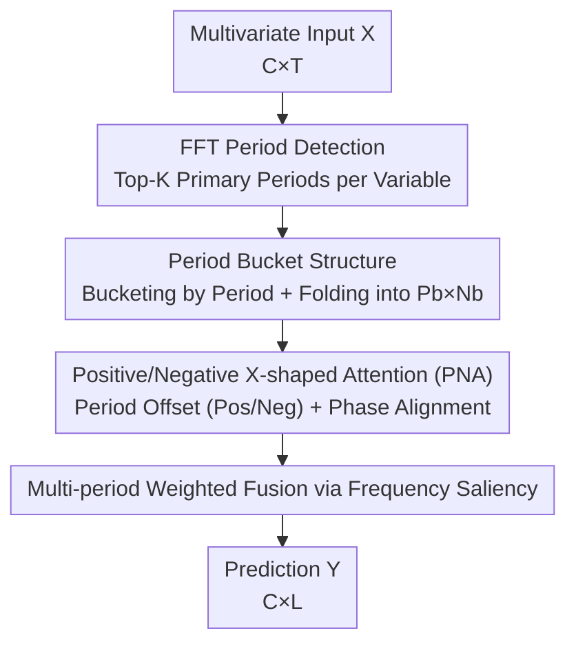

# PHAT: Modeling Period Heterogeneity for Multivariate Time Series Forecasting

**Conference**: ICLR 2026  
**OpenReview**: [https://openreview.net/forum?id=lr4RlISR6x](https://openreview.net/forum?id=lr4RlISR6x)  
**Code**: Open-sourced (The paper states that the source code is on GitHub; the repository link is to be confirmed)  
**Area**: Time Series Forecasting  
**Keywords**: Multivariate Time Series Forecasting, Period Heterogeneity, Period Buckets, Positive/Negative Attention, Frequency Domain Analysis

## TL;DR
PHAT identifies that in real-world multivariate time series, different variables have distinct and dynamically changing period lengths (period heterogeneity). It first uses FFT to group variables into "period buckets" according to their primary periods and folds them into phase-aligned 2D tensors. Then, an "X-shaped" self-attention mechanism with positive/negative decomposition and periodic modulation terms is used to model periodic dependencies. Finally, multiple periodic components are fused via weighting based on frequency saliency. PHAT achieves SOTA results on approximately 74% of metrics across 14 real-world datasets and 18 baselines, while maintaining parameters and computational costs over an order of magnitude lower than Transformer-based methods.

## Background & Motivation

**Background**: Periodicity is one of the most critical intrinsic structures in time series. Consequently, almost all recent multivariate time series (MTS) forecasting models prioritize superior periodic modeling. Mainstream approaches fall into three categories: modifying Transformer architectures to capture long-range dependencies (Autoformer, FEDformer, PatchTST), employing seasonal-trend decomposition with parallel sub-networks (DLinear, xPatch), and explicitly identifying periods using frequency domain tools like FFT (TimesNet, FITS).

**Limitations of Prior Work**: These methods almost all implicitly assume a "single, static, and shared period"—treating all variables as interchangeable channels and applying uniform pooling or adaptive fusion before modeling periodicity. However, by visualizing the Autocorrelation Function (ACF) with Bartlett tests on datasets like ZafNoo, the authors found that the significant periods of three variables in the same dataset can be entirely different (e.g., daily, weekly, and yearly). Forcing these vastly different periods into a unified framework causes the model to learn spurious temporal dynamics. This is the **period heterogeneity** emphasized repeatedly in the paper.

**Key Challenge**: Another overlooked issue is that standard self-attention amplifies positive correlations and suppresses negative ones during softmax normalization. However, periodic signals naturally contain "anti-phase/complementary" negative correlation structures (e.g., two points with a phase difference of half a period are often strongly negatively correlated). These negative correlations carry crucial information about system dynamics but are discarded by existing attention mechanisms.

**Goal**: ① Relax the single-period assumption to allow the model to simultaneously handle multiple heterogeneous periods within a single dataset; ② Enable the attention mechanism to model both positive correlations and explicitly represent negative periodic dependencies.

**Core Idea**: Replace "uniform pooling + standard self-attention" with "Period Buckets + Positive/Negative X-shaped Attention". Variables are isolated into buckets based on period lengths and folded into phase-aligned 2D structures. Then, a period-offset attention mechanism, decomposed into positive and negative branches and modulated by periodic distance, is used to faithfully characterize periodic trends.

## Method

### Overall Architecture
The input to PHAT is a multivariate sequence $X \in \mathbb{R}^{C\times T}$ of the past $T$ steps, and the output is the future $L$ steps $Y \in \mathbb{R}^{C\times L}$. The pipeline consists of four serial steps: "Period Detection → Bucketing and Folding → Intra-bucket Positive/Negative Attention → Multi-period Weighted Fusion based on Frequency Saliency." First, FFT is applied to each variable to extract the Top-K frequencies, which are converted into discrete period lengths. Variables are grouped into buckets by period length, and each sequence within a bucket is folded into a $P_b\times N_b$ 2D tensor (rows represent phase offsets within a period, and columns represent identical phase points across periods). Variable interactions occur only within buckets, separated by masks to prevent interference between heterogeneous periods. Within each bucket, PNA (Positive-Negative X-shaped Attention) models periodic dependencies. Finally, the outputs from multiple buckets belonging to a single variable are fused via weighted averaging based on spectral amplitudes.

### Key Designs

**1. Period Bucket Structure: Isolating variables by period length and folding into phase-aligned 2D tensors**

This design directly addresses the "period heterogeneity" pain point. First, FFT is performed on the input, keeping the Top-K significant frequencies and converting them into discrete period lengths $P = \lfloor T/\arg\text{TopK}[|\text{FFT}(X)|] + 0.5\rfloor \in \mathbb{N}^{K\times C}$. The sequences are then reconstructed in two steps: **Bucketing**—the $K\times C$ periods are deduplicated into $N$ distinct values, and a bucket $\mathcal{B}_i$ is created for each period length $P_i$ to house variables whose primary period is $P_i$. Since a variable can have multiple periods, buckets are not mutually exclusive. A separate Bucket-0 collects variables without significant periods. **Folding**—for variable $j$ in bucket $b$, the sequence is first aligned to the future window $X_j\to X_j\in\mathbb{R}^{L\times d}$ via a linear layer, then partitioned into $N_b=\lfloor L/P_b\rfloor$ segments of length $P_b$ (zero-padded if not divisible), and unflattened into $\bar{X}^{(b)}\in\mathbb{R}^{|\mathcal{B}_b|\times P_b\times N_b}$. This 3D structure has distinct semantics: the first dimension represents period-homogeneous variables, the second represents phase offsets within a period, and the third represents identical phase points across periods. Interactions $Z^{(b)}=(\bar{X}^{(b)\top}W_i+b_i)$ occur only within buckets.

**2. Positive/Negative X-shaped Attention (PNA): Decomposing period-offset attention into positive/negative branches with periodic distance modulation**

Standard self-attention allows unconstrained token interaction and suppresses negative correlations, which is suboptimal for periodic structures. PNA involves three key elements. **X-shaped Receptive Field**: Attention is assigned only along the rows and columns of the bucket tensor $Z^{(b)}\in\mathbb{R}^{P_b\times N_b\times d_h}$, forming a cross-shaped (X-shaped) receptive field centered on the target point. This explicitly separates "cross-period phase alignment" (period-aligned $\tilde{A}$) from "intra-period phase offset" (period-offset $A$). **Positive/Negative Decoupling**: Two sets of query/key pairs calculate positive logits $\zeta=\mu Q_1\times_1 K_1^\top$ and negative logits $\eta=\mu Q_2\times_1 K_2^\top$ ($\mu=d^{-1/2}$). After separate softmax operations, they are fused as $A=\text{Softmax}(\tilde\zeta)-\Lambda\odot\text{Softmax}(\tilde\eta)$, where $\Lambda$ is a sigmoid-learned intensity filter. The negative branch is explicitly subtracted to preserve anti-phase negative correlations. **Periodic Inductive Bias**: A periodic modulation term is added to the logits—the positive term $\tilde\zeta[m,n]=\zeta[m,n]-\sum_{s\in\Delta_{m,n}^{(b)}}\text{Softplus}(\zeta[m,s])$ aggregates points closer in periodic distance, causing weights to decay monotonically with distance. The negative term symmetrically aggregates distant points. Periodic distance is defined as $\delta_{ij}^b=\min\{(i-j)\bmod B_b,\,(j-i)\bmod B_b\}$.

**3. Multi-period Weighted Fusion via Frequency Saliency: Aggregating multiple period interpretations via spectral intensity voting**

Since a variable may belong to multiple buckets, their outputs must be fused. Bucket outputs $\bar{Z}^{(b)}\in\mathbb{R}^{P_b\times N_b\times d}$ are flattened, truncated, and linearly re-aligned to the original variable count $\tilde{Z}^{(b)}\in\mathbb{R}^{|\mathcal{B}_b|\times L}$. For the $c$-th variable, its $K_c$ corresponding buckets are identified and fused using weights $\hat{Y}_c=\sum_{b=1}^{K_c}\alpha_c^{(b)}\tilde{Z}_c^{(b)}$, where $\alpha_c^{(b)}=\text{Avg}(\text{Softmax}(|\beta_c^{(b)}|))$ is determined by the spectral amplitude $\beta_c^{(b)}=\text{Extract}(\text{FFT}(X_c^{(b)}))$ of the corresponding period.

### Loss & Training
The model is optimized using Adam with MSE/MAE as evaluation metrics (A100 80GB, PyTorch). The lookback window $T$ is treated as a tunable hyperparameter. For small datasets (<5000 samples), $T\in\{36,104\}$ and $L\in\{24,36,48,60\}$; for large datasets, $T\in\{96,336,512\}$ and $L\in\{96,192,336,720\}$. "Drop Last" batch sampling is disabled to ensure fair evaluation.

## Key Experimental Results

### Main Results
PHAT was compared against 18 baselines on 14 real-world datasets and 1 synthetic dataset. PHAT achieved SOTA on approximately **73.95% (71/96)** of the metrics, with 84.38% of metrics in the top two. In the NYSE dataset, MSE improved by up to 23.33%. Selected representative results (average MSE/MAE):

| Dataset/horizon | Metric | PHAT | TimeKAN | xPatch | CycleNet | iTransformer |
|--------|------|------|---------|--------|----------|--------------|
| ETTh-96 | MSE | **0.316** | 0.324 | 0.327 | 0.327 | 0.342 |
| NN5-24 | MSE | **0.681** | 0.769 | 0.853 | 0.754 | 0.727 |
| ILI-24 | MSE | **1.318** | 2.176 | 2.320 | 2.195 | 1.783 |
| NASDAQ-24 | MSE | **0.416** | 0.541 | 0.503 | 0.631 | 0.570 |
| NYSE-24 | MSE | **0.161** | 0.224 | 0.210 | 0.237 | 0.225 |

PHAT's "Top1 hits" count is 71, significantly higher than second-place PDF (9) and TimeKAN (6). The advantage is particularly pronounced in financial (NASDAQ/NYSE) and health (ILI) datasets characterized by strong period heterogeneity.

### Ablation Study

| Configuration | Description | Observation |
|------|------|------|
| Full (PHAT) | Complete model | Optimal |
| w/o Bucket | No period bucketing; variables independent | Error increased significantly, proving the need to isolate heterogeneous periods. |
| w/o POA | No Period-Offset Attention | Dramatic performance drop; the most critical component. |
| w/o PAA | No Phase-Alignment Attention | Noticeable degradation, especially on weak-period data (NN5, CzeLan). |
| w/o Attn | Self-attention replaced by Feed-Forward Network | Substantial degradation. |

### Key Findings
- **POA provides the largest contribution**: Removing it leads to extremely poor performance, indicating that decomposing periodic dependencies into positive/negative paths is the core of PHAT's gain.
- **Bucketing is critical for period heterogeneity**: Error rises sharply without bucketing, confirming that mixing variables with heterogeneous periods increases modeling difficulty.
- **Efficiency is outstanding**: Complexity scales with the square of the detected period length (rather than the full sequence length). On ETTm1 (L=96), PHAT has only 33.4K parameters and 2.9M MACs, which is over an order of magnitude fewer parameters than Transformer models and a >98% reduction in MACs/FLOPs.

## Highlights & Insights
- **Precise identification of "Period Heterogeneity"**: The use of ACF + Bartlett tests to visualize diverse periods within a single dataset establishes a solid, non-arbitrary motivation.
- **Reclaiming negative correlations**: The insight that standard attention discards anti-phase information is well-supported and offers a design applicable to other symmetric signals (e.g., audio, vibration).
- **Clear semantics of folded tensors**: Folding 1D sequences into 3D grids effectively embeds inductive biases into the data structure itself.
- **Counter-intuitive efficiency**: Scaling with period length rather than sequence length makes long-sequence processing very cheap.

## Limitations & Future Work
- **Dependency on FFT accuracy**: Bucket quality depends on the reliability of FFT Top-K selection; noise or period drift can contaminate bucketing.
- **Bucket management costs**: Handling overlapping buckets for a large number of variables and periods might incur overhead not fully discussed.
- **Bucket-0 handling**: Variables without periods revert to absolute distance attention; more nuanced strategies for "weakly periodic" variables are needed.
- **Future Directions**: Making period detection learnable/differentiable or introducing dynamic bucket updates to handle non-stationary periods.

## Related Work & Insights
- **Vs. Uniform Period Modeling (CycleNet / TimesNet)**: These assume shared periods across variables; PHAT relaxes this via bucketing.
- **Vs. Decomposition (xPatch / DLinear)**: These split seasonal/trend components; PHAT models periodic dependencies directly on folded tensors and explicitly preserves negative correlations.
- **Vs. Standard Transformers (PatchTST / iTransformer)**: PHAT injects periodic inductive bias and reduces complexity from sequence length to period length scales.

## Rating
- Novelty: ⭐⭐⭐⭐⭐ 
- Experimental Thoroughness: ⭐⭐⭐⭐⭐ 
- Writing Quality: ⭐⭐⭐⭐ 
- Value: ⭐⭐⭐⭐⭐ 

<!-- RELATED:START -->

## Related Papers

- [\[ICLR 2026\] Are Global Dependencies Necessary? Scalable Time Series Forecasting via Local Cross-Variate Modeling](are_global_dependencies_necessary_scalable_time_series_forecasting_via_local_cro.md)
- [\[ICLR 2026\] Towards Robust Real-World Multivariate Time Series Forecasting: A Unified Framework](towards_robust_real-world_multivariate_time_series_forecasting_a_unified_framewo.md)
- [\[ICLR 2026\] CPiRi: Channel Permutation-Invariant Relational Interaction for Multivariate Time Series Forecasting](cpiri_channel_permutation-invariant_relational_interaction_for_multivariate_time_se.md)
- [\[ICLR 2026\] MixLinear: Extreme Low Resource Multivariate Time Series Forecasting with 0.1K Parameters](mixlinear_extreme_low_resource_multivariate_time_series_forecasting_with_01k_par.md)
- [\[ICLR 2026\] Learning Recursive Multi-Scale Representations for Irregular Multivariate Time Series Forecasting](learning_recursive_multi-scale_representations_for_irregular_multivariate_time_s.md)

<!-- RELATED:END -->
