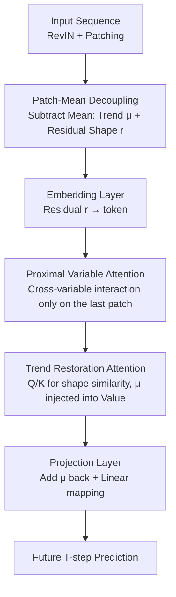

# PMDformer: Patch-Mean Decoupling Information Transformer for Long-term Forecasting

**Conference**: ICLR 2026  
**OpenReview**: [https://openreview.net/forum?id=rfJ41gK9Ct](https://openreview.net/forum?id=rfJ41gK9Ct)  
**Code**: https://github.com/aohu1105/PMDformer  
**Area**: Time Series Forecasting / Transformer  
**Keywords**: Long-term time series forecasting, patch attention, shape similarity, cross-variable modeling, trend-residual decoupling

## TL;DR
PMDformer points out that the true "shape similarity" between patches is often drowned out by different numerical scales (means). It explicitly decouples trends and residual shapes by "subtracting the mean of each patch." It then re-stitches local shapes with global trends using Proximal Variable Attention (cross-variable interaction only on the most recent patch) and Trend Restoration Attention (injecting means back into the Value channel), surpassing various SOTA models with more stable and accurate performance across 8 LTSF benchmarks.

## Background & Motivation

**Background**: The current mainstream for Long-Term Time Series Forecasting (LTSF) is the Transformer + patch paradigm—slicing one-dimensional sequences into patches, treating them as token sequences for attention to capture long-range dependencies (e.g., PatchTST, Pathformer, TimeBase). This is further divided into Variable Independent (VI) and Variable Dependent (VD). However, VD has failed to consistently outperform VI to date.

**Limitations of Prior Work**: Unlike images with fixed spatial structures, time series are essentially one-dimensional curves. The key to forecasting lies in identifying **shape similarity** between patches and variables (e.g., two segments showing a slow rise with similar slopes). Yet, time series are non-stationary, with numerical scales (mean, magnitude) drifting significantly across patches. Figure 1 of the paper shows a poignant example: P1 and P2 have more similar shapes, but due to scale differences, the attention mechanism assigns higher weight to the dissimilar (P1, P3). In other words, **scale differences masquerade as shape similarity**, leading the model to learn incorrect relationships, a bias that is even more severe in cross-variable modeling.

**Key Challenge**: To eliminate scale bias, normalization is the natural choice. However, existing Patch Normalization methods (like SAN) use Z-score—subtracting the mean and dividing by the standard deviation. This division by standard deviation flattens the original amplitude, effectively **destroying the shape itself**. This creates a dilemma: without normalization, scale bias contaminates attention; with standard normalization, the shape information that needs protection is washed away.

**Goal**: Eliminate scale bias while preserving shape structure, ensuring that decoupled global trends are not lost, and focusing cross-variable interactions only on truly useful recent correlations.

**Key Insight**: The authors observe that the culprit destroying shape is solely the "division by standard deviation" step. If one only **subtracts the mean without dividing by the standard deviation**, the "long-term trend" (encoded in patch means) and the "residual shape" (the waveform after mean subtraction) can be cleanly separated while preserving the original amplitude changes.

**Core Idea**: Replace "Z-score normalization" with "patch-mean subtraction" to decouple trend and shape (PMD), allowing attention to focus only on true shape similarity. Then, inject the decoupled means back into the Value channel via TRA and focus cross-variable interactions only on the most recent patch (PVA), effectively modeling both local shapes and global trends under scale-unbiased conditions.

## Method

### Overall Architecture

PMDformer addresses the core problem of "scale bias contaminating shape attention." The pipeline is organized around "stripping trends for pure shape matching, then stitching trends back at the end." Given an input sequence $X=\{x_t\in\mathbb{R}^C\}_{t=1}^L$ of length $L$ with $C$ variables, the model predicts the future $T$ steps $\hat{Y}$. The overall flow is: input passes through RevIN for instance normalization, then is sliced into $N=\lfloor L/S\rfloor$ non-overlapping patches where **Patch-Mean Decoupling (PMD)** is executed—splitting each patch into a mean (trend $\mu$) and a zero-mean residual (shape $r$). Residuals are transformed into tokens via an embedding layer. **Proximal Variable Attention (PVA)** performs cross-variable interaction only on the most recent patch. **Trend Restoration Attention (TRA)** then performs temporal shape attention along the patch axis and injects the mean $\mu$ back into the Value channel. Finally, the projection layer adds the mean back and linearly maps to the $T$-step prediction.

### Key Designs

**1. Patch-Mean Decoupling: Subtracting mean without dividing by variance to strip trend without destroying shape**

This is the foundation. It addresses the pain point directly: scale differences blind attention to true shapes, and Z-score normalization flattens shapes. PMD only uses subtraction: for the $j$-th patch $P_j^i\in\mathbb{R}^S$ of variable $i$, it calculates the temporal mean $\mu_j^i=\frac{1}{S}\sum_{k=1}^S x_{(j-1)S+k}^i$, then derives the zero-mean residual $r_j^i=P_j^i-\mu_j^i\mathbf{1}_S$. The residual is re-centered to zero mean while the original amplitude is fully preserved. The residuals are embedded into tokens via a shared linear projection $WE$: $P_j^i:=r_j^iW_E+b_E+z_{p_j}$, while the mean $\mu$ is stored separately as the "trend component."

Theoretical support shows that when a patch is written as $\tilde{x}=r+\mu\mathbf{1}$, the attention logit expands into "mean×mean," "mean×residual cross-terms," and "residual×residual." The first two are dominated by scale (mean). PMD removes the $\mu\mathbf{1}$ term, eliminating all mean-dependent pollution terms in the logit, leaving only the pure shape similarity $r^\top M r$.

**2. Proximal Variable Attention: Focusing cross-variable interaction only on the most recent patch**

This targets a common flaw in VD methods: modeling interactions across the entire historical window. Since correlations between variables are non-stationary and evolve over time, using the whole history introduces noise and risks overfitting to obsolete couplings. PVA performs cross-variable self-attention only on the **most recent (proximal) patch**: taking tokens $P_N=\{P_N^1,\dots,P_N^C\}$ from the $N$-th patch across all $C$ variables and applying multi-head self-attention plus FFN. Tokens for historical patches $\{1,\dots,N-1\}$ remain unchanged from PMD.

This offers two benefits: robustness (focusing on the most predictive recent interactions) and efficiency (reducing cross-variable attention complexity from $O(C^2N)$ to $O(C^2)$).

**3. Trend Restoration Attention: Q/K for shape, injecting mean into the Value channel**

By stripping the mean, PMD risks the model ignoring long-term dependencies. TRA fills this gap without destroying shape matching. It runs a shared Transformer encoder along the patch axis for each variable. Crucially: Query and Key act only on shape embeddings to ensure attention scores $A=\text{Softmax}(Q^i(K^i)^\top/\sqrt{d})$ reflect pure shape similarity. Meanwhile, the per-patch mean $\mu^i$ is **explicitly added to the Value channel** $V^i=P^iW_V+\mu^i$. This allows Q/K to focus on fine-grained local shapes while V preserves global trend dynamics.

The final "restoration" happens at the projection layer, where the mean is added back to the shape tokens before final linear mapping: $\hat{Y}^i=(P^i+\mu^i)W_o+b_o$.

### Loss & Training

Input window $L=720$, prediction lengths $T\in\{96,192,336,720\}$. Patch size $S$ is tuned per dataset within $\{24,48,72\}$. Optimizer: Adam, learning rate selected from $\{2\text{e-}4, 5\text{e-}4, 1\text{e-}3, 1\text{e-}2\}$. Implementation in PyTorch using A100 80GB.

## Key Experimental Results

### Main Results

Compared 9 baselines across 8 datasets. PMDformer achieved the lowest MSE and MAE in 7 out of 8 datasets.

| Dataset (Avg) | Metric | PMDformer | TimeBase(2025) | iTransformer(2024) | PatchTST(2023) |
|--------|------|------|----------|------|------|
| ECL | MSE / MAE | **0.148 / 0.241** | 0.167 / 0.258 | 0.166 / 0.264 | 0.169 / 0.266 |
| Traffic | MSE / MAE | **0.378 / 0.234** | 0.418 / 0.279 | 0.407 / 0.291 | 0.394 / 0.266 |
| Weather | MSE / MAE | **0.217 / 0.251** | 0.219 / 0.263 | 0.233 / 0.273 | 0.224 / 0.264 |
| Solar | MSE / MAE | **0.181 / 0.211** | 0.216 / 0.254 | 0.233 / 0.285 | 0.227 / 0.275 |
| ETTh2 | MSE / MAE | **0.337 / 0.382** | 0.347 / 0.398 | 0.392 / 0.422 | 0.344 / 0.391 |
| ETTm2 | MSE / MAE | **0.246 / 0.304** | 0.253 / 0.317 | 0.279 / 0.338 | 0.251 / 0.319 |

Relative gains: PMDformer reduced average MSE by 5.68% compared to TimeBase and 11.44% compared to iTransformer.

### Ablation Study

PMD module ablation (Table 3) validates "subtracting mean only":

| Configuration | ETTh2 MSE | Traffic MSE | Solar MSE | Description |
|------|---------|---------|---------|------|
| PMDformer (PMD) | **0.337** | **0.378** | **0.181** | Full model, subtract mean only |
| w/ stdev | 0.354 | 0.396 | 0.205 | Division by std destroys shape |
| SAN | 0.360 | 0.392 | 0.182 | Rigid decoupling, weaker generalization |
| ✗ (w/o PMD) | 0.359 | 0.397 | 0.199 | Scale bias contaminates attention |

### Key Findings
- **PMD is the primary contributor**: Replacing "subtract mean only" with "subtract mean + divide by std" or SAN leads to significant performance degradation, highlighting that preserving amplitude is more critical than total normalization.
- **Trend restoration is essential**: Replacing TRA with standard self-attention (dropping $\mu$ injection) results in a sharp drop in performance, especially on Traffic and Solar.
- **Order sensitivity**: PVA must precede TRA. Executing TRA first compresses patch information too early, leaving cross-variable modeling without meaningful dependencies.
- **Hyperparameters**: Focusing on $k=1$ most recent patch is most stable; MSE increases as $k$ grows. Medium patch sizes $\{24, 48, 72\}$ are optimal.

## Highlights & Insights
- **"The problem lies in dividing by standard deviation"**: Instead of complex normalization, the authors diagnose that the division step in Z-score destroys shape. This "doing less is more" design is elegant and theoretically backed.
- **Trend-Shape "Decouple-Recouple" loop**: The coordination between PMD, TRA (Value injection), and Projection (addition) creates a complete cycle that enjoys pure shape matching without losing global trends.
- **"Proximal focus" for cross-variable modeling**: Reducing complexity from $O(C^2N)$ to $O(C^2)$ is practical for high-dimensional data, and the insight that recent correlations are most reliable under non-stationarity is valuable.

## Limitations & Future Work
- Authors suggest scaling to even higher dimensions and multi-modal fusion.
- Limitation: PVA's rigid focus on the last patch might be too aggressive for scenarios where long-term seasonal variable couplings are significant.
- Dependency on patch size: The decoupling relies on the granularity of slicing.

## Related Work & Insights
- **vs Patch Normalization / SAN**: These methods divide by standard deviation; PMD omits this to preserve amplitude.
- **vs PatchTST / TimeBase**: TimeBase sacrifices shape similarity for redundancy reduction; PMD prioritizes preserving shapes.
- **vs iTransformer / ModernTCN**: These VD methods calculate dependencies over the full history; PMD focuses on the proximal patch to avoid noise.

## Rating
- Novelty: ⭐⭐⭐⭐ The clear focus on "mean-only subtraction" and the combination with PVA/TRA is cohesive and well-motivated.
- Experimental Thoroughness: ⭐⭐⭐⭐⭐ Comprehensive coverage across 8 datasets, multiple baselines, and extensive ablation studies.
- Writing Quality: ⭐⭐⭐⭐ Strong chain of motivation-method-theory-experiment.
- Value: ⭐⭐⭐⭐ Stable SOTA on LTSF; the insights on PMD and proximal cross-variable attention are transferable and reproducible.

## Related Papers

- [\[AAAI 2026\] CometNet: Contextual Motif-guided Long-term Time Series Forecasting](../../AAAI2026/time_series/cometnet_contextual_motif-guided_long-term_time_series_forecasting.md)
- [\[ICLR 2026\] Routing Channel-Patch Dependencies in Time Series Forecasting with Graph Spectral Decomposition](routing_channel-patch_dependencies_in_time_series_forecasting_with_graph_spectra.md)
- [\[ICLR 2026\] MMPD: Diverse Time Series Forecasting via Multi-Mode Patch Diffusion Loss](mmpd_diverse_time_series_forecasting_via_multi-mode_patch_diffusion_loss.md)
- [\[ICLR 2026\] Efficient Autoregressive Inference for Transformer Probabilistic Models](efficient_autoregressive_inference_for_transformer_probabilistic_models.md)
- [\[ICLR 2026\] Relational Transformer: Toward Zero-Shot Foundation Models for Relational Data](relational_transformer_toward_zero-shot_foundation_models_for_relational_data.md)

<!-- RELATED:END -->

<!-- RELATED:START -->

## Related Papers

- [\[ICLR 2026\] Routing Channel-Patch Dependencies in Time Series Forecasting with Graph Spectral Decomposition](routing_channel-patch_dependencies_in_time_series_forecasting_with_graph_spectra.md)
- [\[ICLR 2026\] EVEREST: A Transformer for Probabilistic Rare-Event Anomaly Detection with Evidential and Tail-Aware Uncertainty](everest_a_transformer_for_probabilistic_rare-event_anomaly_detection_with_eviden.md)
- [\[ICLR 2026\] Inferring brain plasticity rule under long-term stimulation with structured recurrent dynamics](inferring_brain_plasticity_rule_under_long-term_stimulation_with_structured_recu.md)
- [\[ICLR 2026\] PhaseFormer: From Patches to Phases for Efficient and Effective Time Series Forecasting](phaseformer_from_patches_to_phases_for_efficient_and_effective_time_series_forec.md)
- [\[ICLR 2026\] Semantic-Enhanced Time-Series Forecasting via Large Language Models](semantic-enhanced_time-series_forecasting_via_large_language_models.md)

<!-- RELATED:END -->
