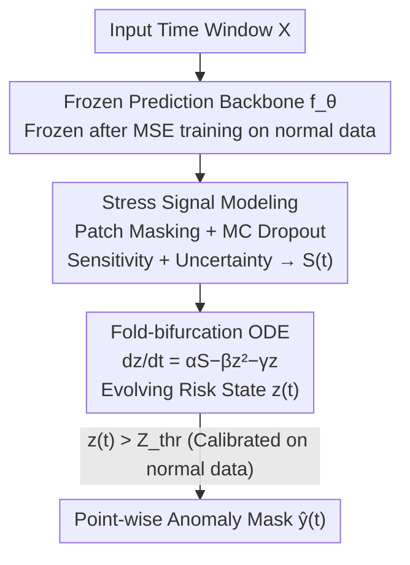

# Point-wise Anomaly Detection via Fold-bifurcation ODE

**Conference**: ICLR 2026  
**OpenReview**: [https://openreview.net/forum?id=6dOGGKK0p6](https://openreview.net/forum?id=6dOGGKK0p6)  
**Code**: To be confirmed  
**Area**: Time Series Anomaly Detection / Dynamical Systems  
**Keywords**: Point-wise anomaly detection, Fold-bifurcation, ODE, Stress signals, Critical transitions

## TL;DR
FOLD reformulates time series anomaly detection as "tracking how far the system is from a critical transition." It extracts "sensitivity + uncertainty" stress signals from a frozen prediction model and injects them into an ODE inspired by fold-bifurcation to evolve a risk state $z(t)$. An anomaly is detected when $z(t)$ crosses a threshold calibrated only on normal data. The entire process requires no anomaly labels or detector training. FOLD achieves the best average ranking under strict point-wise evaluation across 40 benchmarks compared to 34 SOTAs.

## Background & Motivation
**Background**: Current time series anomaly detection primarily follows two paradigms: predictive methods (monitoring prediction/reconstruction error, e.g., Anomaly Transformer, TranAD) and distance-based methods (relying on representation learning and embedding similarity, e.g., GDN). Both perform well on conventional benchmarks.

**Limitations of Prior Work**: Both paradigms essentially only capture "sudden stress"—drastic deviations at a single moment. Predictive methods focus on instantaneous error spikes, while distance-based methods look for sudden changes in the embedding space. Even with extended observation windows, they still target "instantaneous fluctuations" rather than "how stress accumulates over time."

**Key Challenge**: This deficiency has long been hidden by "window-level evaluation," where a detection is considered correct if it falls anywhere within an anomaly window. However, when switched to stricter "point-wise evaluation" (requiring precise localization at every timestep), the performance of these methods collapses. Many papers show impressive window-level metrics but fail point-wise because they do not model the stress accumulation process. In reality, many failures occur only after stress slowly accumulates and pushes the system toward a critical transition.

**Goal**: To use a unified dynamical framework to characterize both "slowly accumulating" and "short-lived peak" anomalies, providing robust performance under strict point-wise protocols without labels or additional training.

**Key Insight**: The authors draw inspiration from a classic theory in dynamical systems—fold/saddle-node bifurcation. Fold-bifurcation describes how, as an external pressure (control parameter $r$) slowly increases, stable and unstable equilibrium points approach each other until they suddenly annihilate at a critical point, leading to a sudden system collapse. This directly corresponds to the "normal $\to$ failure" process of anomalies.

**Core Idea**: Reinterpret the fixed control parameter $r$ in fold-bifurcation as a time-varying stress signal $S(t)$ extracted from a prediction model. Use a fold-bifurcation ODE to integrate these stresses into a risk state $z(t)$, where an anomaly is detected if $z(t)$ crosses a critical threshold. In short—define anomalies by "how close the system is to a critical tipping point" rather than "how large the current error is."

## Method

### Overall Architecture
The input to FOLD is a time window $X=[x_1,\dots,x_L]\in\mathbb{R}^{L\times d}$, and the output is a point-wise anomaly mask $\hat{y}(t)$ at each timestep. The pipeline consists of three steps across three modules: first, train and freeze a prediction model $f_\theta$ on normal data as a backbone. During testing, apply patch masking and MC dropout to the window to extract "sensitivity + uncertainty" signals, synthesizing them into a stress signal $S(t)$. Then, feed $S(t)$ into a fold-bifurcation ODE to evolve a risk trajectory $z(t)$. An alarm is triggered once $z(t)$ escapes a calibrated basin of stability. Crucially, the detector itself contains no learnable parameters, and $(\alpha,\beta,\gamma)$ are fixed hyperparameters based on data statistics, enabling zero-shot detection when paired with pre-trained foundation models (e.g., Chronos).

### Key Designs

**1. Stress Signals: Synthesizing "Prediction Fragility + Model Panic" into Time-varying External Pressure**

The control parameter in fold-bifurcation is originally a constant; FOLD replaces it with a data-driven signal that reflects system pressure at each timestep. The authors partition the input window into $N$ patches $\{P_i\}$. For each patch, two components are calculated. First, the **sensitivity term**: mask patch $P_i$ to get $X_{\backslash P_i}$, feed it into the frozen backbone for a perturbed prediction $\hat{Y}_{\backslash i}=f_\theta(X_{\backslash P_i})$, and calculate the distance $D(\hat{Y}_{\backslash i},\hat{Y})$ from the original prediction $\hat{Y}=f_\theta(X)$. If masking a patch significantly alters the future prediction, that local segment is highly influential and suspicious. Second, the **uncertainty term**: use MC dropout for $T_{MC}$ stochastic forward passes to quantify the difference in prediction variance before and after masking $\mathrm{Var}(\hat{Y}_{\backslash i})-\mathrm{Var}(\hat{Y})$. A systematic increase in variance is an early warning signal of an approaching critical transition. These are weighted to form a patch-level stress score:

$$\epsilon_i=\delta\cdot D(\hat{Y}_{\backslash i},\hat{Y})+\lambda\cdot\big(\mathrm{Var}(\hat{Y}_{\backslash i})-\mathrm{Var}(\hat{Y})\big),\quad \delta, \lambda > 0$$

These are aggregated back to the timeline based on the set of patches $I(t)$ covering time $t$: $S(t)=\frac{1}{|I(t)|}\sum_{i\in I(t)}\epsilon_i$, where $S(t)\in\mathbb{R}^d$. Both terms are essential: removing uncertainty leads to false positives from instantaneous fluctuations, while removing sensitivity fails to capture sharp deviations.

**2. Fold-bifurcation ODE: Accumulating Instantaneous Stress into "Tipping-point" State Transitions**

$S(t)$ alone is just a point-wise signal, similar to traditional error spikes. Modeling "accumulation $\to$ transition" requires dynamics. The standard form of fold-bifurcation is $\frac{dz}{dt}=r-z(t)^2$, which becomes $\frac{dz}{dt}=r-z^2-z$ after adding a decay term. FOLD replaces the fixed $r$ with time-varying $S(t)$ to obtain the core dynamics:

$$\frac{dz(t)}{dt}=\alpha S(t)-\beta z(t)^2-\gamma z(t)$$

The three coefficients serve different roles: $\alpha>0$ controls stress injection; $\gamma>0$ provides resilience, pulling the state back to stability as stress fades; and $\beta>0$ creates nonlinear escalation—where accumulated risk amplifies disproportionately near the tipping point. The $-\beta z^2$ term allows "slow accumulation" and "sudden spikes" to be characterized within a single mechanism. The equation is calculated per feature dimension to get $z\in\mathbb{R}^{L\times d}$, then aggregated into a system-level risk $z_{sys}\in\mathbb{R}^L$. Numerical integration is performed using an adaptive ODE solver (e.g., Runge–Kutta).

**3. No-label Threshold Calibration and Point-wise Decision: Boundaries of the Basin of Stability**

Since the detector is not trained and has no anomaly labels, the threshold must be calibrated from normal data. The authors simulate the ODE on normal training data. Due to the randomness of dropout, multiple risk trajectories are generated with different seeds, and the set of maximum values for each trajectory is recorded: $M_{train}=\{\max_t z(t)\mid X\in\mathcal{D}^{normal}_{train}\}$. The threshold is set as a high quantile of this set plus a small margin:

$$Z_{thr}=(1+\rho)\cdot\mathrm{Quantile}_p(M_{train}),\quad p\approx0.95\text{--}0.99,\ \rho\approx0.05$$

The point-wise decision simply checks if $z_{sys}(t)$ exceeds the threshold: $\hat{y}(t)=\mathbb{1}\{z_{sys}(t)>Z_{thr}\}$.

### Loss & Training
FOLD has no "detector" to train. The only training involves the backbone prediction model $f_\theta$ using MSE loss on normal sequences (including dropout layers). After training, the backbone is frozen. All subsequent stress extraction, ODE evolution, and threshold calibration are parameter-free during inference.

## Key Experimental Results
Evaluation was conducted on the TSB-AD leaderboard, containing 40 selected datasets with 1070 time series, compared against 34 SOTAs. The primary metric is the threshold-independent VUS-PR (Volume Under the Surface of PR curve) to eliminate threshold bias, supplemented by Point-wise F1.

### Main Results
Average VUS-PR rank for univariate tracks (lower is better, 23 datasets):

| Method | Avg Rank | Description |
|------|---------|------|
| **FOLD (Chronos)** | **2.95** | Foundation model, zero-shot, Best |
| FOLD (DLinear) | 3.86 | Lightweight backbone, still #1 |
| TSPulse (FT) | 8.65 | Second best baseline, large gap |
| Sub-PCA | 13.39 | Statistical method |
| MOMENT (FT) | 14.69 | Foundation model fine-tuned |
| Chronos (Vanilla) | 21.08 | Purely predictive |

FOLD also won the multivariate track with an average rank of 3.11, significantly outperforming deep baselines like CNN (7.52).

### Ablation Study
Ablation of the two stress signal components (Point-wise P/R/F1, selected from SMAP):

| Configuration | SMAP-P | SMAP-R | SMAP-F1 | Description |
|------|--------|--------|---------|------|
| FOLD (Full Model) | 0.6820 | 0.7059 | **0.6013** | Full Model |
| w/o Uncertainty | 0.1879 | 0.0942 | 0.0655 | Only sensitivity; sensitive to fluctuations $\to$ high false positives |
| w/o Sensitivity | 0.3491 | 0.3532 | 0.2959 | Only uncertainty; misses sharp deviations |
| NRdetector | 0.6372 | 0.1608 | 0.2367 | Baseline comparison |

### Key Findings
- **Complementary Stress Terms**: Removing uncertainty caused SMAP-F1 to collapse from 0.60 to 0.07; removing sensitivity dropped it to 0.30. Both are required for robustness.
- **The Resonance of the $-\beta z^2$ Term**: This term upgrades a simple integrator to fold-bifurcation dynamics, allowing the distinction between accumulation and sudden spikes without delicate tuning.
- **Synergy with Foundation Models**: FOLD converts Chronos' probabilistic output into an external force driving state transitions, improving univariate ranking from 3.86 to 2.95 without extra training.
- **Robustness to Contamination**: On SMAP(S-1), with training data contamination $\varepsilon \leq 3\%$, the threshold $Z_{thr}$ shifted only ~2%. While F1 eventually dropped at 10% contamination, it remained significantly higher than NRDetector or TranAD.

## Highlights & Insights
- **From "Error Magnitude" to "Proximity to Tipping Point"**: Reformulating anomaly detection as tracking the system's approach to a critical tipping point is a profound shift that unifies gradual and sudden anomalies naturally.
- **Dynamic Modeling via Fold-bifurcation**: The $-\beta z^2$ term allows disproportionate risk amplification near critical points, capturing "stress accumulation" that window-level methods fail to model.
- **Parameter-free + Foundation Model Compatible**: With zero learnable parameters in the detector, FOLD can be layered atop any pre-trained predictor to add dynamical monitoring at zero cost.
- **Uncertainty as Stress**: Treating MC dropout variance as "accumulated pressure" rather than just a confidence score leverages physical intuitions of "critical slowing down" in complex systems.

## Limitations & Future Work
- **Backbone Dependency**: Since the stress signal is derived entirely from $f_\theta$, detection quality degrades if the backbone's prediction capability is poor on specific data.
- **Statistical vs. Learned Coefficients**: While $(\alpha,\beta,\gamma)$ do not require fine-tuning, they are currently fixed by statistics. Learned or adaptive coefficients could offer more theoretical guidance across domains.
- **Contamination Sensitivity**: Threshold calibration is sensitive to heavy contamination ($\varepsilon \geq 5\%$), which may push the threshold too high and lead to missed detections.
- **Future Directions**: Exploring adaptive coefficients, more robust quantile calibration, and utilizing other bifurcation types (e.g., Hopf) for oscillatory anomalies.

## Related Work & Insights
- **vs. Predictive Methods (TranAD / Anomaly Transformer)**: These rely directly on prediction error, which only captures local spikes. FOLD uses error sensitivity and uncertainty as stressors in an ODE to model accumulation, preventing point-wise collapse.
- **vs. Distance-based Methods (GDN, etc.)**: These learn representations to detect transitions. FOLD avoids learning and additional training, using dynamical mechanisms to unify different anomaly types with lower deployment costs.
- **vs. Early Warning Signals (Williamson & Lenton)**: Traditional EWS fits autoregressive models to estimate Jacobian eigenvalues. FOLD instead instantiates a fold-bifurcation mechanism driven by predictive stress for precise point-wise localization.

## Rating
- Novelty: ⭐⭐⭐⭐⭐ Introduces fold-bifurcation dynamics to point-wise detection; a novel perspective on unifying anomalies.
- Experimental Thoroughness: ⭐⭐⭐⭐⭐ Comprehensive coverage across 40 benchmarks, 34 baselines, and various ablation studies.
- Writing Quality: ⭐⭐⭐⭐ Clear motivation and mechanism; combines physical intuition with mathematics effectively.
- Value: ⭐⭐⭐⭐⭐ High practical value for industrial monitoring due to its label-free, training-free, and foundation-model-compatible nature.

<!-- RELATED:START -->

## Related Papers

- [\[ICLR 2026\] Towards Multimodal Time Series Anomaly Detection with Semantic Alignment and Condensed Interaction](towards_multimodal_time_series_anomaly_detection_with_semantic_alignment_and_con.md)
- [\[ICLR 2026\] ICDiffAD: Implicit Conditioning Diffusion Model for Time Series Anomaly Detection](icdiffad_implicit_conditioning_diffusion_model_for_time_series_anomaly_detection.md)
- [\[ICLR 2026\] When Foundation Models Are One-Liners: Limitations and Future Directions for Time Series Anomaly Detection](when_foundation_models_are_one-liners_limitations_and_future_directions_for_time.md)
- [\[ICLR 2026\] EVEREST: A Transformer for Probabilistic Rare-Event Anomaly Detection with Evidential and Tail-Aware Uncertainty](everest_a_transformer_for_probabilistic_rare-event_anomaly_detection_with_eviden.md)
- [\[ICML 2026\] IMPACT: Influence Modeling for Open-Set Time Series Anomaly Detection](../../ICML2026/time_series/impact_influence_modeling_for_open-set_time_series_anomaly_detection.md)

<!-- RELATED:END -->
