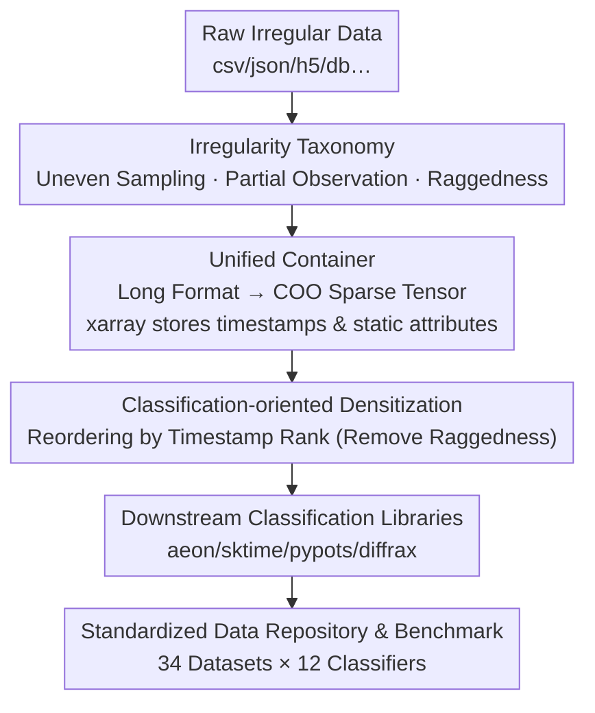

# pyrregular: A Unified Framework for Irregular Time Series, with Classification Benchmarks

**Conference**: ICLR 2026  
**OpenReview**: [https://openreview.net/forum?id=qetBM8nLkf](https://openreview.net/forum?id=qetBM8nLkf)  
**Code**: https://github.com/fspinna/pyrregular  
**Area**: Time Series / Irregular Time Series / Classification Benchmarks  
**Keywords**: Irregular time series, Sparse tensors, xarray, Classification benchmarks, Data interoperability

## TL;DR
This paper proposes pyrregular, a unified container based on xarray and sparse COO tensors that systematically organizes three types of irregularity in time series (uneven sampling, partial observation, and raggedness). It provides the first standardized data repository for irregular time series classification (34 datasets) and a cross-community benchmark (12 classifiers), concluding that the simple, generic ROCKET model surprisingly performs the best overall on such data.

## Background & Motivation
**Background**: Real-world time series (e.g., mobility trajectories, medical monitoring, environmental sensors) are almost always "irregular"—different sensors have varying sampling frequencies, recording durations, and occasional missing observations. Research into this data is fragmented across various communities: trajectory analysis, irregular time series (ITS) classification, forecasting, and imputation. Each community utilizes its own incompatible tools and libraries (statistical/data mining models, neural networks, differential equations).

**Limitations of Prior Work**: This fragmentation leads to two primary issues. First, there is **no unified data format**. Existing array structures either store variable-length data but lose real timestamps (e.g., NumPy masked arrays, awkward arrays, ragged tensors), use long formats for forecasting (`(i, j, t, x)` tuples) which require pivoting for classification and struggle with static attributes, or support multi-dimensional arrays with timestamps (e.g., xarray) but lack native sparse support. The mainstream ITS library, pypots, ignores "uneven sampling" and exists as an isolated ecosystem. Second, there is **no standardized benchmark**. Regular time series have "bake-offs" with hundreds of datasets (UEA/UCR), whereas ITS benchmarks are often limited to single papers with few datasets, frequently relying on "artificial dropping" of regular data—a practice that introduces assumptions about missingness mechanisms and destroys "structural missingness" inherent in real collection processes.

**Key Challenge**: The fundamental cause is that "irregularity" itself has never been clearly defined—it is actually an overlay of multiple independent causes. Existing tools target only one type (e.g., partial missingness), causing fragmentation in data formats, methods, and benchmarks. Consequently, the generalization ability of methods has not been verified across sufficiently diverse data.

**Goal**: (1) Clarify irregularity by providing a taxonomy distinguishing various types; (2) design a unified array container capable of expressing all types of irregularity; (3) establish the first standardized irregular classification data repository and cross-community benchmark.

**Key Insight**: The authors observed that the "long format" (each row as `(i, j, t, x)`) commonly used in ITS is structurally identical to the COO (Coordinate) representation of sparse tensors. The only difference is that COO uses discrete integer indices $k$, while the long format uses real timestamps $t$; the two are linked via a $t \leftrightarrow k$ mapping.

**Core Idea**: By combining "xarray for timestamps + underlying sparse COO tensors for observations," the authors create a cross-library compatibility layer, allowing irregular data and methods from all communities to be compared fairly within the same container.

## Method

### Overall Architecture
pyrregular aims to convert irregular time series from any source or format into a unified representation that is memory-efficient, expresses all irregularities, and is compatible with existing libraries. The pipeline consists of three steps: **preprocessing**, which unifies raw data into long format for the sparse COO container; **handling**, which allows data exploration, slicing, visualization, and access; and **converting**, which densifies the sparse container into tensors usable by downstream classification libraries. The central container is the core—it stitches xarray (managing timestamps and static attributes) and the underlying sparse COO tensor (managing observations) via custom backends and accessors.

### Key Designs

**1. A Unified Taxonomy of Irregularity: Decomposing "Chaos" into Three Factors**

The authors formalize "irregularity" into three independent causes. A single signal can be irregular due to **uneven sampling** (intervals $t_{k+1}-t_k$ are not constant) or being **partially observed** (values that should exist are missing, marked as NaN). When multiple signals are combined into a multivariate array, a third structural irregularity emerges: **raggedness**, which necessitates padding due to inconsistencies in length or alignment. Raggedness is further divided into: **length raggedness** (varying number of observations $\tau_a \neq \tau_b$), **shifting** (signals starting/ending at different times), and **sampling raggedness** (differing sampling intervals $\Delta t_{a,k} \neq \Delta t_{b,k}$). These factors are independent—e.g., trajectory data may have highly uneven timestamps but shared intervals (uneven but not ragged). This taxonomy allows the container to accommodate all causes and enables stratified evaluation in benchmarks.

**2. Long-Format $\leftrightarrow$ COO Unified Container: Integrating Timestamps and Missingness**

This is the core engine (preprocessing and handling). Preprocessing requires users to provide a function that outputs data in **long format** (each row: `(i, j, t, x)`—Instance ID, Signal ID, timestamp, observation). Since long format and sparse COO `(i, j, k, x)` are nearly isomorphic, the authors map sorted unique timestamps $t=[t_1,\dots,t_T]$ from the entire dataset to indices $k=[1,\dots,T]$. A two-pass read completes the conversion to a sparse tensor $X \in \dot{\mathbb{R}}^{n \times d \times T}$. The COO representation elegantly distinguishes two types of NaNs: **explicitly stored** `(i, j, k, \text{NaN})` represent "partially observed" values, while **implicitly generated** NaNs during densification represent padding from "raggedness." By using xarray to store timestamps and static attributes (e.g., labels) with a sparse COO backend, the system retains full xarray functionality (querying, plotting, HDF5 storage) while remaining memory-efficient.

**3. Densitization for Classification: Rank-based Reordering**

To make the data compatible with downstream supervised learning libraries, the sparse container must be converted to dense tensors. Since raggedness is usually irrelevant to labels in classification, simply expanding by global timestamps would result in a massive, mostly-NaN array. Instead, the authors perform **rank-based densification** on each sequence: for each COO entry $(i, j, k, x)$, they produce $(i, j, \text{rank}_i(k), x)$, where:

$$\text{rank}_i(k) = 1 + |\{k' \in [1, T_i] : k' < k\}|.$$

This compresses each sequence's timestamp indices into a continuous sequence from 1 to its own length $T_i$, resulting in a dense $X' \in \dot{\mathbb{R}}^{n \times d \times \bar{T}}$ ($\bar{T} = \max_i T_i$). This retains real NaNs from partial observations while minimizing raggedness-induced padding. $X'$ can be fed directly into libraries like sktime, aeon, or pypots.

**4. Standardized Data Repository & Benchmark: 34 Natural Datasets × 12 Classifiers**

The authors curated 34 **naturally irregular** datasets (no artificial missingness), covering healthcare (P12/P19/MIMIC-III), human activity (PAM/LPA), and trajectories (animal AN, bird SE, vehicle TA/VE). They labeled each dataset by irregularity type (US/PO/UL/SH/RS) and created a toy benchmark (ABF) where classes depend on sampling skewness. 12 classifiers capable of "native irregular processing" were selected from five libraries, including ROCKET, NCDE, BRITS, and TimesNet. The goal was to find models with the best generalization under "single reasonable configurations" (default hyperparameters) rather than per-dataset tuning.

## Key Experimental Results

### Main Results
Using macro-F1 as the primary metric, the 12 models were ranked via Critical Difference (CD) diagrams:

| Model | Type | Avg F1 Rank | Remarks |
|------|------|--------------|------|
| ROCKET | Regular · Kernel | 3.47 | Best, despite not utilizing irregularity info |
| BORF | Dictionary | 4.87 | Statistically tied with LGBM/RIFC/TimesNet |
| LGBM | Tabular · Tree | 5.07 | Trained directly on raw ITS, fastest |
| RIFC | Interval Feature | 5.53 | Degrades on large datasets |
| TimesNet | Neural · Inception | 6.06 | Improves significantly with more data |
| RAINDROP | GNN | 6.41 | Strong on long sequences (graph structure) |
| KNN (DTW) | Distance | 6.46 | Poor scalability on large datasets |
| ... | ... | ... | ... |
| NCDE | Neural ODE | 8.56 | Relatively low performance |
| SVM (LCSS) | Distance Kernel | 10.44 | Worst performance |

**Counter-intuitive finding**: ROCKET, a generic model designed for regular time series that ignores irregularity information, is the strongest overall. Specialized neural networks (GRU-D, NCDE) generally underperform in this "bake-off" setting. This is attributed to the robust inductive bias of simple generic models ("high bias, low variance") across multiple tasks.

### Stratified Analysis & Fine-tuning

| Dimension | Key Finding |
|----------|----------|
| Data Scale | KNN/RIFC degrade on large data; LGBM and TimesNet improve significantly. |
| Dimensionality | Neural networks benefit from higher dimensionality (multivariate). |
| Sequence Length | Recurrent models (GRU-D/BRITS) struggle; ROCKET/BORF/RIFC perform better. |
| Irregularity Type | ROCKET/BORF/LGBM lead in most categories; however, for **Partially Observed** data, specialized models like SAITS/BRITS take the lead. |
| After Fine-tuning | On P12/P19, specialized deep models (MTSFORMER, MUSICNET) can surpass simple models; ROCKET falls behind after tuning, while LGBM remains highly competitive. |

### Key Findings
- **Simple & Generic > Specialized & Complex**: ROCKET/BORF/LGBM outperform specialized neural networks in the bake-off, suggesting complex "native" designs may not yield cross-dataset generalization benefits.
- **Partial Observation is the Exception**: Specialized modeling of missingness (SAITS/BRITS) only provides value when missingness has structured patterns, justifying its distinct category in the taxonomy.
- **Significant Storage Savings**: The sparse COO format excels on highly irregular data (e.g., TA dataset reduced from 1.81GB to 0.08GB).

## Highlights & Insights
- **Isomorphism Insight**: Recognizing that the "long format" effectively mirrors the "sparse COO" representation is a brilliant pivot point, enabling cross-library compatibility via a simple $t \leftrightarrow k$ mapping.
- **Semantic Separation of NaNs**: Explicitly distinguishing "real missingness" from "padding" based on the existence of a COO entry provides a clarity missing in most existing formats.
- **Universal xarray + Sparse Backend**: This "semantic layer + storage layer" separation is a pattern applicable to any high-dimensional sparse data with coordinates, not just time series.
- **Honest Negative Results**: The objective reporting that simple models often outperform complex neural networks adds significant value to the community's understanding of robust baselines.

## Limitations & Future Work
- **Task Scope**: Currently focused on classification; effectiveness for forecasting or imputation is not yet verified.
- **Hyperparameter Bias**: The "simple is better" conclusion holds for default parameters; specialized models can regain the lead with extensive per-dataset tuning.
- **Explainability**: ROCKET is powerful but lacks inherent interpretability compared to models like BORF or LGBM, which is a drawback for high-stakes fields like healthcare.
- **Preprocessing Effort**: While only a long-format generator is required, correctly implementing incremental row production for unfamiliar data sources still presents a hurdle for users.

## Related Work & Insights
- **vs pypots**: While pypots is a major ITS library, it focuses on partial missingness and ignores uneven sampling; pyrregular accommodates three types of irregularity and provides compatibility across multiple major libraries (aeon, sktime, etc.).
- **vs UEA/UCR**: Unlike standard repositories that use artificial missingness, pyrregular collects 34 naturally irregular datasets, preserving real structural patterns.
- **vs Ragged Tensors/Long Formats**: Traditional formats often compromise on either timestamp preservation or support for static attributes; pyrregular achieves both by combining COO with xarray.

## Rating
- Novelty: ⭐⭐⭐⭐ Solid engineering and conceptual contribution via the "Unified Container + Taxonomy + Benchmark" trifecta.
- Experimental Thoroughness: ⭐⭐⭐⭐⭐ 34 datasets × 12 models with multi-dimensional analysis; a true "bake-off."
- Writing Quality: ⭐⭐⭐⭐ Clear formalization of the taxonomy and excellent visualizations.
- Value: ⭐⭐⭐⭐⭐ Provides a much-needed standardized benchmark and framework to advance research in the field.

<!-- RELATED:START -->

## Related Papers

- [\[ICLR 2026\] Towards Robust Real-World Multivariate Time Series Forecasting: A Unified Framework](towards_robust_real-world_multivariate_time_series_forecasting_a_unified_framewo.md)
- [\[ICLR 2026\] Delta-XAI: A Unified Framework for Explaining Prediction Changes in Online Time Series Monitoring](delta-xai_a_unified_framework_for_explaining_prediction_changes_in_online_time_s.md)
- [\[ICLR 2026\] A Unified Federated Framework for Trajectory Data Preparation via LLMs](a_unified_federated_framework_for_trajectory_data_preparation_via_llms.md)
- [\[ICLR 2026\] Reliable Probabilistic Forecasting of Irregular Time Series via Marginal Consistent Flows](reliable_probabilistic_forecasting_of_irregular_time_series_through_marginalizat.md)
- [\[ICLR 2026\] TimeSeriesExamAgent: Creating Time Series Reasoning Benchmarks at Scale](timeseriesexamagent_creating_time_series_reasoning_benchmarks_at_scale.md)

<!-- RELATED:END -->
