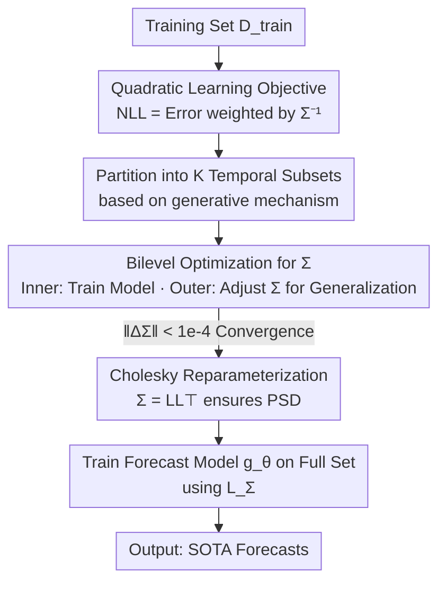

# Quadratic Direct Forecast for Training Multi-Step Time-Series Forecast Models

**Conference**: ICLR2026  
**OpenReview**: [https://openreview.net/forum?id=vpO8n9AqEG](https://openreview.net/forum?id=vpO8n9AqEG)  
**Code**: https://github.com/Master-PLC/QDF  
**Area**: Time Series  
**Keywords**: Time-series forecasting, Learning objectives, Label autocorrelation, Heterogeneous task weights, Bilevel optimization  

## TL;DR
Addressing the flaw in multi-step time-series forecasting where MSE treats each future step as an independent, equal-weighted task, this paper derives a "quadratic learning objective" weighted by the inverse conditional covariance matrix from a maximum likelihood perspective. Using a bilevel optimization framework (QDF), this weighting matrix is treated as a learnable parameter and learned on a hold-out set to maximize generalization. As a plug-and-play loss replacement for MSE, it consistently achieves SOTA results across 8 datasets and various forecasting models.

## Background & Motivation
**Background**: Advances in deep time-series forecasting have primarily proceeded along two axes: neural network architectures (Transformer-based like iTransformer / PatchTST / TQNet, and linear-based like DLinear / TimeMixer) and training learning objectives. The vast majority of work focuses on architecture, while the learning objective almost universally defaults to Mean Squared Error (MSE), following the Direct Forecast (DF) paradigm that outputs $T$ future steps simultaneously and sums the MSE for each step.

**Limitations of Prior Work**: MSE treats "predicting the $t$-th step" as a set of independent sub-tasks with identical weights. This introduces two long-ignored issues. First, **label autocorrelation**: time-series data is naturally strongly autocorrelated; even when conditioned on the historical $X$, future steps remain correlated (a case study on ECL found that over 61.4% of off-diagonal elements in the partial correlation matrix of label sequences have absolute values > 0.1). MSE treats them as independent, inherently acting as a biased objective. Second, **heterogeneous task weights**: the prediction difficulty and uncertainty vary significantly across different future steps (conditional variance changes noticeably with lead time), yet MSE assigns uniform weights to all steps, wasting the opportunity to weight tasks by difficulty.

**Key Challenge**: From a maximum likelihood perspective, the truly "unbiased" objective should be a quadratic form weighted by the **inverse conditional covariance matrix** $\bar{\Sigma}$—where off-diagonal elements handle autocorrelation and diagonal elements handle heterogeneous weights. MSE is equivalent to assuming $\bar{\Sigma}=I$, which discards both layers of information. Existing improvements (FreDF, Time-o1) transform labels into a latent space before alignment, but they only ensure **marginal decorrelation** and fail to achieve the required **conditional decorrelation** (i.e., diagonalizing $\bar{\Sigma}$), while still optimizing all components with equal weights. Thus, neither problem is truly resolved.

**Goal**: To effectively utilize the quadratic objective weighted by $\bar{\Sigma}$. This involves three sub-problems: (1) How to estimate $\bar{\Sigma}$ from data? (2) How to define a trainable objective after estimation? (3) Can it actually improve prediction accuracy?

**Key Insight**: $\bar{\Sigma}$ is unknown and difficult to estimate directly since there is only one label sequence for each $X$. The authors' key shift is **not to estimate the true covariance, but to treat $\Sigma$ as a set of learnable proxy parameters** targeting "model generalization," using bilevel optimization on a hold-out set to learn the objective that best drives the forecasting model's generalization.

**Core Idea**: Replace the identity matrix implicit in MSE with a "generalization-oriented, bilevel-optimized quadratic weighting matrix," simultaneously modeling label autocorrelation (off-diagonal) and heterogeneous task weights (diagonal) within the loss function.

## Method

### Overall Architecture
QDF (Quadratic Direct Forecast) is a **model-agnostic training algorithm / loss replacement scheme**. it does not modify the structure of the forecasting model $g_\theta$, but replaces MSE during training with a quadratic objective parameterized by a $T\times T$ weighting matrix, supported by a specialized learning pipeline. The process is divided into three stages: first, partitioning the training set into $K$ non-overlapping temporal subsets; then, treating the weighting matrix $\Sigma$ as a learnable parameter and refining it via **bilevel optimization** across these subsets (inner loop trains the model with the current $\Sigma$, outer loop updates $\Sigma$ on hold-out data to maximize generalization); finally, using the converged $\Sigma$ to define the final loss $L_\Sigma$ for normal training on the full training set. This process uses only the training data and avoids leakage from validation/test sets.

Input: History sequence $X\in\mathbb{R}^{H\times D}$, training set $D_{\text{train}}$; Output: Learned weighting matrix $\Sigma$ and corresponding loss $L_\Sigma$, resulting in the trained forecasting model.

### Key Designs

**1. Quadratic Learning Objective: Replacing the "Identity Matrix" of MSE with Inverse Conditional Covariance**

This is the theoretical foundation, directly addressing the bias in MSE. The paper uses Theorem 3.1 to show that, assuming prediction errors follow a multivariate Gaussian distribution, the negative log-likelihood (NLL) of the label sequence (omitting constants) is a quadratic form:

$$L_{\bar{\Sigma}}(X,Y;g_\theta)=\|Y-g_\theta(X)\|_{\bar{\Sigma}}^2=(Y-g_\theta(X))^\top \bar{\Sigma}\,(Y-g_\theta(X)),$$

where $\Sigma\in\mathbb{R}^{T\times T}$ is the conditional covariance of the label sequence given $X$, and $\bar{\Sigma}=\Sigma^{-1}$ is its inverse. This formula reveals two things: **off-diagonal elements** characterize conditional correlation between future steps (autocorrelation effects), and **diagonal elements** assign different weights to different future steps (heterogeneous task weights). MSE $L_{\text{mse}}=\|Y-g_\theta(X)\|^2$ is equivalent to setting $\bar{\Sigma}=I$, discarding both pieces of information. Upgrading the objective from a "sum of point-to-point squared errors" to a "quadratic form weighted by $\bar{\Sigma}$" allows both factors to be addressed at the loss level, which methods like FreDF / Time-o1 cannot achieve as they only perform marginal decorrelation without diagonalizing $\bar{\Sigma}$.

**2. Generalization-Oriented Bilevel Optimization: Learning the Weighting Matrix as a Parameter**

The true $\Sigma$ is unknown and cannot be accurately estimated from a single label sequence per $X$. The breakthrough here is **not to estimate the true covariance, but to learn a proxy $\Sigma$ that maximizes model generalization**. This is formalized as a bilevel optimization in Definition 3.2: partitioning training data into non-overlapping $D_{\text{in}}=(X^{\text{in}},Y^{\text{in}})$ and $D_{\text{out}}=(X^{\text{out}},Y^{\text{out}})$,

$$\min_{\Sigma\succeq 0} L_\Sigma(X^{\text{out}},Y^{\text{out}};g_{\theta^\star})\quad\text{s.t.}\quad \theta^\star=\arg\min_\theta L_\Sigma(X^{\text{in}},Y^{\text{in}};g_\theta).$$

The inner loop trains model $g_\theta$ on $D_{\text{in}}$ using a fixed $\Sigma$; the outer loop evaluates it on the disjoint $D_{\text{out}}$ and updates $\Sigma$ to improve the generalization of the model trained by it. Crucially, the gradient for $\Sigma$ in the outer loop is **backpropagated through the updated $\theta$** (rather than directly), capturing the causal chain of how $\Sigma$ affects generalization via $\theta$. This approach is conceptually similar to meta-learning (MAML/Reptile) but differs in objective: meta-learning seeks fast adaptation to new tasks, while QDF seeks a **static objective tailored for a single task to model its autocorrelation and heterogeneous weights**.

**3. Cholesky Reparameterization: Ensuring Positive Semi-Definiteness via Unconstrained Optimization**

As a covariance matrix, $\Sigma$ must be positive semi-definite ($\Sigma\succeq 0$). Directly optimizing with this constraint is difficult. The paper employs Cholesky decomposition $\Sigma=LL^\top$ for reparameterization, where $L$ is lower triangular with positive diagonal elements (ensured via softplus activation). This transforms the constrained optimization over $\Sigma$ into an unconstrained optimization over $L$, allowing standard gradient descent. This engineered solution ensures every learned weighting matrix is a valid covariance matrix without additional projection steps.

**4. Block Iterative Refinement Workflow: Robust Learning for Convergence**

Beyond the atomic update (Algorithm 1: $N$ inner steps for $\theta$, one outer step for $\Sigma$), a robust workflow (Algorithm 2) is used: (i) Initialize $\Sigma=I_T$ (starting from MSE) and partition the training set into $K$ temporal subsets; (ii) Iteratively apply Algorithm 1 across these subsets to refine $\Sigma$ until $\|\Sigma_{n+1}-\Sigma_n\|_F<10^{-4}$ or the outer maximum $N_{\text{out}}$ is reached; (iii) Use the converged $\Sigma$ to train the model normally on the full dataset. **Temporal partitioning** is key to robustness, ensuring $\Sigma$ is updated across different data distributions to prevent overfitting to a specific segment. Being model-agnostic, QDF can be applied to iTransformer, DLinear, TQNet, Fredformer, PDF, etc.

### Loss & Training
The final training objective is the converged quadratic NLL: $L_{\Sigma}(X,Y;g_\theta)=(Y-g_\theta(X))^\top\bar{\Sigma}(Y-g_\theta(X))$, estimated over mini-batches. Key hyperparameters include inner update steps $N_{\text{in}}$, outer steps $N_{\text{out}}$, number of subsets $K$, and update rate $\eta$. For multivariate scenarios, variables are treated as independent scalars for objective calculation according to the paper convention.

## Key Experimental Results

### Main Results
On 8 public datasets (ETTh1/h2/m1/m2, ECL, Weather, PEMS03/08) with input length 96, results were averaged for $T\in\{96,192,336,720\}$. QDF used TQNet as the backbone and was compared against 10 SOTA models.

| Dataset | Metric | QDF (Ours) | TQNet | iTransformer | DLinear |
|---------|--------|------------|-------|--------------|---------|
| ETTm2 | MSE | **0.270** | 0.277 | 0.295 | 0.342 |
| ETTh1 | MSE | **0.431** | 0.449 | 0.452 | 0.456 |
| ECL | MSE | **0.165** | 0.175 | 0.179 | 0.212 |
| Weather | MSE | **0.242** | 0.246 | 0.269 | 0.265 |
| PEMS08 | MSE | **0.120** | 0.139 | 0.149 | 0.249 |

QDF led consistently across all datasets, with notable reductions in MSE/MAE on PEMS08. Qualitatively, while DF captures general trends, it often misses details (e.g., trend shifts in ETTm2 or periodic peaks around step 150 in ECL), which QDF follows more accurately.

### Comparison of Learning Objectives
Plugging different losses into the same model (TQNet / PDF) for a fair comparison:

| Loss | Dataset | MSE | MAE |
|------|---------|-----|-----|
| QDF | ETTm1 | **0.371** | **0.389** |
| Time-o1 | ETTm1 | 0.372 | 0.390 |
| FreDF | ETTm1 | 0.375 | 0.390 |
| DF(MSE) | ETTm1 | 0.376 | 0.391 |
| Soft-DTW | ETTm1 | 0.387 | 0.394 |
| Koopman | ETTm1 | 0.595 | 0.499 |

While corrective objectives like FreDF / Time-o1 outperform raw MSE, they fall short of QDF due to marginal decorrelation and equal weighting. Soft-DTW and Koopman significantly deteriorated on some datasets.

### Ablation Study
Decomposing the two components of QDF (Hetero. = Heterogeneous weights / diagonal learning; Auto. = Autocorrelation / off-diagonal learning):

| Config | Hetero. | Auto. | ECL MSE | ETTh1 MSE | Note |
|--------|---------|-------|---------|-----------|------|
| DF | ✗ | ✗ | 0.175 | 0.449 | Pure MSE ($\bar\Sigma=I$) |
| QDF† | ✓ | ✗ | 0.166 | 0.443 | Diagonal only |
| QDF‡ | ✗ | ✓ | 0.166 | 0.442 | Off-diagonal only |
| QDF | ✓ | ✓ | **0.165** | **0.431** | Complete, synergistic |

### Key Findings
- **Individual components both outperform DF**: Learning either heterogeneous weights (QDF†) or autocorrelation (QDF‡) improves upon MSE, with QDF‡ often being the runner-up, highlighting the value of modeling label autocorrelation.
- **Model-agnostic普适 gains**: Consistent error reduction when applied to TQNet, PDF, Fredformer, and iTransformer. On ECL, it reduced MSE for Fredformer and TQNet by 7.4% and 5.9%, respectively.
- **Comparison with meta-learning optimizers**: While MAML / iMAML / Reptile can optimize weighting matrices to beat DF, they underperform QDF because they do not explicitly optimize for out-of-sample generalization.
- **Hyperparameter insensitivity**: Performance improves significantly as $N_{\text{in}}$ increases from 0 to 1 and stabilizes thereafter. The method is robust across a wide range of $K$ and $\eta$.

## Highlights & Insights
- **Re-theorizing Loss Design**: Deriving the "optimal objective = quadratic form weighted by inverse conditional covariance" from maximum likelihood provides a solid theoretical foundation, positioning MSE and FreDF/Time-o1 as simplified special cases.
- **Proxy Matrix Learning via Generalization**: Circumventing the impossibility of estimating true covariance by learning a proxy $\Sigma$ that maximizes generalization is a clever shift, turning a statistical estimation problem into a solvable optimization problem.
- **Non-Invasive Plug-and-Play**: Changing the loss without modifying the model allows any direct forecast architecture to benefit with minimal implementation cost.
- **Second-Order Gradients**: Backpropagating the outer gradient through $\theta$ is essential to capture the causal impact of $\Sigma$ on generalization.

## Limitations & Future Work
- **Computational Complexity**: The $T\times T$ weighting matrix and second-order backpropagation in bilevel optimization may pose scaling challenges for extremely long horizons or massive variable counts.
- **Gaussian Assumption**: Theorem 3.1 relies on multivariate Gaussian error assumptions; robustness against heavy-tailed or highly non-stationary distributions requires further validation.
- **Independent Multivariate Treatment**: Each variable is currently treated as an independent scalar objective, leaving potential for improvement by modeling cross-variable covariance.
- **Interpretability of $\Sigma$**: An analytical visualization of learned weighting matrices compared to true data structures would further strengthen the "proxy matrix" argument.

## Related Work & Insights
- **vs MSE / DF**: MSE assumes $\bar\Sigma=I$, treating steps as independent tasks. QDF generalizes this by learning a non-trivial $\bar\Sigma$ for autocorrelation and heterogeneous weights.
- **vs FreDF / Time-o1**: These prioritize marginal decorrelation in latent spaces but retain equal weighting. QDF optimizes the full weighting matrix in the original space, aligning more closely with NLL theory.
- **vs Soft-DTW / Koopman**: Shape/transformation-based objectives lack the theoretical bias-reduction guarantees of QDF and show instability on certain datasets.
- **vs Meta-learning**: While sharing the learnable parameter concept, QDF targets a static objective for out-of-sample generalization within a single task, rather than fast adaptation across task distributions.

## Rating
- Novelty: ⭐⭐⭐⭐⭐ Re-theorizing loss design and utilizing generalization-oriented proxy covariance is a novel and self-consistent approach.
- Experimental Thoroughness: ⭐⭐⭐⭐⭐ Comprehensive coverage across 8 datasets, 10 baselines, objective comparisons, ablations, and meta-learning controls.
- Writing Quality: ⭐⭐⭐⭐ Clear derivations and logical progression, though binary optimization details require some technical background.
- Value: ⭐⭐⭐⭐⭐ High practical utility as a model-agnostic, plug-and-play enhancement for forecasting training.

<!-- RELATED:START -->

## Related Papers

- [\[ICLR 2026\] Panda: A Pretrained Forecast Model for Chaotic Dynamics](panda_a_pretrained_forecast_model_for_chaotic_dynamics.md)
- [\[ICLR 2026\] DistDF: Time-series Forecasting Needs Joint-distribution Wasserstein Alignment](distdf_time-series_forecasting_needs_joint-distribution_wasserstein_alignment.md)
- [\[ICLR 2026\] Multi-Scale Hypergraph Meets LLMs: Aligning Large Language Models for Time Series Analysis](multi-scale_hypergraph_meets_llms_aligning_large_language_models_for_time_series.md)
- [\[ICML 2026\] Simulation-Augmented Multi-Step Split Conformal Prediction for Aggregated Forecasts](../../ICML2026/time_series/simulation-augmented_multi-step_split_conformal_prediction_for_aggregated_foreca.md)
- [\[ICLR 2026\] MMPD: Diverse Time Series Forecasting via Multi-Mode Patch Diffusion Loss](mmpd_diverse_time_series_forecasting_via_multi-mode_patch_diffusion_loss.md)

<!-- RELATED:END -->
