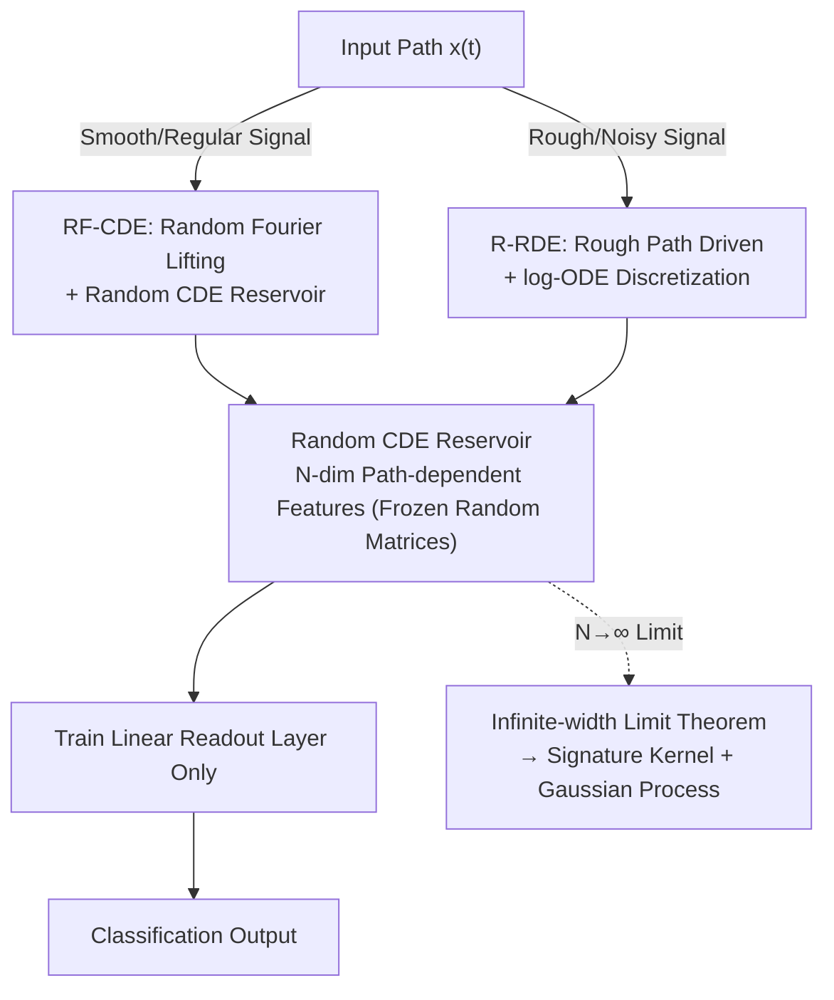

# Random Controlled Differential Equations

**Conference**: ICLR 2026  
**OpenReview**: [https://openreview.net/forum?id=kHqt0ZSbKT](https://openreview.net/forum?id=kHqt0ZSbKT)  
**Code**: https://github.com/FrancescoPiatti/RandomSigJax  
**Area**: Time Series Modeling / Differential Equations / Reservoir Computing  
**Keywords**: Time Series Classification, Controlled Differential Equations, Reservoir Computing, Signature Kernels, Random Features

## TL;DR
By utilizing a large collection of Controlled Differential Equations (CDEs) / Rough Differential Equations (RDEs) with **random parameters** as a continuous-time reservoir and training only a final linear readout layer, a fast, scalable time-series classifier is obtained. It strictly converges to the "signature kernel" in the infinite-width limit, preserving the inductive bias of path signature methods while eliminating the overhead of explicit signature calculation and kernel matrix inversion.

## Background & Motivation

**Background**: Modern time-series learning follows two complementary mainlines. One is **Controlled Differential Equations (CDEs)**: sequences are viewed as driving paths $x:[0,T]\to\mathbb{R}^d$, allowing a hidden state to evolve "controlled" by this path. This is the continuous-depth limit of Residual Networks and the unified perspective of Deep State Space Models (S4, Mamba); Neural CDEs further parameterize vector fields with neural networks to learn from data. The other is **Path Signatures**: iterated integral sequences of paths that linearize CDE solution maps and induce **signature kernels** with universality and stability guarantees.

**Limitations of Prior Work**: While signatures and signature kernels are theoretically elegant, they are **computationally expensive** at high truncation orders. Signature feature dimensions explode exponentially with the order, and signature kernels require constructing and inverting large Gram matrices, which becomes a bottleneck as the number of samples increases. Learnable methods like Neural CDEs require full backpropagation training, which is costly.

**Key Challenge**: Path methods with high expressivity (signature kernels, Neural CDEs) have high training/inference costs, while low-cost methods often lack the proper inductive bias for path data. In other words, there is a **trade-off between "signature-level expressivity" and "reservoir-level training efficiency"**.

**Goal**: Construct a class of **random feature models tailored for path data** that simultaneously satisfy three criteria: (1) preserve the continuous-time structure of CDEs; (2) have clear kernel/statistical limits in the infinite-width regime (not black-box random networks); (3) require training only a linear readout, making them lightweight and scalable.

**Key Insight**: The authors borrow ideas from **reservoir computing**: using a large, **randomly initialized and untrained** dynamical system as a feature extractor, learning only the final linear readout layer. The key observation is that if this random dynamical system itself is a CDE with random parameters (Cirone et al. 2023 proved the infinite width-depth limit of a random controlled ResNet is exactly the signature kernel), it naturally inherits the signature inductive bias while only requiring readout training.

**Core Idea**: **Use "randomly parameterized CDE / Rough DE reservoirs + linear readout" to replace explicit signature computation**, and prove that the infinite-width limit is the (RBF-lifted / Rough) signature kernel, thereby unifying random feature reservoirs, continuous-time deep architectures, and path signature theory within a single framework.

## Method

### Overall Architecture

The paper provides a framework for "turning signature kernels into random feature reservoirs." The input is a time-series path $x$, and the output is its classification label. The core pipeline is: **(Optional) Lift the path → Use it to drive a random parameter differential equation reservoir → Obtain $N$-dimensional path-dependent features → Train a linear readout on the features only**. The random matrices $A_i\sim\xi_N$ (standard Gaussian) in the reservoir remain frozen throughout, so training costs are almost entirely from the final linear regression.

Within this skeleton, the paper introduces two specific variants for input signals with different regularities:

- **RF-CDE**: For smooth/regular paths. It uses Random Fourier Features (RFF) to lift the signal pointwise into an RBF Reproducing Kernel Hilbert Space (RKHS), then uses the lifted path to drive a random CDE. The infinite-width limit converges to the **RBF-lifted signature kernel**.
- **R-RDE**: For rough/noisy signals. Operating directly on geometric rough paths, it uses **log-ODE discretization** combined with log-signatures to capture high-order temporal interactions. The infinite-width limit converges to the **rough signature kernel**.

Both branches lead to a unified theoretical guarantee—**Infinite-width Limit Theorem + Gaussian Process Interpretation**: Fixing a random reservoir + training a linear readout ≈ performing kernel ridge regression with the corresponding signature kernel, equivalent to a Gaussian Process prior with the signature kernel as covariance.

### Key Designs

**1. Random CDE Reservoir + Linear Readout: "Sampling" Signature Kernels as Random Features**

**Mechanism**: This establishes the foundation of the method, addressing the high cost of explicit signatures. The reservoir is a **random parameter Controlled Differential Equation** (R-CDE, originating from Cirone et al. 2023, with the first empirical tests in this paper): A batch of i.i.d. Gaussian random matrices $A_k\sim\xi_N$ is taken, and the $N$-dimensional hidden state evolves under path driving:

$$\mathrm{d}Z^N_t(x)=\frac{1}{\sqrt{N}}\sum_{i=1}^{m}A_i\,\varphi\!\left(Z^N_t(x)\right)\mathrm{d}x^i_t,\qquad Z^N_0=z_0\in\mathbb{R}^N.$$

It is essentially the continuous-time limit of a randomly initialized, homogeneous single-layer ResNet as "depth $\to \infty$ and step size $\to 0$".  
**Design Motivation**: Cirone et al. proved that as width $N\to\infty$ and $\varphi=\mathrm{id}$, the expected inner product of two path features $\frac1N\mathbb{E}[\langle Z^N_s(x),Z^N_t(y)\rangle]$ converges exactly to the **signature kernel** $K^{x,y}_{\mathrm{sig}}(s,t)$ of $x,y$. Thus, random matrices sample the "signature kernel" via Monte Carlo. We avoid explicit signature calculations by running this random DE to get $N$-dimensional features and training a linear readout. Training complexity drops from "kernel matrix inversion" ($O(n^3)$) to "linear regression".

**2. RF-CDE: Random Fourier Lifting to Approximate RBF-Lifted Signature Kernels**

**Mechanism**: Pure R-CDE corresponds to a "raw" signature kernel, lacking local geometric characterization. Toth et al. (2025) showed that **lifting the signal into an RBF RKHS before taking the signature** yields significantly better results. This design incorporates this into continuous-time dynamics. Pointwise lifting using RFF $\phi^F_\mu:\mathbb{R}^d\to\mathbb{R}^{2F}$ creates the lifted path $X^F_t:=\phi^F_\mu(x_t)$, which then drives the random CDE:

$$\mathrm{d}Z^{N,F}_t(x)=\frac{1}{\sqrt{N}}\sum_{i=1}^{2F}A_i\,\varphi\!\left(Z^{N,F}_t(x)\right)\mathrm{d}X^{F,i}_t.$$

**Design Motivation**: Theorem 3.2 proves that taking $N\to\infty$ followed by $F\to\infty$, the feature inner product converges to the **RBF-lifted signature kernel** $K^{x,y}_{\mathrm{Sig\text{-}RBF}}$. This provides a clear inductive bias: RF-CDE inherits the signature kernel's expressive structure while maintaining the scalability of random feature reservoirs. Euler discretization with additional bias vectors $b_i\sim\xi_N$ and scale parameters $\sigma_A,\sigma_b,\sigma_0$ allows for handling piecewise linear paths.

**3. R-RDE: Rough Path Driving + log-ODE Discretization for High-Order Interactions**

**Mechanism**: For rough signals ($p$-variation $p>2$, e.g., fractional Brownian motion), naive Euler discretization destroys the Chen's multiplicativity of signatures. This design constructs the reservoir on geometric rough paths. It uses the **log-ODE method**: each time step $[t_i,t_{i+1}]$ is summarized by a log-signature $L_i=\log_m(X_{t_i,t_{i+1}})\in\mathcal{L}^m(\mathbb{R}^d)$. The state is advanced through nested Lie brackets:

$$\widetilde Z^N_{t_{i+1}}=\widetilde Z^N_{t_i}+\Pi_B(X_{t_i,t_{i+1}})\,\varphi(\widetilde Z^N_{t_i}).$$

**Design Motivation**: The log-ODE accurately preserves the group/Chen structure, remaining faithful to rough path algebra. This allows stable utilization of **high-order temporal interaction information** carried by log-signatures—crucial for tasks distinguishing categories based on long-range dependencies in noisy data (e.g., Hurst exponent identification). Theorem 3.4 proves the infinite-width limit converges to the **rough signature kernel** $K^{X,Y}_{\mathrm{Sig}}$.

**4. Infinite-Width Limit and GP Perspective: Unifying the Framework**

**Design Motivation**: This provides the theoretical foundation for the three models. R-CDE, RF-CDE, and R-RDE all have corresponding **infinite-width limit theorems**, converging to signature kernels, RBF-lifted signature kernels, and rough signature kernels, respectively. Based on kernel-GP correspondence, fixing the random reservoir and training a linear readout is equivalent to **kernel ridge regression with the corresponding signature kernel**, or placing a **Gaussian Process prior** $\mathrm{GP}(0,K_{\mathrm{Sig}})$ over path functionals. This unified perspective aligns "random feature reservoirs," "continuous-time deep architectures," and "path signature kernel theory," making the inductive bias explainable and predictable rather than a black-box.

### Loss & Training
The reservoir (random matrices $A_i, b_i$, initial value $z_0$) is completely frozen. The only trainable part is the **linear readout layer** on top of the features. For classification, this involves linear classification (SVM / linear regression) on $N$-dimensional random features, equivalent to kernel ridge regression. Hyperparameters include scales $\sigma_A, \sigma_b, \sigma_0$, number of random features $F$, and signature truncation order $m$. Training complexity scales linearly with the number of samples.

## Key Experimental Results

### Main Results: UEA Multivariate Time-series Classification (16 datasets, N=250)

| Model | Avg. Accuracy ↑ | Avg. Rank ↓ | Notes |
|------|------|------|------|
| **RF-CDE (Ours)** | **0.741** | 3.062 | Strongest among random feature models |
| SigPDE | 0.738 | **2.562** | Non-random kernel baseline (requires Gram matrix) |
| RFSF-DP | 0.726 | 3.406 | Toth 2025 strong baseline |
| RFSF-TRP | 0.725 | 3.594 | Toth 2025 strong baseline |
| R-RDE (Ours) | 0.708 | 4.125 | Occasionally leads on structured data |
| R-CDE | 0.695 | 4.250 | Cirone 2023, first empirical results here |

RF-CDE is particularly competitive on medium-difficulty tasks (Libras, NATOPS); R-RDE occasionally outperforms other random feature methods on highly structured data (UWaveGestureLibrary, 0.903).

### Hurst Exponent Identification (Synthetic fBm, rougher is harder)

| Setting | R-CDE | RF-CDE | **R-RDE** | RFSF-DP | RFSF-TRP | NCDE | NRDE |
|------|------|------|------|------|------|------|------|
| V1, N=64 | 0.870 | 0.895 | **0.955** | 0.840 | 0.895 | 0.905 | 0.920 |
| V1, N=100 | 0.900 | 0.945 | 0.950 | 0.890 | 0.910 | 0.895 | 0.945 |
| V2, N=64 | 0.635 | 0.645 | **0.735** | 0.630 | 0.650 | 0.650 | 0.675 |
| V2, N=100 | 0.650 | 0.695 | **0.730** | 0.675 | 0.675 | 0.650 | 0.685 |

V2 involves per-sample normalization, forcing the model to rely solely on geometric features/long-range dependencies. In the most difficult V2, N=64 setting, R-RDE consistently leads all baselines (including Neural CDE/RDE), confirming the advantage of rough path variants for high-order interactions.

### Key Findings
- **RF-CDE and R-RDE serve different purposes**: The former excels at capturing local geometry in continuous time for general tasks, while the latter excels at high-order interactions for rough/noisy signals. This directly maps to their respective kernel limits.
- Using a few hundred random features matches or exceeds explicit signature kernels (SigPDE) while avoiding kernel matrix inversion—validating the practicality of the random feature reservoir approach.

## Highlights & Insights
- **Turning "Signature Kernels" into "Random Feature Reservoirs"**: This is the most significant contribution—approximating signature kernels "automatically" through infinite-width random CDEs without explicit calculation.
- **Regularity Determines Variant Selection**: Choosing between RFF lifting (RF-CDE) or rough paths + log-ODE (R-RDE) based on signal smoothness links inductive bias directly to the mathematical properties of the signal ($p$-variation).
- **Log-ODE Preserves Chen Structure**: This discretization method using log-signatures + commutator advancement is highly transferable to any scenario requiring feature extraction from rough sequences while maintaining algebraic structures.
- **Unified Perspective**: Connects reservoir computing, continuous-depth networks, and signature kernel theory, providing a kernel-limit explanation for "why random networks work" for path data.

## Limitations & Future Work
- **Fixed Reservoir Random Spectrum**: Random matrix spectral measures are sampled and fixed; learning or sparsifying these measures is a future direction.
- **$O(N^3)$ Overhead of R-RDE**: While matrix evolutions can be precomputed, the cubic term is a burden at large feature dimensions; R-RDE is typically the slowest variant.
- **Limited to Classification**: Currently only verified for time-series classification. Prediction, generation, and online streaming inference are yet to be explored.
- **Asymptotic Guarantees**: Theorems provide $N\to\infty$ guarantees; quantitative characterizations of approximation errors and required feature counts for finite width are lacking.

## Related Work & Insights
- **vs R-CDE (Cirone et al. 2023)**: R-CDE is the "prototype" for the reservoir used here. This paper extends it with RFF lifting or rough path driving to create a kernel family and provides the first empirical baselines.
- **vs RFSF (Toth et al. 2025)**: RFSF also uses RFF + signatures but follows a **discrete** signature feature route; this paper uses a **continuous-time CDE** route. While both converge to the same RBF-lifted signature kernel, RF-CDE performs slightly better on most UEA data and handles irregular sampling naturally.
- **vs SigPDE (Salvi et al. 2021a)**: SigPDE is the exact signature kernel requiring $O(n^2)$ Gram matrix construction; this paper approximates it for $O(n)$ complexity with similar accuracy.
- **vs Neural CDE / Neural RDE**: Neural versions require end-to-end backpropagation; this paper uses frozen random matrices and only trains linear readouts, making it lighter and sometimes more accurate on tasks like Hurst exponent detection.

## Rating
- Novelty: ⭐⭐⭐⭐⭐ Unifies random reservoirs, continuous networks, and signature kernels with solid theoretical contributions.
- Experimental Thoroughness: ⭐⭐⭐⭐ Good coverage across UEA, Hurst, and missing data, though limited to classification.
- Writing Quality: ⭐⭐⭐⭐ Clear mathematical background, though the barrier to entry for rough path theory is high.
- Value: ⭐⭐⭐⭐ Provides a lightweight, scalable, and theoretically grounded alternative to signature kernels with an open-source JAX implementation.

<!-- RELATED:START -->

## Related Papers

- [\[ICML 2026\] Learning Manifold and Itô Dynamics with Branched Neural Rough Differential Equations](../../ICML2026/time_series/learning_manifold_and_itô_dynamics_with_branched_neural_rough_differential_equat.md)
- [\[AAAI 2026\] AirDDE: Multifactor Neural Delay Differential Equations for Air Quality Forecasting](../../AAAI2026/time_series/airdde_multifactor_neural_delay_differential_equations_for_air_quality_forecasti.md)
- [\[NeurIPS 2025\] In-Context Learning of Stochastic Differential Equations with Foundation Inference Models](../../NeurIPS2025/time_series/in-context_learning_of_stochastic_differential_equations_with_foundation_inferen.md)
- [\[ICLR 2026\] MambaSL: Exploring Single-Layer Mamba for Time Series Classification](mambasl_exploring_single-layer_mamba_for_time_series_classification.md)
- [\[ICLR 2026\] ResCP: Reservoir Conformal Prediction for Time Series Forecasting](rescp_reservoir_conformal_prediction_for_time_series_forecasting.md)

<!-- RELATED:END -->
