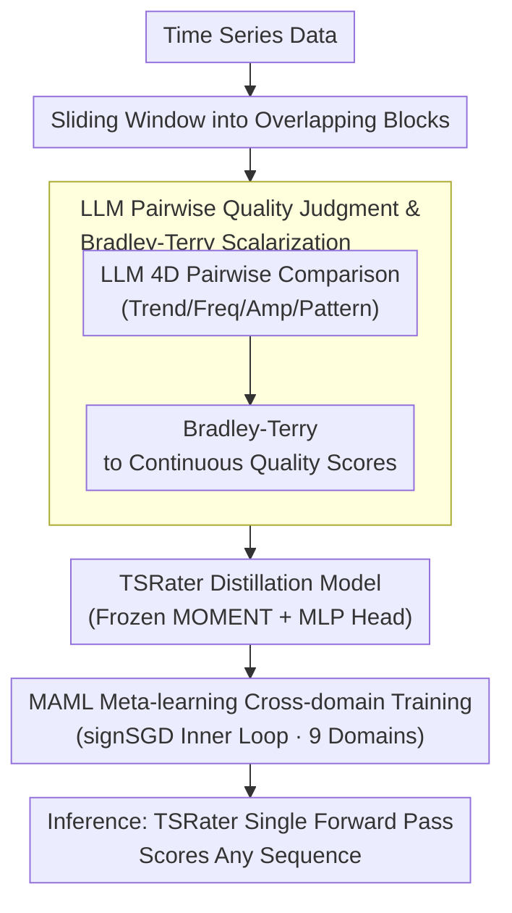

# Rating Quality of Diverse Time Series Data by Meta-learning from LLM Judgment

## TL;DR

Ours proposes the TSRating framework, which utilizes LLMs to perform pairwise quality comparisons of time series (TS) data blocks across four dimensions: trend, frequency, amplitude, and pattern. These comparisons are converted into scalar quality scores using the Bradley-Terry model. A TSRater model (comprising a MOMENT encoder and an MLP) is then trained via MAML meta-learning across 22 subsets in 9 domains, achieving efficient and unified cross-domain TS data quality assessment.

## Background & Motivation

**Importance of TS Data Quality**: Whether fine-tuning LLMs for TS tasks or training TS foundation models from scratch, data quality is a critical bottleneck for performance. Real-world data is often plagued by missing values, sensor failures, and irregular sampling.

**Domain Limitations of Existing Methods**: TimeInf adapts influence functions to TS data, and TimeShap extends Shapley values to TS—but both are effective only within a single domain, ignoring the fact that real TS data spans vastly different fields such as healthcare, finance, meteorology, and industry.

**Computational Efficiency**: Influence functions require expensive Hessian and gradient calculations, while Shapley values face exponential combinatorial costs. Both categories of methods struggle to balance efficiency and accuracy, and repeated per-domain computation is prohibitively expensive.

**Inspiration from LLM Success in Text Quality Assessment**: Works like Qurating and Ask-LLM have verified that LLMs can accurately evaluate text quality via prompting. Large-scale pre-training likely equips LLMs with rich cross-domain TS knowledge—can this capability be transferred to TS quality assessment?

**Core Problem**: Do LLMs truly understand the key features of TS quality? How can LLMs be effectively guided to distinguish between high and low-quality TS data? How can LLM judgment be efficiently distilled into a lightweight model for large-scale deployment?

**Goal**: Construct a unified cross-domain TS data quality assessment framework that simultaneously addresses challenges in accuracy, efficiency, and generalization.

## Method

### Overall Architecture

TSRating decomposes "LLM quality judgment" and "large-scale scoring by lightweight models" into a pipeline: first, use a sliding window to cut time series into overlapping blocks; let the LLM perform pairwise comparisons across four dimensions (trend, frequency, amplitude, pattern); then convert these preferences into continuous quality scores using the Bradley-Terry model to serve as supervision for distilling a TSRater (with a frozen MOMENT encoder and an MLP head); finally, use MAML meta-learning across nine domains with signSGD in the inner loop. During inference, the LLM is bypassed, and a single forward pass of the TSRater scores any time series.

### Key Designs

**1. LLM Pairwise Quality Judgment & Bradley-Terry Scalarization: Transforming "Which is Better" into Supervised Continuous Scores**

LLMs are poor at direct absolute scoring but excel at binary choices. For each pair of blocks $\mathbf{B}_i, \mathbf{B}_j$, pairwise comparisons are performed across four dimensions, repeating $M$ times to obtain confidence $p_{i \succ j} = \frac{1}{M} \sum_{k=1}^{M} m_{i \succ j}^{(k)}$ to mitigate randomness. To eliminate position bias, the order of blocks in the prompt is swapped and the results averaged. For multivariate sequences, channel-wise evaluation is averaged: $s(\mathbf{B}_i) = \frac{1}{D} \sum_{d=1}^{D} s(\mathbf{B}_i^d)$. To train a scoring model, the Bradley-Terry assumption $p_{i \succ j} = \sigma(s(\mathbf{B}_i) - s(\mathbf{B}_j))$ links preference probability to the difference in scalar scores, fitting the comparisons via maximum likelihood:

$$\mathcal{P} = \sum_{(\mathbf{B}_i, \mathbf{B}_j, p_{i \succ j}) \in \mathcal{J}} \left[ p_{i \succ j} \log \sigma(s(\mathbf{B}_i) - s(\mathbf{B}_j)) + (1-p_{i \succ j}) \log \sigma(s(\mathbf{B}_j) - s(\mathbf{B}_i)) \right]$$

This design was validated on synthetic data, achieving recognition accuracies of 94.5%, 92.25%, 98.75%, and 95.75% for trend, frequency, amplitude, and pattern, respectively, proving that LLMs capture key TS attributes.

**2. TSRater Distillation Model: Compressing $O(n^2)$ API Calls into a Single Forward Pass**

Directly using LLMs for large-scale scoring is impractical due to quadratic API costs. TSRating distills LLM judgments into a lightweight model. TSRater uses the MOMENT foundation model (~109M parameters) as a frozen encoder to extract features, followed by a 3-layer MLP (hidden dimension 256, with LayerNorm, ReLU, and residual connections) to output scalar scores. The model is trained to replicate LLM pairwise preferences using binary cross-entropy:

$$\mathcal{L}_\theta = \mathbb{E}_{(\mathbf{B}_i, \mathbf{B}_j, p_{i \succ j}) \in \mathcal{J}} \left[ -p_{i \succ j} \log \sigma(s_\theta(\mathbf{B}_i) - s_\theta(\mathbf{B}_j)) - (1-p_{i \succ j}) \log \sigma(s_\theta(\mathbf{B}_j) - s_\theta(\mathbf{B}_i)) \right]$$

Post-training, scoring requires only a single TSRater forward pass. Block-level scores aggregate bottom-up: point-level scores average all blocks covering that point $s(x_i) = \frac{1}{|B(x)|} \sum_{\mathbf{B}_k \in B(x)} s(\mathbf{B}_k)$, and sample-level scores average all time points $s(\mathbf{S}) = \frac{1}{T} \sum_{i=1}^{T} s(x_i)$.

**3. MAML Meta-learning: One Scorer Adapting to All Domains**

Training per-domain scorers is expensive. TSRating sets "fast adaptation to new domains" as the goal. It selects 22 subsets from nine domains (Energy, Retail, Finance, Health, etc.) in the Time-300B corpus. The objective optimizes the query set loss after a single inner-loop update:

$$\min_\theta \sum_{\mathcal{T}_i \sim \mathcal{T}} \mathcal{L}_{\mathcal{T}_i}^{\text{query}} \left( \theta - \alpha \cdot \text{sign}(\nabla_\theta \mathcal{L}_{\mathcal{T}_i}^{\text{support}}(\theta)) \right)$$

Key Insight: The inner loop uses signSGD instead of standard GD, taking only the gradient sign $\text{sign}(\cdot)$. This avoids second-order derivatives (hypergradients) for the meta-objective, making training faster and more stable.

## Key Experimental Results

### Table 1: Main Results (3 Tasks × 3 Models × 11 Datasets)

| Model | Method | Long-term Forecasting RMSE (Avg of 4) | Short-term Forecasting MAPE (Avg of 3) | Classification Accuracy (Avg of 4) |
|------|------|------------------|------------------|--------------|
| Linear | Random | 0.900 | 1.528 | 0.291 |
| Linear | TimeInf | 0.722 | 1.536 | 0.323 |
| Linear | **TSRating** | **0.740** | **1.366** | **0.344** |
| CNN | Random | 1.085 | 1.550 | 0.449 |
| CNN | TimeInf | 1.077 | 1.503 | 0.455 |
| CNN | **TSRating** | **1.026** | **1.322** | **0.494** |
| PatchTST | Random | 0.366 | 2.725 | 0.408 |
| PatchTST | TimeInf | 0.374 | 2.690 | 0.406 |
| PatchTST | **TSRating** | **0.357** | **2.574** | **0.444** |

TSRating significantly leads in the ratio of achieving best/second-best across 36 evaluation cases.

### Table 2: Runtime Comparison

| Method | Time (Seconds) | Notes |
|------|---------|------|
| DataShapley | 210,000 | Extremely slow |
| KNNShapley | 152 | Fast but poor accuracy |
| DataOob | 4,785 | — |
| TimeInf | 4,938 | — |
| **TSRater Total** | **4,687** | Incl. LLM judgment + Meta-training + Fine-tuning + Inference |
| — New Dataset Inference | **~200** | Meta-trained model is reusable |

Key Advantage: The meta-trained model is reusable; adaptation to a new dataset takes only ~200s.

### Table 3: Ablation Study on Meta-learning Generalization (Electricity Dataset)

| Method | Linear | CNN | PatchTST | iTransformer | TimeMixer |
|------|--------|-----|----------|-------------|-----------|
| Meta-rater | 1.390 | 1.511 | 0.397 | 0.300 | 0.345 |
| Per-domain (In-domain) | 1.471 | 1.497 | 0.398 | 0.306 | 0.332 |
| Per-domain (Cross-domain) | 1.556 | 1.602 | 0.418 | 0.310 | 0.382 |

Meta-rater matches or exceeds per-domain training performance and far outperforms direct cross-domain transfer.

## Key Findings

1.  **LLMs truly understand TS quality**: Accuracy in synthetic experiments reached 92-99%, and visualizations on real data align with human intuition.
2.  **Quality assessment generalizes**: Meta-rater matches or exceeds domain-specific raters on unseen datasets with only few-shot adaptation.
3.  **High-quality data > Total data**: TS foundation models (Time-MoE, Time-LLM) fine-tuned on the top-50% data selected by TSRating achieve lower MSE than those using all data.
4.  **Effective data pruning**: Removing samples by descending quality score causes the fastest performance drop in TSRating compared to baselines.
5.  **Multi-dimensional fusion is superior**: Single dimensions vary in performance (e.g., amplitude is best on Weather but worst on Traffic); four-dimensional fusion is consistently strong.
6.  **Encoder robustness**: MOMENT, Chronos, and TimeGPT encoders yield comparable performance, suggesting gains come from LLM supervision rather than specific encoders.

## Highlights & Insights

- **First systematic validation of LLM-as-judge in TS**: Innovation lies in transferring the LLM-as-judge paradigm to TS with a 4-dimensional prompt covering fundamental TS properties.
- **Knowledge Distillation Paradigm**: LLM pairwise judgment → Bradley-Terry scalarization → MLP distillation converts expensive API calls into a low-cost, high-efficiency rater.
- **Clever Use of signSGD**: Replacing standard gradients with signSGD in the MAML inner loop skips second-order derivative calculations, significantly reducing meta-learning overhead.

## Limitations

- Dependency on LLM quality—different LLMs (GPT-4o-mini vs. Claude) show variations in judgment.
- Completeness of the 4 dimensions—factors like distribution shift or label noise are not explicitly included.
- Frozen MOMENT encoder—its representation quality serves as an upper bound for the TSRater.
- Task coverage—evaluation focused on prediction and classification; anomaly detection was only briefly explored.
- Fixed top-50% selection—adaptive threshold strategies were not explored.

## Related Work & Insights

### vs TimeInf (Zhang et al., 2024b)
TimeInf adapts influence functions to TS but: (1) requires per-domain Hessian/gradient calculation (~4938s); (2) lacks cross-domain portability. TSRating achieves new domain adaptation in ~200s via meta-learning.

### vs DataShapley (Ghorbani & Zou, 2019)
DataShapley uses game theory but is: (1) computationally prohibitive (~210,000s); (2) ignores temporal dependencies. TSRating is over 45x faster and incorporates temporal understanding.

### vs Qurating (Wettig et al., 2024)
Qurating pioneered LLM-as-judge for text. Ours extends this to TS by designing domain-specific prompts, utilizing the Bradley-Terry model for scalarization, and ensuring cross-domain generalization via meta-learning.

## Rating

- **Novelty**: ⭐⭐⭐⭐⭐
- **Experimental Thoroughness**: ⭐⭐⭐⭐⭐
- **Writing Quality**: ⭐⭐⭐⭐
- **Value**: ⭐⭐⭐⭐

<!-- RELATED:START -->

## Related Papers

- [\[ICLR 2026\] SciTS: Scientific Time Series Understanding and Generation with LLMs](scits_scientific_time_series_understanding_and_generation_with_llms.md)
- [\[AAAI 2026\] Finding Time Series Anomalies using Granular-ball Vector Data Description](../../AAAI2026/time_series/finding_time_series_anomalies_using_granular-ball_vector_data_description.md)
- [\[ICLR 2026\] SwiftTS: A Swift Selection Framework for Time Series Pre-trained Models via Multi-task Meta-Learning](swiftts_a_swift_selection_framework_for_time_series_pre-trained_models_via_multi.md)
- [\[ICLR 2026\] MMPD: Diverse Time Series Forecasting via Multi-Mode Patch Diffusion Loss](mmpd_diverse_time_series_forecasting_via_multi-mode_patch_diffusion_loss.md)
- [\[ICLR 2026\] AutoDA-Timeseries: Automated Data Augmentation for Time Series](autoda-timeseries_automated_data_augmentation_for_time_series.md)

<!-- RELATED:END -->
