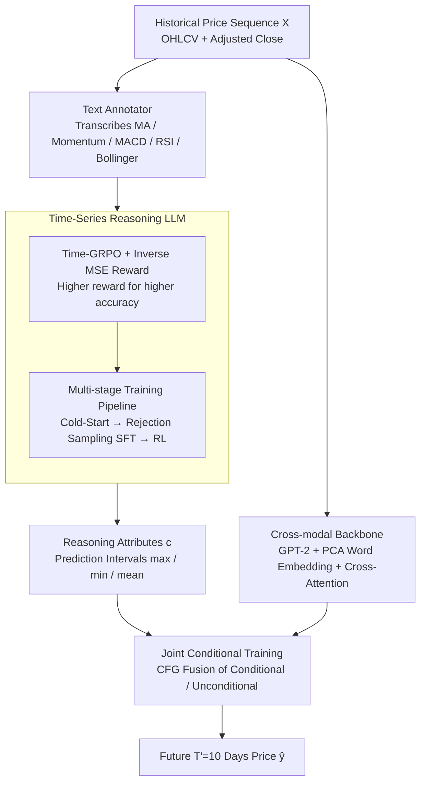

# Reasoning on Time-Series for Financial Technical Analysis

**Conference**: ICLR2026  
**arXiv**: [2511.08616](https://arxiv.org/abs/2511.08616)  
**Code**: [chen-jan/VTA](https://github.com/chen-jan/VTA)  
**Area**: Time Series  
**Keywords**: Time-series reasoning, financial technical analysis, Reinforcement Learning, LLM fine-tuning, interpretable forecasting  
**Authors**: Kelvin J.L. Koa, Jan Chen, Yunshan Ma, Huanhuan Zheng, Tat-Seng Chua (NUS, TUM, SMU, CityU HK)

---

## TL;DR

This paper proposes the Verbal Technical Analysis (VTA) framework, which combines the linguistic reasoning capabilities of LLMs with the pattern-capturing abilities of time-series models. By optimizing the reasoning chain through Time-GRPO reinforcement learning and conditioning time-series forecasting on reasoning attributes, the framework achieves financial time-series prediction that is both accurate and interpretable.

---

## Background & Motivation

**LLM Limitations in Finance**: Existing financial LLMs primarily analyze textual reports (earnings Q&A, sentiment analysis) but neglect interpretable analysis of historical price data, namely Technical Analysis, which is crucial for trading practitioners.

**LLM Deficiency in Time-Series Reasoning**: Prior research (Merrill et al., 2024) indicates that LLMs are "remarkably bad" at zero-shot time-series reasoning, performing poorly when raw time-series data is directly input.

**Sacrifice of Interpretability in Time-Series LLMs**: Methods like Time-LLM and CALF output time-series forecasts by modifying the embedding space, causing the LLM to lose its natural language reasoning capabilities and fail to provide interpretable analysis.

**Inadequacy of Existing Interpretable Solutions**: The most closely related work, TimeCAP, only produces classification label predictions rather than full time-series trajectories, and its reasoning relies on external auxiliary data rather than endogenous signals.

**Cross-Domain Challenges**: The task requires switching between two domains—the input/output are in the time-series domain (stock prices), while the reasoning process is in the natural language domain, increasing modeling difficulty.

**Intrinsic Interpretable Signals in Financial Time-Series**: Unlike general time-series, financial data contains numerous expert-researched technical indicators (MACD, RSI, Bollinger Bands, etc.), providing natural anchors for verbalized reasoning.

---

## Method

### Overall Architecture

VTA (Verbal Technical Analysis) decomposes financial time-series forecasting into three steps: verbal reasoning, time-series backbone forecasting, and conditioning the forecast on the reasoning. This corresponds to three components: using an LLM for linguistic reasoning on text-annotated time-series (Time-Series Reasoning), using a GPT-2 backbone to capture underlying price patterns (Time-Series Forecasting), and joint conditional training that injects attributes extracted from reasoning into the backbone (Joint Conditional Training). Formally, given an input of $T$ historical trading days $\mathbf{X} = \{\mathbf{x}_{t-T+1}, \ldots, \mathbf{x}_t\}$ (where $\mathbf{x}_t = [o_t, h_t, l_t, v_t, c_t, p_t]$ represents OHLCV and adjusted closing price), the model simultaneously produces a linguistic reasoning trajectory $\mathbf{v}$ and future $T'$ days of prices $\mathbf{y} = \{p_{t+1}, \ldots, p_{t+T'}\}$. Experiments focus on a short-term scenario where $T = T' = 10$. The pipeline flow is as follows: historical prices are first transcribed by a text annotator into technical indicator language for the LLM; the same historical prices enter a GPT-2 backbone; finally, attributes distilled from reasoning are fused with backbone features during joint conditional training to output future prices.

### Key Designs

**1. Time-GRPO and Inverse MSE Reward: Driving Reasoning Optimization via Prediction Accuracy**

LLMs perform poorly when reasoning directly on raw numbers. Thus, a text annotator first converts the sequence into textual annotations $\mathbf{X'} = \mathbf{f}(\mathbf{X})$, describing statistics (mean, extrema) and technical indicators (Moving Averages, Momentum, MACD, RSI, Bollinger Bands) in natural language to provide semantic anchors. Since no "gold standard reasoning" exists for supervision, VTA modifies GRPO (Group Relative Policy Optimization) into Time-GRPO with the objective $\mathcal{L}_{\text{time-grpo}}(\theta) = \mathbb{E}_{\mathbf{q} \sim \mathcal{Q}} \frac{1}{G} \sum_{i=1}^{G} \left( \min\left(\frac{\pi_\theta(\mathbf{o_i}|\mathbf{q})}{\pi_{\theta_{\text{old}}}(\mathbf{o_i}|\mathbf{q})} A_i, \text{clip}(\cdot, 1{-}\epsilon, 1{+}\epsilon) A_i \right) - \beta \mathbb{D}_{\text{KL}}(\pi_\theta \| \pi_{\text{ref}}) \right)$. The key modification is that the reward does not rely on manual reasoning labels but uses an inverse MSE: $r_{\text{MSE}}(\theta) = \frac{1}{\lambda \cdot \|\hat{\mathbf{y}}_\theta - \mathbf{y}\|_2^2}$. As RL maximizes the reward, and smaller MSE implies better accuracy, "accuracy" becomes equivalent to "high reward." This compels the reasoning chain to evolve in a direction that improves forecasting precision without human-labeled ground truth reasoning.

**2. Multi-stage Training Pipeline: Stabilizing Incremental Reasoning Capabilities**

Running RL directly on a base model yields minimal gains (~1.6%) because the base model lacks initial reasoning structure. VTA stabilizes training via three stages: First, a Cold-Start stage runs one round of Time-GRPO to generate initial reasoning samples despite stagnant performance. Second, Rejection Sampling + SFT is performed, where samples are bucketed by stock and period, retaining only those in the top 10% (lowest decile) of MSE as high-quality trajectories for supervised fine-tuning. This teaches the model "what good reasoning looks like." Finally, another round of Time-GRPO is conducted on the SFT model to search for optimal strategies. The total improvement reaches 20.3% with this pipeline, significantly higher than pure Cold-Start RL.

**3. Cross-modal Backbone: Aligning Time-Series to Language Space via GPT-2**

The forecasting branch performs cross-modal fine-tuning on GPT-2 to leverage the representation power of pre-trained language models for time-series. Input sequences are projected into time tokens $\mathbf{X}_{\text{time}}$ via Embedding and Multi-head Attention. To conserve computation, VTA performs PCA on the LLM word embeddings to obtain the principal components $\hat{\mathbf{D}}$. Multi-head Cross-Attention $\mathbf{X}_{\text{text}} = \text{Softmax}\left(\frac{\mathbf{Q}\mathbf{K}^\top}{\sqrt{C}}\right)\mathbf{V}$ aligns time tokens to the word embedding space. To prevent representation drift, layer-wise feature regularization is applied: $\mathcal{L}_{\text{feature}} = \sum_{n=1}^{N} \gamma^{(N-n)} \text{sim}\left(\phi_{\text{text}}^n(\mathbf{F}_{\text{text}}^n), \phi_{\text{time}}^n(\mathbf{F}_{\text{time}}^n)\right)$, where the exponential decay of $\gamma$ assigns higher weights to deeper layer alignment.

**4. Joint Conditional Training: Injecting Reasoning via Classifier-Free Guidance**

After generating reasoning and time-series features separately, descriptive attributes $\mathbf{c}$ (e.g., max, min, mean of the predicted interval) are extracted from the reasoning output. The forecasting objective is $\mathcal{L}_{\text{forecast}}(\phi) = \mathbb{E}_{\mathbf{X}, \mathbf{y}, \mathbf{c}} \left[\|\hat{\mathbf{y}}_\psi(\mathbf{X}, \tilde{\mathbf{c}}) - \mathbf{y}\|^2\right]$. Adopting the Classifier-Free Guidance (CFG) approach from diffusion models, the model parameterizes both conditional and unconditional paths using the same network. During training, $\mathbf{c}$ is randomly nullified with probability $p_{\text{uncond}}=0.3$. During inference, outputs are fused as $\hat{\mathbf{y}} = s \cdot \hat{\mathbf{y}}_\psi(\mathbf{X}, \mathbf{c}) + (1-s) \cdot \hat{\mathbf{y}}_\theta(\mathbf{X})$ with a guidance scale $s=0.1$. This ensures that even if reasoning is unreliable, the model can fall back on the time-series backbone.

---

## Key Experimental Results

### Main Results: Forecasting Performance Comparison

**Datasets**: ACL18 StockNet (88 US stocks, 2012-2017) + Dow Jones/China A50/EURO STOXX 50 (2024)

| Model | StockNet MSE | StockNet MAE | All MSE | All MAE |
|------|-------------|-------------|---------|---------|
| GPT-4o mini | 0.0846 | 0.1827 | 0.2014 | 0.2376 |
| DeepSeek-R1 | 0.0788 | 0.1853 | 0.1428 | 0.2323 |
| TimesNet | 0.0708 | 0.1789 | 0.1286 | 0.2229 |
| TimeLLM | 0.0704 | 0.1780 | 0.1262 | 0.2210 |
| CALF | 0.0674 | 0.1738 | 0.1235 | 0.2180 |
| **VTA (Ours)** | **0.0659** | **0.1701** | **0.1178** | **0.2122** |

VTA achieves the best MSE and MAE across all 4 datasets, with an overall MSE improvement of 4.6% and MAE improvement of 2.7%.

### Ablation Study: Contribution of Multi-stage Training

| Stage | Llama-3.1-8B MSE | Qwen-2.5-3B MSE | Qwen-2.5-7B MSE |
|------|-----------------|-----------------|-----------------|
| Base Model | 0.1482 | 0.1707 | 0.0949 |
| Cold Start (RL) | 0.1475 | 0.1648 | 0.0941 |
| SFT for Reasoning | 0.1168 | 0.1032 | 0.0893 |
| RL for Reasoning | 0.0955 | 0.0832 | 0.0686 |
| + Conditioning (VTA) | 0.0667 | 0.0672 | **0.0659** |

**Key Findings**:
- Cold-Start RL only yields a 1.6% (average) gain but provides the foundation for subsequent data.
- Applying RL after Rejection Sampling + SFT results in a 20.3% gain, validating the multi-stage pipeline.
- Conditioning the backbone model further reduces error, suggesting "external reasoning + internal patterns" are complementary.
- Qwen-2.5-7B performs best as a reasoning model, though the 3B model achieves near-parity after conditional training.

### Key Findings: Reasoning Quality

25 financial experts (from JPMorgan, UBS, Evercore, Allianz, etc.) performed blind evaluations of reasoning chains from VTA, GPT-4o mini, and DeepSeek-R1 on a 1-5 scale:

- **Depth, Accuracy, Relevance**: VTA leads significantly, reflecting its proficiency in technical indicators and reasoning.
- **Coherence, Clarity**: The gap is smaller, as general LLMs naturally possess high textual fluency.

### Key Findings: Portfolio Evaluation

| Model | Returns | Volatility | Max Drawdown | Sharpe Ratio |
|------|---------|-----------|-------------|-------------|
| TimeLLM | 0.2185 | 0.1193 | -0.1040 | 1.5230 |
| CALF | 0.2019 | 0.1247 | -0.0981 | 1.4566 |
| **VTA (Ours)** | **0.2409** | **0.1185** | **-0.0883** | **1.7190** |

VTA leads significantly in Sharpe Ratio (1.7190 vs. 1.5230), proving its practical utility in real investment scenarios.

---

## Highlights & Insights

1. **Elegant Cross-Domain Bridge**: Uses financial technical indicators as a bridge between time-series and language domains, overcoming LLMs' inability to handle raw time-series directly.
2. **Time-GRPO Design**: Employs inverse MSE as an RL reward to drive reasoning chain optimization via forecasting accuracy without manual reasoning labels.
3. **Multi-stage Pipeline**: Cold-Start → Rejection Sampling SFT → RL design ensures stable and efficient training.
4. **CFG Knowledge Transfer**: Adapts Classifier-Free Guidance from diffusion models for time-series conditioning, training conditional and unconditional paths simultaneously.
5. **Comprehensive Evaluation**: Includes prediction accuracy, expert qualitative scores, and Markowitz portfolio validation.

---

## Limitations & Future Work

1. **Financial Domain Specificity**: Cross-domain experiments (medical/energy) show VTA's superiority depends on technical indicators; it degrades to simple trend extrapolation for general data.
2. **Short-term Forecasting**: $T=T'=10$ covers only short-term trading; long-term effectiveness remains unverified.
3. **Alignment of Reasoning and Prediction**: Conditioning uses only simple attributes (max/min/mean); richer reasoning information (trend direction, indicator signals) is underutilized.
4. **Fixed Guidance Scale**: The $s=0.1$ scale suggests the model primarily relies on the backbone, with reasoning contributing a relatively low proportion.
5. **Computational Cost**: Multi-stage RL + LLM reasoning + backbone training is resource-intensive.

---

## Related Work & Insights

| Direction | Representative Work | Difference from VTA |
|------|---------|-------------|
| Financial LLMs | Fin-R1, FinMem, SEP | Analyze textual reports/news; do not process price time-series |
| Time-Series LLMs | Time-LLM, CALF | Modify embedding space; lose linguistic reasoning ability |
| Time-Series Reasoning | TimeCAP | Relies on external auxiliary data; produces only classification labels |
| LLM T-S Reasoning | Merrill et al. | Found poor zero-shot performance; VTA solves this via RL fine-tuning |
| Reasoning Optimization | DeepSeek-R1, GRPO | VTA adapts GRPO into Time-GRPO using inverse MSE rewards |

---

## Rating

- **Novelty**: ⭐⭐⭐⭐ — Novel combination of RL reasoning optimization (GRPO) with time-series and CFG-based conditioning.
- **Experimental Thoroughness**: ⭐⭐⭐⭐⭐ — Very comprehensive: 4 datasets, 14+ baselines, expert evaluation, and portfolio validation.
- **Writing Quality**: ⭐⭐⭐⭐ — Clear structure, strong motivation, and rich visualizations.
- **Value**: ⭐⭐⭐⭐ — Interpretable financial forecasting has direct value for practitioners; Sharpe Ratio validates investment potential.

<!-- RELATED:START -->

## Related Papers

- [\[ICLR 2026\] EDINET-Bench: Evaluating LLMs on Complex Financial Tasks using Japanese Financial Statements](edinet-bench_evaluating_llms_on_complex_financial_tasks_using_japanese_financial.md)
- [\[ICLR 2026\] TimeOmni-1: Incentivizing Complex Reasoning with Time Series in Large Language Models](timeomni-1_incentivizing_complex_reasoning_with_time_series_in_large_language_mo.md)
- [\[ICLR 2026\] TimeSeriesExamAgent: Creating Time Series Reasoning Benchmarks at Scale](timeseriesexamagent_creating_time_series_reasoning_benchmarks_at_scale.md)
- [\[ICLR 2026\] Characteristic Root Analysis and Regularization for Linear Time Series Forecasting](characteristic_root_analysis_and_regularization_for_linear_time_series_forecasti.md)
- [\[ACL 2026\] Time-RA: Towards Time Series Reasoning for Anomaly Diagnosis with LLM Feedback](../../ACL2026/time_series/time-ra_towards_time_series_reasoning_for_anomaly_diagnosis_with_llm_feedback.md)

<!-- RELATED:END -->
