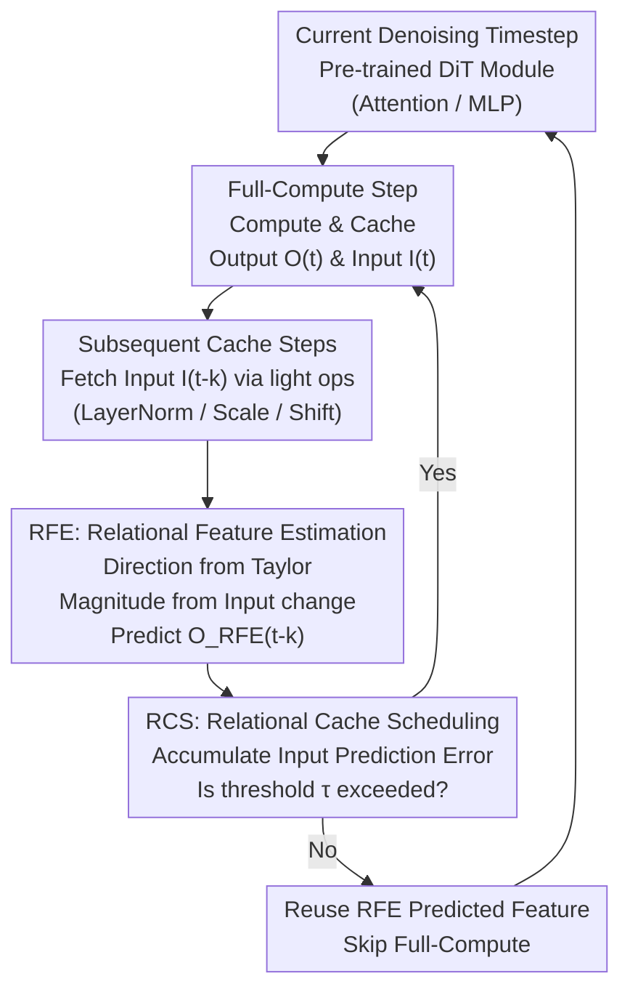

# Relational Feature Caching for Accelerating Diffusion Transformers

**Conference**: ICLR 2026  
**arXiv**: [2602.19506](https://arxiv.org/abs/2602.19506)  
**Code**: [Project Page](https://cvlab.yonsei.ac.kr/projects/RFC)  
**Area**: Diffusion Models / Inference Acceleration  
**Keywords**: Feature Caching, DiT Acceleration, Input-Output Relationship, Dynamic Scheduling, Prediction Accuracy

## TL;DR
The Relational Feature Caching (RFC) framework is proposed to enhance the precision of cached feature prediction by leveraging the strong correlation between input and output features of DiT modules. It includes Relational Feature Estimation (RFE) to estimate output change magnitudes from input changes and Relational Cache Scheduling (RCS) to trigger full computation using input errors as a proxy. RFC significantly outperforms existing temporal extrapolation-based caching methods in image and video generation tasks.

## Background & Motivation
- **Background**: Diffusion Transformers (DiT) show superior performance in text-to-image/video tasks but suffer from extreme inference costs due to expensive forward passes across many denoising timesteps. Feature caching methods exploit the high similarity of features between adjacent timesteps by performing full computation at certain steps and reusing or predicting features at others to skip redundant computation.
- **Limitations of Prior Work**: (1) Early caching methods (FORA, DeepCache) directly reuse cached features without adjustment, leading to error accumulation and quality degradation at large intervals; (2) Recent prediction-based methods (FasterCache via linear extrapolation, TaylorSeer via Taylor expansion) assume features evolve smoothly over time. In reality, **output feature change magnitudes are highly irregular across timesteps**, making pure temporal extrapolation inaccurate; (3) Fixed uniform caching schedules are suboptimal as they do not account for varying error rates across timesteps.
- **Key Challenge**: Temporal extrapolation-based methods struggle to capture the non-smoothness of output feature changes, while directly measuring output errors requires expensive full computation.
- **Goal**: Achieve more accurate cached feature prediction and dynamically determine full-compute steps without adding significant computational overhead.
- **Key Insight**: Detailed feature analysis reveals that **the input feature change and output feature change of the same module are highly correlated**. Furthermore, obtaining input features requires only lightweight operations (LayerNorm, scaling, shifting), which are essentially "free."
- **Core Idea**: Utilize the input-output relationship to enhance feature prediction: (1) use the magnitude of input change to estimate the magnitude of output change (RFE); (2) use input prediction error to estimate output prediction error to dynamically trigger full computation (RCS).

## Method

### Overall Architecture
Each denoising step of a Diffusion Transformer (DiT) requires an expensive forward pass. Feature caching aims to perform "Full-Compute" only at a few steps and reuse or predict features at "Cache Steps." Existing methods rely on temporal extrapolation (FORA via reuse, TaylorSeer via Taylor expansion), but since DiT output magnitudes are irregular over time, these suffer from poor prediction and error accumulation. Relational Feature Caching (RFC) breaks this by utilizing a "free" clue: **the change in output features of a module is highly correlated with the change in its input features**, where input features are computed via lightweight ops like LayerNorm, scaling, and shifting.

The workflow centers on this clue: during full-compute steps, the output $O(t)$ and input $I(t)$ are cached; for subsequent cache steps, Relational Feature Estimation (RFE) uses the current input change relative to the cache to calibrate the Taylor-based output prediction. Meanwhile, Relational Cache Scheduling (RCS) monitors the accumulation of input prediction error, triggering a full-compute and cache refresh once it exceeds a threshold. Both components only require additional reads of input features without any training.

### Key Designs

**1. RFE: Relational Feature Estimation: Using Input Change Magnitude to Rescue Taylor Extrapolation**

Pure temporal extrapolation fails because DiT output change magnitudes are irregular, violating the smoothness assumption of Taylor expansion. RFE solves this by observing a stable metric: the ratio of output change to input change $s_k(t-k) = \frac{\|\Delta_k O(t-k)\|_2}{\|\Delta_k I(t-k)\|_2}$ is nearly constant across timesteps (measured relative standard deviation is only ~2%). The paper provides theoretical support via local linearity (Proposition 1): if the mapping is locally linear $O = AI + b$ and the input change direction remains consistent within the interval $1 \leq k \leq N$, then $s_k(t-k) = \|A\,u_k(t-k)\|_2$ is a constant independent of $k$. These assumptions hold in diffusion models due to small adjacent feature changes and stable change directions.

RFE decomposes prediction into direction and magnitude: the direction is still derived from Taylor expansion, while the magnitude is scaled by the input change—using the ratio $s_N(t)$ from the most recent full-compute steps to approximate $s_k(t-k)$, thus $\|\Delta_k O(t-k)\| \approx s_N(t)\,\|\Delta_k I(t-k)\|_2$. The final prediction for a cache step is:

$$O_{\text{RFE}}(t-k) = O(t) + \big(s_N(t)\|\Delta_k I(t-k)\|_2\big) \cdot g\!\left(\sum_{i=1}^{m}\frac{k^i}{i!}\frac{\Delta_N^i O(t)}{N^i}\right),$$

where $g(\cdot)$ is the L2 normalization function, reducing the Taylor term to a unit direction vector, while the scalar handles the magnitude. This is effective because input features must be computed anyway (at low cost), providing a reliable anchor for "how much has changed."

**2. RCS: Relational Cache Scheduling: Using Input Prediction Error as a Proxy for Dynamic Scheduling**

Even with RFE, residuals exist and fluctuate. A fixed uniform interval $N$ is suboptimal. An ideal schedule triggers full-compute when "output prediction error is high," but output error cannot be measured without the full-compute itself. RCS bypasses this by measuring error on the input side—the authors found that input error trends align closely with output error (Fig. 2b). Specifically, the normalized input prediction error is defined as $\mathcal{E}_I(t-k) = \frac{\|E_I(t-k)\|_1}{\|I(t-k)\|_1}$, where $E_I(t-k) = I(t-k) - I_{\text{Taylor}}(t-k)$. When the accumulated error $\sum_{j=1}^{k} \mathcal{E}_I(t-j) > \tau$, a full-compute is triggered. Threshold $\tau$ controls the quality-efficiency trade-off. Monitoring only the first module is sufficient (Table 6), making scheduling overhead negligible.

### Loss & Training
RFC is a **training-free** inference acceleration framework. It requires no additional training or fine-tuning and is applied directly to pre-trained DiT models. The only parameter to set is the RCS threshold $\tau$ (often adjusted to match the number of full computations (NFC) for fair comparison). The Taylor order $m$ is typically 1 or 2.

## Key Experimental Results

### Main Results

**Class-Conditional Image Generation (DiT-XL/2, ImageNet)**:

| Method | NFC | FLOPs(T) | FID↓ | sFID↓ | FID2FC↓ | sFID2FC↓ |
|------|-----|----------|------|-------|---------|----------|
| Full-Compute | 50 | 23.74 | 2.32 | 4.32 | - | - |
| TaylorSeer (N=4) | 14 | 6.66 | 2.55 | 5.30 | 0.44 | 2.17 |
| **RFC (m=2)** | 14.01 | 6.67 | **2.52** | **4.60** | **0.30** | **1.33** |
| TaylorSeer (N=7) | 8 | 3.82 | 3.46 | 6.97 | 1.30 | 5.61 |
| **RFC (m=2)** | 8.02 | 3.83 | **3.12** | **5.07** | **0.81** | **3.10** |
| TaylorSeer (N=9) | 7 | 3.35 | 4.90 | 7.92 | 2.33 | 7.35 |
| **RFC (m=2)** | 7.04 | 3.37 | **3.40** | **5.21** | **1.03** | **3.66** |

**Text-to-Image Generation (FLUX.1 dev, DrawBench)**:

| Method | NFC | FLOPs(T) | PSNR↑ | SSIM↑ | LPIPS↓ | IR↑ |
|------|-----|----------|-------|-------|--------|-----|
| Full-Compute | 50 | 2813.50 | - | - | - | 0.9655 |
| TaylorSeer (N=4,m=2) | 14 | 788.59 | 19.77 | 0.771 | 0.318 | 0.941 |
| **RFC (m=2)** | 13.80 | 777.44 | **20.35** | **0.793** | **0.295** | **0.950** |
| TaylorSeer (N=9,m=2) | 8 | 451.10 | 16.55 | 0.656 | 0.533 | 0.800 |
| **RFC (m=2)** | 8.03 | 452.91 | **16.92** | **0.694** | **0.471** | **0.919** |

**Text-to-Video Generation (HunyuanVideo, VBench)**:

| Method | NFC | FLOPs(T) | PSNR↑ | SSIM↑ | LPIPS↓ | VBench↑ |
|------|-----|----------|-------|-------|--------|---------|
| Full-Compute | 50 | 7520.00 | - | - | - | 81.40 |
| TaylorSeer (N=6,m=1) | 9 | 1359.19 | 15.53 | 0.461 | 0.245 | 79.52 |
| **RFC (m=1)** | 8.96 | 1354.65 | **18.54** | **0.635** | **0.133** | **80.83** |
| TaylorSeer (N=8,m=1) | 7 | 1058.45 | 15.20 | 0.441 | 0.262 | 79.59 |
| **RFC (m=1)** | 7.09 | 1072.65 | **18.25** | **0.616** | **0.144** | **80.49** |

### Ablation Study

**Component Ablation (DiT-XL/2, m=1)**:

| Method | NFC | FID↓ | sFID↓ | FID2FC↓ | sFID2FC↓ |
|------|-----|------|-------|---------|----------|
| TaylorSeer | 14 | 2.65 | 5.60 | 0.57 | 2.77 |
| +RFE | 14 | 2.52 | 5.18 | 0.43 | 2.02 |
| +RCS | 14 | 2.52 | 4.76 | 0.36 | 1.88 |
| **RFC (RFE+RCS)** | 14 | **2.51** | **4.66** | **0.31** | **1.41** |

**RFE vs. Other Magnitude Estimation Strategies (NFC=14)**:

| Method | FID2FC↓ | sFID2FC↓ |
|------|---------|----------|
| Linear (FasterCache) | 0.73 | 3.40 |
| w(t)=0.8 | 0.73 | 3.36 |
| w(t)=1.0 (TaylorSeer) | 0.57 | 2.77 |
| **RFE** | **0.43** | **2.02** |

### Key Findings
- RFC outperforms existing methods across all compute budgets; the **advantage grows as computation becomes more constrained**: e.g., at N=9, RFC (3.37 TFLOPs) beats TaylorSeer at N=6 (4.76 TFLOPs) in sFID.
- Performance gains are particularly striking in video generation: RFC improves PSNR from 15.53 to 18.54 (+3 dB) and nearly halves LPIPS from 0.245 to 0.133, with VBench scores approaching full-compute levels.
- RFE and RCS are complementary: each independently improves upon TaylorSeer, and their combination yields the best results.
- The stability of the $s_k(t-k)$ ratio (2% relative std dev) validates the input-output relational assumption.
- Monitoring only the first module for input error is sufficient for RCS scheduling.

## Highlights & Insights
- **Profound yet Simple Insight**: Irregular output changes are highly correlated with input changes. The decoupling of Taylor prediction into "direction" and "magnitude" (using input to anchor magnitude) is an elegant design.
- **Training-Free Plug-and-Play**: RFC requires no fine-tuning and can be applied to any pre-trained DiT. The overhead of fetching input features is negligible, making it deployment-friendly.
- **Clever Proxy for Dynamic Scheduling**: Using input prediction error as a proxy for output error avoids the circular dependency of needing full computation to measure error, while keeping overhead minimal.

## Limitations & Future Work
- **Global Scalar Limitation**: $s_k(t-k)$ is a single global scalar applied to all tokens. Fine-grained (per-token or per-channel) ratios might further improve precision.
- **Manual Threshold $\tau$**: The threshold for RCS still requires adjustment based on the model and task. Automating optimal threshold selection remains an open problem.
- **Architecture Generalization**: Analysis focused on DiT; applicability to other architectures like U-Net has not yet been verified.
- **Returns on Taylor Order**: Higher-order Taylor expansions (m>2) show diminishing returns, indicating that magnitude estimation—which RFC addresses—is the primary bottleneck.

## Related Work & Insights
- **vs. TaylorSeer**: TaylorSeer relies solely on temporal extrapolation and fails during irregular feature shifts. RFC calibrates the **magnitude** of Taylor predictions using the input-output relationship.
- **vs. FORA**: FORA's direct reuse leads to catastrophic degradation at large intervals (FID jumps to 12.63 at N=7). RFC maintains high quality even at NFC=7.
- **vs. FasterCache/GOC**: Linear methods use fixed or simplistic scaling. RFC’s dynamic $s_N(t)$ provides better adaptability.
- **vs. TeaCache**: TeaCache also uses input features for scheduling but compares simple input distance and requires calibration. RFC’s RCS uses input **prediction error**, which is better suited for forecasting-based caching.

## Rating
- Novelty: ⭐⭐⭐⭐ Simple yet effective use of input-output relations for cache correction; clever direction-magnitude decoupling.
- Experimental Thoroughness: ⭐⭐⭐⭐⭐ Covers image, text-to-image, and text-to-video; extensive metrics and baselines.
- Writing Quality: ⭐⭐⭐⭐ Clear flow from observation to theory to implementation.
- Value: ⭐⭐⭐⭐ 5-6x compute savings while maintaining quality makes it highly valuable for DiT deployment.

<!-- RELATED:START -->

## Related Papers

- [\[ICLR 2026\] Relational Transformer: Toward Zero-Shot Foundation Models for Relational Data](relational_transformer_toward_zero-shot_foundation_models_for_relational_data.md)
- [\[ICLR 2026\] Online Time Series Prediction Using Feature Adjustment](online_time_series_prediction_using_feature_adjustment.md)
- [\[NeurIPS 2025\] Diffusion Transformers as Open-World Spatiotemporal Foundation Models](../../NeurIPS2025/time_series/diffusion_transformers_as_open-world_spatiotemporal_foundation_models.md)
- [\[ICLR 2026\] CPiRi: Channel Permutation-Invariant Relational Interaction for Multivariate Time Series Forecasting](cpiri_channel_permutation-invariant_relational_interaction_for_multivariate_time_se.md)
- [\[ICLR 2026\] Understanding Transformers in Time Series Forecasting: A Case Study on MOIRAI](understanding_transformers_for_time_series_forecasting_a_case_study_on_moirai.md)

<!-- RELATED:END -->
