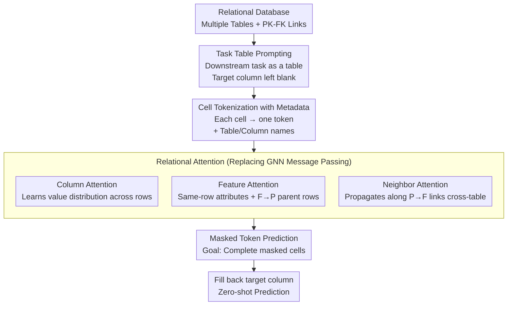

# Relational Transformer: Toward Zero-Shot Foundation Models for Relational Data

**Conference**: ICLR 2026  
**arXiv**: [2510.06377](https://arxiv.org/abs/2510.06377)  
**Code**: [snap-stanford/relational-transformer](https://github.com/snap-stanford/relational-transformer)  
**Area**: Relational Data Modeling / Foundation Models  
**Keywords**: Relational Databases, Zero-Shot Learning, Transformer, Foundation Models, Relational Attention

## TL;DR
The paper proposes the Relational Transformer (RT) architecture. Through task table prompting, cell tokenization, and Relational Attention mechanisms, the model can be pre-trained on multiple relational databases and transferred zero-shot to unseen datasets and tasks. A 22M parameter model achieves a zero-shot AUROC of 93% compared to fully supervised methods, significantly outperforming a 27B LLM (84%).

## Background & Motivation
Pre-trained Transformers in sequence modeling can easily adapt to new tasks via zero-shot prompting, but the relational data domain lacks architectures capable of cross-dataset and cross-task transfer. The **Key Challenge** lies in the diversity of relational data: heterogeneous schemas, graph structures, and functional dependencies make it difficult to design a universal architecture. Existing methods are usually trained for a single dataset and cannot be directly applied to unseen databases. While Large Language Models exhibit some generalization, they lack sufficient understanding of structured relational data (a 27B LLM reaches only 84% AUROC). The **Core Idea** of this paper is to build a universal architecture for relational data that allows for pre-training and zero-shot transfer, similar to foundation models in the text domain.

## Method

### Overall Architecture
Ours aims to establish a universal skeleton for relational databases that enables zero-shot transfer across datasets and tasks, analogous to NLP/CV models. The input consists of an entire relational database (multiple tables + primary-foreign key links) and a "task table" declaring the downstream task with the target column left blank. RT first encodes every cell in the database, along with its table and column names, into a token. It then propagates information along three dimensions—columns, rows, and primary-foreign key links—using Relational Attention, supplemented by standard self-attention for unconstrained global interaction. Finally, it performs masked token prediction on the blank spaces in the task table to "fill in" the answers. This process requires no task-specific heads or in-context examples, allowing a pre-trained model to be applied directly to new tasks in unseen databases.

### Key Designs

**1. Task Table Prompting: Encoding the target as a table**

The difficulty of zero-shot in relational data lies in the vast differences between tasks. Traditional methods attach a prediction head or retrieve in-context examples for each task. RT borrows the prompting concept from NLP and encodes the task as a "task table" containing the IDs of target entities and an empty target column (e.g., churn labels). The model fills these blanks based on the context of other tables. Unlike few-shot learning, the task rows provide "in-context labels" without requiring explicit subgraph-label pairs. This unifies different tasks—such as churn prediction or sales forecasting—into a "task table completion" format, enabling zero-shot transfer without fine-tuning or example selection.

**2. Cell Tokenization with Metadata: Integrating structure into tokens**

Serializing table rows as text (XML/JSON/CSV) for LLMs loses structural info like "which table/column this value belongs to," which is critical for relational data. RT treats each cell as an independent token. Its embedding consists of two parts: a trainable value encoding specialized by data type (numeric/text/time) and frozen language model embeddings of the table and column names. This cell-level granularity allows all downstream tasks to be unified as masked token prediction and enables the model to distinguish columns with the same name in different tables during attention calculation.

**3. Relational Attention: Structured attention patterns**

Standard Transformers calculate attention on 1D sequences, failing to capture 2D table structures and cross-table links. RT innovates by allowing each cell token to perform attention along three relational patterns: **Column Attention** across different rows in the same column to learn value distributions; **Feature Attention** between columns of the same row and along F→P links to parent rows to mix attributes of an entity and its parents; and **Neighbor Attention** along P→F links to child rows for cross-table aggregation. Standard self-attention is then stacked for global interaction. This flow allows GNN-like relational modeling at the cell level while leveraging mature Transformer training mechanisms.

**4. Masked Token Prediction Pre-training: Self-supervision for universal representations**

To instill universal relational inductive biases, RT uses masked token prediction. Similar to BERT's MLM, it masks and predicts cell tokens. Because all tasks are unified as cell tokens, this self-supervised objective covers both prediction and completion tasks. Pre-training is conducted across multiple heterogeneous RelBench datasets, forcing the model to recover hidden values from contextual cells and thus learning cross-schema featured representations—the foundation for zero-shot capability on unseen datasets.

### Loss & Training
The process involves three stages: joint **Pre-training** on multiple RelBench datasets using a leave-one-out strategy to ensure the target database is unseen (achieving ~90.3% of supervised AUROC); **Continued Pre-training** on the target dataset (without the target task) to adapt to the new distribution (~93.1%); and finally, **Fine-tuning** on the target task, which demonstrates high sample efficiency. Despite having only 22M parameters, RT rivals a 27B LLM in zero-shot settings, proving that inductive biases matching data characteristics are more effective than simple parameter scaling.

## Key Experimental Results

### Main Results

| Method | Metric | Zero-shot Result | Description |
|------|------|-----------|------|
| RT (22M, Zero-shot) | Binary AUROC | 93% of Supervised | Single forward pass |
| 27B LLM (Zero-shot) | Binary AUROC | 84% of Supervised | Outperformed by RT |
| RT (Fine-tuned) | Binary AUROC | SOTA | High sample efficiency |

### Key Findings
- RT zero-shot performance averages 93% of fully supervised AUROC with a single forward pass.
- Compared to a 27B parameter LLM, the 22M RT is 9 percentage points higher in zero-shot settings.
- Fine-tuning achieves SOTA results with high sample efficiency.
- Ablation shows that zero-shot transfer relies on the synergy of task context, Relational Attention patterns, and schema semantics.

### Ablation Study

| Configuration | Description |
|------|------|
| No Relational Attention | Significant performance drop, proving the importance of structured attention. |
| No Task Table Prompting | Inability to perform zero-shot inference. |
| No Metadata | Cell tokens lack structural context, leading to performance degradation. |
| Pre-training Data Quantity | More datasets lead to better generalization. |

## Highlights & Insights
- **Exquisite Architecture**: Relational Attention models relationships across columns, rows, and PK-FK links, perfectly fitting the structural properties of relational databases.
- **Incredible Efficiency**: A small 22M parameter model significantly outperforms a 27B LLM in zero-shot settings, demonstrating that inductive biases for specific data types are more efficient than brute-force scaling.
- **Task Table Prompting is a Key Innovation**: Encoding the task itself as a table allows the model to execute different tasks without additional heads or fine-tuning.
- **Opening the Era of Foundation Models for Relational Data**: Similar to GPT for text or ViT for images, RT provides the first effective foundation model framework for the relational data domain.

## Limitations & Future Work
- Pre-training data is primarily from RelBench; domain coverage is limited and needs validation on more heterogeneous sources.
- While zero-shot performance is strong, a ~7% gap remains compared to supervised models; few-shot settings offer room for improvement.
- Zero-shot results are currently shown for binary classification; regression and multi-class tasks require more exploration.
- Scalability to extremely complex schemas (dozens of tables, complex M:M relations) needs verification.
- Subsequent work like PluRel further improves pre-training and architecture via synthetic data.

## Related Work & Insights
- **Comparison with TabPFN**: TabPFN handles single-table data, while RT handles multi-table relational data.
- **Comparison with LLMs**: LLMs lose structural information by serializing tables into text; RT preserves the relational structure.
- **Comparison with GNNs on relational data**: RT models directly at the cell level and replaces GNN message passing with Relational Attention.
- **Insight**: Designing inductive biases that match the data modality is more efficient than general-purpose LLMs; task prompting concepts can be extended to other structured data domains.

## Rating
- Novelty: ⭐⭐⭐⭐⭐
- Experimental Thoroughness: ⭐⭐⭐⭐
- Writing Quality: ⭐⭐⭐⭐⭐
- Value: ⭐⭐⭐⭐⭐

<!-- RELATED:START -->

## Related Papers

- [\[ICLR 2026\] Zero-shot Forecasting by Simulation Alone](zero-shot_forecasting_by_simulation_alone.md)
- [\[ICLR 2026\] Relational Feature Caching for Accelerating Diffusion Transformers](relational_feature_caching_for_accelerating_diffusion_transformers.md)
- [\[ICLR 2026\] CPiRi: Channel Permutation-Invariant Relational Interaction for Multivariate Time Series Forecasting](cpiri_channel_permutation-invariant_relational_interaction_for_multivariate_time_se.md)
- [\[ICLR 2026\] Efficient Autoregressive Inference for Transformer Probabilistic Models](efficient_autoregressive_inference_for_transformer_probabilistic_models.md)
- [\[ICLR 2026\] GARLIC: Graph Attention-based Relational Learning of Multivariate Time Series in Intensive Care](garlic_graph_attention-based_relational_learning_of_multivariate_time_series_in_.md)

<!-- RELATED:END -->
