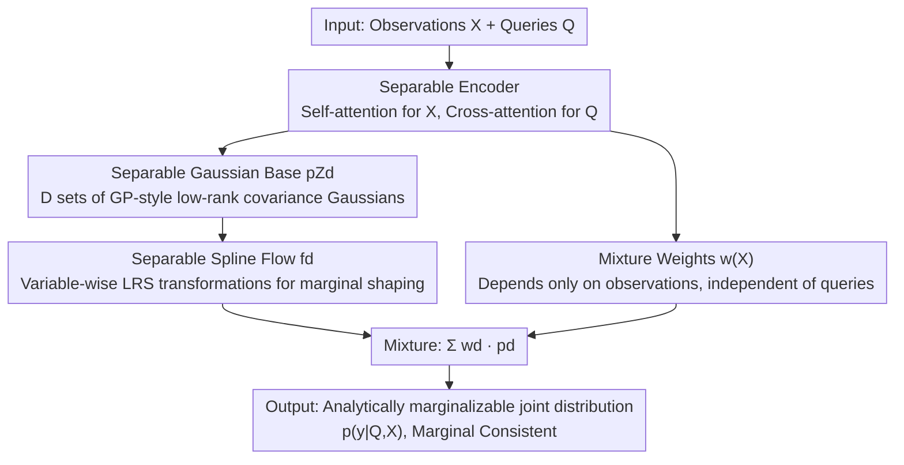

# Reliable Probabilistic Forecasting of Irregular Time Series via Marginal Consistent Flows

**Conference**: ICLR 2026  
**OpenReview**: [https://openreview.net/forum?id=awWi4hJI7O](https://openreview.net/forum?id=awWi4hJI7O)  
**Code**: https://github.com/yalavarthivk/separable_flows  
**Area**: Probabilistic Time Series Forecasting / Irregular Time Series / Normalizing Flows  
**Keywords**: Marginal Consistency, Irregular Time Series, Normalizing Flows, Gaussian Processes, Mixture Models

## TL;DR
This paper proposes MOSES (Mixtures of Separable Flows), which uses a mixture of normalizing flows—combining a "multivariate Gaussian source distribution + variable-wise separable spline transformations"—to perform probabilistic forecasting for irregular time series. This approach ensures "marginal consistency," where predictions for subset queries are perfectly self-consistent with the margins integrated from the joint distribution. It significantly outperforms the previous SOTA ProFITi in marginal prediction while maintaining near-SOTA joint prediction performance.

## Background & Motivation

**Background**: Probabilistic forecasting of irregularly sampled time series (e.g., vital sign records of ICU patients) requires models to provide predictive distributions for **arbitrary time points and arbitrary subsets of variables**. Both the number of query points $K$ and the context length $N$ vary across samples. Existing methods providing true joint distributions primarily include Gaussian Process Regression (GPR) and the normalizing-flow-based ProFITi.

**Limitations of Prior Work**: GPR is marginal-consistent but limited to Gaussian distributions, restricting its expressivity. ProFITi is highly expressive and yields accurate joint predictions but **violates marginal consistency**. In the same context, a marginal distribution obtained by querying a single variable directly does not match the marginal distribution derived by integrating out other variables from a joint prediction. The paper illustrates the danger with an ICU example: a model might report a "90% probability of stability" for blood pressure when queried alone, but only "60%" when inferred from the joint distribution of vital signs. Such self-contradiction is fatal for clinical decision-making.

**Key Challenge**: A "false dichotomy" is perceived between expressivity (using non-separable flows to capture complex dependencies) and consistency (requiring analytical marginalization from the joint distribution). Models are typically either consistent but limited (like GPR) or flexible but inconsistent (like ProFITi).

**Goal**: Construct a probabilistic forecasting model for irregular time series that maintains the expressivity of modern flow methods while **strictly satisfying marginal consistency**, and demonstrate that consistency does not necessitate significant performance loss.

**Key Insight**: The authors elevate marginal consistency to a **mathematical necessity**. According to the Kolmogorov Extension Theorem, a model only defines a legal stochastic process if it satisfies joint prediction (R1), permutation invariance (R2), and marginal consistency/projection invariance (R3). Furthermore, per the Data Processing Inequality (DPI), once a model is consistent, accurate joint predictions "guarantee" accurate marginal predictions for any subset, making consistency a performance safeguard.

**Core Idea**: Instead of using non-linear flow transformations to capture inter-variable dependencies, **dependencies are embedded within a multivariate Gaussian source distribution with a full covariance matrix, while transformations are restricted to variable-wise "separable" shaping**. Marginalization then simplifies to selecting rows and columns of the Gaussian distribution, which is naturally consistent. Non-Gaussian expressivity is recaptured through mixtures.

## Method

### Overall Architecture
The core problem MOSES addresses is how to ensure a highly expressive normalizing flow remains self-consistent during marginalization (integrating out certain variables). The general strategy is to decouple the responsibilities of "modeling dependencies" and "modeling marginal shapes." The former is handled by a $D$-component mixture of multivariate Gaussian source distributions (where dependencies are stored in the covariance), and the latter is handled by uncoupled spline transformations acting independently on each variable. Since Gaussian distributions, mixtures, and variable-wise monotonic transformations are each marginal-consistent, the entire combined model is consistent.

Specifically, the encoder transforms observations $X$ and queries $Q$ into embeddings, which are fed into $D$ "separable flow" components. Each component first samples from a multivariate Gaussian $z \sim p_{Z_d}$ with low-rank covariance, then applies a conditional spline transformation $\phi$ independently to each component of $z$ to obtain $y$. The $D$ components are combined using weights $w(X)$ that depend only on observations, finally yielding the joint density $\hat p(y \mid Q, X)$. Since every step is analytically marginalizable, queries for any subset directly yield marginal distributions consistent with the joint.

### Key Designs

**1. Establishing R3 Marginal Consistency as a Hard Constraint**

Prior work (including ProFITi) only emphasized joint prediction (R1) and permutation invariance (R2), treating marginal consistency as optional. This paper formalizes R3: for a sub-query $Q_{-k}$ obtained by removing the $k$-th item from query $Q$, the model's joint prediction on $Q_{-k}$ must equal the prediction on the full $Q$ after integrating out the $k$-th variable, i.e., $\hat p(y_{-k} \mid Q_{-k}, X) = \int_{\mathbb{R}} \hat p(y \mid Q, X) \, dy_k$. The paper proves that models satisfying R1–R3 define a valid stochastic process on the index set $T = \mathbb{R} \times \{1, \dots, C\}$; otherwise, the model is "inconsistent." Consistency is not just for mathematical rigor: via DPI, $D_{\mathrm{KL}}$ does not increase under marginalization, so **Joint Accuracy + Consistency $\implies$ Marginal Accuracy for any subset**, effectively providing performance insurance for marginal predictions.

**2. Separable Construction: Dependencies in Gaussian Source, Transformations for Shaping**

The inconsistency in ProFITi stems from using non-separable flow transformations to couple variables, making analytical marginalization impossible. This paper reverses that: it uses a "separable" transformation $f(z \mid Q, X) = \big(\phi(z_1 \mid Q_1, X), \dots, \phi(z_K \mid Q_K, X)\big)$, where each $\phi$ only considers its own query and the shared context (Lemma 3.1). Thus, the transformation itself introduces no cross-variable dependency. All dependencies originate from the source distribution—a GP-style multivariate Gaussian $\mathcal{N}(\mu(X, Q), \Sigma(X, Q))$, where the mean and covariance are separably parameterized as $\mu_k = \tilde\mu(Q_k, X)$ and $\Sigma_{k, \ell} = \tilde\Sigma(Q_k, Q_\ell, X)$. The paper proves that a **separable transformation + a marginal-consistent source distribution = a marginal-consistent model** (Lemma 3.1).

**3. Mixtures of Separable Flows (MOSES): Recapturing Non-Gaussian Expressivity**

A single Gaussian source distribution can only express linear dependencies and simple marginals. MOSES uses a mixture of $D$ separable flows $\hat p(y \mid Q, X) = \sum_{d=1}^{D} w_d(X) \, \hat p_d(y \mid Q, X)$ to enhance expressivity (Lemma 3.2 guarantees the mixture still satisfies R1–R3). The components include: **① Separable Encoder**, where observations are encoded via self-attention into $h^{\mathrm{OBS}}$, and queries are encoded via cross-attention; **② Separable Gaussian Base**, which parameterizes $\mu_d, \Sigma_d$; **③ Separable Spline Transformation**, applying a shared Linear Rational Spline (LRS) $\phi$ to each component of $z$; **④ Mixture Weights**, $w = \mathrm{softmax}(\mathrm{MHA}(\beta, h^{\mathrm{OBS}}, h^{\mathrm{OBS}}))$. A critical constraint is that **weights must only depend on observations $X$, not queries $Q$**, as query-dependent weights would violate marginal consistency.

**4. Low-Rank Covariance + njNLL Training: Scalable Joint Likelihood**

Naive calculation of multivariate Gaussian density requires $O(K^3)$ for inversion and determinants, which is prohibitive for large queries. This paper designs the covariance as a low-rank update $\Sigma_d = I_K + UU^\top$ (i.e., $\Sigma_{k,l} = \delta_{kl} + (h_{d,k}\theta^{\mathrm{COV}})(h_{d,l}\theta^{\mathrm{COV}})^\top / \sqrt{M'}$). Using the Woodbury identity and Weinstein–Aronszajn identity, complexity is reduced to $O(M'^2 K)$, making it scalable where $K \gg M'$. The training objective is the normalized joint negative log-likelihood (njNLL): $\mathcal{L}_{\mathrm{njNLL}}(\theta) = \frac{1}{|B|} \sum_{(Q,X,y) \in B} \frac{-1}{|y|} \log \hat p(y \mid Q, X)$.

### Loss & Training
Training uses Adam with a learning rate of 0.001 and a batch size of 64. Hyperparameter search covers the number of mixture components $D \in \{1, 3, 5, 7, 10\}$, attention heads $\{1, 2, 4\}$, and hidden dimensions $M, F \in \{16, 32, 64, 128\}$. All models are implemented in PyTorch and trained on RTX 3090 / A40 / GTX 1080 Ti GPUs.

## Key Experimental Results

Datasets: USHCN (Climate), and three medical datasets: PhysioNet'12, MIMIC-III, and MIMIC-IV—all irregularly sampled with missing values. The evaluation uses njNLL (joint density, lower is better) and mNLL (marginal density, lower is better).

### Main Results

Joint njNLL Comparison (lower is better):

| Dataset | ProFITi (Inconsistent) | GPR (Consistent) | GMM (Consistent) | MOSES (Ours) |
| :--- | :--- | :--- | :--- | :--- |
| USHCN | -3.226 | 2.011 | 1.050 | **-3.357** |
| PhysioNet'12 | **-0.647** | 1.367 | 1.063 | -0.491 |
| MIMIC-III | **-0.377** | 3.146 | 1.160 | -0.305 |
| MIMIC-IV | **-1.777** | 2.011 | 1.076 | -1.668 |

Marginal mNLL Comparison (lower is better):

| Dataset | ProFITi (Inconsistent) | GPR (Consistent) | GMM (Consistent) | MOSES (Ours) |
| :--- | :--- | :--- | :--- | :--- |
| USHCN | -3.324 | 1.235 | 1.042 | **-3.355** |
| PhysioNet'12 | -0.016 | 1.161 | 1.069 | **-0.271** |
| MIMIC-III | 0.408 | 1.341 | 1.124 | **0.163** |
| MIMIC-IV | 0.500 | 1.161 | 1.075 | **-0.634** |

Observations: While MOSES and ProFITi are competitive on njNLL, MOSES **significantly outperforms all consistent baselines** (GPR/GMM). Crucially, in marginal mNLL, MOSES leads ProFITi across the board—ProFITi suffers from performance collapse due to inconsistency (e.g., MIMIC-IV drops from -1.777 to +0.500), whereas MOSES remains stable.

### Ablation Study

| Configuration | Meaning | Key Finding |
| :--- | :--- | :--- |
| MOSES(1) | Single component | Insufficient expressivity to fit curved distributions. |
| MOSES(4) | 4 components | A few components significantly improve fit to ground truth. |
| GMM | MOSES w/o flow | Consistent but poor expressivity, requires many components. |
| ProFITi-TF | ProFITi w/ MOSES encoder | MOSES outperforms on MIMIC-III/IV, suggesting ProFITi's edge was partly the encoder. |
| MOSES-GraFITi | MOSES w/ ProFITi encoder | Joint njNLL improves but mNLL degrades due to encoder inconsistency. |

### Key Findings
- **Consistency is a performance safeguard**: ProFITi is strong in joint but collapses in marginal; MOSES remains competitive in joint and leads in marginal, validating the DPI argument.
- **Mixtures drive expressivity**: MOSES(1) cannot fit curved distributions, while MOSES(4) can. A few components outperform the no-flow GMM.
- **ProFITi's advantage is largely in the encoder**: When using the same encoder, MOSES outperforms on MIMIC datasets, indicating its probabilistic components are superior.
- **Encoder consistency is non-negotiable**: MOSES-GraFITi showed that even with a better joint fit, an inconsistent encoder leads to worse marginal (mNLL) results.

## Highlights & Insights
- The **decoupling of "dependencies to source" and "shapes to transformations"** is elegant: it converts marginal consistency from an intractable transformation constraint into a simple condition on the source distribution.
- **Translating mathematical rigor into quantifiable gains**: Using the Kolmogorov theorem and DPI, the paper links the abstract requirement of "consistency" to the concrete "guarantee of marginal performance."
- **Low-rank covariance + Woodbury** is a reusable trick for any scenario requiring multivariate Gaussian likelihoods on variable-length targets.
- The **query-independence of mixture weights** is an "explicit cost" of consistency, providing clear directions for future improvements.

## Limitations & Future Work
- **Separable constraints sacrifice joint expressivity**: Dependencies are limited to low-rank Gaussian covariance and mixtures, which cannot capture dependencies as directly as non-separable flows.
- **Mixture weights cannot depend on queries**: This is a mandatory condition for R1–R3, representing a fundamental trade-off between adaptive weighting and consistency.
- **Marginal consistency verified mainly for univariate margins**: Multi-variable margins are theoretically consistent but computationally expensive to evaluate.
- **Future Work**: The authors plan to explore Copula models and Probabilistic Circuits that maintain consistency while offering more flexibility.

## Related Work & Insights
- **vs ProFITi**: ProFITi uses non-separable triangular attention flows, providing strong joint expressivity but lacking consistency. MOSES trades a small amount of joint expressivity for strict consistency and better marginal performance.
- **vs GPR**: GPR is consistent but strictly Gaussian. MOSES adds spline transformations and mixtures to gain non-Gaussian expressivity while retaining consistency.
- **vs GMM**: GMM is MOSES without flows; it requires massive components to approximate complex distributions, whereas MOSES achieves better results with fewer components.

## Rating
- Novelty: ⭐⭐⭐⭐⭐ 
- Experimental Thoroughness: ⭐⭐⭐⭐ 
- Writing Quality: ⭐⭐⭐⭐⭐ 
- Value: ⭐⭐⭐⭐⭐ 

<!-- RELATED:START -->

## Related Papers

- [\[ICLR 2026\] pyrregular: A Unified Framework for Irregular Time Series, with Classification Benchmarks](pyrregular_a_unified_framework_for_irregular_time_series_with_classification_ben.md)
- [\[ICLR 2026\] Learning Recursive Multi-Scale Representations for Irregular Multivariate Time Series Forecasting](learning_recursive_multi-scale_representations_for_irregular_multivariate_time_s.md)
- [\[ICLR 2026\] Delta-XAI: A Unified Framework for Explaining Prediction Changes in Online Time Series Monitoring](delta-xai_a_unified_framework_for_explaining_prediction_changes_in_online_time_s.md)
- [\[ICLR 2026\] When Foundation Models Are One-Liners: Limitations and Future Directions for Time Series Anomaly Detection](when_foundation_models_are_one-liners_limitations_and_future_directions_for_time.md)
- [\[ICLR 2026\] HiVid: LLM-Guided Video Saliency For Content-Aware VOD And Live Streaming](hivid_llm-guided_video_saliency_for_content-aware_vod_and_live_streaming.md)

<!-- RELATED:END -->
