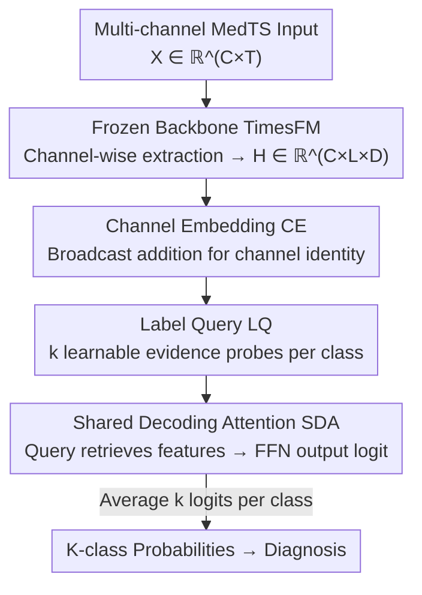

# Repurposing Foundation Model for Generalizable Medical Time Series Classification

**Conference**: ICLR 2026  
**OpenReview**: [https://openreview.net/forum?id=wNEzRYiyZM](https://openreview.net/forum?id=wNEzRYiyZM)  
**Code**: https://github.com/DL4mHealth/FORMED  
**Area**: Time Series / Medical Signals / Foundation Model Adaptation  
**Keywords**: Medical Time Series, Foundation Model Repurposing, Channel Embedding, Label Query, Cross-dataset Generalization

## TL;DR
FORMED freezes a forecasting foundation model (TimesFM) pre-trained on general time series to serve as a feature extractor, appending a novel classification head composed of "Channel Embedding + Label Query + Shared Decoding Attention." By jointly training on multiple MedTS datasets, medical domain knowledge is consolidated into the shared layers. This enables adaptation to new medical time series datasets with arbitrary channel counts, sequence lengths, and class numbers using only 0.1% of the parameters, achieving a maximum absolute F1 improvement of 35% on ADFTD.

## Background & Motivation
**Background**: Medical time series (MedTS, such as EEG and ECG) classification is critical for diagnosing diseases like Alzheimer's, Parkinson's, and arrhythmias. Common practices involve training a Task-Specific Model (TSM) from scratch for each dataset, or performing Task-Specific Adaptation (TSA) by attaching adapters and task heads to a fixed pre-trained backbone.

**Limitations of Prior Work**: MedTS data is naturally heterogeneous—datasets vary significantly in channel counts (12–33), sampling rates, signal lengths, and diagnostic categories (from binary to 5-way classification). There is also massive inter-patient variability within the same dataset, while privacy concerns and acquisition costs lead to small sample sizes in individual datasets. TSM requires retraining for every dataset, preventing knowledge sharing. While TSA freezes the backbone and trains fewer parameters, its input adapters and output heads are "hard-coded" to the initial task, hindering reuse across datasets and risking overfitting. The authors' pilot experiments show that TSA gains relative to training from scratch are often marginal or negative.

**Key Challenge**: Current adaptation paradigms conflate "domain-invariant representations" with "task-specific configurations." Knowledge is either not shared at all (TSM) or the shared component (backbone) fails to capture medical domain knowledge, while components capable of learning domain knowledge (adapters/heads) are bound to a single task and cannot be transferred. Although forecasting-based time series foundation models learn general representations, they are mostly univariate and channel-independent, designed for forecasting (sequence-to-sequence) rather than classification (sequence-to-category), failing to capture cross-channel diagnostic patterns.

**Goal**: To enable a forecasting foundation model to reuse medical domain knowledge across datasets and adapt to any new MedTS configuration with minimal parameters, achieving "Generalizable Adaptation" (GA).

**Key Insight**: The authors propose the **architectural decoupling** of "domain-invariant representation learning" and "task-specific adaptation." Domain knowledge is embedded in a shared attention layer that remains frozen after training, while task-specific information (channels and categories) is handled by lightweight, dynamically expandable parameters.

**Core Idea**: Use "repurposing" instead of "re-programming." Freeze the forecasting foundation backbone and replace it with an attention-based classification head that separates "shared domain knowledge" from "task-specific configurations," allowing the shared head to be trained once and reused indefinitely.

## Method

### Overall Architecture
The input to FORMED is any multi-channel MedTS signal $X \in \mathbb{R}^{C \times T}$ ($C$ channels, $T$ time points), and the output is a probability distribution over $K$ diagnostic classes. The pipeline consists of three phases: **Pre-training** (completed by TimesFM on general time series); **Repurposing**, where the backbone is frozen and a new classification head is jointly trained on a cohort of 5 MedTS datasets to consolidate medical domain knowledge into a shared attention layer; and **Adapting**, where both the backbone and the shared attention layer are frozen, while dataset-specific channel embeddings and label queries (~0.1% of total parameters) are initialized and trained for a new dataset.

The backbone processes data in a **channel-independent** manner: for each channel's univariate signal, it extracts $L$ patch tokens of dimension $D$, resulting in $H \in \mathbb{R}^{C \times L \times D}$. The classification head then applies: Channel Embedding (CE) to inject spatial topological information; Label Query (LQ) as "evidence probes" for each category; and Shared Decoding Attention (SDA) for retrieving evidence from channel features to generate logits. Only SDA carries cross-dataset knowledge, while CE and LQ remain specific to the current dataset.

### Key Designs

**1. Repurposing Paradigm: Decoupling Domain Knowledge from Task Configuration**

This design directly addresses the key challenge where shared parts of TSA fail to learn medical knowledge while knowledge-heavy parts are task-bound. The authors formally distinguish two stages: Repurposing (Definition 3.1) redirects a pre-trained model to a new class of tasks by freezing the backbone $f$ and training a small, adaptable output network $h_\theta$. The goal is to minimize cross-entropy across multiple MedTS datasets to compress domain knowledge into shared parameters $\theta$: $\theta^*, \mathcal{E}^*, \mathcal{Q}^* = \arg\min_{\theta,\mathcal{E},\mathcal{Q}} \mathbb{E}_{i,(X_i,y_i)}\big[\mathcal{L}_{CE}(h_\theta|_{Q_i,E_i}(f(X_i)), y_i)\big]$. Adapting (Definition 3.2) applies the trained model (with $\theta^*$ and backbone frozen) to a new dataset by learning only new channel embeddings $E'$ and label queries $Q'$. Unlike "re-programming," where input adapters and heads are highly specialized and discarded for new datasets, repurposing ensures the domain-knowledge layer is independent of $C$, $L$, and $K$, enabling cross-task reuse.

**2. Channel Embedding (CE): Decoupling Spatial Topology and Temporal Features**

MedTS channel counts vary (dozens for EEG, 12 for ECG), and the backbone treats channels independently, unaware of spatial relationships. CE introduces a learnable vector $E \in \mathbb{R}^{C \times D}$ for each channel, injected via broadcast addition to all tokens of that channel: $\tilde{H}_{c,l,:} = H_{c,l,:} \oplus E_{c,:}$. This separates the "lead identity and spatial role" from general temporal features. CE is task-specific: for a new dataset with different channels, a new set of CE is initialized and trained while the rest remains frozen, supporting arbitrary channel configurations.

**3. Label Query (LQ): Diagnostic Classes as Learnable "Evidence Probes"**

To handle varying class counts $K$ and provide learnable anchors for each category, FORMED uses label queries $Q \in \mathbb{R}^{K \times D}$. Each row $Q_{i,:}$ represents the $i$-th class, actively "searching" for supporting evidence in channel-aware features. Specifically, $k$ queries are used per class, i.e., $Q \in \mathbb{R}^{(K\cdot k)\times D}$, allowing each category to capture complex patterns from multiple "perspectives." LQ is also task-specific, making the architecture flexible to the number of classes.

**4. Shared Decoding Attention (SDA): A Cross-dataset Knowledge Layer**

SDA is the core of the classification head and the only part shared and eventually frozen. It is a single-layer Transformer decoder: using all $K\cdot k$ label queries as "query" and flattened channel-aware features $\text{Flatten}(\tilde{H}) \in \mathbb{R}^{(C\cdot L)\times D}$ as "key/value." It produces logits through multi-head attention and a feed-forward network: $\hat{y}_{raw} = \text{FFN}(\text{MHA}(Q, \text{Flatten}(\tilde{H}), \text{Flatten}(\tilde{H})))$. Final logits are obtained by averaging the $k$ logits per class. Since SDA's parameters $\theta$ are independent of $C$, $L$, and $K$, it is forced to learn **task-agnostic diagnostic interaction patterns**, while task-specific scaling is handled by CE and LQ.

### Loss & Training
Both phases utilize cross-entropy loss. The repurposing phase involves joint training of $\theta$, $\mathcal{E}$, and $\mathcal{Q}$ on a cohort of 5 MedTS datasets (approx. 340,000 samples, 90 million time points, with fixed $k=16$). The adaptation phase freezes the backbone and SDA, optimizing only $E'$ and $Q'$ for the new dataset. Adaptation experiments use 5 random seeds for averaging.

## Key Experimental Results

### Main Results
Evaluated on 5 intra-cohort datasets using patient-independent testing (test patients unseen during training), comparing against 11 TSMs and 4 TSAs:

| Dataset | Task | FORMED Performance | Comparison |
|:---|:---|:---|:---|
| ADFTD | EEG Neurodegenerative | Abs. F1 Gain up to ~35% | Significantly outperforms all TSM/TSA |
| PTB / PTB-XL | ECG Cardiac | 30-40% gain on mid-large datasets | SOTA level |
| TDBrain | EEG (Small/Simple) | Equivalent to strongest TSM | Still notably better than TSA |

FORMED reaches SOTA levels across all metrics; gains are particularly pronounced on mid-to-large datasets, while it matches the strongest TSM on small, saturated tasks while consistently beating TSA.

### Ablation Study
Performed on out-of-domain datasets (ECG200, StandWalkJump) to test adaptation and class query count $k$:

| Configuration | Key Finding | Description |
|:---|:---|:---|
| New Dataset Adaptation | Surpasses TimesFM-TSA with 0.1% params | Validates efficacy of SDA domain knowledge |
| Increasing $k$ | Performance follows power-law growth with $k$ | A tunable knob for compute-performance trade-off |
| ECG200 | Exceeds TimesFM-TSA at $k \ge 64$ | Larger datasets require more probes |
| StandWalkJump | Exceeds TimesFM-TSA at $k \ge 16$ | Smaller tasks surpass baselines earlier |

### Key Findings
- **SDA Shared Knowledge**: Shared domain knowledge in SDA is the core of generalization. Cohort training allows it to learn task-agnostic feature-class interaction patterns, translating into robustness against unseen patients.
- **TSA Weakness**: TSA generally underperforms TSM and lags far behind FORMED, confirming that a "shared backbone + simple specialized head" struggles with cross-task knowledge transfer.
- **Scaling with $k$**: The adaptation phase $k$ provides a power-law scaling knob between computation and accuracy, adjustable based on data scale and budget.

## Highlights & Insights
- **Repurposing Concept**: Clearly distinguished from prompting, fine-tuning, or re-programming by ensuring the domain-knowledge layer is architecturally independent of task configurations.
- **Dynamic Expansion of CE/LQ**: The use of "on-demand small embeddings" elegantly solves the engineering problem of fixed channel and class counts without altering the backbone.
- **Multi-query Aggregation**: Using $k$ probes per class captures multiple sub-modes of a diagnosis, enhancing expressivity while providing a clean scaling mechanism.

## Limitations & Future Work
- The study excludes sparse/irregular EHR data, focusing on continuous high-frequency waveforms (EEG/ECG); broader MedTS coverage would require different tokenization.
- Only one backbone (TimesFM) was verified due to resource constraints; other channel-independent or forecasting models remain to be tested.
- Since the backbone processes channels independently and cross-channel interaction is compressed into a single-layer SDA, its capacity might become a bottleneck for tasks requiring extremely high cross-channel coupling.

## Related Work & Insights
- **vs TSM (e.g., PatchTST, Medformer)**: TSMs train from scratch per dataset without knowledge sharing; FORMED leads significantly on mid-large datasets via SDA.
- **vs TSA / Re-programming (e.g., TimesFM-TSA)**: These freeze the backbone but lock the adapter/head to a single task; FORMED decouples knowledge for 0.1% parameter adaptation.
- **vs General Foundation Models (e.g., UniTS, Time-LLM)**: Often univariate and forecasting-oriented; FORMED adds the necessary "cross-channel integration + sequence-to-category" capability efficiently.

## Rating
- **Novelty**: ⭐⭐⭐⭐⭐ "Repurposing" paradigm + CE/LQ/SDA decoupling addresses foundational reuse challenges.
- **Experimental Thoroughness**: ⭐⭐⭐⭐ Solid evaluation on 5+2 datasets and 15 baselines, though limited to one backbone.
- **Writing Quality**: ⭐⭐⭐⭐⭐ Clear distinctions between paradigms and formal definitions.
- **Value**: ⭐⭐⭐⭐⭐ Provides a resource-efficient, deployable paradigm for foundation model reuse in medicine.

<!-- RELATED:START -->

## Related Papers

- [\[AAAI 2026\] A Unified Shape-Aware Foundation Model for Time Series Classification](../../AAAI2026/time_series/a_unified_shape-aware_foundation_model_for_time_series_class.md)
- [\[NeurIPS 2025\] MIRA: Medical Time Series Foundation Model for Real-World Health Data](../../NeurIPS2025/time_series/mira_medical_time_series_foundation_model_for_real-world_health_data.md)
- [\[ICLR 2026\] Decentralized Attention Fails Centralized Signals: Rethinking Transformers for Medical Time Series](decentralized_attention_fails_centralized_signals_rethinking_transformers_for_me.md)
- [\[ICLR 2026\] Adapt Data to Model: Adaptive Transformation Optimization for Domain-shared Time Series Foundation Models](adapt_data_to_model_adaptive_transformation_optimization_for_domain-shared_time_.md)
- [\[ICLR 2026\] CauKer: Classification Time Series Foundation Models Can Be Pretrained on Synthetic Data](cauker_classification_time_series_foundation_models_can_be_pretrained_on_synthet.md)

<!-- RELATED:END -->
