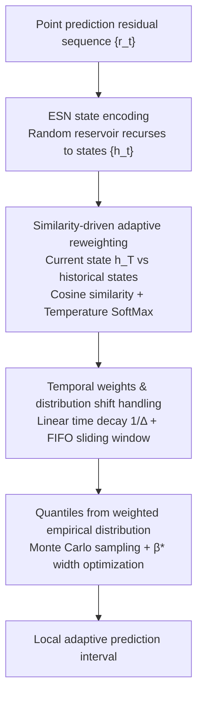

# ResCP: Reservoir Conformal Prediction for Time Series Forecasting

**Conference**: ICLR 2026  
**arXiv**: [2510.05060](https://arxiv.org/abs/2510.05060)  
**Code**: None  
**Area**: Time Series/Uncertainty Quantification  
**Keywords**: conformal prediction, reservoir computing, echo state network, prediction interval, training-free

## TL;DR
This paper introduces Reservoir Computing (Echo State Network) into Conformal Prediction for the first time. By encoding temporal dynamics of residual sequences using a randomly initialized ESN and utilizing state similarity to adaptively reweight historical residuals, it constructs local prediction intervals. Without any training, it achieves SOTA Winkler scores on four real-world datasets and is 20-80× faster than HopCPT.

## Background & Motivation

**Background**: Conformal Prediction (CP) is a robust framework for constructing distribution-free prediction intervals. however, it requires data exchangeability, which is naturally violated by the temporal dependence of time series.

**Limitations of Prior Work**:
- Fixed decay methods like NexCP cannot adapt to local dynamics, resulting in overly conservative (large width) intervals.
- HopCPT uses Hopfield/Transformer attention for data-dependent reweighting, but training is expensive (4574s on Solar vs. 53s for ResCP) and requires retraining when distributions shift.
- SPCI fits a quantile random forest at every step, with computational demands limiting its practicality.
- Training-based methods (CP-QRNN, ResCQR) suffer from severe under-coverage (>10%) on small datasets like ACEA/Exchange.

**Key Challenge**: The need for data-dependent adaptive reweighting to capture local dynamics conflicts with high training costs and vulnerability to distribution shifts.

**Goal**: Achieve local adaptivity for time series conformal prediction without introducing any training process.

**Key Insight**: Echo State Networks (ESN) in Reservoir Computing—randomly initialized RNNs that map input sequences to high-dimensional state spaces without training—produce meaningful dynamic representations.

**Core Idea**: Use the similarity between ESN states as data-dependent weights for residual reweighting, effectively implementing local conformal prediction using a "free dynamic encoder."

## Method

### Overall Architecture

ResCP addresses the issue that time series residuals do not satisfy the exchangeability required by CP, without training a model. The approach treats the residual sequence $\{r_t\}$ from a point prediction model as input, encodes it into a state sequence $\{\boldsymbol{h}_t\}$ via a **randomly initialized, never-trained** Echo State Network (ESN), and uses the similarity between the current state and historical states to reweight historical residuals. Finally, quantiles are taken from the reweighted empirical distribution to build prediction intervals that adaptively scale with local dynamics. The entire pipeline contains no learnable parameters.

### Key Designs

**1. ESN State Encoding: Using random reservoirs to transform residual sequences into comparable dynamic fingerprints**

Instead of training an encoder to judge dynamic similarity, ResCP uses a randomly initialized, non-updated Echo State Network. Residuals $x_t$ are fed into the ESN, with states updated as $\boldsymbol{h}_t = (1 - l)\boldsymbol{h}_{t-1} + l\,\sigma(\boldsymbol{W}_x \boldsymbol{x}_t + \boldsymbol{W}_h \boldsymbol{h}_{t-1} + \boldsymbol{b})$, where the input matrix $\boldsymbol{W}_x$ and recurrent matrix $\boldsymbol{W}_h$ are fixed after random generation. The "free encoder" is reliable because as long as the Echo State Property ($\rho(\boldsymbol{W}_h)<1$) is satisfied, the ESN asymptotically forgets initial conditions, produces similar states for similar input subsequences, and maintains a Lipschitz continuous mapping.

**2. Similarity-driven Adaptive Reweighting: Greater weights for history with similar dynamics**

ResCP quantifies which historical residuals are most relevant by calculating the cosine similarity between the current state $\boldsymbol{h}_t$ and every state $\boldsymbol{h}_s$ in the calibration set. These are normalized via temperature softmax into weights $w_s(\boldsymbol{h}_t) = \text{SoftMax}\left(\frac{\text{Sim}(\boldsymbol{h}_t, \boldsymbol{h}_s)}{\tau}\right)$. Applying these weights to the empirical distribution of residuals yields an approximation of the conditional distribution:

$$\hat{F}(r \mid \boldsymbol{h}_t) = \sum_{s} w_s(\boldsymbol{h}_t)\,\mathbb{1}(r_{s+H} \leq r)$$

The temperature $\tau$ acts as a bias-variance knob: low $\tau$ concentrates weights on a few similar states (low bias, high variance), while high $\tau$ leads to uniform weights (low variance, high bias).

**3. Temporal Dependence and Distribution Shift: Layering gentle time decay over similarity**

To handle non-stationary sequences, ResCP multiplies similarity weights by a temporal decay factor $w_i(\boldsymbol{h}_t, t) = \gamma(\Delta(t,i)) \cdot w_i(\boldsymbol{h}_t)$. It specifically chooses linear decay $\gamma(\Delta) = 1/\Delta$ rather than exponential decay to avoid prematurely discarding distant samples. Combined with a FIFO sliding window for the calibration set, the reference set stays current with the distribution. Since the mechanism is training-free, ResCP adapts to shifts automatically without retraining.

### Loss & Training

ResCP is **completely training-free**—ESN weights are fixed after random initialization. Hyperparameters (spectral radius, leak rate, input scaling, temperature, window size) are determined via grid search to minimize the Winkler score on a validation set. 

Prediction intervals are approximated via Monte Carlo sampling and optimized using the best $\beta^*$: $\beta^* = \arg\min_{\beta \in [0,\alpha]} [\hat{Q}_{1-\alpha+\beta}(\boldsymbol{h}_t) - \hat{Q}_\beta(\boldsymbol{h}_t)]$.

## Key Experimental Results

### Main Results ($\alpha=0.1$, RNN Baseline Model)

| Dataset | Method | ΔCov(%) | PI Width↓ | Winkler↓ |
|--------|------|---------|---------|----------|
| Solar | HopCPT | -1.64 | 60.49 | 112.46 |
| Solar | CP-QRNN | -0.26 | 55.74 | **78.42** |
| Solar | **Ours** | **0.74** | **62.25** | 104.24 |
| Exchange | HopCPT | 2.75 | 0.0404 | 0.0482 |
| Exchange | **Ours** | **1.13** | **0.0210** | **0.0264** |
| ACEA | HopCPT | -2.18 | 18.90 | 27.56 |
| ACEA | CP-QRNN | -12.37 | 15.86 | 32.61 |
| ACEA | **Ours** | **1.56** | **9.61** | **12.91** |

### Runtime Comparison (Seconds, RNN Baseline)

| Dataset | SPCI | HopCPT | CP-QRNN | **Ours** | SCP |
|--------|------|--------|---------|-----------|-----|
| Solar | 1040 | 4575 | 172 | **53** | 18 |
| Beijing | 351 | 1839 | 82 | **35** | 9 |
| Exchange | 51 | 318 | 37 | **7** | 2 |
| ACEA | 228 | 2263 | 95 | **71** | 7 |

### Ablation Study

| Configuration | Exchange Winkler↓ | ACEA Winkler↓ | Description |
|------|-------------------|---------------|------|
| ResCP (Full) | **0.0264** | **12.91** | Time decay + Sliding window |
| No decay | 0.0269 | 13.41 | Without time decay, under-coverage worsens |
| No window | 0.0284 | 14.80 | Using all history instead of sliding window |
| No window, no decay | 0.0291 | 15.25 | Degenerates to global similarity |

### Key Findings
- ResCP leads all methods (including training-based ones) significantly in Winkler score on ACEA and Exchange, and is competitive on Solar and Beijing.
- Training-based methods (CP-QRNN, ResCQR) suffer from severe under-coverage (-12% to -27%) on the small ACEA dataset, whereas ResCP maintains valid coverage.
- ResCP provides accurate estimates across all coverage levels, whereas NexCP, despite good calibration, yields much wider intervals.
- The runtime is 20-80× faster than HopCPT and does not require intensive GPU training.

## Highlights & Insights
- **Ingenious use of Reservoir Computing**: ESN serves as a free "temporal dynamics encoder"—generating representations sufficient for distinguishing local dynamics without training.
- **Robust Theoretical Guarantees**: Under reasonable assumptions ($\alpha$-mixing, ESP, and conditional CDF continuity), the paper proves the consistency (Theorem 3.6) and asymptotic conditional coverage (Corollary 3.7) of the weighted empirical CDF.
- **Naturally Robust to Distribution Shifts**: Because ResCP lacks learnable parameters, it adapts to shifts automatically through sliding windows and time decay without model updates.

## Limitations & Future Work
- ESN hyperparameters (spectral radius, leak rate, temperature, etc.) require grid search tuning, which adds some burden to the user.
- Theoretical guarantees are asymptotic; coverage bias in finite samples is not yet quantified.
- Currently limited to single-step univariate forecasting; extensions to multi-step joint prediction and spatio-temporal data are future directions.
- In scenarios with massive data and informative exogenous variables (e.g., Solar), training-based methods like CP-QRNN may still perform better.

## Related Work & Insights
- **vs HopCPT**: Both use data-dependent attention weights, but HopCPT requires end-to-end Transformer training, whereas ResCP is training-free and more effective.
- **vs NexCP**: NexCP uses data-independent exponential decay; while its coverage is reliable, its interval widths are 1.5-2× those of ResCP.
- **vs SPCI**: SPCI fits a quantile random forest at every step, which is computationally expensive; ResCP achieves similar local adaptivity with a fixed ESN.

## Rating
- Novelty: ⭐⭐⭐⭐ First combination of Reservoir Computing and Conformal Prediction; concise yet effective concept.
- Experimental Thoroughness: ⭐⭐⭐⭐⭐ 4 datasets × 3 baseline models × 3 coverage levels + full ablation + runtime analysis.
- Writing Quality: ⭐⭐⭐⭐ Clear theoretical derivations and systematic experimental design.
- Value: ⭐⭐⭐⭐ Provides a simple, fast, and theoretically grounded practical tool for time series uncertainty quantification.

<!-- RELATED:START -->

## Related Papers

- [\[AAAI 2026\] HydroDCM: Hydrological Domain-Conditioned Modulation for Cross-Reservoir Inflow Prediction](../../AAAI2026/time_series/hydrodcm_hydrological_domain-conditioned_modulation_for_cross-reservoir_inflow_p.md)
- [\[ICML 2026\] Simulation-Augmented Multi-Step Split Conformal Prediction for Aggregated Forecasts](../../ICML2026/time_series/simulation-augmented_multi-step_split_conformal_prediction_for_aggregated_foreca.md)
- [\[ICLR 2026\] Online Time Series Prediction Using Feature Adjustment](online_time_series_prediction_using_feature_adjustment.md)
- [\[ICLR 2026\] JAPAN: Joint Adaptive Prediction Areas with Normalising-Flows](japan_joint_adaptive_prediction_areas_with_normalising_flow.md)
- [\[ICLR 2026\] Delta-XAI: A Unified Framework for Explaining Prediction Changes in Online Time Series Monitoring](delta-xai_a_unified_framework_for_explaining_prediction_changes_in_online_time_s.md)

<!-- RELATED:END -->
