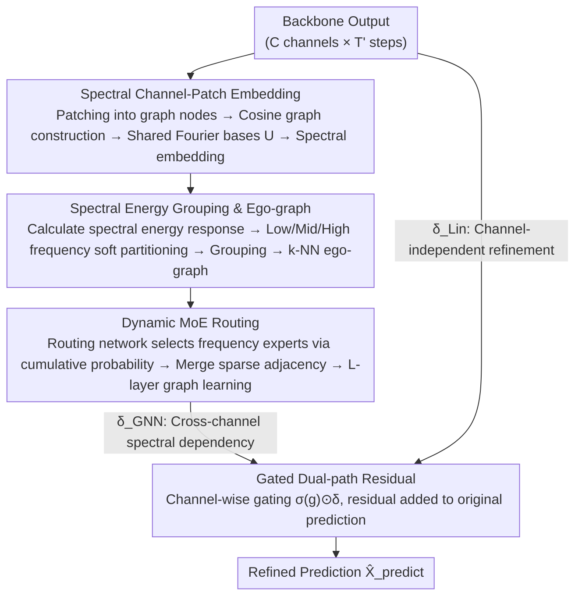

# Routing Channel-Patch Dependencies in Time Series Forecasting with Graph Spectral Decomposition

**Conference**: ICLR 2026  
**arXiv**: [2603.13702](https://arxiv.org/abs/2603.13702)  
**Code**: [GitHub](https://github.com/Clearloveyuan/xCPD)  
**Area**: Time Series Forecasting  
**Keywords**: Channel dependencies, graph spectral decomposition, frequency-aware, MoE routing, plug-and-play

## TL;DR

Ours proposes xCPD, a plug-and-play plugin that refines modeling units from "channels" to "channel-patches" in multivariate time series. By utilizing shared graph Fourier bases for spectral embedding, it groups units by frequency energy response into low, medium, and high bands. Dynamic MoE routing adaptively selects frequency-specific filtering experts, enabling seamless integration into any existing CI/CD models to consistently improve long-term and short-term forecasting performance and support zero-shot transfer.

## Background & Motivation

**Background**: Multivariate Time Series Forecasting (MTSF) is a core AI task widely applied in transportation, finance, energy, and meteorology. Recently, research has progressed along two main lines: model architectures (Linear/CNN/Transformer/MLP/GNN) and channel strategies (CI/CD/CP). Channel strategies have become a performance bottleneck.

**Limitations of Prior Work**: (1) CI (Channel-Independent), such as DLinear/PatchTST, models each channel independently—robust but ignores inter-channel relationships; (2) CD (Channel-Dependent), such as TSMixer/TimesNet, aggregates all channels, potentially introducing irrelevant information leading to over-smoothing; (3) CP (Channel-Partiality), such as DUET/CCM/TimeFilter, attempts to balance the two but remains fundamentally insufficient.

**Key Challenge**: Existing CP methods operate at the channel level (treating the entire channel as a relational unit), failing to model local interactions at the patch level. For instance, channel A might show a smooth seasonal trend in segment $T_1$ but sharp anomalies in $T_2$; channel-level models generate only a single average weight, failing to distinguish between the different interaction modes required for the two segments.

**Frequency Coupling**: CD/CP models calculate attention weights in the time domain, where low-frequency trends, mid-frequency fluctuations, and high-frequency noise are mixed within the same embedding. High attention scores between two channels may simultaneously reflect meaningful low-frequency seasonal dependencies and irrelevant high-frequency noise correlations, leading the model to produce spurious correlations.

**Key Insight**: Refine the modeling unit from "channel" to "channel-patch" (patches as graph nodes), perform dependency modeling in the graph spectral domain (rather than the time domain), group nodes by spectral energy, and use MoE to route different filtering experts by frequency band. This achieves frequency-decoupled, fine-grained channel-patch dependency modeling.

**Value**: xCPD is designed as a post-processing plugin that does not require retraining the base model. With linear computational complexity, it can be directly embedded into existing forecasting pipelines, making it suitable for large-scale real-time scenarios.

## Method

### Overall Architecture

xCPD is a post-processing plugin attached after any forecasting model. It receives the backbone output $\hat{X}^{\text{model}} \in \mathbb{R}^{C \times T'}$ and outputs the refined $\hat{X}^{\text{predict}}$. It segments each channel into patches, making each "channel-patch" a graph node. A shared set of graph Fourier bases projects nodes into the spectral domain (spectral channel-patch embedding). Nodes are then partitioned into low, medium, and high-frequency groups based on spectral energy, forming ego-graphs (spectral energy grouping). Finally, dynamic MoE selects frequency-specific filtering experts for each node's local subgraph for graph learning (dynamic MoE routing). Features are integrated back via a gated dual-path residual mechanism combining cross-channel spectral dependencies and channel-independent refinements.

### Key Designs

**1. Spectral Channel-Patch Embedding: Refinement to patch-level in the spectral domain**

Existing CP methods use the entire channel as a unit, failing to capture varying interactions across time segments. Time-domain attention causes spurious correlations due to frequency coupling. xCPD segments $\hat{X}^{\text{model}}$ into $N=\lceil T'/P\rceil$ non-overlapping patches, linearly mapping them to $d$ dimensions to obtain $X^{\text{emb}}\in\mathbb{R}^{n\times d}$ ($n=C\times N$ nodes). It uses scale-invariant cosine similarity $A_{ij}^t=\cos(X_i^{\text{emb},t},X_j^{\text{emb},t})$ and the normalized Laplacian $L=I-D^{-1/2}AD^{-1/2}$. To ensure comparability across batches, xCPD learns a set of **shared graph Fourier bases** $U$ from the average Laplacian, projecting all time steps into the same spectral coordinate system: $X^{\text{spc}}=U^\top X^{\text{emb}}$. Theorem 4.1 provides an approximation bound $\|U^t-UR^t\|_F\le C\|L^t-L_{\text{avg}}\|_F$, ensuring the shared basis differs from the true basis only by a controllable rotation.

**2. Spectral Energy Grouping and Ego-graph: Same-frequency communication**

After spectral projection, it is necessary to determine which frequency each node primarily "responds" to. xCPD defines spectral energy response $S_{i,j}=\|U_{i,j}\cdot X_{j,:}^{\text{spc}}\|_2^2$ to quantify node $i$'s energy at frequency $j$. Theorem 4.2 guarantees energy conservation $\sum_j S_{i,j}=\|X_{i,:}^{\text{emb}}\|_2^2$. Two learnable boundaries $\tau_1,\tau_2$ use sigmoid soft partitioning to divide frequencies into low, mid, and high bands, providing weights $\alpha_j^{\text{low/mid/high}}$. Nodes are assigned to the band with the maximum cumulative energy. k-NN is then used to construct ego-graphs, retaining only edges within the same frequency band to prevent the mixing of smooth trends and high-frequency noise.

**3. Dynamic MoE Routing: Input-dependent frequency filtering experts**

Three frequency filters construct candidate adjacency matrices to capture smooth trends, local fluctuations, and abrupt anomalies. The routing network provides noisy scores $\psi(x_i)=\text{Linear}_c(x_i)+\epsilon\cdot\text{Softplus}(\text{Linear}_n(x_i))$. Instead of a fixed top-K, it selects the **minimum** number of experts such that cumulative probability $\ge\tau$ (Eq. 7). Thus, a smooth segment might use only a low-frequency expert, while an abrupt segment invokes an additional high-frequency expert. Selected edges are merged into a sparse adjacency matrix (Eq. 8) followed by $L$ layers of graph learning (Eq. 9–10). Entropy loss $\mathcal{L}_{\text{Entropy}}$ and load balancing loss $\mathcal{L}_{\text{Balance}}$ are used to prevent expert collapse.

**4. Gated Dual-path Residual: Secure cross-channel spectral dependencies**

xCPD utilizes two correction paths: the GNN path $\delta_{\text{GNN}}=W_{\text{proj}}H^{(L)}$ for cross-variable spectral dependencies, and the Linear path $\delta_{\text{Lin}}=f_{\text{lin}}(\hat{X}^{\text{model}})$ for channel-independent (CI-style) refinement. Each path has channel-wise gates $g_{\text{GNN}},g_{\text{Lin}}\in\mathbb{R}^C$. The final output is $\hat{X}^{\text{predict}}=\hat{X}^{\text{model}}+\sigma(g_{\text{GNN}})\odot\delta_{\text{GNN}}+\sigma(g_{\text{Lin}})\odot\delta_{\text{Lin}}$. If the gate values approach zero, the plugin degrades to the original backbone prediction, ensuring it is "at least as good as the base model." The total loss is $\mathcal{L}=\mathcal{L}_{\text{MSE}}+\mu\mathcal{L}_{\text{Entropy}}+\beta\mathcal{L}_{\text{Balance}}$.

## Key Experimental Results

### Main Results: Long-term Forecasting (9 Datasets, 4 Backbones, MSE↓)

| Setting | TSMixer → +xCPD | DLinear → +xCPD | PatchTST → +xCPD | TimesNet → +xCPD |
|------|:---:|:---:|:---:|:---:|
| ETTh1 avg | 0.412 → **0.401** | 0.456 → **0.445** | 0.469 → **0.455** | 0.458 → **0.447** |
| Weather avg | 0.234 → **0.221** | 0.265 → **0.253** | 0.259 → **0.248** | 0.259 → **0.249** |
| Electricity avg | 0.167 → **0.158** | 0.212 → **0.197** | 0.205 → **0.194** | 0.192 → **0.175** |
| Traffic avg | 0.408 → **0.394** | 0.625 → **0.606** | 0.482 → **0.467** | 0.620 → **0.558** |

xCPD improved results in almost all 144 experimental settings, with the most significant gains in high-dimensional datasets (Electricity with 321 variables, Traffic with 862 variables).

### Comparison with LIFT, CCM (TSMixer/DLinear Backbones)

| Dataset | TSMixer+LIFT | TSMixer+CCM | TSMixer+**xCPD** | DLinear+LIFT | DLinear+CCM | DLinear+**xCPD** |
|--------|:---:|:---:|:---:|:---:|:---:|:---:|
| ETTh2 | 0.351 | 0.351 | **0.345** | 0.553 | 0.552 | **0.507** |
| Weather | 0.231 | 0.225 | **0.221** | 0.262 | 0.262 | **0.253** |
| Traffic | 0.405 | 0.396 | **0.394** | 0.620 | 0.614 | **0.606** |

xCPD outperformed LIFT and CCM across all 9 datasets.

## Key Findings

1.  **High-dimensional data benefits most**: The more channels (e.g., Traffic 862 variables), the larger the gain. Spectral decoupling effectively suppresses irrelevant channel noise in high-dimensional scenarios.
2.  **CI models gain more from xCPD**: In zero-shot experiments, CI models (DLinear 12.0%, PatchTST 15.2%) showed significantly higher improvements than CD models, indicating xCPD successfully injects the missing cross-channel interaction capabilities.
3.  **Advantage in long prediction windows**: In zero-shot settings, performance gains increase with longer prediction horizons, suggesting frequency knowledge transfer is more effective for long-range dependencies.
4.  **Linear computational complexity**: With time complexity $\mathcal{O}(nkd + Lnkd)$ and space complexity $\mathcal{O}(nd + nk)$, it adds only 9%–11% training overhead, significantly lower than the quadratic complexity of CCM.
5.  **Ablation Study**: Removing shared Fourier bases, frequency partitioning, node grouping, or filters led to performance drops, validating each component.

## Highlights & Insights

-   **Dependency modeling in the graph spectral domain**: xCPD is the first method to model channel interactions entirely within the graph spectral domain. Decoupling frequencies in the spectral domain avoids spurious correlations found in time-domain attention.
-   **Granularity elevation (Channel to Channel-patch)**: Modeling at the patch level captures segment-level heterogeneity, as different time segments within the same channel interact differently with other channels.
-   **DyMoE dynamic expert allocation**: Unlike fixed top-K, DyMoE adaptively selects 1–3 experts based on a cumulative probability threshold, enabling input-sensitive fine-grained modeling.
-   **Visualization verifies theory**: Figure 3 shows spectral energy corresponds to time-domain patterns (high low-frequency energy corresponds to smooth trends), verifying the energy conservation in Theorem 4.2.
-   **Plug-and-play + Zero-shot transfer**: As a post-processing plugin, it requires no backbone retraining, and its learned frequency knowledge is transferable across datasets.

## Limitations & Future Work

1.  **Zero-shot transfer limited to ETT series**: Cross-domain transfer (e.g., Weather to Traffic) has not been verified, and results between domains with significantly different frequency structures remain uncertain.
2.  **Quadratic cost of graph construction**: Although overall complexity is linear, the $O(n^2d)$ calculation for cosine similarity adjacency matrices may become a bottleneck when both channel and patch counts are very high.
3.  **Fixed three-frequency partition**: The grouping into low/mid/high bands may need finer or coarser partitioning for certain data, lacks an adaptive mechanism for the number of groups.
4.  **Limited to forecasting tasks**: Not yet verified on other time-series tasks like classification or anomaly detection.
5.  **Approximation error of shared bases**: Theorem 4.1 depends on the eigenvalue gap of $L_{\text{avg}}$; dramatic data distribution shifts may reduce approximation quality.

## Related Work & Insights

| Dimension | xCPD (Ours) | CCM (Chen et al., NeurIPS 2024) | TimeFilter (Hu et al., 2025) |
|------|------------|------|------|
| Granularity | **Channel-patch level** | Channel level | Patch level (Time domain) |
| Modeling Domain | **Graph Spectral Domain** | Time Domain | Time Domain |
| Adaptivity | **Frequency-specific MoE** | Similarity-based clustering | Spatio-temporal filtering |
| Freq. Decoupling | ✓ Spectral energy grouping | ✗ Frequency coupling | ✗ Frequency coupling |
| Plugin Nature | ✓ Post-processing | ✓ (Quadratic complexity) | Framework integration required |
| Zero-shot | ✓ Transferable knowledge | Not verified | Not verified |

## Rating

-   **Novelty**: ⭐⭐⭐⭐ Spectral channel-patch modeling + DyMoE provides a fresh perspective with innovation in granularity, domain, and adaptivity.
-   **Experimental Thoroughness**: ⭐⭐⭐⭐⭐ Extremely comprehensive (9 datasets × 4 backbones × 144 settings + zero-shot/efficiency/ablation/visualization).
-   **Writing Quality**: ⭐⭐⭐⭐ Clear method description and rigorous theoretical derivation (two theorems).
-   **Value**: ⭐⭐⭐⭐ High practical value for the forecasting community as a linear-complexity universal plugin.

<!-- RELATED:START -->

## Related Papers

- [\[ICLR 2026\] MMPD: Diverse Time Series Forecasting via Multi-Mode Patch Diffusion Loss](mmpd_diverse_time_series_forecasting_via_multi-mode_patch_diffusion_loss.md)
- [\[ICLR 2026\] CPiRi: Channel Permutation-Invariant Relational Interaction for Multivariate Time Series Forecasting](cpiri_channel_permutation-invariant_relational_interaction_for_multivariate_time_se.md)
- [\[ICLR 2026\] TimeSliver: Symbolic-Linear Decomposition for Explainable Time Series Classification](timesliver_symbolic-linear_decomposition_for_explainable_time_series_classificat.md)
- [\[ICLR 2026\] PMDformer: Patch-Mean Decoupling Information Transformer for Long-term Forecasting](pmdformer_patch-mean_decoupling_information_transformer_for_long-term_forecastin.md)
- [\[ICLR 2026\] GCGNet: Graph-Consistent Generative Network for Time Series Forecasting with Exogenous Variables](gcgnet_graph-consistent_generative_network_for_time_series_forecasting_with_exog.md)

<!-- RELATED:END -->
