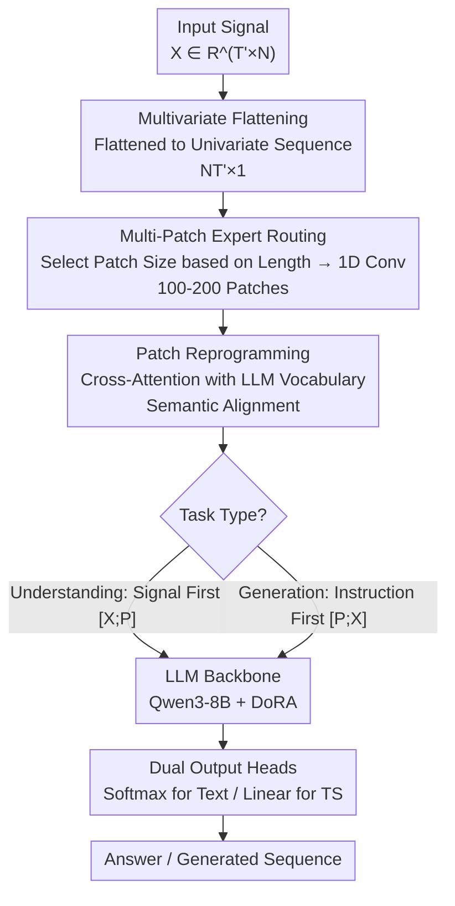

# SciTS: Scientific Time Series Understanding and Generation with LLMs

## TL;DR
The authors propose the SciTS benchmark, covering 43 tasks and 54K+ instances across 12 scientific fields (with lengths from $10^0$ to $10^7$ and frequencies up to 10MHz). Systematic evaluation of 17 models reveals that general LLMs generalize better than specialized time series models, though text/image encodings have limitations. Accordingly, the TimeOmni framework is designed using Multi-Patch Experts, a routing mechanism, and Patch Reprogramming to explicitly model temporal dynamics and train jointly with LLMs.

## Background & Motivation

**Background**: While the scientific reasoning capabilities of LLMs have gained significant attention, time series—a fundamental modality in scientific data (physics, astronomy, biology, engineering, etc.)—is largely overlooked in current multimodal LLMs. Existing methods either encode numerical sequences as text (resulting in extremely long sequences) or convert them into images (losing numerical precision), failing to adequately support scientific time series understanding and generation.

**Limitations of Prior Work**: (1) Existing time series benchmarks focus primarily on routine tasks like forecasting or anomaly detection, lacking coverage of scientific domains (astronomy, earth science, neuroscience, etc.); (2) Unified time series models either perform only forecasting or only analysis, failing to handle both understanding and generation; (3) Scientific signals are highly heterogeneous (astronomical light curves vs. EEG signals vs. seismic waves vs. radar communications), making it difficult for existing models to adapt.

**Key Insight**: Construct the first comprehensive scientific time series benchmark, SciTS → Perform systematic evaluation to identify issues → Design the LLM-native time series processing framework, TimeOmni.

**Key Challenge**: Scientific signals span frequencies from $10^{-5}$Hz to $10^7$Hz, lengths from a few points to millions, and dimensions from 1 to 58. This extreme heterogeneity poses a severe challenge for unified modeling.

**Limitations of Prior Work**: Although UniTS integrates QA and forecasting, it relies on an independent architecture incompatible with general LLM training. Specialized models like Moirai and TimeMoE only support forecasting and cannot handle tasks like imputation or event localization.

**Goal**: A unified framework is required that leverages the reasoning and knowledge capabilities of LLMs while explicitly modeling temporal dynamics, maintaining compatibility with general LLM training pipelines.

## Method

### Overall Architecture

TimeOmni addresses a core difficulty: enabling a general LLM to both "understand" and "generate" scientific time series spanning 12 orders of magnitude in frequency and lengths from a few points to millions. Instead of brute-force conversion to text or images, it grafts an "explicit temporal encoder" onto a general LLM, allowing numerical sequences to be encoded at original precision and aligned with the LLM's semantic space. The pipeline consists of three components: a temporal encoder (Router + Patch Expert Family + Patch Reprogramming), an LLM backbone (Qwen3-8B with DoRA fine-tuning), and task-specific output heads (Softmax for text in understanding tasks, linear regression heads for generation tasks).

Data Flow: Given an input $\mathbf{X} \in \mathbb{R}^{T' \times N}$, it is first flattened along the time dimension into a univariate long sequence $\mathbf{X}' \in \mathbb{R}^{NT' \times 1}$. The router selects a suitable patch expert based on the total flattened length to segment the signal into 100-200 patches. These patches are aligned to the semantic space via a reprogramming module using the LLM vocabulary, resulting in $\mathbf{X}_{\text{enc}} \in \mathbb{R}^{T_{\text{enc}} \times D_{\text{llm}}}$ (where $T_{\text{enc}}$ is between 100-200). Finally, depending on the task type, these are concatenated with text prompt embeddings in different orders and fed to the LLM, with the corresponding head producing the text answer or time series.

### Key Designs

**1. Multi-Patch Expert Routing: Mapping Arbitrary Lengths to 100-200 Tokens**

Scientific time series lengths span $10^0$ to $10^7$; fixed patch sizes are insufficient. Small patches cause the number of tokens to explode for long sequences, while large patches collapse short sequences into a single token, losing all info. TimeOmni uses a router to pick a patch size $D_{\text{patch}}$ based on total length $T = NT'$, constrained such that $\frac{T}{200} < D_{\text{patch}} < \frac{T}{100}$. This ensures the number of patches remains between 100 and 200 regardless of original signal length. The selected Patch Expert reshapes the signal from $\mathbb{R}^{T \times 1}$ to $\mathbb{R}^{\lceil T/D_{\text{patch}} \rceil \times D_{\text{patch}}}$ and maps it to $\mathbf{X}_{\text{patch}} \in \mathbb{R}^{\lceil T/D_{\text{patch}} \rceil \times D_{\text{enc}}}$ using 1D convolution. This scale-adaptive patching resolves the conflict between sequence length and information collapse.

**2. Patch Reprogramming: Aligning TS to Semantic Space via LLM Vocabulary**

Directly inserting temporal embeddings into LLMs faces modality misalignment. TimeOmni (following the Time-LLM reprogramming concept) uses the LLM's existing word embeddings $\mathbf{E} \in \mathbb{R}^{\text{vocab\_size} \times D_{\text{llm}}}$ as a bridge. It first compresses these into a set of semantic prototypes $\mathbb{R}^{1000 \times D_{\text{llm}}}$, then performs multi-head cross-attention with patch representations as queries and word embeddings as keys/values:

$$\mathbf{X}_{\text{enc}} = \text{Linear}(\text{CrossAttn}(\mathbf{X}_{\text{patch}}, \mathbf{E}, \mathbf{E}))$$

Each temporal patch is rewritten as a weighted combination of LLM vocabulary semantics, placing it within the LLM's familiar representation space.

**3. Prompt Strategy and Dual Output Heads: Data-First for Understanding, Instruction-First for Generation**

Understanding and generation tasks have inverted cognitive flows. Understanding tasks (classification/anomaly detection/QA) use "Prompt-as-suffix," placing the signal before the question $[\mathbf{X}_{\text{enc}}; \mathbf{P}]$, simulating a human observing data before answering. Generation tasks (prediction/imputation/synthesis) use "Prompt-as-prefix," placing instructions before the signal $[\mathbf{P}; \mathbf{X}_{\text{enc}}]$, understanding task requirements before processing the signal. For generation, the framework adopts a set of regression heads covering different output lengths, matching the closest length at runtime and performing necessary truncation.

**4. Multivariate Signal Processing: Flattening for Cross-Channel Dependence**

Scientific signal dimensions vary from 1 up to 58. Instead of separate encoders for each channel, TimeOmni flattens $\mathbf{X} \in \mathbb{R}^{T' \times N}$ along the time dimension into $\mathbf{X}' \in \mathbb{R}^{NT' \times 1}$, treating it as a single univariate sequence. This allows the scale-adaptive patching and convolutional experts to naturally capture cross-channel temporal dependencies, though it may sacrifice some structured channel info (e.g., spatial topology in EEG).

## Key Experimental Results

### Understanding Task Results (F1%, Average per Discipline)

| Model | Astro | Bioacoustics | Earth | Econ | Weather | Manuf | Neuro | Physio | Radar | Urban | Avg Rank |
|------|------|---------|---------|------|------|------|---------|------|------|------|---------|
| GPT-4.1-mini | 41.4 | 6.7 | 67.0 | 90.4 | 45.3 | 31.7 | 13.5 | 26.8 | 17.6 | 64.4 | 6.1 |
| Gemini2.5-Flash | 40.2 | 10.3 | 67.6 | 87.8 | 51.8 | 28.8 | 12.7 | 31.8 | 17.2 | 64.6 | 5.5 |
| GPT-5-mini (Multimodal) | 42.3 | 10.7 | 67.6 | 83.8 | 45.3 | 38.4 | 13.9 | 25.0 | 16.5 | 64.8 | 6.0 |
| UniTS | 38.2 | 8.1 | 0.0 | 27.1 | 9.8 | 48.5 | 25.9 | 22.9 | 10.6 | 67.4 | 7.9 |
| ChaTS | 11.3 | — | 64.8 | 79.2 | 51.2 | — | 22.7 | 30.9 | 13.9 | 65.4 | 9.2 |
| **TimeOmni** | **73.2** | **58.1** | **82.5** | **96.4** | **61.3** | **82.0** | **60.1** | **45.9** | **68.9** | **64.8** | **1.9** |

### Generation Task Results (swMAPE, Lower is Better)

| Model | Astro | Earth | Weather | Econ | Neuro | Energy | Physio | Urban | Math | Avg Rank |
|------|------|---------|------|------|---------|------|------|------|------|---------|
| GPT-4.1-mini | 100.9 | 65.0 | 85.0 | 112.2 | 61.4 | 2.0e3 | 610.6 | 670.0 | 1.2e3 | 6.7 |
| Gemini2.5-Flash | 116.6 | 63.0 | 107.5 | 4.5 | 38.7 | 307.6 | 60.5 | 391.4 | 477.5 | 4.6 |
| Moirai-Large | — | — | 51.7 | 1.8 | — | — | — | — | 360.1 | 8.3 |
| UniTS | 3.3e6 | — | 42.0 | — | 147.3 | — | 216.3 | — | — | 9.8 |
| **TimeOmni** | **2.8** | **2.2** | **37.5** | **5.3** | **46.6** | **66.4** | **91.7** | **402.7** | **656.5** | **4.1** |

## Key Findings

1. **General LLMs Generalize Better than Specialized TS Models**: Across the 12 scientific domains of SciTS, general LLMs (e.g., GPT-4.1-mini, Gemini2.5-Flash) demonstrate stronger cross-domain generalization than specialized time series models (Moirai, TimeMoE). Specialized models degrade sharply on scientific signals outside their training distribution.

2. **Task-Dependency of Text vs. Image Encoding**: Image inputs outperform text for understanding tasks (high-level understanding doesn't rely on exact values, and images compress long sequences better). Text inputs outperform images for generation tasks (numerical precision is critical), revealing the complementary nature of these encodings.

3. **High Difficulty of SciTS**: F1 scores in Bioacoustics and Radar are generally below 10%. High-frequency long sequences (millions of points) cause context overflow or instruction following failures for many models. Open-source LLMs fail completely on approximately 10% of tasks.

4. **TimeOmni Achieves Full Coverage + Success**: TimeOmni is the only model to successfully process all instances across all 43 tasks, achieving optimal or near-optimal performance in both understanding (avg. rank 1.9) and generation (avg. rank 4.1).

5. **Ablation Studies Validate Designs**: (1) Replacing Patch Reprogramming with MLP consistently reduces performance; (2) Fixed patch sizes cause severe degradation on extreme-length sequences; (3) Fine-tuning Qwen2.5VL or TimeMoE does not compensate for architectural limitations, indicating the problem lies in architecture rather than data.

## Highlights & Insights

- **SciTS Fills a Critical Gap**: It provides the first benchmark covering 12 scientific domains with 7 task types and extremely heterogeneous signals (frequency spanning 12 orders of magnitude), offering a standardized platform for LLM scientific time series evaluation.
- **Counter-intuitive "General > Specialized" Finding**: Specialized TS models perform worse than general LLMs on non-periodic scientific signals, suggesting that general reasoning and world knowledge are more important than domain-specific design.
- **Theoretical Elegance of Patch Routing**: By constraining the number of tokens to 100-200 via $T/200 < D_{\text{patch}} < T/100$, TimeOmni avoids long-sequence issues while maintaining information density.
- **Framework Compatibility**: TimeOmni integrates seamlessly into general LLM pipelines, allowing joint training with other modalities (text/image/audio), laying the groundwork for true scientific multimodal LLMs.

## Limitations

- All baseline models were evaluated in a zero-shot setting without domain-specific fine-tuning, which may underestimate their potential.
- TimeOmni is based on Qwen3-8B; larger scale effects have not been fully explored.
- SciTS data mostly comes from open-source datasets and simulations, which may differ from raw experimental data distributions in actual research.
- Simple flattening of multivariate signals might lose structural channel information (e.g., spatial topology in EEG).
- "Thinking" modes of closed-source LLMs were not evaluated (preliminary tests showed no improvement despite high costs).

## Related Work & Insights

### vs. Chronos/Moirai/TimeMoE (Specialized TS Models)
These models excel in specific forecasting tasks (e.g., Moirai has the lowest swMAPE in Economics and Math) but have **extremely low task coverage** (forecasting only). SciTS reveals their generalization bottleneck: architectures designed for regular periodic signals struggle with heterogeneous scientific signals.

### vs. UniTS/ChaTS (Unified TS Models)
UniTS attempts to integrate QA and forecasting but relies on an independent architecture. ChaTS supports analysis but fails completely in some domains. TimeOmni achieves **unification of understanding and generation** via LLM-native design while maintaining training compatibility.

### vs. Multimodal LLMs (GPT-5-mini/InternVL/QwenVL)
Image encoding has advantages in high-level understanding (compressing long sequences) but is severely limited in generation tasks requiring numerical precision. TimeOmni avoids this dilemma through explicit temporal encoding, performing excellently in both task types.

## Rating

- **Novelty**: ⭐⭐⭐⭐⭐ First comprehensive scientific TS benchmark + LLM-native TS framework.
- **Experimental Thoroughness**: ⭐⭐⭐⭐⭐ Large-scale evaluation (17 models × 43 tasks × 12 domains) + ablation.
- **Writing Quality**: ⭐⭐⭐⭐ Rigorous benchmark design, informative charts, clear motivation.
- **Value**: ⭐⭐⭐⭐⭐ Significant push for LLM scientific applications; both benchmark and framework are open-source.

<!-- RELATED:START -->

## Related Papers

- [\[ICLR 2026\] Rating Quality of Diverse Time Series Data by Meta-learning from LLM Judgment](rating_quality_of_diverse_time_series_data_by_meta-learning_from_llm_judgment.md)
- [\[ICML 2026\] TimeOmni-VL: Unified Models for Time Series Understanding and Generation](../../ICML2026/time_series/timeomni-vl_unified_models_for_time_series_understanding_and_generation.md)
- [\[ICLR 2026\] CTBench: Cryptocurrency Time Series Generation Benchmark](ctbench_cryptocurrency_time_series_generation_benchmark.md)
- [\[ICLR 2026\] Understanding Transformers in Time Series Forecasting: A Case Study on MOIRAI](understanding_transformers_for_time_series_forecasting_a_case_study_on_moirai.md)
- [\[AAAI 2026\] Finding Time Series Anomalies using Granular-ball Vector Data Description](../../AAAI2026/time_series/finding_time_series_anomalies_using_granular-ball_vector_data_description.md)

<!-- RELATED:END -->
