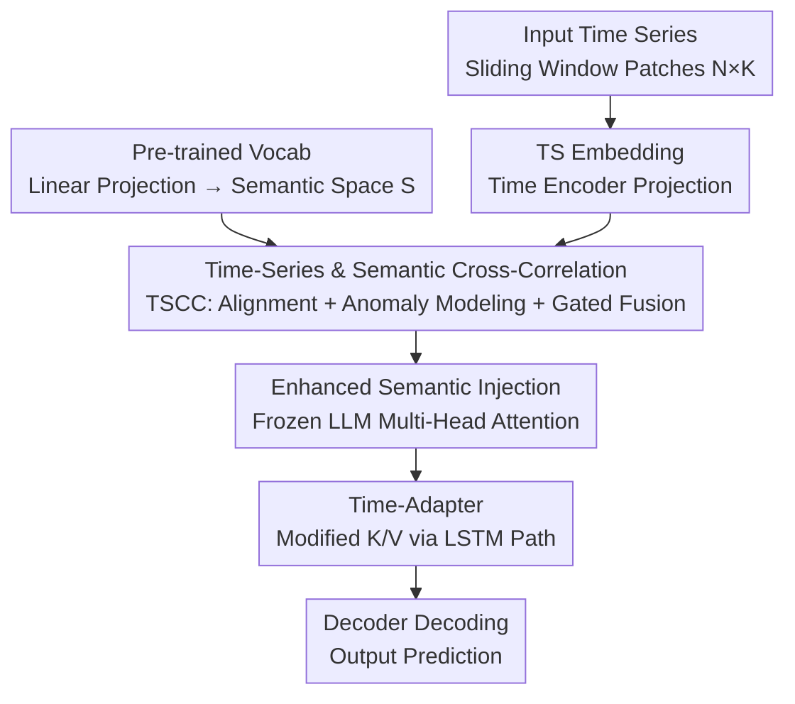

# Semantic-Enhanced Time-Series Forecasting via Large Language Models

**Conference**: ICLR 2026  
**OpenReview**: [https://openreview.net/forum?id=GZ9uSxY3Yn](https://openreview.net/forum?id=GZ9uSxY3Yn)  
**Code**: https://github.com/LH325/SE-LLM  
**Area**: Time-Series Forecasting / LLM4TS  
**Keywords**: Time-Series Forecasting, Large Language Models, Semantic Enhancement, Anomaly Modeling, Adapter Tuning

## TL;DR
SE-LLM enhances token representations by injecting the periodicity and anomaly characteristics of time series into the semantic space of a pre-trained LLM (via the TSCC module). It further utilizes an LSTM-embedded adapter (Time-Adapter) to complement the LLM's capacity for modeling long- and short-term temporal dependencies, achieving state-of-the-art (SOTA) performance across long-term, short-term, and zero-shot forecasting while keeping the LLM frozen and compressing the sequence length.

## Background & Motivation
**Background**: Utilizing LLMs for time-series forecasting has become a prominent research direction. Prevailing methods typically project time-series data into embeddings and align them with the semantic space of the LLM's pre-trained vocabulary, or convert time series into text prompts for a frozen LLM (e.g., Time-LLM, S2IP-LLM, LLM4TS) to leverage the LLM's generalization capabilities for capturing temporal dependencies.

**Limitations of Prior Work**: Most existing methods are limited to **token-level modality alignment**, treating time-series embeddings aligned with semantic space as implicit prompts to guide the LLM. However, token-level alignment ignores the intrinsic **temporal and channel dependencies**, making it difficult to characterize dynamic time-series patterns. Additionally, introducing explicit text descriptions incurs noise and extra computational overhead.

**Key Challenge**: A **fundamental modality gap** exists between the structure of linguistic knowledge and the patterns of time-series data. The Transformer architecture in LLMs excels at capturing long-range dependencies but is naturally disadvantaged in modeling **short-term anomalies/abrupt changes**. Furthermore, fine-tuning all parameters can compromise the universal semantic capabilities obtained during LLM pre-training, leading to cross-domain instability.

**Goal**: Without fine-tuning the LLM backbone, the objectives are: (1) to ensure token embeddings truly carry time-series patterns (including periodicity and anomalies) rather than performing superficial alignment; (2) to fill the gap in the LLM's modeling of long- and short-term temporal dependencies.

**Key Insight**: The authors observe that the semantic space, composed of tokens and time steps, contains exploitable structural priors. If anomalous and non-anomalous patterns can be explicitly decoupled and injected into the semantic space, the tokens become more **interpretable** to the LLM, effectively serving as implicit prompts with temporal semantics.

**Core Idea**: Replace "token alignment" with "semantic enhancement"—incorporating time-series patterns into the semantic space via cross-modal alignment, an Anomaly Modeling VAE, and gated fusion (TSCC), then transforming these semantics into temporal modeling capabilities using an LSTM-based adapter (Time-Adapter).

## Method

### Overall Architecture
The input to SE-LLM is a batch time-series matrix (batch $B$, length $L$). First, a **sliding window** segments the time dimension into $N$ patches of length $K$, resulting in $\tilde{T}\in\mathbb{R}^{B\times N\times K}$. This step reduces the sequence length processed by the LLM from $L$ to $N$, lowering self-attention complexity from $O(L^2)$ to $O(N^2)$, which forms the basis for "freezing the LLM + saving computation."

After patching, the flow splits: one path uses a Time Encoder to project the series into a TS Embedding $H=F_2(\sigma(F_1(\tilde{T})))\in\mathbb{R}^{B\times N\times C}$. The other path linearly maps the pre-trained vocabulary matrix $W\in\mathbb{R}^{V\times C}$ into a semantic space $S\in\mathbb{R}^{K_s\times C}$ as a general linguistic prior. Both are fed into the **TSCC module** to obtain enhanced semantics, which are then injected into the multi-head attention of the frozen LLM. Here, the key/value pairs are modified by the **Time-Adapter** to supplement temporal dependencies. Finally, the Decoder decodes the LLM output into the forecast $O=F_2(\sigma(F_1(Y)))$. Only the TSCC, Time-Adapter, and Encoder/Decoder are trainable; the LLM remains frozen throughout.

### Key Designs

**1. TSCC Module: Injecting Anomaly/De-anomaly Patterns into Semantic Space**

This is the core component addressing the limitation that "token-level alignment ignores temporal dynamics," consisting of four sequential steps. **Step 1: Cross-modal Alignment**: Cross-attention aligns the TS Embedding $H$ and semantic space $S$ into a joint space $C=\text{CrossAttn}(H,S)\in\mathbb{R}^{B\times N\times C}$, enabling temporal features to adaptively merge with semantic priors. **Step 2: Anomaly Modeling (AM-VAE)**: Non-stationary anomaly noise in time series can increase prediction bias. The authors use a Variational Autoencoder to estimate the latent distribution of the joint representation $C$. The encoder predicts the mean $\mu$ and log-variance, and after reparameterization $z=\mu+\epsilon\odot\sigma$, it decodes the **anomaly semantics** $D_C=F_d(z)$. The **de-anomaly semantics** is then obtained as $D_A=C-D_C$. It is important to note that this does not directly predict future observations but reconstructs anomaly-related components in the latent semantic space to explicitly decouple anomalies.

**Step 3: Structural Prior Injection**: $L_2$ normalization is applied to time-series and semantic features to calculate similarity $M=\text{Norm}_2(\text{Mean}_N(H))\times\text{Norm}_2(S)^T$. Top-K semantic prototypes are selected based on sample-level similarity to aggregate structural priors, which then condition $D_A$ and $D_C$. **Step 4: Channel Dependency Enhancement + Gated Fusion**: TS Embedding is concatenated with $D_A/D_C$ and passed through an MLP to obtain channel attention $\text{Attn}_a=\text{MLP}([H,D_A])$. Gated fusion then re-injects the temporal patterns into the joint space $G_A=F_{llm}(\text{Attn}_a\odot H+(1-\text{Attn}_a)\odot D_A)$ (similarly for $D_C$ to obtain $G_C$). The final input to the LLM is $Y=\text{LLM}(G_A+G_C)$. Both de-anomaly and anomaly semantics are enhanced by temporal patterns before fusion, making the resulting tokens more interpretable as implicit prompts carrying periodicity and anomaly information.

**2. Time-Adapter: Complementing Temporal Modeling via LSTM-based Adaptation**

To address the weakness of Transformers in capturing short-term anomalies despite their strength in long-range dependencies, the authors modify the LoRA framework. The low-rank matrices in LoRA are replaced by a **bilinear layer followed by two serial LSTMs**. The process follows four steps: low-rank projection for dimensionality reduction; a first LSTM to increase dimensionality and capture long-term dependencies; a second LSTM via inverse projection (high to low dimension) to isolate local short-term dynamics; and a final linear layer to integrate these temporal dependencies into the self-attention key ($k$) and value ($v$) matrices. Unlike standard LoRA, which only enhances semantic understanding, the Time-Adapter explicitly models long- and short-term dependencies through LSTM paths and embeds them directly into the K/V matrices, enabling the frozen LLM to effectively process time series.

### Loss & Training
The LLM backbone is frozen; only TSCC, Time-Adapter, and the Encoder/Decoder are trained. AM-VAE utilizes the reparameterization trick for sampling and is optimized end-to-end with the standard forecasting loss. The sliding window reduces the sequence length from $L$ to $N$, significantly decreasing the computational cost of self-attention and FFN, keeping the framework lightweight.

## Key Experimental Results

### Main Results
Long-term forecasting (Input length 672, prediction horizons $\{96, 192, 336, 720\}$), where lower MSE/MAE is better:

| Dataset | Metric | SE-LLM | Best Baseline | Description |
|--------|------|--------|----------|------|
| ETTh1 | MSE/MAE | **0.381 / 0.415** | 0.396 / 0.419 (Time-CMA) | Overall lead |
| Traffic | MAE | **0.261** | 0.274 (iTransformer) | ~4.7% relative reduction in MAE |
| ECL | MSE/MAE | **0.161 / 0.255** | 0.161 / 0.258 | Most stable under periodic consumption |
| Solar | MSE/MAE | **0.192 / 0.242** | 0.207 / 0.246 (AutoTimes) | Lead in seasonal/trend-heavy scenarios |

Short-term forecasting (M4, average across all subsets): SE-LLM achieved SMAPE 11.778 / MASE 1.578 / OWA 0.847, yielding relative reductions of approximately 0.42% / 0.13% / 0.35% compared to the runner-up. Zero-shot (M3 ↔ M4 frequency transfer): M3 → M4 SMAPE 13.024; M4 → M3 12.560, both surpassing AutoTimes (13.036 / 12.750), with a relative Gain of ~1.4% on M4 → M3.

### Ablation Study
Ablation of TSCC components (ETTh1, average MSE/MAE):

| Configuration | MSE / MAE | Description |
|------|-----------|------|
| Full model | **0.381 / 0.415** | Best with all four modules |
| w/o AM-VAE | 0.393 / 0.423 | Significant drop without anomaly modeling |
| w/o Cross Attn | 0.396 / 0.425 | Weakened cross-modal alignment via linear concat |
| w/o Gated Fusion | 0.399 / 0.432 | Largest drop without channel dependency modeling |
| w/o Semantic Space | 0.402 / 0.431 | Loss of explicit semantic guidance via learnable matrix |

Step-wise ablation (Qwen2.5-0.5B, ECL/Traffic): Baseline → +TSCC → +Time-Adapter. For ECL, MSE improved from 0.167 → 0.166 → 0.161. For Traffic, it improved from 0.405 → 0.389 → 0.386, demonstrating incremental gains from both innovative modules.

### Key Findings
- **Gated Fusion (Channel Dependency) contributes most**, with the largest performance drop (MSE 0.381 → 0.399) when removed, highlighting the necessity of restoring channel-wise information after cross-modal fusion.
- **AM-VAE yields uneven gains**: It significantly helps datasets with strong distribution shifts and irregular dynamics, but provides less benefit for stable series where modeling stochastic changes is less critical.
- **Time-Adapter > LoRA**: While LoRA lacks generalization gains in long-term forecasting, the Time-Adapter's explicit modeling of long- and short-term dependencies via LSTM paths effectively adapts the LLM to forecasting tasks.
- TSCC and Time-Adapter, as **plug-and-play components**, improve the performance of Time-LLM, AutoTimes, and TimeCMA, validating their generalizability.

## Highlights & Insights
- **Treating "Anomalies" as Modelable Semantic Components**: Using a VAE to reconstruct $D_C$ in the semantic space and subtracting it to obtain $D_A$ explicitly decouples the most difficult-to-characterize changes. This provides a layer of temporal semantics beyond simple token alignment.
- **Modifying LoRA instead of reinventing it**: By keeping LoRA's low-rank injection location (K/V) but replacing the matrices with LSTMs, the method reuses the efficient fine-tuning paradigm while addressing the Transformer's temporal shortcomings.
- **Frozen + Patching for Efficiency**: The sliding window reduces complexity to $O(N^2)$, ensuring the framework remains lightweight and efficient while using a frozen large model.

## Limitations & Future Work
- The authors admit that AM-VAE benefits depend on data characteristics, with limited improvement on stationary sequences, and a mechanism to adaptively determine when to enable anomaly modeling is missing.
- Top-K semantic prototype selection may introduce noise or amplitude perturbations across different architectures, requiring extra normalization for stability; sensitivity to hyperparameters (K, patch length) is not fully explored.
- Validation was performed on smaller models like Qwen2.5-0.5B and GPT-2; whether the trade-off between semantic enhancement and compute remains favorable for larger LLMs is yet to be observed.
- Anomaly modeling and qualitative analysis rely on STL residuals and t-SNE visualizations; a quantitative measure of whether "reconstructed semantics = real anomalies" is lacking.

## Related Work & Insights
- **vs Time-LLM / S2IP-LLM**: These methods use text prototypes or semantic prompts for token-level alignment but ignore temporal and channel dependencies. SE-LLM explicitly injects anomaly/de-anomaly patterns into the semantic space.
- **vs LLM4TS / TimeCMA**: While these also use frozen LLMs for cross-modal alignment, SE-LLM adds the Time-Adapter to rewrite attention K/V for better long/short-term modeling and can serve as a plugin to improve these baselines.
- **vs AutoTimes (LoRA + GPT-2)**: AutoTimes uses LoRA for long-range forecasting. This study shows LoRA’s temporal generalization is weak, and the LSTM-based Time-Adapter is superior across long-term, short-term, and zero-shot scenarios.

## Rating
- Novelty: ⭐⭐⭐⭐ The combination of "anomaly semantic decomposition + LSTM-based adapter" targets real weaknesses in LLM4TS from a fresh perspective.
- Experimental Thoroughness: ⭐⭐⭐⭐ Comprehensive long/short/zero-shot, multi-backbone, and plug-and-play ablation, though hyperparameter sensitivity is slightly under-reported.
- Writing Quality: ⭐⭐⭐⭐ Clear architectural diagrams and algorithm descriptions, though some formulas are dense.
- Value: ⭐⭐⭐⭐ Plug-and-play modules offer direct reuse value for the LLM4TS community.

<!-- RELATED:START -->

## Related Papers

- [\[ICLR 2026\] TimeOmni-1: Incentivizing Complex Reasoning with Time Series in Large Language Models](timeomni-1_incentivizing_complex_reasoning_with_time_series_in_large_language_mo.md)
- [\[ICLR 2026\] Multi-Scale Hypergraph Meets LLMs: Aligning Large Language Models for Time Series Analysis](multi-scale_hypergraph_meets_llms_aligning_large_language_models_for_time_series.md)
- [\[ICML 2026\] Building Social World Models with Large Language Models](../../ICML2026/time_series/building_social_world_models_with_large_language_models.md)
- [\[ICML 2026\] Semantics-Enhanced Retrieval-Augmented Time Series Forecasting](../../ICML2026/time_series/semantics-enhanced_retrieval-augmented_time_series_forecasting.md)
- [\[ICLR 2026\] Towards Multimodal Time Series Anomaly Detection with Semantic Alignment and Condensed Interaction](towards_multimodal_time_series_anomaly_detection_with_semantic_alignment_and_con.md)

<!-- RELATED:END -->
