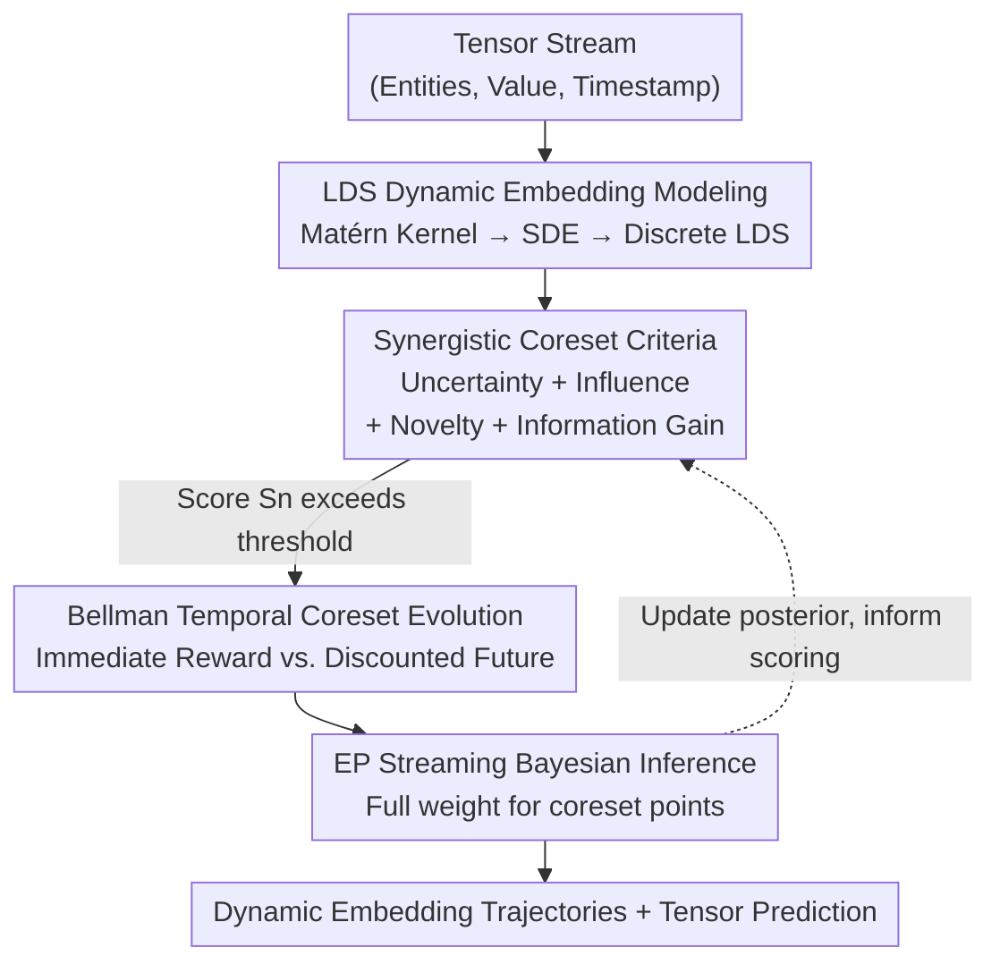

# SONATA: Synergistic Coreset Informed Adaptive Temporal Tensor Factorization

**Conference**: ICLR 2026  
**OpenReview**: [https://openreview.net/forum?id=P1PZBR6a4S](https://openreview.net/forum?id=P1PZBR6a4S)  
**Code**: https://github.com/Applied-Machine-Learning-Lab/ICLR2026_SONATA  
**Area**: Temporal Tensor Factorization / Streaming Learning  
**Keywords**: Dynamic Tensor Streams, Tensor Factorization, Coreset Selection, Linear Dynamical Systems, Bayesian Streaming Inference

## TL;DR
SONATA unifies "expressive dynamic embedding modeling" and "adaptive coreset sample selection" into a streaming tensor factorization framework. It employs Linear Dynamical Systems (LDS) derived from Matérn kernels to characterize the multi-scale temporal evolution of entity embeddings. By utilizing a four-criterion scoring system comprising "Uncertainty + Influence + Novelty + Information Gain" in conjunction with the Bellman equation to dynamically maintain a compact, highly informative coreset, the model reduces the RMSE by up to 61.5% relative to the runner-up method on datasets like CA Traffic under a single-pass data stream constraint.

## Background & Motivation
**Background**: Multi-way data in reality (recommendation, traffic, environmental monitoring, neuroscience) is naturally represented as tensors and increasingly arrives as "high-speed continuous streams." A core task in this field is to learn dynamic embeddings $u_j^{(k)}(t)$ online from such streams to encode the evolving attributes of entities. Classical factorizations (CP, Tucker) only learn static embeddings; early temporal extensions treat time as an extra mode or discretize it; recent continuous-time models (CT-CP using splines, THIS-ODE using Neural ODEs, NONFAT, etc.) have begun to characterize continuous evolution.

**Limitations of Prior Work**: The authors highlight two long-standing challenges. The first is **insufficient modeling expressiveness**—temporal representations used by static methods and simple temporal extensions are too coarse to capture complex non-stationary dynamics; even continuous-time variants like splines struggle in irregular sampling or streaming scenarios. The second is **streaming efficiency**—processing every observation in a stream is computationally prohibitive, yet existing streaming methods either process all data indiscriminately or rely on heuristic sampling.

**Key Challenge**: The "informational value of streaming observations is highly non-uniform"—a large number of samples are redundant, while only a small subset of samples is decisive for improving representation quality and prediction accuracy. Without explicitly prioritizing these high-value samples, the model wastes computational power on low-value observations and may miss crucial data points. To "learn only the most useful samples," one must first have a sufficiently expressive model to assess "what is useful"—both issues must be addressed simultaneously.

**Goal**: Construct a streaming tensor factorization framework that possesses both sufficient modeling capability and a principled way to screen informative samples. This is decomposed into two sub-problems: (1) how to characterize fine-grained, multi-scale temporal evolution in a way that handles streaming/irregular time; (2) how to judge the value of each observation online and maintain a high-information subset within a finite budget.

**Key Insight**: Regarding expressiveness, embeddings are modeled as **Linear Dynamical Systems (LDS)** derived from expressive kernels like Matérn, which naturally support continuous time and multi-scale dynamics. Regarding efficiency, a **dynamic coreset** is introduced, jointly evaluating uncertainty, novelty, influence, and information gain to decide coreset membership, using the Bellman equation for decisions oriented toward long-term returns.

**Core Idea**: By aligning "LDS temporal embeddings + four-criterion synergistic scoring + Bellman long-term optimized dynamic coreset" into a single framework for streaming Bayesian inference, SONATA represents—to the authors' knowledge—the first streaming tensor factorization that fully integrates temporal considerations into coreset selection.

## Method

### Overall Architecture
SONATA processes a $K$-mode tensor stream where data arrives continuously as triplets $(\ell_n, y_n, t_n)$. Here, $\ell_n$ represents the indices of involved entities, $y_n$ is the observation at time $t_n$, and the goal is to learn the time-varying embeddings $u_j^{(k)}(t)$ of each entity online and predict tensor values. The entire pipeline can be understood as "first assigning a smooth embedding trajectory to each entity using a dynamical system, then calculating an importance score for each arriving sample to decide if it is worth inclusion in the coreset, and finally performing Bayesian updates primarily (or exclusively) using samples in the coreset."

Specifically, each entity's embedding is driven by an LDS, with hidden states evolving according to Stochastic Differential Equations (SDEs), and observed embeddings are linear projections of these hidden states. In CP form, several entity embeddings are combined via element-wise products and summed to obtain tensor value predictions. For each candidate sample, the model synthesizes an importance score $S_n$ using four criteria (Uncertainty / Influence / Novelty / Information Gain). Points exceeding an adaptive threshold enter the coreset; the inclusion/exclusion of the coreset is modeled as a sequential decision problem using the Bellman equation to balance "immediate reward" and "discounted future reward," avoiding purely greedy local optima. Parameters (embeddings, noise precision) are updated via streaming Bayesian inference through Expectation Propagation (EP), where points in the coreset receive full weight while weights for points outside the coreset are decayed.

### Key Designs

**1. LDS-driven Dynamic Latent Factor Model: Characterizing Multi-scale Temporal Evolution with Kernel-induced State Spaces**

This design directly addresses the "insufficient modeling expressiveness" pain point. Instead of treating time as an extra mode or using coarse discretization, the authors assign a continuous trajectory driven by underlying hidden states $x_j^{(k)}(t)\in\mathbb{R}^S$ ($S\ge R$) to each entity $j$ (mode $k$) embedding $u_j^{(k)}(t)\in\mathbb{R}^R$. The hidden states follow an SDE:

$$\mathrm{d}x_j^{(k)}(t) = F\,x_j^{(k)}(t)\,\mathrm{d}t + L\,\mathrm{d}w(t),\qquad u_j^{(k)}(t)=H\,x_j^{(k)}(t),$$

where the feedback matrix $F$, projection matrix $H$, and steady-state covariance $P_\infty$ are determined by the chosen temporal kernel (typically from the Matérn family). For instance, the Matérn-$\nu=3/2$ kernel corresponds to $S=2R$, where the hidden state is exactly $[u_j^{(k)}(t)^\top, \dot u_j^{(k)}(t)^\top]^\top$—modeling both the embedding itself and its velocity. In discrete time, the SDE transforms into a standard LDS: $x_{j,t}^{(k)}=A(\Delta t)x_{j,t-\Delta t}^{(k)}+w$, where $A(\Delta t)=e^{F\Delta t}$ and $Q(\Delta t)=P_\infty - A(\Delta t)P_\infty A(\Delta t)^\top$. The advantage is that the kernel choice directly controls the smoothness and time scale of trajectories, and the continuous-time form naturally accommodates irregular sampling and streaming arrival, capturing non-stationary multi-scale dynamics better than splines or additive temporal modes. Experiments confirm this, showing Matérn-3/2 reduces RMSE by approximately 49% compared to Matérn-1/2.

**2. Synergistic Coreset Construction Criteria: Synthesizing an Importance Score from Four Complementary Criteria**

This is the core contribution of the paper, targeting the pain point of "highly non-uniform information value." SONATA maintains a coreset $C_t$ that is updated dynamically, calculating an importance score $S_n$ for each candidate point $n$:

$$S_n = w_u\,I_{\text{unc}}(n) + w_i\,I_{\text{inf}}(n) + w_n\,I_{\text{nov}}(n) + w_m\,I_{\text{mart}}(n),$$

where the four terms manage complementary perspectives. **Uncertainty** $I_{\text{unc}}$ is the average of the predicted covariance diagonal elements across $M$ modes; the model prioritizes points it is least certain about. **Influence** $I_{\text{inf}}$ calculates the cosine similarity between the interaction vector $z_n=\bigodot_m \mu^{(m)}_{\ell_{n,m}}$ (Hadamard product of entity prediction means) and existing coreset members to measure relevance. **Novelty** $I_{\text{nov}}$ is a weighted sum of "index novelty" (proportion of entity indices not yet seen in the coreset) and "temporal novelty" $1-\exp(-\lambda\,\Delta t_{\min})$ (distance to the nearest timestamp in northern coreset). **Information Gain** $I_{\text{mart}}$ is a martingale-based "surprise" measure, using squared prediction error $\Delta E_n=(y_n-\hat y_n)^2$ mapped to $[0,1)$ via $\tanh(\alpha\cdot\max(0,\Delta E_n))$ to estimate how much error reduction the point brings. Points exceeding an adaptive threshold $\theta_t$ (along with $\epsilon$-greedy exploration) enter $C_t$; if the budget $M_{\max}$ is exceeded, only the top-$M_{\max}$ points are retained. The significance of this synergy is that a single heuristic (only uncertainty or only error) would be biased, whereas these four criteria together select a truly diverse and high-information subset.

**3. Bellman Equation Driven Temporal Coreset Evolution: Sequential Decision Making for Long-term Gains**

Greedily picking points based only on the current $S_n$ is short-sighted—some points may have low current scores but help the model learn better in the future. The authors formulate "which candidates to include in the coreset at each step" as an optimal stopping/dynamic programming problem. They define a value function $V(C_t,\Theta_t)$ representing the expected future model performance given the current coreset and parameters. The action $a_t$ involves selecting a subset from candidates $\mathcal{D}_{\text{cand},t}$ to add and removing $P_t$ to meet the budget, resulting in $C_{t+1}=(C_t\cup a_t)\setminus P_t$. The selection is driven by the Bellman equation:

$$V(C_t,\Theta_t)=\max_{a_t\subseteq \mathcal{D}_{\text{cand},t}}\Big[R(C_t,a_t,\Theta_t)+\gamma_B\,\mathbb{E}_{\Theta_{t+1}}\big[V(C_{t+1},\Theta_{t+1})\big]\Big]$$

where the immediate reward $R$ can be the sum of importance scores or the immediate improvement in model fit/uncertainty, and $\gamma_B\in[0,1]$ discounts future rewards. Solving this (using lookahead or value function approximation) allows the model to make "strategic" data retention decisions. An experimental byproduct showed that the algorithm does not blindly fill the budget—increasing $M_{\max}$ from 2000 to 3000 only increased the final coreset size from 1597 to 1654, as novelty and uncertainty decreased once the coreset became representative.

### Loss & Training
SONATA uses streaming Bayesian methods to learn dynamic latent factors $\{u_j^{(k)}(t)\}$ and observation noise precision $\tau$ online. At each time $t_n$, the Kalman filter's prediction step provides the hidden state prior $p(x_{j,t_n}^{(k)}\mid D_{<t_n})$, which yields the embedding prior. Since the CP mapping $f(\cdot)$ is non-linear and the exact posterior is intractable, the authors use **Expectation Propagation (EP)** to approximate the posterior $p(\{u^{(k)}\},\tau\mid y_n, D_{<t_n})$. The Gamma posterior for noise precision $\tau$ is also updated via EP based on expected squared prediction error and the variance of $f(\cdot)$. Crucially, **whether a point is in the coreset determines its weight in the message update**—coreset points receive full weight, while non-coreset points have decayed weights, focusing the model's learning on the most informative data. Overall, SONATA deliberately uses mature statistical machine learning techniques (LDS, Kernels, EP) without relying on deep neural networks, balancing expressiveness with computational efficiency.

## Key Experimental Results

### Main Results
On four real-world datasets (CA Traffic 30K, ServerRoom, BeijingAir, FitRecord) with rank $R=5$ averaged over ten runs, SONATA consistently leads in RMSE. The most striking result is on CA Traffic 30K: it reduces the RMSE from 0.231 (the runner-up SFTL-CP) to 0.089, a relative decrease of 61.5% ($p<0.05$), despite only seeing the data once.

| Dataset (RMSE) | Ours (SONATA) | Runner-up | Gain |
|--------|------|----------|------|
| CA Traffic 30K | **0.089** | 0.231 (SFTL-CP) | −61.5% |
| ServerRoom | **0.115** | 0.117 (NONFAT) | −1.7% |
| BeijingAir | **0.237** | 0.248 (SFTL-CP) | −4.4% |
| FitRecord | **0.414** | 0.424 (SFTL-CP) | −2.4% |

Compared to static methods (requiring multiple passes) and recent continuous-time factorizations, SONATA achieves higher accuracy under single-pass streaming processing. These gains are attributed to adaptive evolution tracking, a natural focus on recent predictive observations, avoidance of overfitting non-stationary noise, and the coreset's ability to focus learning on the most informative samples.

### Ablation Study

| Configuration | Key Metrics | Description |
|------|---------|------|
| Matérn-3/2 vs. 1/2 | RMSE 0.1293 vs. 0.2539 | Switching to a smoother 3/2 kernel reduces RMSE by 49.1% and MAE by 47.0%. |
| lengthscale 0.1/0.3/0.5/0.9 | Lowest RMSE 0.1293 @0.3 | Too small leads to overfitting noise; too large leads to over-smoothing. |
| Runtime (Server) | 0.338s/iter | An order of magnitude faster than THIS-ODE (7.19s) with higher accuracy. |
| $M_{\max}$ 2000 → 3000 | RMSE 0.0938 → 0.0891 | Coreset size only grew from 1597 to 1654, utilization dropped from 79.9% to 55.1%, indicating saturation. |
| Discount Factor $\gamma$ | Best 0.5 (Server) / 0.9 (CA) | The optimal value of $\gamma$ is dataset-dependent. |

### Key Findings
- **Kernels and lengthscale determine the upper bound**: Matérn-3/2 significantly outperforms 1/2, and a lengthscale of 0.3 is optimal for Server—indicating that using the right temporal kernel is the primary source of expressiveness rather than parameter stacking.
- **Coreset reaches automatic saturation**: The algorithm does not blindly fill the budget; roughly 1600 high-quality samples are sufficient to capture the essential information of the stream. Marginal gains drop sharply thereafter, validating the threshold mechanism.
- **Data dependency of $\gamma$**: Server prefers immediate rewards ($\gamma=0.5$), while CA Traffic favors long-term utility ($\gamma=0.9$); $\gamma=0$ (pure greedy) is significantly worse for both, proving that Bellman long-term optimization is effective.
- **Coreset factors are "cleaner"**: Visualizations show that factor trajectories within the coreset have clear structural and periodic patterns (e.g., daily backups), while non-coreset factors are noisy and cluttered, providing signal-noise separation.

## Highlights & Insights
- **Coupling "Sample Selection" and "Modeling" as a closed loop**: Coreset criteria depend on the model's current predicted mean/covariance, while the model focuses learning on coreset points. Selection affects learning, and learning informs selection; this is more self-consistent than "modeling after sampling" or "sampling with a fixed model."
- **High transfer value of the four-criterion design**: The complementary scoring approach of Uncertainty / Influence / Novelty / Information Gain can be applied to any streaming or active learning scenario. The key is ensuring each criterion covers an orthogonal dimension to avoid bias.
- **Hadamard product alignment for influence**: Interaction vectors are element-wise products of entity embeddings, deliberately mimicking the CP prediction mechanism. This alignment of "similarity measurement" with the "model prediction mechanism" is a subtle yet clever detail.
- **Performance superior to Neural ODEs without deep networks**: The pure LDS + Kernel + EP statistical approach outperforms THIS-ODE in both accuracy and speed, reminding researchers that classical Bayesian state-space models remain highly competitive and interpretable for structured temporal problems.

## Limitations & Future Work
- **Non-uniqueness of Tensor Factorization**: The authors acknowledge that learned factor trajectories are just one interpretation of the system dynamics; neural networks might provide equally valid but different interpretations. Trajectory interpretability should be handled with caution.
- **Hyperparameter Sensitivity**: Weights $w_u,w_i,w_n,w_m$, threshold $\theta_t$, decay rate $\lambda$, scaling $\alpha$, and discount $\gamma_B$ all require tuning, and optimal values for $\gamma$ and lengthscale vary by dataset. An automatic selection scheme is missing.
- **Approximated Bellman Solution**: Long-term value functions rely on lookahead or value function approximation; the paper does not deeply analyze the impact of approximation errors on final coreset quality.
- **Prevalence of CP form**: Detailed methodology focuses on CP factorization; adaptation and performance discussions for more general structures like Tucker are relatively sparse.

## Related Work & Insights
- **vs. Streaming Tensor Methods (POST / ADF-CP / BASS-Tucker)**: These methods incrementally update CP/Tucker factors but lack continuous-time dynamic modeling; SONATA uses LDS + Matérn to learn multi-scale dynamics and leads these streaming baselines throughout.
- **vs. Continuous-time Factorization (CT-CP / CT-GP / NONFAT / THIS-ODE)**: These can characterize continuous evolution but require full datasets and multi-epoch training, making them unsuitable for high-speed streams; SONATA works in a single pass with higher accuracy and is an order of magnitude faster than Neural ODEs.
- **vs. Tensor Coreset Methods (e.g., LineFilter/KernelFilter by Chhaya et al.)**: Previous methods were limited to symmetric tensors, produced static coresets, and relied on local criteria, ignoring evolutionary dynamics and long-term utility. SONATA is the first coreset streaming tensor factorization to fully incorporate temporal considerations via joint criteria and Bellman optimization.

## Rating
- Novelty: ⭐⭐⭐⭐⭐ First to unify "expressive LDS embedding" and "four-criterion + Bellman dynamic coreset" in streaming tensor factorization; a natural yet previously missing perspective.
- Experimental Thoroughness: ⭐⭐⭐⭐ Extensive testing on four real datasets + synthetic data + multi-dimensional ablation; however, performance gains on some datasets are relatively incremental.
- Writing Quality: ⭐⭐⭐⭐ Motivation and methodology are clearly described with complete formulas; notation is heavy but self-consistent.
- Value: ⭐⭐⭐⭐ Provides a transferable set of synergistic criteria for "informative sample screening" in streaming/active learning scenarios; interpretable and independent of deep networks.

<!-- RELATED:START -->

## Related Papers

- [\[ICLR 2026\] STORM: Synergistic Cross-Scale Spatio-Temporal Modeling for Weather Forecasting](storm_synergistic_cross-scale_spatio-temporal_modeling_for_weather_forecasting.md)
- [\[ICLR 2026\] Tensor learning with orthogonal, Lorentz, and symplectic symmetries](tensor_learning_with_orthogonal_lorentz_and_symplectic_symmetries.md)
- [\[ICLR 2026\] Improving Extreme Wind Prediction with Frequency-Informed Learning](improving_extreme_wind_prediction_with_frequency-informed_learning.md)
- [\[ICLR 2026\] Learning Mixtures of Linear Dynamical Systems via Hybrid Tensor-EM Method](learning_mixtures_of_linear_dynamical_systems_via_hybrid_tensor-em_method.md)
- [\[ICLR 2026\] ASTGI: Adaptive Spatio-Temporal Graph Interactions for Irregular Multivariate Time Series Forecasting](astgi_adaptive_spatio-temporal_graph_interactions_for_irregular_multivariate_tim.md)

<!-- RELATED:END -->
