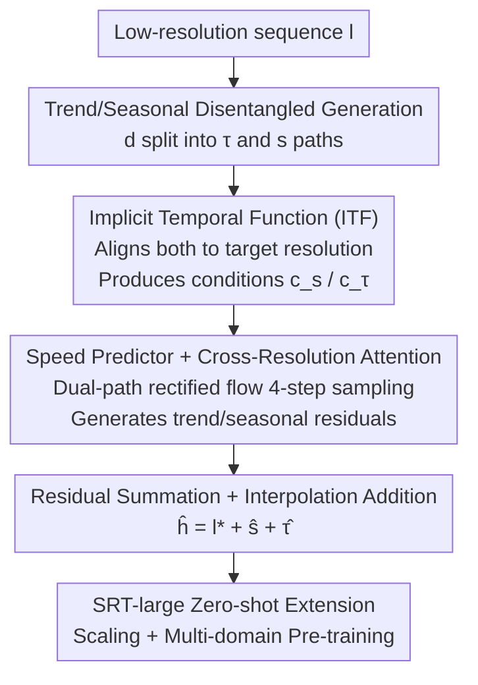

# SRT: Super-Resolution for Time Series via Disentangled Rectified Flow

**Conference**: ICLR2026  
**OpenReview**: [https://openreview.net/forum?id=I94Eg6cu7P](https://openreview.net/forum?id=I94Eg6cu7P)  
**Code**: To be confirmed  
**Area**: Time Series  
**Keywords**: Time Series Super-Resolution, Rectified Flow, Sequence Disentanglement, Implicit Neural Representation, Zero-shot

## TL;DR
SRT transfers the concepts of image super-resolution to time series: it first decomposes the low-resolution sequence into trend and seasonal components, aligns them to the target resolution using an Implicit Temporal Function (ITF), and then employs two rectified flow models with Cross-Resolution Attention to complement high-frequency details. It achieves SOTA on 9 datasets for both sampling-based and aggregation-based super-resolution tasks, requiring only 4-step sampling for inference.

## Background & Motivation

**Background**: Fine-grained, high-resolution time series are crucial for downstream analysis—high-resolution ECG in healthcare can capture subtle arrhythmias missed in low-frequency records, kilohertz vibration signals in industrial IoT can detect mechanical failures early, and climate modeling relies on temporally dense data. However, collecting high-resolution data is often constrained by device battery, communication bandwidth, storage, and computing power, resulting in a large amount of real-world data being coarsely sampled or aggregated.

**Limitations of Prior Work**: A natural idea is to directly migrate mature tools from image super-resolution (ISR)—such as GANs, diffusion, and flow matching—to reconstruct high-resolution sequences from low-resolution ones (referred to as TSSR, Time Series Super-Resolution). However, direct migration often yields suboptimal results because the priors for images and time series are fundamentally different; the dimensions and axes for scaling differ, and the visual priors relied upon by image SR do not hold for time series.

**Key Challenge**: Another seemingly similar path is time series imputation, which also "infers missing points based on observed context." However, the nature of "missingness" is different: imputation deals with randomly missing points in an originally high-resolution sequence, relying on assumptions like local smoothness or global consistency. TSSR, conversely, must **synthesize non-existent high-frequency components** (peaks, transient jitters) from systematically downsampled inputs, where smoothness assumptions fail. Even more difficult, the authors distinguish between two types of TSSR: Sampling SSR (low-res values are samples at specific points, $l_i^{(k)}=h_i^{(p_k)}$) and Aggregation SSR (low-res values are averages within a window, $l_i^{(k)}=\frac{1}{\alpha}\sum_{j=p_k}^{p_{k+1}} h_i^{(j)}$). ASR is inherently more ill-posed and underdetermined because the original high-frequency distribution is completely averaged out, leaving only statistical summaries.

**Goal**: To solve both SSR and the more challenging ASR within a unified framework, aiming for point-to-point accuracy, overall shape similarity, and realistic high-frequency detail synthesis.

**Key Insight**: The authors' key observation is that time series can naturally be disentangled into trend and seasonal components with distinct temporal dynamics (trend reflects the overall direction, seasonal reflects short-term regular fluctuations). Modeling them separately improves both fitting and interpretability. Additionally, low-resolution inputs contain numerous cues that should explicitly guide the generation of high-frequency details rather than letting the model generate blindly.

**Core Idea**: Use sequence disentanglement to split the rectified flow super-resolution process into parallel trend and seasonal flows. Constraints from alignment conditions extracted from the low-resolution sequence are used to bound the generation space, ensuring high-resolution details are "evidence-based."

## Method

### Overall Architecture

Instead of directly generating the high-resolution sequence $h$, SRT generates the "detail residual" $d$—the part of high-resolution details lost relative to $l^*$, which is the linear interpolation of the low-resolution input. The pipeline is as follows: the input low-resolution sequence is decomposed into trend $\tau$ and seasonal $s$ components using an Autoformer-style decomposition ($d=s+\tau$, $\tau=\text{AvgPool}(\text{Padding}(d))$); both components are first aligned from length $L$ to the target length $H'$ via an Implicit Temporal Function (ITF), producing high-resolution conditions $c_s, c_\tau$; then, two independent but structurally identical rectified flow velocity predictors, $V_s$ and $V_\tau$, use these conditions and the original low-resolution sequence as guidance to generate the seasonal/trend residuals, respectively; finally, the two residuals are summed and added back to the linear interpolation $l^*$ to obtain the final high-resolution result $\hat h=l^*+\hat s+\hat\tau$. SRT-large scales this architecture and utilizes large-scale pre-training to achieve zero-shot super-resolution capabilities.

### Key Designs

**1. Disentangled Dual-path Rectified Flow: Splitting an ill-posed problem into two tractable sub-problems**

Directly generating the entire residual $d$ is difficult because the mixed overall direction and short-term fluctuations interfere with each other. SRT first splits the residual into trend $\tau$ and seasonal $s$ via a moving average decomposition from Autoformer, then manages each path with a rectified flow. Rectified flow learns a nearly linear ODE transport path from a prior distribution $\pi_0$ to the target $\pi_1$. Given a linear interpolation path $s_t=ts_1+(1-t)s_0$, the speed predictors $V_s, V_\tau$ are optimized to fit the endpoint difference, with the objective:
$$\min \int_0^1 \mathbb{E}\big[(s_1-s_0-V_s(s_t,t,c_s,l))^2+(\tau_1-\tau_0-V_\tau(\tau_t,t,c_\tau,l))^2\big]\,dt.$$
Since the learned transport path is nearly straight, high-fidelity generation requires only 4-step Euler sampling ($\hat s_{k_{i+1}}=\hat s_{k_i}+(k_{i+1}-k_i)V_s(\cdot)$, starting from standard Gaussian), whereas DDPM performs worse even with 200 steps. This disentanglement not only simplifies fitting but also enhances interpretability—for example, when downscaling rainfall from daily to hourly, the trend path reflects the overall movement of high-resolution precipitation, while the seasonal path reveals short-term regular fluctuations, with their contributions explicitly isolated.

**2. Implicit Temporal Function (ITF): "Interpolating" low-resolution conditions to the target timeline via implicit neural representation**

To serve as conditions for rectified flow, both components must first be aligned from length $L$ to the high-resolution timeline $H'$, but simple linear interpolation cannot recover useful high-frequency structures. ITF treats components as continuous functions of time and uses a learnable interpolator to bridge the grain size gap in three steps. **Temporal enrichment**: A set of dilated window offsets $\delta\in\{\pm 2^i\}\cup\{0\}$ within a radius $r$ is used to concatenate channels within the window into each timestep, trading dilated windows for a large receptive field to capture long-range dependencies. **Value prediction**: Given a candidate step $j_c^{(o)}$ on the original axis and its enriched value, a small network $g(\cdot;\phi)$ predicts the value for the $k^{(t)}$-th step on the target axis, including the coordinate difference $k^{(t)}-T(j_c^{(o)})$ in the input. **Pattern smoothness**: Trends are aggregated through locality—weighted averaging of neighboring candidates by the inverse of their distance $w_{\Delta j}=1/|k^{(t)}-T((j_n+\Delta j)^{(o)})|$; for the seasonal component, two distances $d_{-1}, d_1$ "one main period $f$ apart" (obtained via FFT) are also included, with weights set to $1/\min\{d_{-1},d_0,d_1\}$, ensuring smoothness accounts for both locality and periodic recurrence. Furthermore, ITF is called in a cascaded schema (e.g., using two-stage ITF for $[3L, H]$) rather than skipping to $H$ in one jump, avoiding distortion from excessive scaling.

**3. Speed Predictor and Cross-Resolution Attention (CRA): Aligning generation with both ITF conditions and original low-resolution values**

The speed predictor is a decoder-only Transformer with RoPE and Pre-LN. Its core is the Cross-Resolution Attention (CRA) designed for speed prediction. CRA consists of two stages of cascaded cross-attention: the first layer performs cross-attention on the aligned high-resolution conditions from ITF ($c_s$ for seasonal, $c_\tau$ for trend, $\hat x=\text{CrossAttn}(\text{LN}(x),c_s,c_s)$), allowing the generation to ingest disentangled high-resolution covariate information. The second layer uses the original low-resolution sequence for modulation, branching by task: for SSR, it uses a target mask $m$ for gating, calculating attention only on existing low-resolution timesteps ($y=m\cdot\text{CrossAttn}(\text{LN}(\hat x),l,l)$), as decomposition causes $\{d_t|t\in p\}$ to deviate from 0, necessitating pulling the generation back to align at known points; for ASR, it broadcasts $l$ to all high-resolution steps to get $l'$ before applying cross-attention, allowing the model to learn aggregation constraints for each segment. This cascading enables the model to condition on high-resolution covariates first, then modulate using higher-level contextual cues.

**4. SRT-large: Scaling and Multi-domain Pre-training for Zero-shot Super-Resolution**

Standard SRT requires high-resolution training samples from the target domain, which are often unavailable in TSSR scenarios. SRT-large scales the number of attention heads, FFN hidden dimensions, and decoder blocks to approximately 30 million parameters, pre-trained on large-scale multi-domain data (retail, web search trends, electricity, traffic, etc.). To adapt to varying dimensions across datasets, it is designed as a channel-independent univariate pre-trained model. Structurally, dropout is removed, and the MLP in ITF is replaced, retaining only temporal enrichment and pattern smoothness—as the scaled decoder's generalization capability is strong enough, the value prediction step originally in ITF is moved inside the decoder to process coarser condition sequences directly. SRT-large achieves SOTA results on diverse datasets even in zero-shot settings and remains more stable across different scaling factors than baselines.

### Loss & Training
The training objective is the velocity matching loss of the rectified flow described above: both speed predictors are optimized simultaneously, each fitting the endpoint difference of "target state minus initial state." Inference uses 4-step Euler sampling from a Gaussian initial value to the target state, followed by summing the two residuals and adding them back to the linearly interpolated input. SRT-large undergoes additional large-scale multi-domain pre-training with dropout removed.

## Key Experimental Results

### Main Results
Evaluation was conducted on 9 public datasets (ETTh1/h2/m1/m2, weather, PEMS-SF, MotorImagery, SCP1, SCP2) for both SSR and ASR tasks. Metrics include MSE (point error) and DTW distance (overall shape error), comparing against 8 baselines from image SR, imputation, and time series generation.

| Task | Dataset | Metric (MSE/DTW) | SRT | Best Baseline |
|------|---------|------------------|-----|---------------|
| SSR | ETTm1 | MSE/DTW | **0.026 / 0.057** | IDM 0.036 / CSDI 0.063 |
| SSR | PEMS-SF | MSE/DTW | **0.097 / 0.070** | IDM 0.108 / IDM·CSDI 0.072 |
| ASR | weather | MSE/DTW | **0.035 / 0.068** | ResShift 0.047 / ResShift 0.075 |
| ASR | PEMS-SF | MSE/DTW | **0.125 / 0.073** | IDM 0.126 / CSDI 0.074 |

SRT achieved the top rank in both MSE and DTW in nearly all settings, only missing the second-best position in DTW for the weather SSR task. Across the three datasets × two tasks × two metrics, SRT's average ranking is **1.25**, significantly outperforming the second-place CSDI (3.25). Furthermore, generation takes only 0.04 seconds (equivalent to FlowTS), while the equally fast FlowTS only has an average rank of 6.58—SRT balances accuracy and efficiency.

### Ablation Study
The performance gap of various variants relative to full SRT on the SSR task is reported (higher positive values indicate greater degradation).

| Configuration | weather (MSE/DTW) | Description |
|------|-------------------|------|
| Full SRT | Baseline | Full model |
| w/o ITF | +0.021 / +0.018 | Removing the entire ITF; alignment conditions lost |
| w/o pattern smoothness | +0.013 / +0.009 | Removing smoothness within ITF |
| w/o CRA (both layers) | +0.029 / +0.052 | CRA disabled; DTW drops the most |
| w/o RoPE | +0.005 / +0.007 | Removing Rotary Position Embedding |
| w/o disentanglement | +0.048 / +0.047 | Most severe performance drop |

### Key Findings
- **Disentanglement contributes the most**: Removing disentanglement for both residual $d$ and input $l$ resulted in an MSE/DTW drop of +0.048/+0.047 on weather, the most severe among all variants, confirming that separate modeling of trend/seasonal components is the foundation of SRT.
- **The second layer of CRA is crucial for difficult data**: On weather, removing the second layer of CRA dropped DTW by +0.026, and removing both layers dropped it by +0.052, indicating that modulation with low-resolution values is vital for overall shape reconstruction.
- **Speed predictor design is effective**: Replacing the proprietary speed predictor with MLP/TCN/UNet/LSTM/vanilla Transformer (of similar parameter size) led to significant performance degradation; vanilla Transformer dropped MSE by +0.085 on ETTm1, showing that the combination of RoPE+Pre-LN+CRA is not just a simple stack of modules.
- **Rectified flow reduces steps**: Requires only 4 sampling steps; replacing it with DDPM at 200 steps was still worse, proving the straight transport path is the source of high speed and high fidelity.

## Highlights & Insights
- **Redefining "Image SR" for Time Series**: Instead of forced adaptation, the authors clarified the fundamental differences between TSSR and imputation, subdivided them into SSR/ASR tasks, and provided a unified framework—the problem definition itself is a contribution.
- **Disentanglement for both Accuracy and Interpretability**: The trend/seasonal dual-path is not just an engineering split; the rainfall daily-to-hourly example shows clear physical meanings for both paths. This "explainable divide-and-conquer" approach can be transferred to any generation task with trend+seasonal structures.
- **ITF turns "alignment" into a learnable continuous function**: Using implicit neural representation + dilated windows + period-aware smoothness instead of rigid interpolation, and adopting a cascaded schema for scaling, provides a robust paradigm for arbitrary super-resolution ratios.
- **Task-adaptive Gating in CRA**: The same attention structure switches between two types of constraints via mask gating (SSR) and broadcasting (ASR), elegantly covering tasks with different levels of ill-posedness with one network.
- **Scaling enables Zero-shot**: SRT-large proves that the channel-independent + multi-domain pre-training paradigm used in foundation models works for super-resolution, and scaling allows value prediction in ITF to be internalized into the decoder.

## Limitations & Future Work
- The cascaded schema of ITF, the dilated window radius $r$, and the FFT estimate of the main period $f$ all introduce hyperparameters; the paper lacks a full discussion on their robustness for non-stationary or multi-periodic sequences.
- ASR is inherently ill-posed. Although the paper provides aggregation constraint attention, whether high-frequency distributions can be truly recovered (rather than generating plausible mean-filling) under extreme high-ratio aggregation requires more detailed fidelity analysis.
- Evaluation is primarily based on MSE/DTW; the "realism" of high-frequency details is mostly qualitative via visualization, lacking quantitative metrics for frequency domain or spectral fidelity.
- The 30M parameters and multi-domain pre-training cost of SRT-large are significant, and the dependence of its zero-shot capability on pre-training data domain coverage warrants further investigation.

## Related Work & Insights
- **vs. Image Super-Resolution (SRDiff / ResShift / IDM / FlowIE)**: These are designed for visual priors and fail on time series due to mismatched priors and dimensions; SRT uses trend/seasonal disentanglement + ITF to inject time-series-specific priors, outperforming them across all datasets.
- **vs. Time Series Imputation (CSDI)**: Imputation relies on local smoothness to fill random missing points and cannot synthesize high-frequency details completely lost after systematic downsampling; SRT explicitly models the LR→HR mapping.
- **vs. Time Series Generation (Diffusion-TS / FTS-Diff / FlowTS)**: These methods are mostly unconditional or weakly conditional and do not explicitly model structural correspondence from low-res to high-res; SRT introduces both low-res values and alignment conditions via CRA, resulting in stronger structural consistency and inference speeds comparable to the fastest method, FlowTS, while significantly exceeding its accuracy.

## Rating
- Novelty: ⭐⭐⭐⭐⭐ First systematic definition of TSSR (including SSR/ASR distinction); the combination of disentangled rectified flow + ITF + CRA is an original design for time series.
- Experimental Thoroughness: ⭐⭐⭐⭐ 9 datasets × 2 tasks × 2 metrics + multi-dimensional ablation + speed predictor selection is solid; however, frequency domain fidelity quantification is weak.
- Writing Quality: ⭐⭐⭐⭐ Problem definition is clear and the method is explained in layers; the ITF section is formula-dense, posing a hurdle for initial reading.
- Value: ⭐⭐⭐⭐⭐ Establishes a benchmark and unified framework for an overlooked practical problem (TSSR); SRT-large provides a path for zero-shot deployment.

<!-- RELATED:START -->

## Related Papers

- [\[CVPR 2026\] Probabilistic Precipitation Nowcasting with Rectified Flow Transformers](../../CVPR2026/time_series/probabilistic_precipitation_nowcasting_with_rectified_flow_transformers.md)
- [\[ICLR 2026\] Language in the Flow of Time: Time-Series-Paired Texts Weaved into a Unified Temporal Narrative](language_in_the_flow_of_time_time-series-paired_texts_weaved_into_a_unified_temp.md)
- [\[ICLR 2026\] TSPulse: Tiny Pre-Trained Models with Disentangled Representations for Rapid Time Series](tspulse_tiny_pre-trained_models_with_disentangled_representations_for_rapid_time.md)
- [\[ICLR 2026\] Flow-based Conformal Prediction for Multi-dimensional Time Series](flow-based_conformal_prediction_for_multi-dimensional_time_series.md)
- [\[ICLR 2026\] Time-Gated Multi-Scale Flow Matching for Time-Series Imputation](time-gated_multi-scale_flow_matching_for_time-series_imputation.md)

<!-- RELATED:END -->
