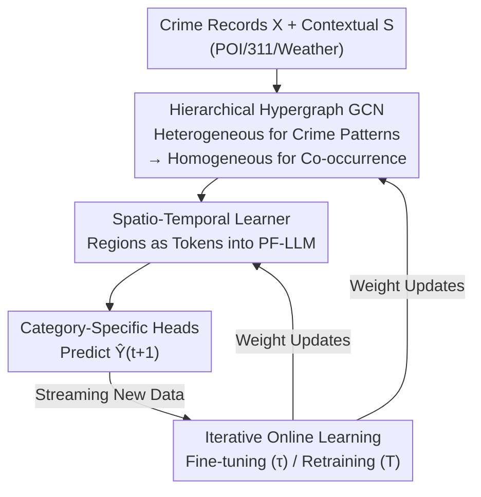

# ST-HHOL: Spatio-Temporal Hierarchical Hypergraph Online Learning for Crime Prediction

**Conference**: ICLR 2026  
**OpenReview**: [https://openreview.net/forum?id=Nc3dl43s5Z](https://openreview.net/forum?id=Nc3dl43s5Z)  
**Code**: https://github.com/777Rebecca/ST-HHOL  
**Area**: Spatio-Temporal Prediction / Time Series / Hypergraph Neural Networks  
**Keywords**: Crime Prediction, Hierarchical Hypergraph, Concept Drift, Online Learning, Partially Frozen LLM  

## TL;DR
ST-HHOL utilizes "Heterogeneous Hypergraph Modeling for Crime Patterns + Homogeneous Hypergraph Modeling for Co-occurrence Relations" to characterize high-order contextual factors behind sparse crime data. Combined with an online learning strategy featuring "frequent fine-tuning for short-term fluctuations + periodic retraining for long-term drift" and a partially frozen GPT-2, it consistently outperforms all offline and online baselines in MAE/MAPE across four real-world city crime datasets.

## Background & Motivation
**Background**: Urban crime prediction is a representative spatio-temporal task. Recent mainstream approaches employ attention mechanisms to model dynamic crime correlations or use GNNs (STGCN, DCRNN, AGCRN, GMAN, etc.) to capture spatial heterogeneity and temporal evolution. To alleviate crime record sparsity, many works introduce auxiliary information such as POI, 311 service requests, and mobility data.

**Limitations of Prior Work**: Relying solely on sparse crime counts fails to reveal multi-faceted crime patterns with both spatial and category specificity. Actual risk stems from the joint action of multiple spatio-temporal factors (environment, crowd flow, weather), whose types and intensities vary by region and crime category—for instance, brawls are frequent near bars late at night, while thefts occur more often near subway stations during the day. However, existing methods incorporating auxiliary data mostly model it as homogeneous graphs, pairwise graphs, or simple feature concatenations, failing to capture the high-order, dual-specific interactions formed when multiple factors coexist. Furthermore, crime data is highly non-stationary, with crime volumes fluctuating drastically across regions within days, leading to concept drift where $P_{train}(Y|X)\neq P_{test}(Y|X)$. Traditional offline models assume distribution stability and struggle with this drift, while methods attempting to extract invariants often assume data completeness and static variable relationships.

**Key Challenge**: The "information insufficiency" of sparse records must be compensated for by high-order contextual modeling, yet high-order contexts themselves drift continuously over time and space. Existing hypergraph crime models construct homogeneous or flat hypergraphs directly from sparse records, ignoring high-order interactions between heterogeneous contextual factors and crime semantics, leading to mixed semantics and unstable patterns under sparse conditions.

**Goal**: (1) Integrate heterogeneous contextual factors into hypergraphs to uncover latent crime patterns with spatial/crime dual-specificity and their co-occurrence relationships; (2) Enable the model to adapt to short-term fluctuations and long-term drift under streaming data; (3) Enhance spatio-temporal reasoning under sparse supervision.

**Core Idea**: Use "Hierarchical Hypergraphs" to model contextual factors $\rightarrow$ crime patterns $\rightarrow$ co-occurrence relations across two levels. Combat concept drift via iterative online learning with "short-term fine-tuning + long-term retraining," and inject sequence priors via a partially frozen pre-trained LLM to supplement sparse supervision.

## Method

### Overall Architecture
ST-HHOL is an online learning framework designed to simultaneously address the dual-specificity of crime patterns and non-stationary concept drift. It consists of two major components in a prediction pipeline: (1) **Hierarchical Hypergraph Convolutional Network (HHGCN)**, which uses heterogeneous hypergraphs to fuse crime records and multi-source contexts into latent crime patterns, and then uses homogeneous hypergraphs to model high-order spatial co-occurrence among these patterns; (2) **Spatio-Temporal Dependency Learner**, which uses a partially frozen GPT-2 (PF-LLM) treating each region as a token for spatio-temporal reasoning on sparse noisy data, followed by category-specific regression heads to predict the crime volume $\hat Y_{t+1}$ for the next time step.

Beyond this forward pipeline, an iterative online learning loop is applied: the model is warmed up with the first 25% of data, followed by streaming updates—fine-tuning every $\tau$ steps (freezing spatial-invariant parameters and updating dynamic parameters and PF-LLM) and full retraining every $T$ steps ($T>\tau$). Empirical results show "two-month retraining + half-month fine-tuning" is optimal.

### Key Designs

**1. Hierarchical Hypergraph Convolutional Network (HHGCN): Transforming Sparse Counts into Interpretable Crime Patterns**

To address the lack of dual-specificity in sparse counts, HHGCN splits modeling into two levels. The first level is the **heterogeneous hypergraph** $G^e_t$: the vertex set includes both crime nodes $\{x^t_{n,c}\}$ and context nodes $\{s^t_{n,m}\}$. Each crime embedding $x^t_{n,c}$ acts as a primary node, forming a heterogeneous hyperedge with several context nodes in its region—explicitly encoding how specific environmental/flow/weather factors jointly influence a crime type in a region. Latent crime patterns are calculated via $\tilde X_t=f(\sigma(\Theta^t_e[X_t\,\|\,S_t]))$, where $\Theta^t_e$ is a learnable incidence matrix quantifying the contribution of each context factor. The second level is the **homogeneous hypergraph** $G^o_t$: it aggregates high-order spatial co-occurrence relations using hypergraph convolution on the distilled crime patterns, approximating the degree-normalized incidence operator as a learnable matrix $\Theta^t_o\in\mathbb R^{H_o\times NC}$ ($H_o$ is set to 64). Together, these levels establish how patterns are shaped by context and how different patterns co-occur, maintaining stable and interpretable representations under sparsity better than flat constructions.

**2. Partially Frozen LLM (PF-LLM) as Spatio-Temporal Learner: Supplementing Sparse Supervision with Pre-trained Sequence Priors**

Pre-training FFNs in Transformers encode transferable sequence priors and few-shot reasoning capabilities, which remain useful for sparse and noisy crime data. Based on GPT-2 (Small, 12 layers, 12 heads, hidden dim 768), PF-LLM **freezes the FFN layers to retain these transferable abilities while fine-tuning only the attention and normalization layers** to adapt to crime-specific spatio-temporal structures and non-stationary dynamics. Each region is treated as a token, and the crime pattern sequence $E_n\in\mathbb R^{T\times C}$ for region $n$ is aligned to the GPT-2 hidden space via category-specific nonlinear projections. Temporal semantics are injected via day-of-week and month-of-year one-hot encodings with sine positional encodings: $E_T=\sin(t_d)+\sin(t_m)$. Ablations show that PF-FFN (freezing only FFN) achieves the best trade-off between retaining pre-trained knowledge and domain adaptation.

**3. Iterative Online Learning Strategy: Decoupling Spatial-Invariant and Temporal-Volatile Parameters**

Concept drift is formalized such that $D_{KL}(P_t(Y|X)\,\|\,P_{t+\tau}(Y|X))\ge\delta$ for some $\tau>0$. The authors observe that while crime co-occurrences fluctuate violently over time, the heterogeneous components and their intensities driving crime patterns remain relatively stable in space. Parameters are decoupled into: $\Theta_s$ encoding spatial-invariant and long-term slow-varying components (linked to the heterogeneous hypergraph, $\frac{d\Theta_s}{dt}\approx 0$); and $\Theta_d(t)$ capturing short-term temporal fluctuations (linked to the homogeneous hypergraph, reflecting regional mutations $\|\Delta E^t_i\|_1\gg 0$). The update mechanism follows two stages: the **fine-tuning phase** freezes $\Theta_s$ every $\tau$ steps, updating only $\Theta_d(t)$ and $\Theta_{\text{PF-LLM}}$ to absorb recent fluctuations; the **retraining phase** every $T$ steps ($T>\tau$) unfreezes $\Theta_s$ and $\Theta_d(t)$ for joint updates to accommodate long-term evolutionary co-occurrence structures.

### Loss & Training
The final prediction is obtained by concatenating category-specific regression convolution heads $\hat Y_{t+1}=\text{Concat}(\text{RConv}_1(H^{l+1}_1),\dots,\text{RConv}_c(H^{l+1}_c))$. The loss includes the prediction term and two hypergraph regularization terms:

$$\mathcal L=\|Y_{t+1}-\hat Y_{t+1}\|_2^2+\lambda_1\|\Theta^{t+1}_e\|_2^2+\lambda_2\|\Theta^{t+1}_o\|_2^2,$$

where $\lambda_1=\lambda_2=0.1$. Optimization uses Adam with a batch size of 32, an initial learning rate of $1\text{e}{-3}$, and a decay of $1\text{e}{-4}$. Data is chronologically split (25:75) into warm-up and online phases.

## Key Experimental Results

### Main Results
Evaluation on four real-world datasets: Chicago (CHI), New York (NYC), Philadelphia (PHI), and Toronto (TOR), all including 311/weather/POI contexts. Baselines include statistical methods (SVM, ARIMA), spatio-temporal models (DCRNN, STGCN, AGCRN, MTGNN, GMAN, MoSSL), crime prediction models (DeepCrime, ST-HSL, ST-SHN), and online learning frameworks (DLF, FSNet, OneNet).

**Crime Quantity Prediction (MAE/MAPE, lower is better, selected CHI / NYC)**:

| Dataset·Type | Metric | Best Baseline | ST-HHOL |
| :--- | :--- | :--- | :--- |
| CHI·Theft | MAE | 0.99 (AGCRN-RT) | **0.95** |
| CHI·Battery | MAE | 0.88 (AGCRN-RT) | **0.87** |
| NYC·Larceny | MAE | 0.98 (MoSSL) | **0.97** |
| NYC·Assault | MAE | 0.70 (AGCRN-RT) | **0.66** |
| TOR·Assault | MAE | 0.62 (AGCRN-RT) | **0.58** |
| TOR·B&E | MAE | 0.98 (AGCRN-RT) | **0.96** |

Average MAE/MAPE reductions: CHI 5.37%/9.21%, NYC 3.52%/8.83%, PHI 2.97%/5.85%, TOR 6.45%/11.32%.

**Crime Occurrence Prediction (NYC/CHI, higher is better)**:

| Dataset | Metric | Best Baseline | ST-HHOL |
| :--- | :--- | :--- | :--- |
| NYC | Micro-F1 | 0.638 (DLF) | **0.644** |
| NYC | TZR | 0.652 (DLF) | **0.663** |
| CHI | Micro-F1 | 0.710 (ST-SHN) | **0.715** |
| CHI | TZR | 0.714 (ST-SHN) | **0.736** |

TZR (True Zero Rate, the proportion of correctly identified zero-occurrence scenarios) consistently leads, demonstrating robustness under sparse and skewed distributions.

### Ablation Study

| Configuration | Description |
| :--- | :--- |
| Full model | Complete ST-HHOL, optimal across all datasets |
| w/o $G^e$ | Removes heterogeneous hypergraph; crime specificity modeling collapses |
| w/o $G^o$ | Removes homogeneous hypergraph; loses co-occurrence dependencies |
| w/o $E_T$ | No temporal information input; loses seasonal semantics |
| w/o PF-LLM | Replaced with standard Transformer; degrades few-shot transfer |
| w/o OL | Reverts to offline modeling; fails to adapt to concept drift |

PF-LLM Variants: **PF-FFN (freezing only FFN) achieved the best trade-off**, outperforming FPT (fully frozen, low adaptability) and full tuning (high variance, overfitting).

### Key Findings
- **Update Frequency "Sweet Spot"**: Biweekly fine-tuning consistently outperforms weekly updates, suggesting crime dynamics evolve roughly on a two-week scale; more frequent updates cause catastrophic forgetting. Bimonthly retraining provides the best stability/adaptability balance, supported by FFT analysis showing 1–3 week and 1–4 month cycles.
- **Hyperparameter Sensitivity**: $H_o=64$ is optimal (128 introduces redundancy); a hidden dimension of 16 is optimal (higher dimensions amplify error); freezing 2 layers is optimal (unfreezing more than 2 layers destroys pre-trained inductive bias).
- **Interpretability**: Homogeneous hyperedges cluster regions by frequency (e.g., low-frequency $e_8$ vs. high-frequency $e_{51}$). Heterogeneous hyperedges reveal regional drivers—commercial areas like the Loop are dominated by restaurant/station density, while Austin is driven by unemployment rates.

## Highlights & Insights
- **Clear Division in Hierarchical Hypergraphs**: The first level answers "what context shapes crime," and the second answers "how do patterns co-occur." This structurally separates mixed semantics, with interpretability derived directly from the physical meaning of hyperedges.
- **Concept Drift $\rightarrow$ Multi-frequency Updates**: Mapping "spatial stability" and "temporal volatility" to two sets of parameters with different evolution rates ($\frac{d\Theta_s}{dt}\approx 0$ vs $\sigma_t^2\gg\sigma^2$) is a clean approach applicable to any "slow-fast mixed" non-stationary spatio-temporal task.
- **Freezing FFN/Tuning Attention**: Treating "FFN for general priors, attention for domain structure" as a principle for transferring LLMs proves robust against overfitting in sparse data domains—a valuable takeaway for LLM application in small-data scenarios.

## Limitations & Future Work
- The optimal frequencies ($\tau$=half-month, $T$=two-month) were tuned on CHI; these periodicities may vary across different cities or crime types.
- PF-LLM uses only GPT-2 Small (2 layers); the potential gains and inference costs of using larger models were not fully explored.
- The "region-as-token" approach with a fixed 7-day window has limited reactivity to sudden, city-wide events (e.g., large-scale protests).
- The associate strength $p^t_{i,n,c}$ provides correlational explanations rather than true causal attribution.

## Related Work & Insights
- **vs ST-SHN / ST-HSL**: These models build homogeneous/flat hypergraphs directly from sparse records. ST-HHOL incorporates heterogeneous contexts first and adds multi-scale online adaptation—addressing the two specific deficiencies noted by the authors in prior hypergraph methods.
- **vs DLF / OneNet**: While these frameworks provide incremental updates, they do not decouple parameters based on the "spatial-stable/temporal-volatile" structure of crime data. ST-HHOL's explicit parameter separation leads to higher stability in TZR metrics.

## Rating
- Novelty: ⭐⭐⭐⭐ The combination of hierarchical hypergraphs and multi-frequency online learning is highly tailored to crime data.
- Experimental Thoroughness: ⭐⭐⭐⭐ Four cities, dual tasks, comprehensive baselines, sensitivity analysis, and interpretability visualizations.
- Writing Quality: ⭐⭐⭐⭐ Logical flow from motivation to method and experiment, with well-integrated formulas and figures.
- Value: ⭐⭐⭐⭐ Provides transferable design experiences for non-stationary spatio-temporal prediction and utilizing pre-trained LLMs in sparse domains.

<!-- RELATED:START -->

## Related Papers

- [\[ICLR 2026\] Online Time Series Prediction Using Feature Adjustment](online_time_series_prediction_using_feature_adjustment.md)
- [\[ICLR 2026\] TEN-DM: Topology-Enhanced Diffusion Model for Spatio-Temporal Event Prediction](ten-dm_topology-enhanced_diffusion_model_for_spatio-temporal_event_prediction.md)
- [\[ICLR 2026\] Delta-XAI: A Unified Framework for Explaining Prediction Changes in Online Time Series Monitoring](delta-xai_a_unified_framework_for_explaining_prediction_changes_in_online_time_s.md)
- [\[ICLR 2026\] TRIDENT: Cross-Domain Trajectory Spatio-Temporal Representation via Distance-Preserving Triplet Learning](trident_cross-domain_trajectory_spatio-temporal_representation_via_distance-pres.md)
- [\[ICLR 2026\] Improving Extreme Wind Prediction with Frequency-Informed Learning](improving_extreme_wind_prediction_with_frequency-informed_learning.md)

<!-- RELATED:END -->
