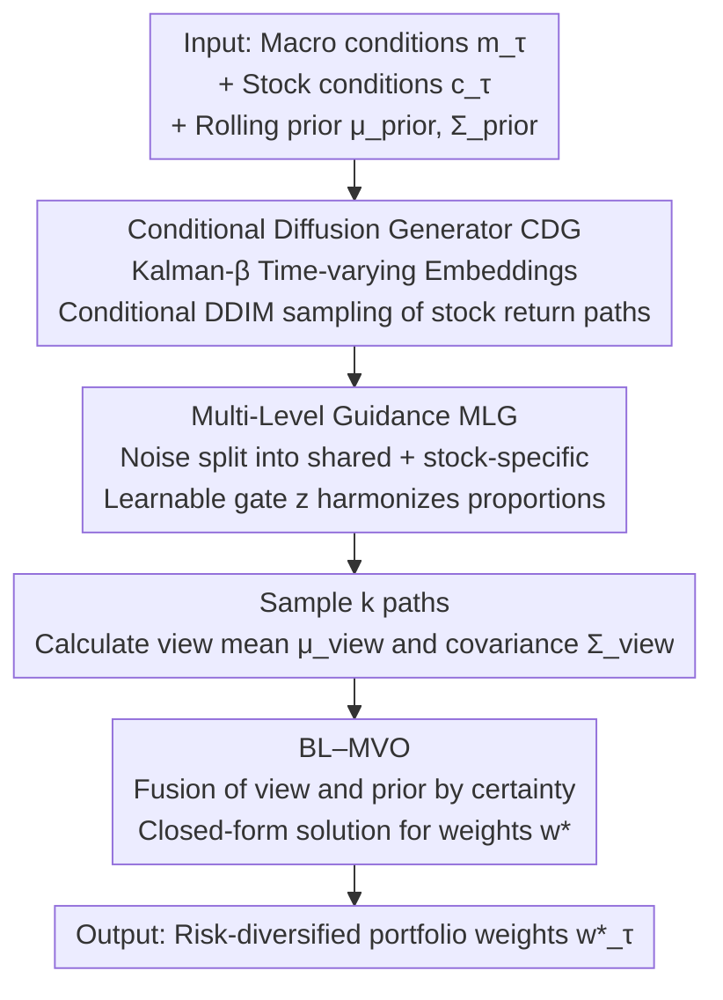

# STABLE: Shift-Tolerant Allocation via Black–Litterman Using Conditional Diffusion Estimates

**Conference**: ICLR 2026  
**OpenReview**: [https://openreview.net/forum?id=VltZQpfarw](https://openreview.net/forum?id=VltZQpfarw)  
**Area**: Time Series / Financial AI / Diffusion Models  
**Keywords**: Portfolio Allocation, Conditional Diffusion, Black–Litterman, Market Regime, Risk Diversification

## TL;DR
STABLE utilizes conditional diffusion models to generate "regime-aware" individual stock return distributions, which are then injected as investor views into Black–Litterman mean-variance optimization. This approach improves the Sharpe ratio by up to 122.9% across four regional equity markets while simultaneously reducing drawdowns and volatility.

## Background & Motivation
**Background**: Portfolio allocation is one of the most practical directions in financial AI. Prevailing methods follow two main paths: first, Modern Portfolio Theory (MPT), such as Markowitz Mean-Variance Optimization (MVO) and Black–Litterman, which use historical returns to estimate mean and covariance for weight solving; second, Deep Reinforcement Learning (RL), which employs policy networks to output weights directly to maximize risk-adjusted returns (e.g., AlphaStock, MetaTrader, AlphaMix).

**Limitations of Prior Work**: MPT methods rely heavily on historical window estimates, which are effective only if the estimates at the rebalancing moment are sufficiently accurate. Once the market regime shifts post-allocation and the true distribution deviates from history, profitability and stability deteriorate sharply. While RL methods introduce regime awareness, they primarily select regimes based on macro signals, making them prone to overfitting current macro states and failing to capture idiosyncratic movements at the individual stock level.

**Key Challenge**: The intensity of macro factor influence on each stock is **stock-specific and time-varying**. Macro factors dominate during crises, causing stocks to move in tandem, whereas individual signals become more significant during stable periods. Existing methods either rely solely on history or apply macro influences "uniformly" across all stocks, failing to decouple "macro impact vs. individual stock impact" for each stock at every timestamp.

**Goal**: To achieve accurate future return time series prediction while obtaining robust weights through risk diversification in markets characterized by constant regime switching. This is decomposed into three sub-problems: (C1) accurate estimation of future series under regime shifts; (C2) separation of macro and individual factor influences for each stock at each moment; (C3) maintenance of robust allocation as the "certainty" of stepwise estimates varies over time.

**Key Insight**: From a random walk perspective, log-returns are modeled as Gaussian noise. Diffusion models, which inject Gaussian perturbations in the forward process and learn to remove them in the reverse process, naturally align with this noise assumption. Thus, conditional diffusion is used as a tool to generate "regime-aware return paths," and the mean and covariance calculated from the generative distribution are fed into Black–Litterman.

**Core Idea**: Use conditional diffusion to generate "regime-aware individual stock return distributions" as views for Black–Litterman, concatenating generative forecasting with classical portfolio optimization to replace the old paradigm of "relying only on history" or "overfitting macro signals."

## Method

### Overall Architecture
STABLE aims to output weights $w^\star_\tau$ that maximize the Sharpe ratio under budget constraints $\mathbf{1}^\top w_\tau = 1$, given macro conditions $m_\tau$, stock conditions $c^{(s)}_\tau$, and prior mean $\mu_{prior,\tau}$ and covariance $\Sigma_{prior,\tau}$ calculated from the most recent $\nu$ trading days. The pipeline consists of three serial stages: first, the **Conditional Diffusion Generator (CDG)** samples regime-aware return paths at the individual stock level; second, **Multi-Level Guidance (MLG)** decomposes the noise of each step into "shared systemic" and "stock-specific" components, harmonized by a learnable gate; finally, the mean/covariance from diffusion sampling are treated as views for the **Black–Litterman Mean-Variance Optimizer (BL–MVO)**, which solves for robust weights after fusing with rolling priors.

### Key Designs

**1. Conditional Diffusion Generator (CDG): Generating regime-aware return paths**

CDG addresses C1—the inaccuracy of classical methods when the regime changes due to reliance on historical windows. It uses a DDIM (Denoising Diffusion Implicit Model) as a conditional sampler to generate stock return segments $\hat{r}^{(s)}_{0,\tau}$ of length $\ell$ at each rebalancing moment $\tau$, conditioned on both macro status and stock identity. Macro features $m_\tau$ (composed of market index, USD index, Treasury spreads, VIX, Gold index, etc., processed via $\nu$-day rolling normalization and log-differences) pass through a linear layer $W_m$ to obtain refined macro conditions $h_{m,\tau}$. Stock features $c^{(s)}_\tau$ pass through $W_c$ to obtain $h^{(s)}_{c,\tau}$. These are concatenated into the full condition $h^{(s)}_{f,\tau}=[h_{m,\tau}\,\|\,h^{(s)}_{c,\tau}]$. The DDIM denoiser predicts noise $\hat\epsilon$ and updates $\hat{r}^{(s)}_{0,\tau}=\frac{r^{(s)}_{n,\tau}-\sqrt{1-\bar\alpha_n}\,\hat\epsilon}{\sqrt{\bar\alpha_n}}$.

A key innovation is the **time-varying embedding $\beta^{(s)}_\tau$** within the stock conditions. Previous methods used static industry labels or neural embeddings of price series, which are either fixed or fail to reflect macro regimes. STABLE utilizes a Kalman filter to treat stock log-returns $y^{(s)}_\tau$ as the dependent variable and macro vectors $m_\tau$ as independent variables, recursively estimating a "current macro sensitivity vector" $\beta^{(s)}_\tau$. As a posterior estimate incorporating all observations up to the current moment, it serves as a **robust stock representation that evolves with the regime**, addressing the lack of "stock-level regime adaptation" in RL baselines.

**2. Multi-Level Guidance (MLG): Decomposing noise into macro and stock impacts via learnable gating**

MLG addresses C2—the variation of macro impact intensity across stocks and time. It explicitly decomposes the guidance noise at each diffusion step into two parts:

$$\hat\epsilon = \underbrace{\hat\varepsilon_{n,\tau}}_{\text{Shared (Systemic)}} + z^{(s)}_\tau\underbrace{\big(\hat\varepsilon^{(s)}_{n,\tau}-\hat\varepsilon_{n,\tau}\big)}_{\text{Stock-specific (Non-systemic)}}$$

The shared term $\hat\varepsilon_{n,\tau}=u_\phi(r^{(s)}_{n,\tau},n,h_{m,\tau})$ is derived using only macro conditions, while the full condition term $\hat\varepsilon^{(s)}_{n,\tau}=u_\phi(r^{(s)}_{n,\tau},n,h^{(s)}_{f,\tau})$ uses complete conditions; the difference represents the stock residual. The gate $z^{(s)}_\tau=g_\pi(h^{(s)}_{f,\tau})\in[0,z_{max}]$ is a scalar generated by stock conditions that adjusts the relative weight of macro influence versus stock dynamics. Optimization during training **automatically suppresses the gate** when conditions indicate high macro synchronization and **elevates the gate** under decoupled regimes to give more weight to individual residuals. This corresponds to the empirical observation that macro factors dominate during crises while individual dynamics dominate during stable periods. Compared to Diffusion-TS, which uses a single condition, this dual-level modeling allows conditional importance to vary by stock and time, leading to more accurate alignment and lower error.

**3. Black–Litterman Mean-Variance Optimizer (BL–MVO): Treating generative distributions as views and fusing priors by certainty**

BL–MVO addresses C3—adaptive allocation based on time-varying estimation certainty. It generates $k$ guided paths $\hat{R}^{(s)}_{0,\tau}\in\mathbb{R}^{k\times\ell}$ for each stock, calculating the view mean $\mu^{(s)}_{view,\tau}=\frac{1}{k}\sum_i \bar{r}^{(s,i)}_{0,\tau}$ and the unbiased sample covariance $\Sigma_{view,\tau}=\frac{1}{k-1}\sum_i (r^{(i)}_{0,\tau}-\mu_{view,\tau})(r^{(i)}_{0,\tau}-\mu_{view,\tau})^\top$, which captures the joint estimation error across assets. Then, the view and rolling prior are fused using **certainty weighting**: with prior certainty $\Phi_\tau=\Sigma^{-1}_{prior,\tau}$ and view certainty $\Omega_\tau=\Sigma^{-1}_{view,\tau}$, the BL posterior is:

$$\mu_{BL,\tau}=(\Phi_\tau+\Omega_\tau)^{-1}(\Phi_\tau\mu_{prior,\tau}+\Omega_\tau\mu_{view,\tau}),\quad \Sigma_{BL,\tau}=(\Phi_\tau+\Omega_\tau)^{-1}.$$

The Sharpe-maximizing weights have a closed-form solution $w^\star_\tau=\frac{\Sigma^{-1}_{BL,\tau}\mu_{BL,\tau}}{\mathbf{1}^\top\Sigma^{-1}_{BL,\tau}\mu_{BL,\tau}}$, which naturally satisfies budget constraints through normalization. The design of using the inverse of the generative covariance as certainty weighting means that when generated paths diverge significantly (high estimation uncertainty), the view automatically yields to the prior, maintaining robustness during uncertain periods. This is the fundamental reason it is more robust than "plug-in MVO," which directly replaces historical means with predicted values.

### Loss & Training
The diffusion component minimizes the denoising MSE across all stocks, rebalancing moments, and DDIM steps, with $\ell_2$ regularization to prevent overfitting: $L(\theta)=\mathbb{E}\,\|\epsilon-\epsilon_\theta(r^{(s)}_{n,\tau},n,h^{(s)}_{f,\tau})\|^2_2+\beta\|\theta\|^2_2$. The trainable parameters are $\theta=\{\phi,\pi,W_m,W_c\}$ (gating, denoising UNet, and two conditional projection linear layers are trained jointly). Since $\epsilon\sim\mathcal{N}(0,I)$, the objective asymptotically makes $\hat\epsilon\sim\mathcal{N}(0,I)$.

## Key Experimental Results

### Main Results
Four regional stock markets (US S&P500, China CSI300, EU EUROSTOXX, KR KOSPI200) were used. Sector-diversified datasets were constructed by taking top stocks from 11 GICS sectors. Training started from 2013-01, truncated at 2024-09, and tested until 2025-03. Metrics: Annualized Sharpe Ratio ASR (↑), Relative Maximum Drawdown RMDD (↓), Annualized Volatility AVol (↓).

| Market | Metric | STABLE | Strongest baseline | Note |
|------|------|--------|--------------|------|
| S&P500 (US) | ASR | **1.85** | 1.18 (MVO) | 1st in all three metrics |
| S&P500 (US) | RMDD% / AVol% | **7.82 / 13.43** | 8.89 / 13.92 | Lowest drawdown and volatility |
| EUROSTOXX | ASR | **2.92** | 1.42 (MOM) | Most significant improvement |
| EUROSTOXX | RMDD% / AVol% | **3.84 / 10.88** | 5.40 / 11.77 | — |
| KOSPI200 | ASR | **1.61** | 1.47 (AlphaMix) | — |
| CSI300 (China) | ASR | **-0.41** | -0.47 (MOM) | Optimal in bear market (least loss) |

STABLE **ranked first in all three metrics** (ASR, RMDD, AVol) across all regions. The abstract reports a maximum Sharpe improvement of 122.9%, a drawdown reduction of up to 1.56 percentage points, and a volatility reduction of up to 7.56%.

### Time Series Prediction (Q2)
The prediction task used MSE (×10⁻⁴) and normalized DTW (×10⁻³), comparing three types of generative predictors.

| Configuration | S&P500 MSE | EUROSTOXX MSE | KOSPI200 MSE | Note |
|------|-----------|---------------|--------------|------|
| Diffusion-TS | 3.90 | 3.05 | 9.41 | Strongest baseline |
| AEC-GAN | 4.27 | 3.70 | 10.18 | GAN + error correction |
| KoVAE | 4.58 | 2.61 | 9.83 | VAE + Koopman |
| **STABLE** | **3.51** | **2.49** | **8.15** | Lowest MSE/DTW in all 4 markets |

STABLE achieved the lowest MSE and DTW in all four markets, with MSE reductions of up to 15.7% and DTW reductions of up to 13.8% relative to the best competitor.

### Key Findings
- **Stock-level regime adaptation is high-gain**: AlphaMix, the strongest RL competitor (which routes through multiple neural allocators based on market state), does not model "time-varying stock specifics." STABLE's reliance on Kalman-β time-varying embeddings to adapt to stock-level regime changes explains its consistent lead in ASR/RMDD/AVol.
- **Macro-stock noise decomposition beats single condition**: Diffusion-TS is designed for generalization and does not adjust conditional importance at the stock level. STABLE’s dual-layer noise decomposition allows conditional weights to vary by stock and time, resulting in better alignment and lower prediction error.
- **Embeddings capture real sector relationships and drift over time** (Q3 Case Study): TSLA's nearest neighbors were large tech stocks like AAPL/AVGO in 2021, but drifted to AI companies like NVDA/MSFT by late 2024, corresponding exactly to the market's AI boom. BAC remained close to JPM/WFC at both time points, reflecting stable financial sector relationships.
- **Optimal even in bear markets**: In markets like CSI300 where losses were prevalent during the test period, STABLE’s ASR (-0.41) remained the least negative among all methods, indicating that risk diversification is equally effective during downturns.

## Highlights & Insights
- **Using diffusion as a "view generator" for Black–Litterman**: Traditional BL views are provided subjectively. Here, they are derived statistically from $k$ sampled paths of conditional diffusion, with the inverse covariance serving as view certainty. The "divergence" of the generative model naturally transforms into the weighting of "whether to trust the view or the prior" in BL, a highly self-consistent design.
- **Noise decomposition = systemic + idiosyncratic**: Interpreting the difference between "full condition" and "reduced condition" (similar to classifier-free guidance) as idiosyncratic risk in finance, and harmonizing them via learnable gating, is a elegant migration of domain priors (CAPM-style systemic/non-systemic risk decomposition) into diffusion guidance.
- **Kalman-β for time-varying stock embeddings**: Using classical Kalman filtering to estimate time-varying sensitivity of stocks to macro factors is both lightweight and inherently capable of "updating with the regime." This can be migrated to any task requiring "asset representation that varies with market status."

## Limitations & Future Work
- **Features are still limited to numerical macro/price signals**: The authors acknowledge that richer features such as text (news, financial reports) should be incorporated to characterize macro and stock states in the future.
- **Stock pool is small and subject to survivor bias**: Each market includes only the top 37–55 stocks by sector, excluding those without a full history. This introduces survivor bias, and it remains questionable whether the method can generalize to a broader all-market universe.
- **Lack of module-level ablation**: The main text primarily provides comparisons with external baselines (Table 3/4) and case studies (Table 5). The individual contributions of CDG/MLG/BL-MVO and improvements lost by removing the gate are not fully expanded in the main text (some are in the appendix).
- **Cross-market conclusions cannot be directly compared**: Market states during the test periods vary significantly across regions (e.g., overall loss in CSI300 vs. high Sharpe in EUROSTOXX). Absolute ASR values should not be compared directly; relative rankings within the same market are what matter.

## Related Work & Insights
- **vs. MVO / Black–Litterman (Classical MPT)**: These rely on historical windows for mean/covariance estimation and fail when regimes shift. STABLE uses conditional diffusion to generate regime-aware future distributions to replace "historical plug-ins," essentially shifting the estimation from "backward-looking" to "forward-looking."
- **vs. DeepTrader / MetaTrader / AlphaMix (RL Allocation)**: These methods derive regime awareness mainly from macro signals and are prone to overfitting macro states. STABLE uses MLG gating to separate macro/stock influences at the stock level and Kalman-β for stock-level regime adaptation, filling the gap of "macro impact variation by stock."
- **vs. Diffusion-TS / AEC-GAN / KoVAE (Generative TS Prediction)**: These are designed for general-purpose generalization and do not adjust conditions at the stock level. STABLE’s systemic + idiosyncratic noise decomposition allows conditional weights to vary by stock and time, resulting in lower MSE/DTW across the board.

## Rating
- Novelty: ⭐⭐⭐⭐ Connecting the sampling distribution of conditional diffusion to Black–Litterman views and using generative covariance as certainty weight is a rare and self-consistent integration.
- Experimental Thoroughness: ⭐⭐⭐ Covers four markets, two tasks, and case studies, but lacks module-level ablation in the main text, and the stock pool is small with survivor bias.
- Writing Quality: ⭐⭐⭐⭐ The three-stage motivation (C1/C2/C3 ↔ I1/I2/I3) is clearly mapped, and formulas are complete.
- Value: ⭐⭐⭐⭐ Directly relevant to financial AI practice; the "diffusion as view generator" paradigm can be replicated in other asset allocation scenarios.

<!-- RELATED:START -->

## Related Papers

- [\[ICLR 2026\] Relational Feature Caching for Accelerating Diffusion Transformers](relational_feature_caching_for_accelerating_diffusion_transformers.md)
- [\[ICLR 2026\] A Study of Posterior Stability in Time-Series Latent Diffusion](a_study_of_posterior_stability_in_time-series_latent_diffusion.md)
- [\[ICLR 2026\] ICDiffAD: Implicit Conditioning Diffusion Model for Time Series Anomaly Detection](icdiffad_implicit_conditioning_diffusion_model_for_time_series_anomaly_detection.md)
- [\[ICLR 2026\] Latent-to-Data Cascaded Diffusion Models for Unconditional Time Series Generation](latent-to-data_cascaded_diffusion_models_for_unconditional_time_series_generatio.md)
- [\[CVPR 2026\] Stable Spike: Dual Consistency Optimization via Bitwise AND Operations for Spiking Neural Networks](../../CVPR2026/time_series/stable_spike_dual_consistency_optimization_via_bitwise_and_operations_for_spikin.md)

<!-- RELATED:END -->
