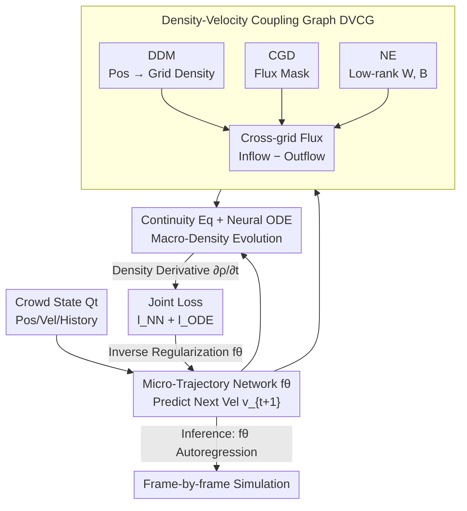

# STDDN: A Deep Learning Framework for Crowd Simulation Guided by the Fluid Continuity Equation

**Conference**: ICLR 2026  
**OpenReview**: [https://openreview.net/forum?id=t21xf6rxqY](https://openreview.net/forum?id=t21xf6rxqY)  
**Code**: None  
**Area**: Spatio-Temporal Prediction / Trajectory Prediction / Physics-Guided Deep Learning  
**Keywords**: Crowd Simulation, Continuity Equation, Neural ODE, Dynamic Graph Networks, Density-Velocity Coupling

## TL;DR
STDDN treats crowds as continuous fluid media, utilizing the fluid mechanics continuity equation as a strong physical constraint and Neural ODEs to model macroscopic density field evolution. This macro-constraint is used to inversely regularize a microscopic trajectory prediction network, simultaneously achieving state-of-the-art accuracy in long-term simulations across four real-world datasets while drastically reducing inference latency (by up to 90%).

## Background & Motivation
**Background**: Crowd simulation is a foundational technology for public safety, emergency evacuation, and intelligent transportation. Mainstream approaches are categorized into three types: physics-based methods (e.g., Social Force Model SFM, Cellular Automata CA), data-driven deep learning methods (e.g., STGCNN, PECNet, MID), and physics-guided methods that embed physical priors into networks (e.g., PCS, NSP, SPDiff).

**Limitations of Prior Work**: Purely physical methods rely on simplified linear mechanical assumptions and fail in high-density, strong-interaction scenarios. Purely data-driven methods lack physical constraints, often predicting behaviors that violate basic physical laws (e.g., unreasonable congestion, ignoring collisions). While existing physics-guided methods improve physical consistency, **almost all focus exclusively on microscopic individual interactions** (modeling crowds as a collection of independent individual trajectories), failing to characterize macroscopic density evolution patterns.

**Key Challenge**: From a microscopic perspective, where individual trajectories are predicted iteratively, errors accumulate and amplify over time, leading to the collapse of long-term simulation stability. Furthermore, diffusion-based methods like SPDiff require multiple forward denoising passes for a single frame of simulation, making them too slow and computationally expensive for large-scale efficient simulation. It is difficult to balance physical consistency, long-term stability, and inference efficiency.

**Goal**: To develop a crowd simulation framework capable of injecting macroscopic physical laws, suppressing error accumulation, and completing inference in a single forward pass.

**Key Insight**: The authors borrow an observation from fluid mechanics: collective crowd behavior at high densities resembles the flow of a continuous medium. The **continuity equation** $\frac{\partial \rho}{\partial t} + \nabla\cdot(\rho v)=0$, which describes mass conservation, naturally decouples time and space: temporal evolution is controlled by the time derivative of density, while spatial transport is guided by the velocity field. Re-formulating crowd trajectory evolution as a "matter transport process within a density field" allows microscopic trajectories to be constrained from a global density perspective.

**Core Idea**: Treat the continuity equation as a strong physical prior, use Neural ODEs to model the evolution of the macroscopic density field, and then end-to-end inversely regularize the microscopic trajectory prediction network with this macroscopic constraint—governing microscopic prediction with macroscopic physics, rather than the reverse.

## Method

### Overall Architecture
STDDN (Spatio-Temporal Decoupled Differential Equation Network) addresses "microscopic trajectory prediction error accumulation and long-term instability" by splitting the simulation into two coupled paths: a **microscopic path** that uses a trajectory prediction network $f_\theta$ to step-wise predict individual acceleration/velocity (updating position and velocity via standard integration rules $v_{t+1}=v_t+a_t\Delta t$, $p_{t+1}=p_t+v_t\Delta t$); and a **macroscopic path** that uses a Neural ODE to solve the evolution of the density field $\rho$ over time. These two paths are connected via a **Density-Velocity Coupling Dynamic Graph (DVCG)** module: DVCG takes density and velocity fields from adjacent timestamps and uses a dynamic graph neural network to calculate the time derivative of the density field $\frac{\partial\rho}{\partial t}$, which serves as the evolution function for the Neural ODE.

Crucially, the "driving force" for macroscopic density evolution is precisely the velocity predicted by the microscopic trajectory network $f_\theta$—thus, the macroscopic conservation law of the continuity equation is imposed end-to-end as physical regularization on $f_\theta$. During training, both paths are optimized jointly; during **inference, only the trained $f_\theta$ is used for autoregressive frame-by-frame generation per Eq.1, entirely bypassing the ODE part**, which enables completion in a single forward pass and avoids the multi-sampling overhead of diffusion models.

Inside DVCG are three sub-modules: Differentiable Density Mapping (DDM) soft-assigns continuous individual positions to discrete grids to obtain density; Continuous Cross-Grid Detection (CGD) calculates cross-grid flux masks; and Node Embedding (NE) constructs weight matrices using low-rank outer products. These three work together to calculate the density derivative while ensuring gradient continuity and mass conservation during training.

### Key Designs

**1. Macro-Micro Coupling: Continuity Equation + Neural ODE Inverse Regularization**

This design directly addresses the pain point where existing physics-guided methods only consider microscopic interactions, leading to error accumulation. The authors no longer view the crowd as a collection of independent individuals but as a continuous medium, using the fluid mechanics continuity equation $\frac{\partial\rho}{\partial t}+\nabla\cdot(\rho v)=0$ as a differentiable structural constraint. Specifically, Neural ODEs model the macroscopic density field evolution: starting from an initial density $\rho_0$, the ODE solver integrates the density derivative over $\tau$ time steps to obtain the density sequence $\rho_{1:\tau}=\text{ODESolver}(\rho_0, F_G, \Phi, [0:\tau])$. Since the calculation of the density derivative $F_G$ embeds the velocity predicted by the microscopic network $f_\theta$, the macroscopic conservation law can end-to-end impose physical regularization back onto the microscopic trajectory prediction. This pushes the model toward a global optimum and suppresses error propagation over time. This contrasts sharply with methods like SPDiff that only model at the individual level: the global perspective of macroscopic density naturally inhibits the "snowballing" of local errors.

**2. Density-Velocity Coupling Dynamic Graph (DVCG): Reformulating Trajectory Prediction as Density Transport**

DVCG is the core evolution function of the Neural ODE, solving the problem of "how to calculate the time derivative of macroscopic density from microscopic trajectories." The authors discretize space into a regular grid, treated as graph nodes, and construct a **dynamic graph across time steps**: current velocities are treated as **incoming edges** and predicted next-frame velocities as **outgoing edges**. Each grid node's flux is determined by individual velocities and current node density. The density derivative is written as inflow minus outflow:

$$\frac{\partial\rho}{\partial t}=F_G(\Phi,t,\rho_t)=G_{in}(\Phi,t,\rho_t)-G_{out}(\Phi,t,\rho_t)$$

where $G_{in}=\rho_t(m_t\odot A_t\odot W\odot\|V_t\|+A_t\odot B)$ and $G_{out}$ is constructed using predicted next-frame velocity $V_{t+1}(V_t;\theta)$ and density $\rho_{t+1}$ ($\odot$ is element-wise multiplication, $A_t$ is a dynamic adjacency matrix, $m_t$ is the cross-grid mask from CGD). This effectively **rewrites the trajectory prediction task as a spatio-temporal transport optimization problem on a density field**—explicitly modeling density flux with the physical intuition that "incoming velocity brings mass, outgoing velocity takes it away," which is more physically interpretable than simple trajectory regression and allows the dynamic graph to truly "move" with individual velocities.

**3. Two Differentiable Structures (DDM + CGD): Eliminating Gradient Fracture caused by Discretization**

Mapping continuous positions to discrete grids and counting cross-grid events via traditional "hard assignment" creates discontinuous gradients, preventing end-to-end training. The authors solve this with two differentiable structures. First, **Differentiable Density Mapping (DDM)**: uses RBF-based soft temperature assignment instead of hard assignment. It calculates the squared Euclidean distance from a predicted position $p_t$ to grid centers, then converts this to a probability distribution $q_i(p_t)=\frac{\exp(-\beta\|p_t-c_i\|^2)}{\sum_j\exp(-\beta\|p_t-c_j\|^2)}$ using softmax with temperature $\beta$. Summing over all individuals yields a continuous differentiable density representation $\rho_t=\sum_i q_i(p_t)$. Second, **Continuous Cross-Grid Detection (CGD)**: since net flux only comes from trajectories crossing grid boundaries, the authors use the Jensen-Shannon divergence $J(q(p_t)\|q(p_{t+1}))$ between probability distributions at adjacent timestamps to quantify the degree of crossing. A sigmoid with temperature then converts the divergence into a continuous cross-grid mask $m=\sigma(\alpha(J-\tau))\in[0.01,0.99]$. Together, these ensure continuous gradients for backpropagation while maintaining mass conservation constraints.

**4. Node Embedding (NE): Compressing Weight Matrices from $O(N^2)$ to $O(N\cdot d)$**

Finer grid division provides more precise continuity equation constraints, but traditional weight matrices expand at $O(N^2)$ with the number of grid nodes, exceeding memory limits. NE assigns a pair of learnable embedding and bias vectors $w\in\mathbb{R}^{N\times d}$, $b\in\mathbb{R}^{N\times d}$ to each grid node, then dynamically constructs the weight and bias matrices via outer products: $W=ww^T$, $B=bb^T$. This reduces storage complexity to $O(N \cdot d)$, allowing the model to use finer grids while maintaining modeling capacity and significantly saving memory.

### Loss & Training
Training couples the trajectory prediction network with the differential equations, using a joint loss to supervise both velocity and density:

$$l_{joint}=l_{NN}+l_{ODE}=\lambda_1\|v-v_\theta\|+\lambda_2\|\rho-\rho_\theta\|$$

$\lambda_1$ and $\lambda_2$ balance velocity prediction accuracy and density evolution consistency. Ablations show that setting the two weights roughly equal yields the best results, reflecting the synergy between data-driven learning and physical modeling. The ODE solver defaults to first-order Euler, which aligns naturally with autoregressive discrete-time modeling.

## Key Experimental Results

### Main Results
On four real-world trajectory datasets (GC, UCY, ETH, HOTEL), metrics include trajectory accuracy (MAE↓, OT↓) and efficiency (#Pars↓, single-frame Latency↓ in ms), with results averaged over 5 runs. STDDN consistently outperforms the second-best model, SPDiff:

| Dataset | Metric | STDDN | SPDiff (Runner-up) | Gain |
|---------|--------|-------|-------------------|------|
| GC | MAE↓ | 0.8875 | 0.9116 | 2.6% |
| GC | OT↓ | 1.3582 | 1.3925 | 2.46% |
| GC | Latency↓ | 86.85 | 206.99 | -50% |
| UCY | MAE↓ | 1.7747 | 1.8760 | 5.39% |
| UCY | OT↓ | 3.6503 | 4.0564 | 10.01% |
| UCY | Latency↓ | 44.66 | 471.05 | -90% |
| ETH | MAE↓ | 0.5185 | 0.5527 | 6.0% |
| ETH | OT↓ | 0.6918 | 0.8706 | 19.81% |
| HOTEL | MAE↓ | 0.2952 | 0.3380 | 12.66% |
| HOTEL | OT↓ | 0.1445 | 0.1646 | 12.21% |

Accuracy generally exceeds the three baseline categories: purely physical (SFM/CA), purely data-driven (STGCNN/PECNet/MID), and physics-guided (PCS/NSP/SPDiff). Simultaneously, the parameter count is the smallest across all datasets (e.g., only 0.07M for UCY vs. 0.22M for SPDiff), and by avoiding the multiple samplings required by diffusion models, latency is significantly reduced. Error accumulation analysis shows that both STDDN and SPDiff exhibit an "increase then decrease" trend, but STDDN maintains the lowest overall error throughout, proving it is the least affected by error accumulation in the long term.

### Ablation Study (GC / UCY, MAE / OT)

| Configuration | GC MAE | UCY MAE | Description |
|---------------|--------|---------|-------------|
| Ours (Euler) | 0.8875 | 1.7747 | Full model |
| w/o ODE | 1.3784 | 2.4867 | Removed continuity constraint; degenerates to pure autoregression (sharpest drop) |
| w/o Cross-net (CGD) | 0.9784 | 1.8926 | Removed cross-grid detection; physical constraint significantly weakened |
| w/o NN loss | 1.2387 | 1.9327 | Only uses density ODE loss; pure physics fails to capture real movement |
| w/o NE | 0.8921 | 1.7917 | Removed node embedding; slight drop |
| Trans | 0.8901 | 1.7833 | Replaced dynamic graph with static attention; slightly worse |
| Dopri5 / RK4 | 1.13/1.23 | 1.97/2.04 | Higher-order ODE solvers performed worse |
| Discrete NN | 0.8875 | 1.7747 | Replacing ODE solver with first-order discrete residual update matches full model |

### Key Findings
- **Removing the ODE constraint causes the most severe performance drop** (GC MAE 0.89 → 1.38), proving that the continuity equation as a physical constraint is crucial for suppressing long-term error accumulation.
- **CGD is indispensable**: Since the method is fundamentally flux-based, removing cross-grid detection causes the mass conservation constraint to fail, resulting in a significant performance decline.
- **Pure physics is insufficient** (w/o NN loss shows significant regression), indicating that the synergy between data-driven learning and physical priors is the source of performance.
- **Higher-order solvers were actually worse**: The intermediate interpolation states of Dopri5/RK4 do not align with actual observation timestamps, increasing overhead and leading to easier overfitting. Euler's natural alignment with autoregressive discrete modeling offers the best efficiency and accuracy.
- **The phenomenon where Discrete NN matches the full model** is interesting: it suggests that STDDN is essentially modeling crowd flow across discrete spatio-temporal grids rather than as a smooth, continuous dynamical system.

## Highlights & Insights
- **Interdisciplinary leverage**: Introducing the fluid mechanics continuity equation to crowd simulation and utilizing its natural spatio-temporal decoupling to rewrite "individual trajectory prediction" as "density field matter transport" is a brilliant perspective shift—where a macroscopic conservation law acts as a regularizer for microscopic prediction.
- **"Heavy Training, Light Inference"**: The macroscopic density evolution constrains the microscopic network during training, but only the lightweight $f_\theta$ is kept for a single forward pass during inference. This achieves physical consistency without the inference burden of diffusion models—a strategy highly transferable to other physics-guided generative tasks.
- **Two tricks for differentiable discrete operations**: Using RBF soft assignment in DDM and JS divergence + Sigmoid in CGD to turn "grid entry" and "cross-grid statistics" (which are inherently non-differentiable discrete operations) into continuous structures for end-to-end training is a versatile engineering trick for combining physical grids with neural networks.
- **Memory efficiency through low-rank outer products**: NE uses $W=ww^T$ to compress $O(N^2)$ to $O(N \cdot d)$, allowing the model to use finer grids. This can be reused in any scenario where graph node weight matrices expand quadratically with the number of nodes.

## Limitations & Future Work
- **Dependence on high-density assumptions**: The continuous medium and continuity equation premise assumes the crowd is dense enough to be approximated as a fluid. In sparse crowds, density field constraints might become meaningless (the paper specifically selects dense, long-duration periods from GC/UCY).
- **Hyperparameter sensitivity from grid discretization**: Grid size, ODE time steps $\tau$, embedding dimensions, and $\lambda_1/\lambda_2$ ratios all affect results (confirmed by sensitivity analysis), requiring tuning for deployment.
- **Discrete NN matching ODE performance** implies the "continuous dynamics" narrative of Neural ODEs might be secondary—if first-order discrete updates are sufficient, the additional modeling gains from ODE solvers may be limited, as the authors candidly note.
- **Simplified environmental/obstacle modeling**: Obstacles are represented only by static positions $E$. Complex scene geometry, dynamic obstacles, and group heterogeneity (differences in age/intent) are not yet integrated and are directions for future expansion.

## Related Work & Insights
- **vs SPDiff (Runner-up baseline)**: SPDiff combines Social Force Models with Diffusion Models for individual-level denoising, but the physical constraints remain microscopic and single-frame generation requires multiple denoising passes. STDDN uses macroscopic continuity constraints + single forward pass, suppressing error accumulation while drastically reducing latency (-90% on UCY).
- **vs PCS / NSP**: These are also physics-guided, but PCS uses dual-branch training with SFM as a prior and NSP embeds physical parameters into the network, both focusing on microscopic interactions. STDDN differs by introducing **macroscopic density evolution** as a global constraint, which offers better long-term stability.
- **vs STDEN / Air-DualODE**: STDEN also uses the continuity equation for traffic flow prediction. STDDN extends this by applying the continuity equation + dynamic graphs + Neural ODEs to crowd trajectories, using a graph construction of "in-flow/out-flow velocities" to explicitly characterize density flux and decouple spatio-temporal dimensions.

## Rating
- Novelty: ⭐⭐⭐⭐⭐ Solid and rare perspective shift using the fluid continuity equation to inversely regularize micro-trajectories from a macro-density view.
- Experimental Thoroughness: ⭐⭐⭐⭐ Four datasets + error accumulation + ablation + sensitivity analysis is quite complete, though focused on dense outdoor scenes and lacks validation on extreme/sparse cases.
- Writing Quality: ⭐⭐⭐⭐ Clear motivation and methodology; some notation (e.g., matrix forms in Eq.4) is dense and requires careful cross-referencing with the original text.
- Value: ⭐⭐⭐⭐ Physically consistent, interpretable, and computationally efficient; holds practical engineering significance for large-scale simulation in public safety and intelligent transportation.

<!-- RELATED:START -->

## Related Papers

- [\[ICLR 2026\] DeepPrim: a Physics-Driven 3D Short-term Weather Forecaster via Primitive Equation Learning](deepprim_a_physics-driven_3d_short-term_weather_forecaster_via_primitive_equatio.md)
- [\[ICLR 2026\] Towards Generalizable PDE Dynamics Forecasting via Physics-Guided Invariant Learning](towards_generalizable_pde_dynamics_forecasting_via_physics-guided_invariant_lear.md)
- [\[ICLR 2026\] Zero-shot Forecasting by Simulation Alone](zero-shot_forecasting_by_simulation_alone.md)
- [\[ICLR 2026\] End-to-End Probabilistic Framework for Learning with Hard Constraints](end-to-end_probabilistic_framework_for_learning_with_hard_constraints.md)
- [\[NeurIPS 2025\] IonCast: A Deep Learning Framework for Forecasting Ionospheric Dynamics](../../NeurIPS2025/time_series/ioncast_a_deep_learning_framework_for_forecasting_ionospheric_total_electron_con.md)

<!-- RELATED:END -->
