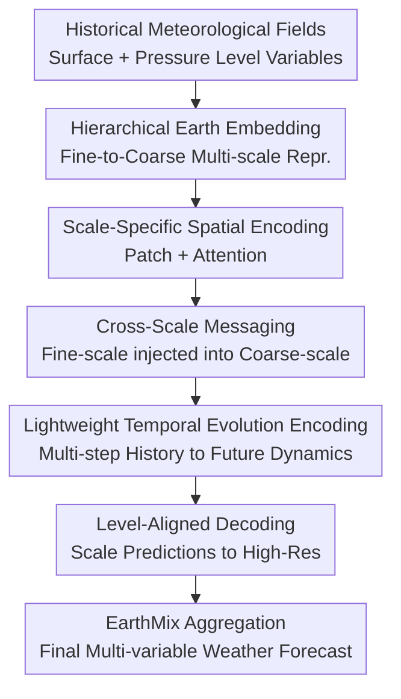

# STORM: Synergistic Cross-Scale Spatio-Temporal Modeling for Weather Forecasting

**Conference**: ICLR2026  
**OpenReview**: [https://openreview.net/forum?id=JLF6XDnscF](https://openreview.net/forum?id=JLF6XDnscF)  
**Code**: https://github.com/h505023992/STORM  
**Area**: Time Series / Spatio-Temporal Modeling / Weather Forecasting  
**Keywords**: Weather Forecasting, Multi-scale Modeling, Spatio-Temporal Prediction, ERA5, Long-term Rolling Forecast  

## TL;DR
STORM explicitly decomposes global meteorological fields into fine-to-coarse multi-scale representations. Through cross-scale messaging, lightweight temporal evolution encoding, and level-aligned decoding, it simultaneously enhances short-term accuracy and 7-10 day long-term stability for ERA5 global and regional weather forecasting.

## Background & Motivation

**Background**: Weather forecasting has long relied on Numerical Weather Prediction (NWP) systems, which ensure physical consistency by solving atmospheric dynamics equations but incur high computational costs in high-resolution, long-term, and multi-variable scenarios. In recent years, deep learning models have begun to learn the evolution of meteorological states directly from reanalysis data like ERA5. Models such as Pangu-Weather, GraphCast, FourCastNet, and FuXi have demonstrated that data-driven methods can achieve high accuracy and speed in global forecasting.

**Limitations of Prior Work**: Meteorological data differs from ordinary video sequences. Phenomena like global circulation, monsoons, and pressure troughs are low-frequency, coarse-scale structures, while precipitation, local wind fields, and regional temperature anomalies involve high-frequency, fine-scale variations. Many deep learning models, despite having strong spatial encoders or temporal predictors, usually compress inputs into a single uniform scale or only learn mappings from the current state to the next. This allows models to follow local textures in the short term, but leads to accumulated errors over multi-day rollouts, where coarse-scale circulations and fine-scale details fail to calibrate each other.

**Key Challenge**: Weather forecasting must satisfy two requirements simultaneously: preserving local structures on fine grids while ensuring predictions conform to larger-scale spatio-temporal evolution. If only fine scales are emphasized, the model may overfit local variations and lose large-scale stability; if only coarse scales are emphasized, predictions become smooth, erasing regional details and extreme variations. The true difficulty lies in enabling different spatial scales to work synergistically within the same temporal evolution process rather than making independent predictions.

**Goal**: The authors define the problem as multi-step spatio-temporal prediction: given meteorological states $X_{t-T+1:t}$ for the past $T$ time steps, predict the states $\hat{X}_{t+1:t+L}$ for the future $L$ steps. For longer forecast horizons, recursive rollouts use block-wise multi-step results. The goal is not merely to improve single-step accuracy but to reduce error accumulation during long-term rollouts.

**Key Insight**: STORM observes that the atmosphere is inherently a hierarchical system: coarse structures provide a large-scale background while fine structures handle local variations, and both evolve together in time. Therefore, the model should construct multi-scale representations, learn spatial dependencies and temporal evolution at each scale, allow fine-scale information to flow to coarse scales, and finally align predictions from all scales back to the same physical variable space.

**Core Idea**: Replace single-scale spatio-temporal mapping with "multi-scale decomposition + cross-scale bridging + level-aligned reconstruction," allowing the weather model to simultaneously perceive local details, global circulation, and long-term temporal evolution within a single framework.

## Method

### Overall Architecture

STORM takes multi-variable meteorological fields from the past $T$ time steps as input, including surface variables and atmospheric variables across 13 pressure levels, denoted as $X \in \mathbb{R}^{T \times H \times W \times C}$. The model first uses a Hierarchical Earth Embedder to downsample the original grid into multi-scale representations layer by layer. Then, a Scale-Bridging Spatio-Temporal Encoder models spatial structures, temporal changes, and information flows between adjacent scales. Finally, a Level-Aligned Forecasting Decoder projects each scale to high-resolution meteorological fields for $L$ future steps, merging them into the final prediction via EarthMix.

The key to this pipeline is that STORM maintains multi-scale paths from input embedding to encoding, decoding, and output integration. The fine-scale path preserves local high-frequency information, the coarse-scale path stabilizes the large-scale background, and cross-scale messaging enables interaction during the encoding phase.

Formally, the model takes the historical window $X_{t-T+1:t}$ as input and outputs the future block $\hat{X}_{t+1:t+L}=\mathrm{Model}(X_{t-T+1:t};\Theta)$. When forecasts exceed $L$ (e.g., 7 or 10 days), STORM does not perform pure step-by-step autoregression but feeds the $T$ most recent predicted states back into the model to generate the next $L$-step block. This block-wise multi-step rollout reduces error amplification caused by repeated single-step iterations.

### Key Designs

**1. Hierarchical Earth Embedding: Decomposing the same field into multi-scale representations**

Standard meteorological grids contain numerous variables and spatial locations at each time step. Modeling at the original resolution directly may overwhelm the model's capacity with local details, making it difficult to capture large-scale circulation stably. STORM uses a $3 \times 3$ convolution to embed the raw input into a hidden dimension, obtaining the fine-scale representation $H_0$, followed by successive downsampling via convolutions with a stride of 2 to construct $H=\{H_0,H_1,\ldots,H_M\}$.

Each downsampling layer is defined as $H_m=\mathrm{LeakyReLU}(\mathrm{GroupNorm}(\mathrm{Conv2d}(H_{m-1})))$. This is intended to separate "local perturbations" and "large-scale backgrounds" into different resolutions: $H_0$ is closer to local structures on the fine grid, while $H_M$ better represents coarse-scale circulation. GroupNorm and LeakyReLU ensure training stability and prevent embedding collapse when meteorological variables have vastly different scales.

**2. Scale-Bridging Spatio-Temporal Encoding: Simultaneous learning of Space, Scale, and Time**

After obtaining multi-scale representations, STORM performs independent spatial encoding for each scale. The authors adopt a ViT-style patching approach: the grid at the $m$-th scale is divided into 2D patches, and multi-head self-attention captures intra-scale spatial dependencies before DePatching back to the grid structure. This allows each scale to learn its own spatial relationships—fine scales focus on local structures, while coarse scales focus on broader dependencies.

Crucial cross-scale synergy occurs after spatial encoding. STORM uses stride-2 convolutions to align finer spatial representations with coarser ones, adding them to the coarse-scale representation: $H^{(n)}_{c,m}=\mathrm{CrossScaleMessaging}(H^{(n)}_{s,m-1})+H^{(n)}_{s,m}$. This step ensures local details influence the coarse-scale background rather than remaining isolated; similarly, coarse-scale predictions are formed by integrating fine-scale evidence. For weather forecasting, this is equivalent to letting local anomalies and large-scale circulation interpret each other at the feature level before temporal modeling.

**3. Lightweight Temporal Evolution Encoding: Learning multi-step dynamics with low-cost linear layers**

Given the large spatial grids, performing full temporal self-attention at every position and scale is computationally expensive. STORM opts for a lightweight linear temporal encoder, modeling historical changes across the temporal dimension with two linear mappings and GELU: $H^{(n)}_{t,m}=W_2\,\mathrm{GELU}(W_1 H^{(n)}_{s,m}+B_1)+B_2$. The paper emphasizes that this temporal network has a very small parameter count (fewer than 100 parameters) yet successfully extracts dynamic relationships between historical steps across multiple scales.

The value of this design lies in treating "predicting future multiple time steps" as an explicit goal rather than learning a single-frame transition. In long-term forecasting, errors often accumulate gradually during recursive steps. Through $T \rightarrow L$ block-wise prediction and intra-scale temporal encoding, STORM allows each scale to learn its corresponding temporal rhythm: coarse scales change slowly but have long-lasting effects, while fine scales change rapidly but are localized.

**4. Level-Aligned Forecasting Decoder: Future field generation and fusion in physical space**

While many multi-scale models use pyramids in the encoder but keep only the highest-level feature or simple skip connections at the output, STORM's decoder emphasizes that "every scale should explain the future." For the $m$-th scale, the model uses scale-specific temporal linear layers to map historical features to representations for $L$ future steps $Z_m$, followed by successive upsampling matched to the depth: $U_m=\mathrm{DeConv}_m(Z_m)$. Coarse scales undergo more upsampling layers for the original resolution, while fine scales preserve local details more directly.

After all scales are upsampled to $L \times H \times W \times D$, they share a linear projection across the variable dimension to map the hidden dimension back to the full meteorological variable space $C$, resulting in $V_m \in \mathbb{R}^{L \times H \times W \times C}$. Finally, EarthMix integrates these multi-scale predictions to form $\hat{X}$. This ensures that both coarse and fine-scale outputs fall within the same physical variable space, preventing the issue where a scale acts only as an auxiliary feature without being constrained to the real weather field.

### Loss & Training

The training and evaluation follow the standard ERA5 multi-step prediction framework. Data from 1993-2017 is used for training, 2018-2019 for validation, and 2020-2021 for testing. The model learns the mapping from $T$ historical steps to $L$ future steps, with long-term results obtained via recursive rollouts.

During evaluation, all predictions are de-normalized, and latitude-weighted RMSE and ACC are calculated. RMSE uses $\alpha(h)$ weighting for different latitudes to prevent grid density at high latitudes from skewing overall error; ACC compares predicted and ground-truth anomalies relative to the empirical climate $C$. The core metric for RMSE is:

$$
\mathrm{RMSE}=\frac{1}{L}\sum_{\ell=1}^{L}\sqrt{\frac{1}{HW}\sum_{h,w}\alpha(h)(y_{\ell hw}-\hat{x}_{\ell hw})^2}
$$

where $\alpha(h)=\cos(h)/(\frac{1}{H}\sum_{h'}\cos(h'))$. ACC uses de-climatized values $\tilde{y}=y-C$ and $\tilde{\hat{x}}=\hat{x}-C$ for weighted correlation, suitable for measuring whether large-scale weather patterns remain aligned.

## Key Experimental Results

### Main Results

The paper constructs three spatial scales for ERA5: Global 5.625° resolution, South America 1° resolution, and East Asia 0.25° resolution. Baselines include Triton, Pangu-Weather, FourCastNet, FuXi, SimVP, and U-Net, all retrained on the same variables and data splits for fair comparison.

| Scenario | Variable/Metric| STORM | Prev. SOTA | Gain Interpretation |
|------|-----------|-------|--------------|----------|
| Global Short-term 24h | T2M RMSE↓ | 0.675 | Triton 0.873 | Significantly lower short-term surface temperature error |
| Global Short-term 24h | MSLP RMSE↓ | 71.8 | Triton 93.7 | Better global consistency in sea-level pressure |
| Global Short-term 24h | U500 RMSE↓ | 1.903 | Triton 2.500 | More accurate spatial structure in mid-level wind fields |
| Global Short-term 24h | Prec ACC↑ | 0.923 | Triton 0.891 | Local high-frequency variables like precipitation benefit from multi-scale modeling |
| Global Short-term 24h | Z500 ACC↑ | 1.000 | Triton 1.000 | Near-perfect correlation for geopotential height in the short term |

STORM demonstrates its value more clearly in long-term global forecasting. The model remains more stable than strong baselines over 7, 8, 9, and 10-day averages.

| Scenario | Variable/Metric | STORM | Prev. SOTA | Gain Interpretation |
|------|-----------|-------|--------------|----------|
| Global Long-term 7-10d | T2M RMSE↓ | 2.596 | SimVP 3.168 | Lowest long-term surface temperature error |
| Global Long-term 7-10d | U10 RMSE↓ | 3.857 | SimVP 3.901 | Low-level wind fields slightly better than the strongest baseline |
| Global Long-term 7-10d | Prec RMSE↓ | 1.4E-03| SimVP 1.5E-03| Small advantage in long-term precipitation forecasting |
| Global Long-term 7-10d | Q925 RMSE↓ | 3.3E-07| SimVP 4.0E-07| Clear advantage in low-level humidity variables |
| Global Long-term 7-10d | Z925 ACC↑ | 0.981 | SimVP 0.971 | Best alignment for large-scale geopotential height patterns |

Regional high-resolution experiments show STORM is not limited to coarse global grids. In both the South America 1° and East Asia 0.25° regions, the model's advantage becomes more pronounced over longer horizons.

| Dataset | Lead Time | Metric | STORM | Prev. SOTA | Note |
|--------|------|------|-------|--------------|------|
| South America 1° | 6h | RMSE↓ / ACC↑ | 0.874 / 0.945 | Fuxi 0.913 / 0.941 | Already outperforms baselines in the short term |
| South America 1° | 10d | RMSE↓ / ACC↑ | 3.510 / 0.499 | Fuxi 3.797 / 0.466 | Advantage expands in long-term regional forecasting |
| East Asia 0.25° | 6h | RMSE↓ / ACC↑ | 14.53 / 0.980 | Triton 14.55 / 0.976 | Leading in high-res short-term |
| East Asia 0.25° | 10d | RMSE↓ / ACC↑ | 200.9 / 0.524 | SimVP 202.5 / 0.523 | Slight win in 10-day high-res regional forecast |

### Ablation Study

Authors ablated three components: removing the temporal evolution encoder (w/o T), replacing multi-scale components with single-scale modeling (w/o M), and removing the spatial encoder (w/o S).

| Configuration | Key Metric | Description |
|------|----------|------|
| Full STORM | Lowest RMSE across variables| Combines multi-scale, spatial, and temporal encoding |
| w/o T | RMSE increases | Insufficient multi-step dynamics learning, leading to faster error accumulation in rollouts |
| w/o M | RMSE increases | Single-scale version struggles to handle local high-frequency and large-scale circulation simultaneously |
| w/o S | One of the most significant drops | Spatial encoding is critical for grid dependencies between variables and regions |
| Scale count analysis | Three scales optimal | Performance improves with scales but gains diminish beyond three |

### Key Findings

- Multi-scale modeling is a core structural requirement for weather forecasting, not just an addition. Analysis shows fine scales capture local details while coarse scales represent global circulation; merging them yields the highest accuracy.
- The spatial encoder contributes significantly, indicating that weather forecasting cannot simply treat each grid point as an independent time series. Spatial propagation and large-scale coupling are vital.
- The value of STORM is more evident in long-term forecasts. While strong baselines can achieve good results via local fitting in the short term, the stability of multi-scale temporal evolution and block-wise rollouts becomes apparent at the 7-10 day mark.

## Highlights & Insights

- The primary highlight of STORM is integrating multi-scale processing throughout the entire model lifecycle, rather than a one-time pyramid fusion at input or output. This allows each scale its own spatial encoding and temporal prediction while enabling mutual influence.
- The model avoids complex temporal Transformers in favor of lightweight linear temporal encoders for multi-step history. This is a pragmatic choice: given the massive spatial dimensions of weather data, allocating the computational budget to spatial and scale structures is more efficient.
- The Level-Aligned Forecasting Decoder is a transferable concept. Other spatio-temporal tasks with "coarse trend + fine detail" characteristics (e.g., traffic flow, air quality, sea temperature) could benefit from scales predicting the future independently before alignment.
- Covering global, continental, and regional scales across short and long horizons provides strong credibility, particularly the 7-10 day results which target the vulnerability of error accumulation in weather models.

## Limitations & Future Work

- The model is primarily validated on ERA5 reanalysis data; its performance in real operational forecasting chains (e.g., dealing with real-time observation errors, data assimilation errors, or missing data noise) remains to be demonstrated.
- STORM emphasizes data-driven multi-scale learning but lacks explicit physical constraints. Future work could incorporate physical consistencies (e.g., energy or moisture conservation) via loss functions or structural priors.
- EarthMix uses simple summation for merging. Exploring variable-aware or lead-time-aware scale weights could allow the model to adopt different fusion strategies for different variables or time horizons.
- While three scales were optimal here, the ideal number of scales may vary by resolution or region. Deploying to higher-resolution global forecasts will require systematic tuning of scale depth and patch sizes relative to computational costs.

## Related Work & Insights

- **vs Pangu-Weather**: Pangu-Weather focuses on efficient 3D meteorological field mapping via Transformers; STORM emphasizes multi-scale synergy and multi-step temporal evolution, making it more robust for long-term rollouts.
- **vs FourCastNet**: FourCastNet uses Fourier Neural Operators for global patterns; STORM maintains better detail by explicitly separating and then merging coarse circulation and fine local structures.
- **vs FuXi / Triton**: Triton excels in short-term forecasting; STORM matches this while providing better stability in long-term and high-resolution regional scenarios.
- **vs SimVP / U-Net**: These are general video/image architectures. STORM’s superior performance highlights the necessity of embedding atmospheric hierarchical structures into the architecture rather than relying on generic spatio-temporal models.

## Rating

- Novelty: ⭐⭐⭐⭐☆ Logically integrates hierarchical embedding, cross-scale messaging, and level-aligned decoding, though individual components are based on existing modules.
- Experimental Thoroughness: ⭐⭐⭐⭐⭐ Comprehensive coverage across global/regional, multi-resolution, and short/long-term tasks with solid ablation.
- Writing Quality: ⭐⭐⭐⭐☆ Clear structure and diagrams, though some mathematical formatting and implementation details for EarthMix could be more precise.
- Value: ⭐⭐⭐⭐⭐ Highly relevant for data-driven weather forecasting, providing design inspiration for multi-scale spatio-temporal models and long-term rollout stability.

<!-- RELATED:START -->

## Related Papers

- [\[ICLR 2026\] Are Global Dependencies Necessary? Scalable Time Series Forecasting via Local Cross-Variate Modeling](are_global_dependencies_necessary_scalable_time_series_forecasting_via_local_cro.md)
- [\[ICLR 2026\] TRIDENT: Cross-Domain Trajectory Spatio-Temporal Representation via Distance-Preserving Triplet Learning](trident_cross-domain_trajectory_spatio-temporal_representation_via_distance-pres.md)
- [\[ICLR 2026\] SONATA: Synergistic Coreset Informed Adaptive Temporal Tensor Factorization](sonata_synergistic_coreset_informed_adaptive_temporal_tensor_factorization.md)
- [\[ICML 2026\] Generalizing Multi-scale Time-Series Modeling with a Single Operator](../../ICML2026/time_series/generalizing_multi-scale_time-series_modeling_with_a_single_operator.md)
- [\[ICLR 2026\] ASTGI: Adaptive Spatio-Temporal Graph Interactions for Irregular Multivariate Time Series Forecasting](astgi_adaptive_spatio-temporal_graph_interactions_for_irregular_multivariate_tim.md)

<!-- RELATED:END -->
