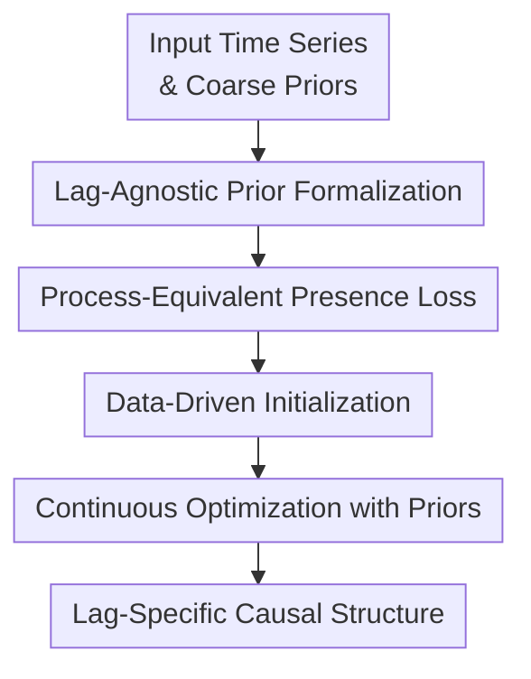

# Structure Learning from Time-Series Data with Lag-Agnostic Structural Prior

**Conference**: ICLR 2026  
**OpenReview**: [https://openreview.net/forum?id=kdJsB0J4Ic](https://openreview.net/forum?id=kdJsB0J4Ic)  
**Code**: None  
**Area**: Time-Series Structure Learning / Dynamic Causal Discovery  
**Keywords**: Lag-agnostic prior, Time-series causal discovery, Structure learning, Continuous optimization, DYNOTEARS

## TL;DR

This paper investigates how to incorporate coarse-grained causal priors—where variable $j$ affects variable $i$ but the specific lag is unknown—into time-series structure learning. By using process-equivalent prior losses and data-driven initialization, the method more stably recovers fine-grained lagged causal structures.

## Background & Motivation

**Background**: Time-series structure learning aims to recover dynamic causal mechanisms from multivariate sequences $X \in \mathbb{R}^{T \times d}$, covering both instantaneous and lagged influences. Continuous optimization methods like DYNOTEARS represent each lag $\tau$ as a structure matrix $W_\tau$: $W_0$ for instantaneous edges within the same time slice and $W_\tau, \tau>0$ for cross-time-slice edges from $t-\tau$ to $t$. Smooth DAG constraints from NOTEARS are typically applied to $W_0$ to ensure acyclicity.

**Limitations of Prior Work**: In practice, researchers often possess high-level causal knowledge, such as "one gene regulates another" or "one brain region influences another," without knowing if the effect occurs at lag $1$, $2$, or $L$. Existing dynamic structure learning methods with priors favor lag-specific priors, requiring the direct specification of whether a specific edge $(W_s)_{ij}$ exists. If the lag in the prior is mislabeled, the model is forced to fit incorrect information.

**Key Challenge**: The semantics of a lag-agnostic prior is "at least one lag contains $j \to i$," rather than "a pre-selected lag must exist." If natural-seeming constraints like $\max_\tau |(W_\tau)_{ij}|$ are used directly, gradients may push only the lag that happens to have a slightly higher weight early in optimization. This can cause the model to prematurely treat a coarse-grained prior as a specific lag prior. Consequently, while the logic of the constraint may be satisfied eventually, the optimization process deviates from the "lag unknown" semantic.

**Goal**: The authors aim to solve three sub-problems: first, formalizing lag-agnostic edge presence and absence; second, designing a loss that satisfies the prior upon convergence without biasing specific lags during optimization; and third, addressing the additional non-convexity introduced by the "OR" semantics of selecting one lag among many to avoid local optima.

**Key Insight**: Instead of inventing a new discrete search algorithm, the paper operates within the continuous structure learning framework. This allows existing optimization-based methods like DYNOTEARS, LIN, RHINO, and NTS-NOTEARS to serve as backbones, supplemented by appropriate lag-agnostic prior losses and a more stable initialization strategy.

**Core Idea**: Utilize a "consequential equivalence" loss that considers all candidate lags simultaneously, replacing maximum-based penalties that lock into a single lag too early. This is combined with data-driven initialization to find lag directions consistent with observed data before using coarse priors to refine the fine-grained temporal causal structure.

## Method

### Overall Architecture

The study starts with standard time-series structure learning: given a multivariate time series $X$, a maximum lag $L$, and two types of lag-agnostic prior matrices $C_p$ (presence) and $C_a$ (absence). $C_p$ indicates that an edge should exist between a variable pair at an unknown lag, while $C_a$ indicates no edge should exist at any lag. The output is a set of lag-specific matrices $W_{0:L}$.

The workflow involves formalizing prior semantics, converting them into losses that do not mislead optimization, and solving them through a two-stage process. Absence priors are straightforward: if $(C_a)_{ij}=1$, $W_\tau$ for all lags is penalized. The difficulty lies in presence priors: if $(C_p)_{ij}=1$, only one $\tau$ must satisfy $|(W_\tau)_{ij}|>\delta$ without being pre-specified.

The optimization retains the original time-series fitting loss $\mathcal{L}(X; W_{0:L})$ and the acyclicity constraint $h(W_0)=0$, adding the lag-agnostic presence prior as a soft penalty:

$$
\min_{W_{0:L}} \mathcal{L}(X; W_{0:L}) + \lambda_p \sum_{i,j} (C_p \circ p(W))_{ij}, \quad \text{s.t. } h(W_0)=0.
$$

The designed prior loss $p(W)$ must satisfy two requirements: consequential equivalence (zero loss if and only if at least one lag edge exceeds the threshold) and process equivalence (preventing biased reinforcement of a single lag early in optimization).

### Key Designs

**1. Lag-Agnostic Prior Formalization: Encoding Presence as a Cross-Lag OR Constraint**

The paper defines edge absence $(C_a)_{ij}=1$ as an AND constraint across all lags $\tau \in \{0,1,\ldots,L\}$, requiring $(W_\tau)_{ij}=0$. Edge presence $(C_p)_{ij}=1$ is defined as an OR constraint:

$$
W_{0:L} \vDash C_p \Longleftrightarrow \forall (i,j), (C_p)_{ij}=1,\ \max_\tau |(W_\tau)_{ij}| > \delta.
$$

The challenge is that presence priors are not point constraints but relations across multiple candidates. If training only focuses on the current maximum $|(W_\tau)_{ij}|$, the "OR" relation collapses into "the current maximum must exist," violating process equivalence.

**2. Process-Equivalent Presence Loss: Pushing All Candidates to Avoid Premature Locking**

The authors point out that a maximum-based formulation:

$$
(p_{\max}(W))_{ij}=\operatorname{ReLU}\left(\delta-\max_\tau |(W_\tau)_{ij}|\right)
$$

is consequentially equivalent but not process-equivalent. If initial absolute weights are small, the max-loss only provides a push to the single largest edge. Once it crosses the threshold, the penalty vanishes, and the model stops exploring other lags that might better fit the data.  

They propose a binary-masked formulation: until the constraint is met, all candidate lags are penalized equally.

$$
(p_{\mathrm{bin}}(W))_{ij}=\mathbb{I}\left(\max_\tau |(W_\tau)_{ij}| < \delta\right) \sum_\tau \operatorname{ReLU}\left(\delta-| (W_\tau)_{ij} |\right).
$$

**3. Logic-Dual Loss: Modeling OR Semantics via Products for Smoothness**

While binary-masked is intuitive, the indicator function is non-smooth. The paper derives a presence constraint from logical duality. Since absence is an AND relation, presence is an OR relation, which can be expressed as a product:

$$
(p_{\mathrm{or}}(W))_{ij}=\prod_\tau \operatorname{ReLU}\left(\delta-| (W_\tau)_{ij} |\right).
$$

If any lag edge exceeds the threshold, the product becomes zero. Unlike the max-based approach, the product term depends on all lags when the constraint is not met. A normalized version is used to maintain loss scale across different max lags $L$:

$$
(\bar{p}_{\mathrm{or}}(W))_{ij}=\prod_\tau \frac{1}{\delta}\operatorname{ReLU}\left(\delta-| (W_\tau)_{ij} |\right).
$$

**4. Data-Driven Initialization: Letting Data Guide Lag Tendency**

The OR structure of priors introduces non-convexity. Direct optimization from zero or random initialization easily falls into "correct prior, wrong lag" local optima. The authors use a two-step approach:  
1. **Stage 1**: Solve standard structure learning without lag-agnostic priors: $\hat{W}^{\mathrm{data}}_{0:L}=\arg\min_{W_{0:L}} \mathcal{L}(X; W_{0:L}), \text{s.t. } h(W_0)=0$.
2. **Stage 2**: Use the result from Stage 1 as initialization and optimize with the lag-agnostic prior loss.

### Loss & Training

The base model uses a linear VAR form: $X_t=\sum_{\tau=0}^{L} W_\tau X_{t-\tau}+\epsilon_t$. Instantaneous structure $W_0$ is controlled via the NOTEARS acyclicity constraint: $h(W_0)=\operatorname{Tr}\left(e^{W_0 \circ W_0}\right)-d=0$.

Training involves the augmented Lagrangian for $h(W_0)=0$. In experiments, prior ratio $p=80\%$, $\lambda_p=0.5$, $\delta=0.1$, and $L=3$. The binary-masked (Backbone&) and logic-dual (Backbone*) versions were tested with various initialization strategies. Inference is performed by thresholding: $\hat{W}_\tau=\mathbb{I}(|W_\tau|>\delta)\circ W_\tau$.

## Key Experimental Results

### Main Results

Evaluations were conducted on synthetic data (ER graphs, VAR processes) and the DREAM4 gene regulatory network dataset.

| Setting | Method | SHD↓ | F1↑ |
|------|------|------|-----|
| 20 nodes ER4, Gaussian, $L=5$, 50% priors | DYNOTEARS | 13.00±3.10 | 0.91±0.02 |
| Same | LS-0, Perfect Lags | 4.83±1.33 | 0.97±0.01 |
| Same | LS-50, 50% Error | 11.83±1.94 | 0.92±0.01 |
| Same | DYNOTEARS& (Init Data) | 6.17±2.71 | 0.95±0.02 |
| Same | DYNOTEARS* (Init Data) | 5.50±1.76 | 0.96±0.01 |

The results highlight that while lag-specific priors are superior if 100% accurate, they degrade significantly even with small errors. The proposed lag-agnostic method remains robust and significantly outperforms the baseline.

### Ablation Study

- **Process Equivalence**: DYNOTEARS* (logic-dual) outperformed maximum-based variants, especially without specialized initialization, as the latter locks into wrong lags prematurely.
- **Initialization**: Data-driven initialization yielded lower variance and higher accuracy than random or zero initialization by providing a "data-first" lag orientation.
- **Non-linear Backbone**: The loss was successfully applied to NTS-NOTEARS on non-linear data, demonstrating its modularity as a plugin.

### Key Findings

- **Process Equivalence is Crucial**: Maximum-based surrogates fail not because of the final constraint, but because the training trajectory ignores the "lag unknown" semantics.
- **Improved Prediction**: On DREAM4, the method improved both AUROC and test regression loss, proving it identifies physiologically meaningful lagged structures rather than just injecting summary prior information.
- **Robustness**: Presence priors are robust up to 30% error rates, while absence priors are more sensitive to incorrect information.

## Highlights & Insights

- The distinction between "consequential equivalence" and "process equivalence" provides a valuable theoretical lens for designing differentiable constraints in non-convex optimization.
- The binary-masked and logic-dual losses are elegant plugins for any optimization-based structure learning framework.
- Letting data guide the initial lag tendency through a two-stage process effectively mitigates the non-convexity of the OR-logic prior.

## Limitations & Future Work

- The method currently assumes no latent confounding or missing variables.
- While the two-stage optimization helps, it does not guarantee global optimality, particularly as node count and max lag increase.
- Future work could extend to more complex priors, such as dynamic path existence or time-window constraints.

## Related Work & Insights

- **Compared to DYNOTEARS/NTS-NOTEARS**: While these methods enable priors, they focus on lag-specific information. This paper fills the gap where temporal detail is unknown but relational knowledge is certain.
- **Gradient Allocation**: The paper serves as a reminder that for differentiable constraints, one must analyze how gradients are distributed among candidates during the search, rather than just checking if the limit point satisfies the logic.

## Rating

- **Novelty**: ⭐⭐⭐⭐⭐
- **Experimental Thoroughness**: ⭐⭐⭐⭐⭐
- **Writing Quality**: ⭐⭐⭐⭐☆
- **Value**: ⭐⭐⭐⭐⭐

<!-- RELATED:START -->

## Related Papers

- [\[ICLR 2026\] Understanding Transformers for Time Series: Rank Structure, Flow-of-ranks, and Compressibility](understanding_transformers_for_time_series_rank_structure_flow-of-ranks_and_comp.md)
- [\[ICLR 2026\] Rating Quality of Diverse Time Series Data by Meta-learning from LLM Judgment](rating_quality_of_diverse_time_series_data_by_meta-learning_from_llm_judgment.md)
- [\[ICLR 2026\] Latent-to-Data Cascaded Diffusion Models for Unconditional Time Series Generation](latent-to-data_cascaded_diffusion_models_for_unconditional_time_series_generatio.md)
- [\[ICML 2026\] Parametric Prior Mapping Framework for Non-stationary Probabilistic Time Series Forecasting](../../ICML2026/time_series/parametric_prior_mapping_framework_for_non-stationary_probabilistic_time_series_.md)
- [\[ICLR 2026\] AutoDA-Timeseries: Automated Data Augmentation for Time Series](autoda-timeseries_automated_data_augmentation_for_time_series.md)

<!-- RELATED:END -->
