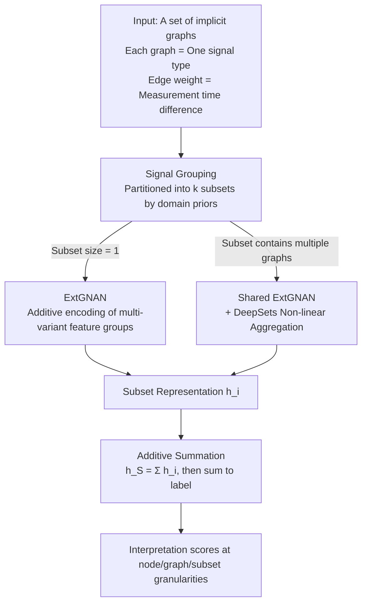

# SuperMAN: Interpretable and Expressive Networks over Temporally Sparse Heterogeneous Data

**Conference**: ICLR 2026  
**OpenReview**: [https://openreview.net/forum?id=1MVeSLvfxU](https://openreview.net/forum?id=1MVeSLvfxU)  
**Code**: https://github.com/azerio/Super-Mixing-Additive-Networks---SuperMAN  
**Area**: Temporal Learning / Graph Neural Networks / Interpretability / Clinical Prediction  
**Keywords**: Irregular Time Series, Implicit Graphs, Additive Networks, Interpretability, Expressivity

## TL;DR
SuperMAN models "multi-type, irregularly sampled, and asynchronous" sparse temporal data as "a set of implicit graphs." By utilizing an extended Graph Additive Network (ExtGNAN) combined with a subset grouping mechanism, it directly learns from these structures. This approach provides interpretable contribution scores at three granularities (node, graph, and subset) while allowing users to trade fine-grained interpretability for stronger expressivity via "grouping" when domain priors are available. It achieves SOTA results on Crohn’s disease onset prediction, ICU length of stay, and fake news detection.

## Background & Motivation
**Background**: Real-world temporal data often consist of various signals recorded at different frequencies and irregular time points. For instance, in a patient's blood test records, different biochemical indicators are measured at varying times and frequencies, resulting in a set of fragmented, sparse, and unaligned temporal signals. Similar patterns appear in news propagation trees within social networks and system event logs. The mainstream approach involves aligning these signals to a fixed-size time grid, forcing a shared timeline, and then filling missing values via cropping/aggregation plus interpolation or learned imputation before feeding them into Transformers, RNNs, or ODEs.

**Limitations of Prior Work**: This "align-then-impute" paradigm suffers from two major flaws. First, imputation causes substantial information loss and may even distort the underlying dynamics; studies have shown that imputation does not necessarily improve downstream prediction. Second, it treats "irregularity" itself as noise to be removed, whereas the density of measurement intervals and the timing differences between indicators often contain critical information (e.g., a patient frequently checking a specific blood indicator is a clinical signal). Moreover, in high-stakes scenarios like healthcare, clinicians require not just predictions but an understanding of the model's reasoning, which these black-box methods rarely provide through built-in interpretability.

**Key Challenge**: There is a trade-off between expressivity and interpretability. Purely additive models that do not mix features (e.g., GNAN) are transparent but have limited expressivity, performing poorly on tasks with strong feature interactions. Conversely, powerful models capable of modeling non-linear interactions return to being black boxes. Structurally, existing methods that directly model sparsity (e.g., Raindrop) can only handle "path-like" signals and fail to accommodate arbitrary graph structures or provide interpretability.

**Goal**: (1) Learn directly from heterogeneous, sparse, and irregular signals without alignment or imputation; (2) Provide interpretable contributions at node, graph, and subset granularities; (3) When domain priors exist, allow users to sacrifice fine-grained interpretability for stronger expressivity, while theoretically proving that this exchange strictly enhances expressivity.

**Key Insight**: Model each signal type as a directed graph where nodes represent individual measurements and edge weights represent the time difference between them. In this way, "irregular sampling" is explicitly encoded into the graph structure without needing imputation. Furthermore, the Graph Additive Network (GNAN) serves as an interpretable backbone that can be extended.

**Core Idea**: Replace "fixed time grids + imputation" with "a set of implicit graphs + additive decomposition," introducing "signal/feature grouping" as a tunable knob between interpretability and expressivity.

## Method

### Overall Architecture
**Mechanism**: SuperMAN operates on a **set of graphs** $S=\{G_1,\dots,G_m\}$. Each graph represents a signal type (e.g., a biochemical indicator), where nodes are single measurements (with feature values $x_v$ and timestamps $t_v$). The distance on directed edges $\Delta_{uv}=t_u-t_v$ encodes the time difference between measurements (0 if no path exists). Graphs can be explicitly given (e.g., propagation trees) or constructed on-the-fly as directed path graphs from timestamps (e.g., blood test data).

The pipeline follows "grouping → intra-subset encoding → additive summation → label output": First, $m$ graphs are partitioned into $k$ **disjoint subsets** $S_1,\dots,S_k$ based on domain priors. Each subset is encoded into a vector $h_i\in\mathbb{R}^d$ by an independent $\Phi_i$. The representation of the entire set is the **direct summation** of subset representations $h_S=\sum_i h_i$. Finally, the $d$ components of $h_S$ are summed to produce a scalar prediction:

$$\mathrm{SUPERMAN}(S)=\sum_{c=1}^{d}\sum_{i=1}^{k}[\Phi_i(S_i)]_c.$$

The key lies in the definition of $\Phi_i$. For **subsets of size 1** (a single graph), $\Phi_i$ is an ExtGNAN, yielding a transparent representation decomposable down to nodes/features. For **subsets containing multiple graphs**, a shared ExtGNAN is run on each graph, followed by a DeepSets module to non-linearly aggregate these graph vectors into a subset vector. Thus, "to group or not" becomes a switch: No grouping → all subsets size 1 → fully interpretable but lower expressivity; Grouping → allows non-linear mixing within subsets → higher expressivity but interpretability regresses to the subset granularity. The design ensures subsets are always additive, meaning predictions can be losslessly attributed to each subset regardless of grouping.

### Key Designs

**1. Implicit Graph Modeling: Encoding Irregular Sampling into Structure rather than Imputation**

This design directly addresses the information loss caused by "alignment + imputation." SuperMAN avoids creating a shared timeline or filling missing values. Instead, it builds a separate directed graph for each signal type: node $v$ is a measurement with features $x_v\in\mathbb{R}^d$ and timestamp $t_v$; the "distance" between any two nodes is defined by the time difference $\Delta_{uv}=t_u-t_v$ (only if a path $u\to v$ exists). This results in different signals being naturally expressed as a set of graphs with varying structures, sizes, and feature spaces. Irregularity is preserved as a signal rather than being smoothed out. Unlike methods like Raindrop that only handle path-like signals, SuperMAN has no restrictions on graph structure—arbitrary structures like propagation trees can be handled directly.

**2. ExtGNAN: Generalizing Additive Networks to Multivariate Feature Groups**

The interpretability of GNAN stems from the fact that features are not non-linearly mixed—it runs a univariate network for each feature of each node and sums them linearly; the cost is poor performance when features interact. ExtGNAN relaxes this constraint to the "feature group" level: features are partitioned into $K$ subsets $\{F_l\}$, where a **multivariate** network processes features within a subset together, while maintaining additivity between subsets. Specifically, it learns a distance function $\rho(\cdot)$ and a set of feature shape functions $\psi_l$. The representation of node $j$ for feature group $F_l$ is a weighted sum of contributions from all nodes in the graph:

$$[h_j]_{F_l}=\sum_{w\in V}\rho(\Delta(w,j))\cdot\psi_l([X_w]_{F_l}),$$

The graph representation is the sum over nodes $h_G=\sum_{i\in V}h_i$. Here, $\rho$ translates time differences into weights (encoding irregular structure), and $\psi_l$ handles non-linear transformations of group features. The advantage is a fine-grained control of "localized interpretability": feature-level interpretability is only sacrificed for features grouped together (replaced by group-level importance), while other features remain fully transparent.

**3. Signal/Feature Grouping: Quantifiable Expressivity Gain for Adjustable Interpretation Granularity**

This is the knob connecting interpretability and expressivity, as well as the entry point for domain priors. When graphs (signals) are grouped into the same subset, they are aggregated non-linearly via DeepSets—$g\big(\sum_{i}f(h_i)\big)$, where $f,g$ are arbitrary networks. Consequently, signals within a subset can interact non-linearly at the cost of interpretability shifting from individual nodes/graphs to the entire subset. The paper provides two theorems to support this: Theorem 3.2 proves that any SuperMAN with at least one subset of size ≥ 2 is strictly more expressive than a version where all subsets are size 1; Theorem 3.1 proves SuperMAN is strictly more powerful than standard GNAN. In medical scenarios, clinical priors naturally group biochemical indicators (e.g., "immune response," "inflammation," "oxygen transport"), and subset-level interpretation is often sufficient for clinical needs.

**4. Additive Attribution: Three-tier Interpretability Guaranteed by Architecture "Fidelity"**

Since the final prediction is an additive sum of contributions, SuperMAN's importance scores are not post-hoc approximations but are read directly from the architecture. For nodes in a subset of size 1 (no non-linear mixing), the total contribution is the sum across all feature groups:

$$\mathrm{TotalContribution}(j)=\sum_{l=1}^{K}[h_j]_{F_l}=\sum_{w\in V}\rho(\Delta(w,j))\sum_{l=1}^{K}\psi_l([x_w]_{F_l}),$$

The graph contribution is the sum of its node contributions. For non-linearly mixed graphs (subset size > 1), the contribution is given for the whole subset $\mathrm{TotalContribution}(S)=\sum_l [S]_{F_l}$. The authors emphasize that this "by design" interpretability is more reliable than post-hoc attribution: in perturbation analysis (e.g., adding PCA noise to the first principal component of an indicator group), the effect exactly matches the group's true contribution because it is the actual term added to the output.

### Loss & Training
Tasks are framed as binary classification (CD onset / ICU stay > 72h / Fake News). Standard classification objectives are used. For the highly imbalanced P12 dataset (~93% positive), minority class upsampling within batches is applied. CD data is balanced by downsampling the control group based on age. Grouping configurations (no grouping vs. 5 clinical knowledge-based groupings) are selected via grid search on the validation set, with results reported as mean ± SD over 3 random seeds.

## Key Experimental Results

### Main Results
Two clinical prediction tasks (Metric: AUPRC, mean ± SD over 3 seeds):

| Dataset | Metric | Ours (SuperMAN) | Prev. SOTA | Gain |
|--------|------|----------|-------------------|------|
| P12 (ICU Stay > 72h) | AUPRC | 97.41 ± 0.38 | DGM2 97.00 | +0.41 |
| CD onset (Crohn’s Disease) | AUPRC | 83.93 ± 0.27 | GRU-D 83.36 | +0.57 |

Baselines include 8 models ranging from sequential to graph-based: Transformer, Trans-mean, GRU-D, SeFT, mTAND, DGM2, MTGNN, and Raindrop.

Fake news detection (GossipCop, propagation trees converted to path graph sets, Metric: Accuracy):

| Dataset | Metric | Ours (SuperMAN) | Prev. SOTA | Gain |
|--------|------|----------|---------------|------|
| GossipCop | Accuracy | 97.34 ± 0.2 | GraphConv 96.77 | +0.57 |

Since clinical baselines cannot handle tree structures, SuperMAN is compared against 4 GNNs (GATv2, GraphConv, GraphSAGE, GCNFN), demonstrating its versatility across graph structures.

### Ablation Study
Components removed from the optimal configuration on CD data (Relative drop in AUPRC):

| Configuration | AUPRC Drop | Description |
|------|-----------|------|
| Full model | — | Complete model |
| (i) DeepSet → mean pooling | −19.98% ± 0.28% | Removing learned aggregation causes the largest drop |
| (ii) $\rho \to 1$ (Distance = const) | −12.39% ± 1.39% | Removing temporal structure information |
| (iii) ExtGNAN → Node-wise MLP | −15.00% ± 2.09% | Removing graph inductive bias |
| (iv) ExtGNAN → Identity | −17.70% ± 0.15% | Lower bound without feature learning |
| (v) ExtGNAN → Standard GNAN | −4.38% ± 2.85% | Removing multivariate feature grouping |

### Key Findings
- **DeepSet non-linear aggregation is the most significant contributor**: Replacing it with mean pooling drops performance by nearly 20%, confirming that "intra-subset non-linear mixing" is the primary source of expressivity, aligning with Theorem 3.2.
- **Temporal structure is critical**: Setting the distance function $\rho$ to a constant 1 (ignoring intervals) leads to a 12%+ drop, proving that irregular sampling intervals are informative signals rather than noise—empirical evidence against "alignment + imputation."
- **Interpretability aligns with biological priors**: Node-level importance in CD highlighted F-Cal, platelets, and lymphocytes (inflammation/immune markers). In P12, markers for renal function, liver injury, and cardiac stress were prominent. Subset-level analysis showed the inflammatory subset had the largest non-linear impact on CD prediction, potentially revealing phase changes in disease progression.

## Highlights & Insights
- **Turning "Irregularity" from a Burden into a Signal**: Using edge weights as time differences in implicit graphs directly encodes sampling cadence, bypassing imputation. The 12% drop when $\rho\to1$ is the clearest evidence that this approach works for any asynchronous multi-source temporal data.
- **Interpretability-Expressivity Knob with Theoretical Support**: Grouping granularity serves as both a prior injection point and a regulator, with theorems ensuring that grouping strictly improves expressivity rather than just being an empirical heuristic.
- **Fidelity in Interpretability "By Design"**: Importance scores are the exact terms added to the output. Perturbation analysis aligns perfectly with internal computations, avoiding the "infidelity" issues of post-hoc attribution methods. This additive attribution is highly suited for auditable high-risk scenarios.
- **Unified Framework for Heterogeneous Data**: Handling both path-like blood tests and tree-like fake news propagation is possible because the model makes no assumptions about graph structure, making it more general than specialized models like Raindrop.

## Limitations & Future Work
- **Dependency on Domain Priors for Grouping**: The expressivity gains rely on "meaningful grouping." In scenarios without clear clinical or domain priors, finding the right grouping (though data-driven grouping was tested) adds hyperparameter overhead.
- **Modest Absolute Improvements**: The absolute gain over the best baselines is relatively small (0.41/0.57 points in medical tasks). The core selling point is the combination of "comparable/better accuracy + built-in interpretability."
- **Interpretability vs. Expressivity Boundary**: Once subsets are size > 1, node/graph interpretability is replaced by subset-level interpretability. This is a fundamental design trade-off.
- **Qualitative Nature of Clinical Validation**: While importance scores "align with known biology," this remains descriptive. Prospective clinical trials are needed to prove these interpretations can effectively change decision-making.

## Related Work & Insights
- **vs. GNAN (Bechler-Speicher 2024)**: GNAN performs additive modeling for single graphs and univariate features, which is transparent but limits expressivity. SuperMAN extends this to "graph sets + multivariate groups + subset grouping," with a theoretical proof of stronger expressivity (Theorem 3.1).
- **vs. Alignment + Imputation (CSDI, SAITS, GRU-D, etc.)**: These create fixed grids and fill gaps, which may lose information. SuperMAN encodes irregularity directly into the graph, with ablation studies proving the value of temporal structure.
- **vs. Raindrop**: Raindrop models sparsity via graphs but is limited to path-like signals and lacks built-in interpretability. SuperMAN handles arbitrary graph structures (like propagation trees) with three-tier faithful attribution.
- **vs. Neural/Latent ODE**: ODEs handle irregular intervals via continuous dynamics but are computationally heavy and rely on missingness encoding. SuperMAN uses static implicit graphs to avoid integration, making it lighter and more naturally interpretable.

## Rating
- Novelty: ⭐⭐⭐⭐ Innovative modeling of heterogeneous sparse time series as implicit graph sets with tunable additive interpretability, backed by expressivity theorems.
- Experimental Thoroughness: ⭐⭐⭐⭐ Coverage of medical and fake news tasks with complete ablations and qualitative validation, though absolute gains are small with overlapping variance bands.
- Writing Quality: ⭐⭐⭐⭐ Clear progression from motivation to method and theory, with well-defined formulas for attribution.
- Value: ⭐⭐⭐⭐ "SOTA accuracy + built-in faithful interpretability" is highly valuable for high-risk clinical settings. The framework is versatile for asynchronous multi-source time series.

<!-- RELATED:START -->

## Related Papers

- [\[ACL 2026\] A Unified Framework for Modeling Heterogeneous Financial Data via Dual-Granularity Prompting](../../ACL2026/time_series/a_unified_framework_for_modeling_heterogeneous_financial_data_via_dual-granulari.md)
- [\[ICLR 2026\] Weight-Space Linear Recurrent Neural Networks](weight-space_linear_recurrent_neural_networks.md)
- [\[ICLR 2026\] Learning Linear State-Space Models with Sparse System Matrices](learning_linear_state-space_models_with_sparse_system_matrices.md)
- [\[ICLR 2026\] Tuning the burn-in phase in training recurrent neural networks improves their performance](tuning_the_burn-in_phase_in_training_recurrent_neural_networks_improves_their_pe.md)
- [\[ICLR 2026\] Enhancing Sparse Event Detection in Healthcare Time-Series via Adaptive Gate of Context–Detail Interaction](enhancing_sparse_event_detection_in_healthcare_time-series_via_adaptive_gate_of_.md)

<!-- RELATED:END -->
