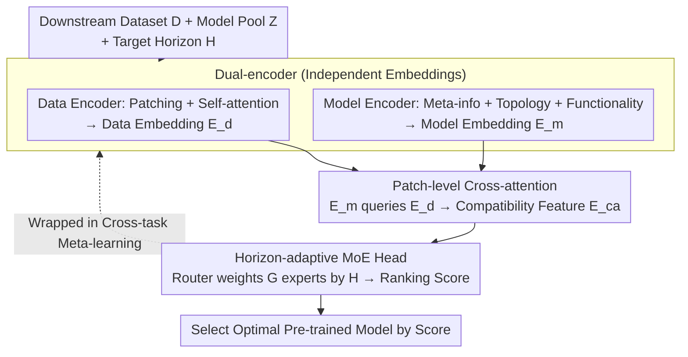

# SwiftTS: A Swift Selection Framework for Time Series Pre-trained Models via Multi-task Meta-Learning

**Conference**: ICLR 2026  
**arXiv**: [2510.23051](https://arxiv.org/abs/2510.23051)  
**Code**: [GitHub](https://github.com/decisionintelligence/SwiftTS)  
**Area**: Time Series/Model Selection  
**Keywords**: Pre-trained Model Selection, Dual-encoder, Meta-learning, Time Series Forecasting, Horizon-adaptive

## TL;DR

SwiftTS is introduced as the first model selection framework for time series pre-trained models. It employs a dual-encoder architecture to independently embed dataset patch-level temporal features and model meta-information (architecture, topology, and functionality). Compatibility scores are computed via patch-level cross-attention, combined with a horizon-adaptive Mixture-of-Experts (MoE) and cross-domain/cross-horizon meta-learning. Across 14 datasets and 8 models, it significantly outperforms all baselines with a mean weighted Kendall $\tau_\omega = 0.442$.

## Background & Motivation

**Background**: Time series foundation models (e.g., TimesFM, MOIRAI, Chronos) have emerged in large numbers, categorized into encoder-only, decoder-only, and encoder-decoder architectures. However, no single model is optimal for all tasks. Given a new dataset, selecting the best model is challenging, and fine-tuning every candidate is computationally expensive (e.g., $3.46 \times 10^6$ seconds on the Traffic dataset).

**Limitations of Prior Work**:
- Existing model selection methods (e.g., RankME, LogME, LEEP) are primarily designed for CV and do not account for temporal dependencies or sequential patterns.
- Feature-based analytic methods require a forward pass for every candidate model to extract features, resulting in computational costs that grow linearly with the model pool.
- Time series pre-trained models exhibit highly heterogeneous architectures and training paradigms, precluding the use of a unified feature extractor.
- The performance of a single model can vary significantly across different forecasting horizons, a dimension ignored by prior methods.

**Key Challenge**: Model selection requires understanding the compatibility between a dataset and a model. However, (1) different models lack comparable feature representations, and (2) matching relationships shift according to the forecasting horizon.

**Goal**: How to efficiently select the optimal pre-trained model for a new dataset and a specific horizon without executing any candidate models?

**Key Insight**: Learn matching patterns from historical (dataset, model, horizon) performance triplets. This shifts the focus from feature analysis to learning-oriented matching, using independent encoders to represent data and models respectively, followed by an attention mechanism for matching.

**Core Idea**: Utilize meta-learning to transform the model selection problem into "learning to find matches between data and model embeddings."

## Method

### Overall Architecture

SwiftTS reformulates model selection as a supervised matching problem based on historical performance. It trains a score function $\hat{r}_k = f(\phi_k, D, H)$ on a meta-dataset $\mathcal{D}_{\text{meta}} = \{D^i, Z, H^i, \boldsymbol{r}^i\}_{i=1}^N$. Given a downstream dataset $D$, a model pool $Z$ containing candidate $\phi_k$, and a target horizon $H$, the function outputs an expected ranking score. The pipeline consists of four stages: first, a **Data Encoder** and a **Model Encoder** project data and candidates into a shared space independently (crucially, candidates never run a forward pass on target data). Second, a **Patch-level Cross-attention** layer calculates fine-grained compatibility. Third, a **Horizon-adaptive MoE Head** outputs ranking scores weighted by the target horizon. The entire training is wrapped in **Cross-task Meta-learning** to ensure generalization to new datasets and horizons. During inference, the optimal model is selected by score without running any candidates.

### Key Designs

**1. Dual-encoder: Decoupling Data and Model Embeddings to Avoid Forward Pass Overhead**

The bottleneck of analytic methods is the requirement to run a forward pass for every candidate on the target data. SwiftTS decouples this by encoding data and models independently. On the data side, the time series $X \in \mathbb{R}^{L \times C}$ is divided into $P = \lfloor L/S \rfloor$ patches, linearly projected to $d$ dimensions with positional encoding, and processed by self-attention to capture long-range dependencies:

$$E_{\text{sa}} = \text{softmax}\!\left(\frac{E_{\text{inp}} W_Q^{sa} (E_{\text{inp}} W_K^{sa})^T}{\sqrt{d_k}}\right) E_{\text{inp}} W_V^{sa}$$

Compact data embeddings $E_d \in \mathbb{R}^{P \times d}$ are obtained by aggregating $B$ sampled sequences. On the model side, three types of knowledge characterize candidate $\phi_k$: meta-information embeddings $\boldsymbol{v}_a^k$ encode architecture type, parameter count, GMACs, and pre-training domain; topological embeddings $\boldsymbol{v}_t^k$ represent the model as a Directed Acyclic Graph (DAG) for graph2vec encoding; and functional embeddings $\boldsymbol{v}_c^k$ perform "black-box probing" by recording outputs $\boldsymbol{v}_c^k = \phi_k(\epsilon)$ from fixed Gaussian noise $\epsilon \sim \mathcal{N}(0, I)$. These are concatenated and projected into the model embedding $\boldsymbol{E}_m = \sigma([\boldsymbol{v}_a, \boldsymbol{v}_t, \boldsymbol{v}_c] W_m^T)$. Consequently, expensive per-model forward passes are replaced by one-time offline embeddings.

**2. Patch-level Cross-attention: Fine-grained Compatibility Mapping**

While the embeddings are in the same space, simple dot-products lose information about which temporal patterns a model favors. SwiftTS uses the model embedding $E_m$ as query and data embedding $E_d$ as key/value for cross-attention:

$$E_{\text{ca}} = \text{softmax}\!\left(\frac{E_m W_Q^{ca} (E_d W_K^{ca})^T}{\sqrt{d_k}}\right) E_d W_V^{ca}$$

This allows the framework to focus on patch regions that best match specific model features. The training objective balances ranking and precision: $\mathcal{L}_{\text{total}} = -\sum_{k=1}^K p_k(\hat{\boldsymbol{r}}) \log q_k(\boldsymbol{r}) + \lambda \cdot \sum_{k=1}^K \|\boldsymbol{r}_k - \hat{\boldsymbol{r}}_k\|_2^2$, combining a ranking loss for distribution alignment and a prediction loss for score regression.

**3. Horizon-adaptive MoE + Cross-task Meta-learning: Addressing Horizon Variance and OOD Generalization**

A model's relative performance can invert between $H=96$ and $H=720$. SwiftTS employs a router to dynamically weight $G$ experts based on the target horizon: $\boldsymbol{w} = \text{softmax}(\text{Router}(H; \theta_s))$, $\hat{\boldsymbol{r}} = \sum_{g=1}^G w_g \cdot \text{MLP}_g(E_{\text{ca}})$. This allows the framework to cover multiple horizons without retraining. MAML-style meta-learning is applied to enhance generalization: the inner loop adapts to a support set $\theta_i' = \theta - \alpha \nabla_\theta \mathcal{L}_{\text{supp}}(\mathcal{T}_i; \theta)$, while the outer loop updates meta-parameters $\theta \leftarrow \theta - \gamma \nabla_\theta \sum_{\mathcal{T}_i} \mathcal{L}_{\text{query}}(\mathcal{T}_i; \theta_i')$. Task sampling involves cross-dataset (support/query from different domains) and cross-horizon (support/query use different $H$) strategies to force the learning of universal matching patterns.

## Key Experimental Results

### Main Results: Average weighted Kendall $\tau_\omega$ (14 datasets × 4 horizons)

| Method | H=96 | H=192 | H=336 | H=720 | Mean | Top-1 Count |
|------|:---:|:---:|:---:|:---:|:---:|:---:|
| RankME | 0.008 | -0.046 | -0.201 | -0.238 | -0.119 | 0 |
| LogME | 0.020 | -0.027 | -0.066 | -0.090 | -0.041 | 3 |
| Etran | 0.318 | 0.212 | -0.004 | 0.073 | 0.150 | 8 |
| DISCO | 0.003 | 0.023 | 0.066 | 0.040 | 0.033 | 4 |
| Model Spider | 0.319 | 0.301 | 0.294 | 0.271 | 0.296 | 6 |
| zero-shot | 0.031 | 0.104 | 0.114 | 0.251 | 0.125 | 5 |
| **Ours** | **0.470** | **0.453** | **0.411** | **0.432** | **0.442** | **28** |

### Top-k Selection Probability and Overall Correlation

| Method | Pr(top-1) | Pr(top-2) | Pr(top-3) | $\tau_\omega$ |
|------|:---:|:---:|:---:|:---:|
| RankME | 0.000 | 0.000 | 0.196 | -0.119 |
| Model Spider | 0.304 | 0.482 | 0.571 | 0.296 |
| **Ours** | **0.339** | **0.500** | **0.607** | **0.442** |

### Ablation Study: Model Embeddings

| $\boldsymbol{v}_a$ | $\boldsymbol{v}_t$ | $\boldsymbol{v}_c$ | H=96 | H=192 | H=336 | H=720 | Mean |
|:---:|:---:|:---:|:---:|:---:|:---:|:---:|:---:|
| ✓ | | | 0.341 | 0.283 | 0.331 | 0.401 | 0.339 |
| | | ✓ | 0.365 | 0.401 | 0.317 | 0.397 | 0.370 |
| ✓ | ✓ | | 0.361 | 0.383 | 0.315 | 0.417 | 0.369 |
| **✓** | **✓** | **✓** | **0.470** | **0.453** | **0.411** | **0.432** | **0.442** |

### Key Findings

- SwiftTS achieves a mean $\tau_\omega = 0.442$—49% higher than Model Spider (0.296), demonstrating significantly stronger generalization across datasets and horizons.
- SwiftTS wins 28/56 Top-1 placements, while other methods achieve at most 6-8.
- Efficiency: Model selection on ETTh1 takes ~1000-4000s compared to $4.97 \times 10^4$s for full fine-tuning, reflecting a 10-50x speedup.
- Functional embeddings $\boldsymbol{v}_c$ ($\tau_\omega = 0.370$) contribute the most, followed by meta-info $\boldsymbol{v}_a$ ($0.339$), suggesting model "behavior" is more informative than "description."
- Cross-task meta-learning uniformly improves $\tau_\omega$ across all horizons, serving as the source of OOD robustness.
- Feature analytic methods (RankME/LogME) often produce negative correlations on time series models, proving these CV-based methods are unsuitable for heterogeneous TS models.

## Highlights & Insights

- **"First TS Model Selection Method"**: While model selection is mature in CV, SwiftTS fills a critical gap in the TS domain; the problem definition itself is a contribution.
- **Symmetry of Dual-encoders**: Independent embedding of data and models followed by attention-based matching avoids the fundamental overhead of analytic methods by not requiring model execution on target data.
- **"Black-box Probing" via Functional Embeddings**: Probing with Gaussian noise to observe output patterns allows the framework to distinguish models without knowing internal architectures—a simple yet elegant design.
- **Natural Fit for Meta-learning**: Since model selection is intrinsically a "learning-to-learn" problem, the MAML paradigm with cross-domain sampling naturally enhances generalization.

## Limitations & Future Work

- The model pool is limited to 8 pre-trained models; scalability remains to be verified as TS foundation models proliferate.
- Functional embedding still requires a single forward pass per candidate (albeit using Gaussian noise), so it is not strictly "zero-cost."
- The scope is currently limited to forecasting; classification and anomaly detection tasks are not yet addressed.
- Constructing the meta-dataset requires pre-collecting fine-tuning performance across all models and datasets, which involves a high cold-start cost.

## Related Work & Insights

- **vs Model Spider (Zhang et al., 2023)**: Both are learning-oriented, but Model Spider ignores temporal characteristics and the horizon dimension, resulting in a lower $\tau_\omega$ of 0.296 compared to SwiftTS's 0.442.
- **vs LogME/RankME (Feature Analysis)**: These produce negative correlations on heterogeneous TS models and are identified as inappropriate for the TS domain by SwiftTS.
- **vs TSFM-Bench (Li et al., 2025)**: Provides the ground-truth fine-tuning performance utilized by SwiftTS for training; the two works are complementary.
- **Insight**: SwiftTS could be extended into a "TS Model Recommendation System" combining automated data augmentation and online learning to continuously update selection strategies during deployment.

## Rating

⭐⭐⭐⭐ (4/5)

Overall Evaluation: This is the first comprehensive model selection framework for TS pre-trained models. The combination of dual-encoders, patch cross-attention, horizon-specific experts, and meta-learning is well-designed. Extensive experiments across 14 datasets and 8 models are sufficient, though the model pool size is modest and the method is not completely zero-cost. The technical design is solid, but the breakthrough is methodological rather than theoretical.

<!-- RELATED:START -->

## Related Papers

- [\[ICLR 2026\] TSPulse: Tiny Pre-Trained Models with Disentangled Representations for Rapid Time Series](tspulse_tiny_pre-trained_models_with_disentangled_representations_for_rapid_time.md)
- [\[ICLR 2026\] Rating Quality of Diverse Time Series Data by Meta-learning from LLM Judgment](rating_quality_of_diverse_time_series_data_by_meta-learning_from_llm_judgment.md)
- [\[ICLR 2026\] Multi-Scale Hypergraph Meets LLMs: Aligning Large Language Models for Time Series Analysis](multi-scale_hypergraph_meets_llms_aligning_large_language_models_for_time_series.md)
- [\[ICLR 2026\] Learning Recursive Multi-Scale Representations for Irregular Multivariate Time Series Forecasting](learning_recursive_multi-scale_representations_for_irregular_multivariate_time_s.md)
- [\[ICLR 2026\] MMPD: Diverse Time Series Forecasting via Multi-Mode Patch Diffusion Loss](mmpd_diverse_time_series_forecasting_via_multi-mode_patch_diffusion_loss.md)

<!-- RELATED:END -->
