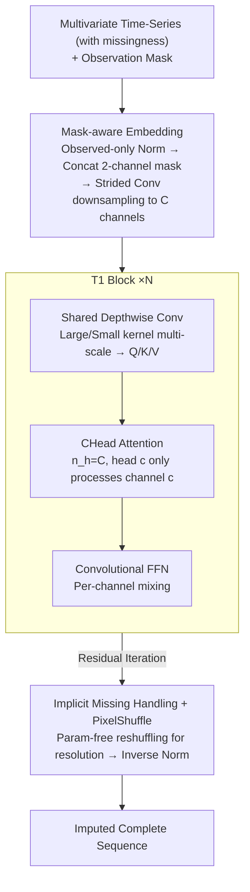

# T1: One-to-One Channel-Head Binding for Multivariate Time-Series Imputation

**Conference**: ICLR 2026  
**arXiv**: [2602.21043](https://arxiv.org/abs/2602.21043)  
**Code**: [GitHub](https://github.com/Oppenheimerdinger/T1)  
**Area**: Time Series / Imputation  
**Keywords**: Time-series Imputation, CNN-Transformer Hybrid, Channel-Head Binding, Selective Information Passing, Missing Pattern Generalization

## TL;DR

T1 is proposed as a CNN-Transformer hybrid architecture. Its core innovation is Channel-Head Binding (CHead Attention): a shared Depthwise Conv extracts $C$ types of temporal features (trend, periodicity, abrupt changes, etc.) for each variable, followed by a one-to-one binding of each CNN channel with an attention head. This ensures that cross-variable information transfer occurs independently at the feature level. When missing data prevents a channel from extracting valid patterns, the corresponding attention head is automatically down-weighted, achieving adaptive missing value processing without explicit design. On 11 benchmark datasets, the MSE is reduced by an average of 46%, with even greater advantages under 70% extreme missingness.

## Background & Motivation

**Background**: Multivariate time-series imputation requires the simultaneous completion of two tasks: (1) extracting temporal patterns from sparse observations; and (2) transferring complementary information across variables to assist reconstruction. These tasks are highly coupled: temporal features contaminated by missing values will amplify errors during cross-variable transfer, while naive cross-variable transfer cannot distinguish which variables are reliable under the current missing pattern.

**Limitations of Prior Work (Four Architectural Paradigms)**:

| Architectural Paradigm | Representative Methods | Temporal Modeling | Cross-Variable Modeling | Key Challenge |
|---------|---------|---------|----------|---------|
| Time-axis tokenization | SAITS, PatchTST | ✓ Attention models long-range dependencies | ✗ All variables mixed in same token | Missing values directly contaminate token representations → pollution propagates through all calculations |
| Variable-axis tokenization | iTransformer | △ Whole sequence compressed to single token | ✓ Pure inter-variable attention | Loss of feature-level selectivity; all temporal patterns are forced to fuse |
| Dual-axis tokenization | ImputeFormer, CSDI | ✓ Time-axis attention | ✓ Variable-axis attention | Missing values create "broken paths" between axes; intermediate representations become unreliable |
| Temporal CNN | ModernTCN, TimesNet | ✓ Efficient multi-scale extraction | △ Only static pointwise mixing | Limited cross-variable transfer capability and unable to adapt to missing patterns |

**Key Insight**: CNNs excel at extracting temporal features from sparse observations (convolutions are naturally robust to local missingness), while Transformers are adept at dynamically modeling inter-variable relationships. The key problem is how to "connect" them correctly—naive concatenation causes multi-channel features extracted by the CNN to be mixed in the attention layer, allowing channels contaminated by missing values to compromise reliable ones.

**Core Idea**: Establish a one-to-one binding between CNN channels and attention heads, allowing each attention head to handle the cross-variable transfer of only one feature type, thereby achieving selective information channels at the feature level.

## Method

### Overall Architecture

T1 addresses the difficulty in multivariate time-series imputation where "temporal feature extraction" and "cross-variable information transfer" interfere with each other: missing values contaminate temporal features, which then amplify errors when transferred across variables. The proposed solution is a division of labor—letting the CNN robustly extract temporal features from sparse observations and the Transformer perform dynamic cross-variable information transfer, then using "Channel-Head Binding" to precisely interface the two at the **feature level**, isolating channels contaminated by missingness.

The pipeline consists of three stages. The input multivariate sequence first undergoes **Mask-aware Embedding**: each variable is normalized using only observed positions, concatenated with the observation mask into 2 channels, and downsampled via strided convolution into $C$-channel latent representations. These latent representations are iteratively processed by $N$ stacked **T1 Blocks**, each performing "Shared Depthwise Conv for multi-scale temporal feature extraction → CHead Attention for channel-wise cross-variable transfer → Convolutional FFN for channel-wise mixing." Finally, the **Implicit Missing Handling + PixelShuffle** reconstruction stage uses a parameter-free 1D PixelShuffle to restore temporal resolution and outputs the complete sequence via inverse normalization.

### Key Designs

**1. Shared Depthwise Conv: Providing Semantic Alignment for Per-channel Cross-Variable Attention**

Naively concatenating multi-channel features into attention heads causes different channels to mix, leading to semantic misalignment and rendering per-channel transfer meaningless. The first step of each T1 Block uses Depthwise Conv with **weights shared across all variables** to independently extract temporal features for each channel of each variable. Multi-scale analysis with large and small kernels generates Q/K/V:

$$Q_{m,c} = \text{DWConv}_{\text{large},Q}(Z_{m,c}) + \text{DWConv}_{\text{small},Q}(Z_{m,c})$$

Weight sharing ensures that the $c$-th channel extracts the **same type** of temporal pattern across all variables (e.g., the 3rd channel always captures periodicity), naturally aligning the semantics of the $c$-th channel across different variables—a prerequisite for effective per-channel cross-variable attention.

**2. CHead Attention: One-to-One Channel-Head Binding for Selective Information Transfer**

This is the core innovation of T1, answering how to prevent missing-polluted channels from affecting reliable ones. While traditional multi-head attention handles mixed feature subspaces in each head, T1 sets the number of attention heads $n_h = C$ (equal to the number of CNN channels) and makes the $c$-th head process **only** the $c$-th channel of all variables:

$$O_c = \text{Softmax}\!\left(\frac{Q_c K_c^T}{\sqrt{L}}\right) V_c, \quad Q_c, K_c, V_c \in \mathbb{R}^{M \times L}$$

The outputs of each head are concatenated and passed through pointwise conv, LayerNorm, and residual connections. Since each information channel transfers only one feature type, if a variable's $c$-th channel fails to extract valid patterns due to missingness, the feature naturally becomes weak, and the corresponding attention head assigns it a low weight. Pollution is locked within a single channel and does not propagate. This feature-level isolation allows "selective information transfer" to occur automatically without explicit design.

**3. Mask-aware Embedding + Implicit Missing Handling: Structural Response to Missingness**

Explicit mask attention or missing-rate conditioning depends on prior assumptions about missing patterns, which may fail if patterns change. T1 provides necessary information at the embedding layer: for each variable $x^{(m)}$, it first performs instance normalization using **only observed positions** ($\Omega_{m,t}=1$), then concatenates the normalized sequence with the mask into a 2-channel input $[x_{\text{norm}}^{(m)}; \Omega^{(m)}] \in \mathbb{R}^{2 \times T}$. This is downsampled via strided 1D Conv with $C$ filters to $z^{(m)} \in \mathbb{R}^{C \times L}$, with learnable variable encodings $E_{\text{var}}^{(m)}$ added. Thereafter, the network performs no special processing for missing values, relying on CHead Attention's adaptive weighting. The reconstruction uses 1D PixelShuffle (parameter-free, reshuffling from $\mathbb{R}^{M \times C \times L}$ to $\mathbb{R}^{M \times (C/r) \times (L \cdot r)}$, where $r=T/L$) to restore resolution, avoiding checkerboard artifacts of transposed convolutions. This "structural" approach generalizes across point, block, and natural missingness.

### Loss & Training

T1 is trained using self-supervised learning with random masking: during training, a 40% random mask is applied to the input, and the model regresses to reconstruct the masked positions. Due to its structure-independent design, the model trained at 40% missingness generalizes to rates from 10%–70% without retraining. All 11 datasets share a single set of hyperparameters.

## Key Experimental Results

### Point Missing Scenario: 9 Benchmark Datasets (Average of 4 Missing Rates)

| Dataset | T1 (MSE) | PatchTST | ModernTCN | iTransformer | TimeMixer++ | ImputeFormer | SAITS |
|-------|----------|----------|-----------|-------------|------------|-------------|-------|
| ETTh1 | **0.049** | 0.082 | 0.083 | 0.129 | 0.132 | 0.223 | 0.092 |
| ETTh2 | **0.036** | 0.049 | 0.051 | 0.064 | 0.068 | 0.429 | 0.275 |
| ETTm1 | **0.022** | 0.038 | 0.040 | 0.063 | 0.052 | 0.086 | 0.051 |
| ETTm2 | **0.017** | 0.024 | 0.026 | 0.032 | 0.030 | 0.151 | 0.103 |
| Weather | **0.029** | 0.037 | 0.038 | 0.090 | 0.034 | 0.042 | 0.034 |
| PEMS03 | **0.021** | 0.038 | 0.056 | 0.048 | 0.044 | 0.080 | 0.060 |
| Exchange | **0.002** | 0.003 | 0.009 | 0.004 | 0.002 | 0.031 | 0.180 |
| Illness | **0.038** | 0.130 | 0.260 | 0.205 | 0.238 | 0.636 | 0.614 |
| Electricity | **0.043** | 0.089 | 0.121 | 0.090 | 0.071 | 0.076 | 0.152 |
| **Average** | **0.027** | 0.050 | 0.070 | 0.079 | 0.075 | 0.210 | 0.176 |

T1 achieves an average MSE of 0.027, a **46%** reduction compared to the runner-up PatchTST (0.050) and **56%** lower than the specialized imputer PSW-I (0.062).

### Robustness across Missing Rates (Average of 9 Datasets)

| Test Rate | T1 | PatchTST | ModernTCN | iTransformer | PSW-I |
|-----------|-----|----------|-----------|-------------|-------|
| 10% | **0.017** | 0.040 | 0.063 | 0.057 | 0.048 |
| 30% | **0.021** | 0.038 | 0.048 | 0.061 | 0.058 |
| 50% | **0.027** | 0.048 | 0.059 | 0.076 | 0.068 |
| 70% | **0.049** | 0.092 | 0.135 | 0.128 | 0.093 |

Under 70% extreme missingness, T1's MSE (0.049) is nearly half that of PatchTST (0.092), indicating that the CHead Attention's selectivity is most valuable at high missing rates.

### Block Missing Scenario (Sensor Failure Simulation)

Tested with a combination of 5% point missing + continuous blocks of 24–96 steps (0.15% probability). T1's average MSE is 0.026, **48%** lower than PatchTST (0.050). On the Illness dataset, T1 (0.037) significantly outperforms PatchTST (0.125).

### Natural Missing Datasets

- **PhysioNet2012** (ICU data, ~80% inherent missing + artificial): T1 achieves an average MSE of 0.075, **23%** lower than the second best DLinear (0.097). It maintains reasonable performance (MSE=0.106) even at 94% total missingness.
- **AQI36** (Air quality, 15-30% natural): T1 MSE 0.226, **13%** lower than PatchTST (0.262).

### Ablation Study

| Component | Alternative | Avg MSE | Gain |
|------|---------|--------|---------|
| **T1 Full Model** | — | **0.033** | — |
| Cross-variable | Replace Attention with Ptwise Conv | 0.037 | +12.91% |
| Cross-variable | Completely Remove | 0.051 | +56.16% |
| Binding Granularity | 8 Channels/Head | 0.035 | +7.45% |
| Binding Granularity | 16 Channels/Head | 0.038 | +16.86% |
| Binding Granularity | 32 Channels/Head | 0.037 | +14.57% |
| Embedding | Remove Mask Channel | 0.034 | +3.64% |
| Reconstruction | Linear Up-sample vs PixelShuffle | 0.034 | +3.19% |

Key Findings: (1) Removing cross-variable modeling causes a 56% performance drop, highlighting its criticality; (2) Dynamic selectivity via attention is 13% better than static Conv; (3) One-to-one binding (128 heads for 128 channels) is significantly better than coarser groupings, as grouping introduces harmful feature mixing.

## Highlights & Insights

- **Channel-Head Binding as an Elegant Interface**: Unlike traditional methods that mix features in the attention layer, T1's $n_h=C$ constraint makes each attention head a "pure information pipe" for one feature. This design carries almost zero additional overhead while providing fundamental improvements.

- **Philosophy of "Implicit Missing Handling"**: Instead of mask attention or explicit conditioning, T1's architecture naturally handles missingness—CNN channels extract weak features from missing regions, and attention heads automatically down-weight them. This "structural solution" is more elegant and robust.

- **Breakthrough Margin**: A 46% reduction in MSE is rare for the well-studied problem of time-series imputation. This indicates previous architectures made fundamental compromises—either good temporal modeling with poor cross-variable transfer (CNN) or good cross-variable transfer with contaminated temporal features (Transformer).

- **Practicality of Unified Hyperparameters**: Using identical configurations for all 11 datasets lowers the deployment threshold and suggests a strong inductive bias in the architecture.

## Limitations & Future Work

- Sequence length is fixed at 96; scalability for long sequences (e.g., 1000+) remains unverified.
- Training uses simple random masking; more advanced strategies like curriculum learning could be explored.
- CHead Attention complexity scales at $M \times M$ (variable count); sparsification might be needed for thousands of variables.
- No deep comparison with diffusion models (e.g., CSDI) regarding generation diversity; T1 provides point estimates.

## Related Work & Insights

- **vs ModernTCN**: T1 utilizes the DWConv design from ModernTCN but replaces its static pointwise mixing with dynamic CHead Attention, contributing significantly to the performance gain.
- **vs iTransformer**: While both use variable-axis attention, iTransformer compresses the sequence to a single token, losing feature-level selectivity. T1 maintains $C$ independent information channels.
- **vs ImputeFormer**: Dual-axis attention creates "information fractures" when values are missing across both axes; T1 avoids this by performing robust temporal extraction via CNN first.

## Rating

- Novelty: ⭐⭐⭐⭐⭐ CHead Attention is an elegant (exquisite) concept; the one-to-one constraint is simple but essential.
- Experimental Thoroughness: ⭐⭐⭐⭐⭐ 11 datasets across 3 missing scenarios and 4 missing rates, plus ablation and representation analysis.
- Writing Quality: ⭐⭐⭐⭐⭐ Clear motivation, intuitive paradigm comparisons, and insightful ablation design.
- Value: ⭐⭐⭐⭐⭐ The 46% MSE reduction is a breakthrough in time-series imputation.

<!-- RELATED:START -->

## Related Papers

- [\[ICLR 2026\] When Foundation Models Are One-Liners: Limitations and Future Directions for Time Series Anomaly Detection](when_foundation_models_are_one-liners_limitations_and_future_directions_for_time.md)
- [\[ICLR 2026\] Time-Gated Multi-Scale Flow Matching for Time-Series Imputation](time-gated_multi-scale_flow_matching_for_time-series_imputation.md)
- [\[ICLR 2026\] CPiRi: Channel Permutation-Invariant Relational Interaction for Multivariate Time Series Forecasting](cpiri_channel_permutation-invariant_relational_interaction_for_multivariate_time_se.md)
- [\[NeurIPS 2025\] Channel Matters: Estimating Channel Influence for Multivariate Time Series](../../NeurIPS2025/time_series/channel_matters_estimating_channel_influence_for_multivariate_time_series.md)
- [\[ICLR 2026\] Routing Channel-Patch Dependencies in Time Series Forecasting with Graph Spectral Decomposition](routing_channel-patch_dependencies_in_time_series_forecasting_with_graph_spectra.md)

<!-- RELATED:END -->
