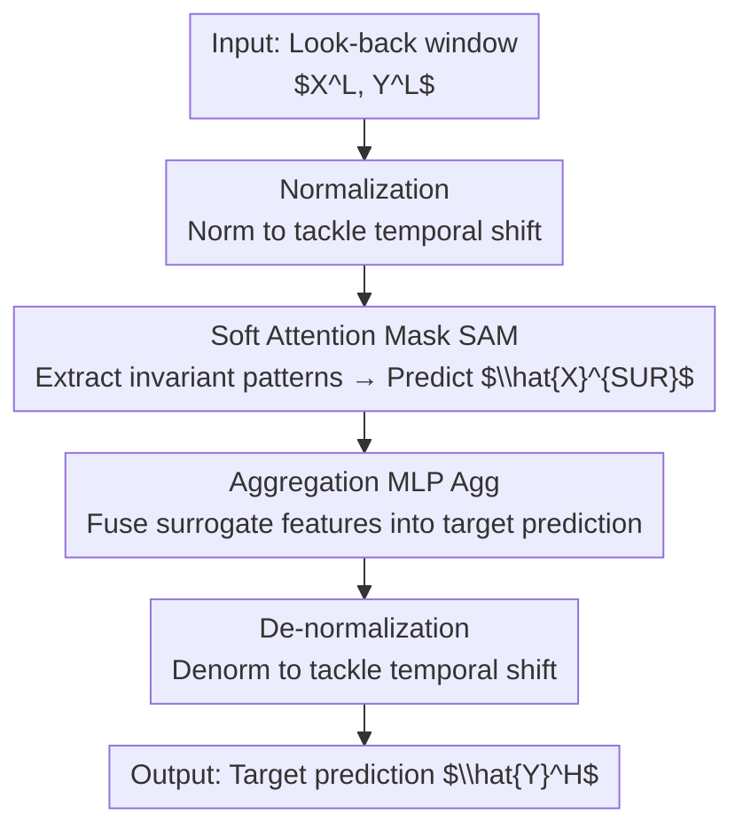

# Tackling Time-Series Forecasting Generalization via Mitigating Concept Drift

**Conference**: ICLR 2026  
**OpenReview**: [https://openreview.net/forum?id=emkvZ7NanK](https://openreview.net/forum?id=emkvZ7NanK)  
**Code**: https://github.com/AdityaLab/ShifTS  
**Area**: Time-Series Forecasting  
**Keywords**: Concept Drift, Temporal Shift, Distribution Shift Generalization, Invariant Patterns, Soft Attention

## TL;DR
This paper categorizes distribution shifts in time-series forecasting into "temporal shift" and "concept drift." It proposes a Soft Attention Mask (SAM) to extract stable invariant patterns from exogenous features in both the look-back and prediction windows to mitigate concept drift. Using a model-agnostic framework, ShifTS, which "treats temporal shift first, then concept drift," it consistently improves forecasting accuracy across multiple datasets and models.

## Background & Motivation

**Background**: Deep learning models for time-series forecasting (e.g., Informer, PatchTST, iTransformer) have become highly performant. However, time-series data evolves dynamically, and patterns learned by models on training distributions may fail during testing. The academic community models this distribution shift as one of the core challenges in forecasting.

**Limitations of Prior Work**: The authors point out that there are actually two types of distribution shifts in time-series, but existing work focuses almost exclusively on one. The first is **temporal shift**, where marginal distributions change over time (shifts in mean, variance, or autocorrelation) while the conditional distribution remains constant—this is the "non-stationarity" problem addressed by normalization methods like RevIN, N-S Transformer, and SAN. The second is **concept drift**, where the conditional distribution $P(Y^H \mid X^L)$ changes over time while the marginal distribution remains constant—the correlation between exogenous factors and the target itself drifts. This area has been largely neglected in time-series forecasting.

**Key Challenge**: The mainstream tool for tackling concept drift in general machine learning is **invariant learning** (e.g., IRM, GroupDRO, VREx), but these methods are ill-suited for time-series forecasting. First, they require explicit environment labels (e.g., rotation angles or noise categories labeled in image classification), which time-series datasets lack. Second, they assume all relevant exogenous features determining the target are visible, whereas in time-series, the **look-back window $X^L$ is often insufficient to determine the prediction window target $Y^H$**. A few concept drift methods designed specifically for time-series that do not rely on invariant learning only apply to online settings, requiring iterative retraining at each step, making them unsuitable for standard offline forecasting tasks.

**Key Insight**: The authors' key observation is that the conditional distribution is unstable because the look-back window $X^L$ lacks sufficient information; however, **causal relationships exist between exogenous features in the prediction window $X^H$ and the target across future time steps** (and the future cannot affect the past, $X^H_{t+1} \nrightarrow Y^H_t$, maintaining a clean causal direction). If the **patterns in $[X^L, X^H]$ that are consistently and stably correlated with the target** can be extracted and modeled, the conditional distribution becomes stable.

**Core Idea**: Instead of directly modeling $P(Y^H \mid X^L, X^H)$ (which would require predicting the entire future $X^H$, a task as difficult as predicting $Y^H$ itself), the method selects "invariant patterns" from $[X^L, X^H]$ that exhibit stable cross-step correlations to aggregate into a surrogate exogenous feature $X^{SUR}$. It then models the more stable $P(Y^H \mid X^{SUR})$, while treating temporal shift as a preliminary normalization step.

## Method

### Overall Architecture

ShifTS is a **model-agnostic** framework: any time-series forecasting backbone (Crossformer, PatchTST, iTransformer, etc.) can be integrated. It decomposes forecasting into a unified pipeline of "mitigating temporal shift first, then concept drift," centered on a **two-stage prediction**. The first stage predicts the surrogate exogenous features $\hat{X}^{SUR}$ that stably support the target, and the second stage uses $\hat{X}^{SUR}$ along with $Y^L$ to predict the target $Y^H$. The full workflow is: normalize inputs (to address temporal shift) → use SAM to identify and predict surrogate features (to address concept drift) → use an aggregation MLP to fuse surrogate features into the target prediction → de-normalize the output.

The top-down sequence in the diagram corresponds to three key designs: the normalization/de-normalization pair constitutes "treating temporal shift first" (Design 2), SAM is the core for handling concept drift (Design 1), and the integration of two-stage prediction, aggregation, and joint loss forms the ShifTS framework (Design 3).

### Key Designs

**1. SAM (Soft Attention Mask): Extracting stable invariant patterns from the look-back and prediction windows**

This is the core of mitigating concept drift, addressing the pain point that "$X^L$ alone is insufficient to determine the target, leading to unstable conditional distributions." SAM follows a two-step process. First, **Slicing**: it concatenates $[X^L, X^H]$ into a full sequence of length $L+H$ and slides a window of size $H$ to obtain $L+1$ local segments (each step $t$ corresponds to $[X^H_{t-L}, \dots, X^H_t]$), which serve as candidates for "invariant patterns." Second, **Weighted Selection**: it builds conditional distributions for each candidate and uses a learnable soft attention matrix $M$ to score and weight them. $M$ undergoes three operations:

$$\text{Softmax}: M_j = \text{Softmax}(M_j), \quad \text{Sparsity}: M_{ij} = M_{ij}\cdot \mathbb{1}_{(M_{ij}-\mu(M_j))\geq 0}, \quad \text{Normalize}: M_j = \frac{M_j}{|M_j|}$$

The intuition is: Softmax calculates the contribution weight of each candidate pattern to the target $Y^H$, and sparsity filters out low-weight patterns (those correlated with the target only sporadically or locally, likely being spurious correlations). This retains only **high-weight patterns that contribute stably to the target across all time steps**—these are the invariant patterns ($P(Y^H_i \mid X^H_{i-k}) \approx P(Y^H_j \mid X^H_{j-k})$). Finally, these invariant patterns are weighted and summed to form the surrogate feature $X^{SUR} = \text{SAM}([X^L, X^H]) = \sum_{L+1} M(\text{Slice}([X^L, X^H]))$. Since a target may be determined by multiple patterns (e.g., flu-like illnesses might be triggered by severe cold in winter and heatwaves in summer), the weighted sum successfully incorporates multiple invariant causes. The resulting $P(Y^H \mid X^{SUR})$ is much more stable than $P(Y^H \mid X^L)$; although estimating $X^{SUR}$ introduces error, $X^{SUR}$ contains partial information and is easier to predict than the entire $X^H$, with empirical results showing that the stability benefits outweigh the estimation errors.

During inference, $X^H$ consists of unknown future values, so SAM uses the backbone model to **estimate** $\hat{X}^{SUR}$, supervised by a surrogate loss $L_{SUR} = \text{MSE}(X^{SUR}, \hat{X}^{SUR})$.

**2. Treating Temporal Shift First: A prerequisite for mitigating concept drift**

This design addresses a dependency emphasized by the authors: SAM aims to learn a stable conditional distribution $P(Y^H \mid X^{SUR})$, but if the marginal distributions $P(Y^H)$ and $P(X^{SUR})$ themselves drift over time (temporal shift), "stability" cannot be established. Therefore, the marginal distributions must be standardized **before** addressing the conditional distribution. This is achieved through instance normalization: the sequence is normalized before processing and de-normalized after output, ensuring $P(X^L_{Norm}) \approx P(X^H_{Norm}) \sim \text{Dist}(0,1)$ and $P(Y^L_{Norm}) \approx P(Y^H_{Norm}) \sim \text{Dist}(0,1)$, thereby eliminating marginal distribution drift. The authors chose **RevIN** (Reversible Instance Normalization) for its simplicity and effectiveness without requiring changes to the backbone architecture or extra pre-training. Stronger normalization methods like SAN or N-S Transformer can also be used, as they are plug-and-play components (the paper demonstrates further gains on the Exchange dataset by replacing RevIN with SAN).

**3. ShifTS Unified Framework: Two-stage prediction + Aggregation MLP + Joint Loss**

The first two designs are components; this design assembles them into a model-agnostic machine. The ShifTS workflow involves four steps: (1) Normalize the input; (2) Use SAM to predict the surrogate exogenous feature $\hat{X}^{SUR}$ that provides invariant support for the target; (3) An **Aggregation MLP** $\text{Agg}(\cdot)$ uses $\hat{X}^{SUR}$ to refine the target prediction: $\hat{Y}^H_{Norm} = \hat{Y}^H_{Norm} + \text{Agg}(\hat{X}^{SUR}_{Norm})$; (4) De-normalize the output. Conceptually, steps 1 and 4 handle temporal shift, step 2 handles concept drift, and step 3 performs weighted aggregation of exogenous features to support the target sequence. Training optimizes both surrogate estimation and final prediction using a joint objective:

$$L = L_{SUR}(X^{SUR}, \hat{X}^{SUR}) + L_{TS}(Y^H, \hat{Y}^H)$$

Where $L_{SUR}$ encourages the model to learn to predict the surrogate exogenous features, and $L_{TS}$ is the standard MSE loss for time-series forecasting. The value of this design lies in its "model-agnostic" nature—the stable conditional distribution identified by SAM can be learned by any backbone. Consequently, ShifTS acts as a "plug-in" that can be applied to any forecasting model rather than requiring a completely new architecture.

### Loss & Training
The total loss is the sum of the surrogate loss and the prediction loss: $L = L_{SUR}(X^{SUR}, \hat{X}^{SUR}) + L_{TS}(Y^H, \hat{Y}^H)$. During training, $X^{SUR}$ is calculated by SAM using the visible $[X^L, X^H]$ as the supervision target; during testing, only $X^L, Y^L$ are provided, and the backbone estimates $\hat{X}^{SUR}$, followed by aggregation and de-normalization to obtain $\hat{Y}^H$. The experiments focus on univariate prediction with exogenous features ($d_Y=1, d_X \geq 1$).

## Key Experimental Results

### Main Results
On 6 time-series datasets (Exchange, ILI, ETTh1/h2, ETTm1/m2), multiple backbone models, and 4 prediction horizons, ShifTS was compared against the baseline (ERM). Below is an excerpt of IMP. (the average improvement of ShifTS relative to ERM across all horizons):

| Dataset | Crossformer (MSE/MAE) | PatchTST (MSE/MAE) | iTransformer (MSE/MAE) |
|--------|------|------|------|
| ILI | 81.9% / 64.0% | 12.0% / 7.1% | 13.8% / 6.5% |
| Exchange | 53.5% / 38.9% | 20.9% / 12.6% | 15.2% / 6.9% |
| ETTh1 | 68.2% / 48.8% | 14.5% / 7.2% | 5.1% / 3.3% |
| ETTm2 | 71.3% / 52.0% | 15.9% / 8.6% | 4.8% / 2.1% |

ShifTS consistently reduces prediction error across all backbones. The improvement is more significant for weaker backbones (e.g., Crossformer, Informer), but it still provides approximately 15% improvement for SOTA models (iTransformer) on ILI and Exchange.

Comparison with distribution shift baselines (using Crossformer as backbone, average results, lower is better):

| Category | Method | ILI MSE | Exchange MSE | ETTh1 MSE | ETTh2 MSE |
|------|------|------|------|------|------|
| Base | ERM | 3.705 | 0.819 | 0.254 | 0.937 |
| Concept Drift | IRM | 2.248 | 0.846 | 0.201 | 0.878 |
| Temporal Shift | SAN | 0.757 | 0.415 | 0.088 | 0.199 |
| Combined | FOIL | 0.735 | 0.497 | 0.081 | 0.206 |
| **Ours** | **ShifTS** | **0.668** | **0.470** | **0.076** | **0.194** |

ShifTS ranked first in 6 out of 8 evaluations (4 datasets × MSE/MAE) and second in 2, outperforming pure concept drift, pure temporal shift, and combination baselines (including the SOTA FOIL).

### Ablation Study
On Exchange, with horizon=96 and three backbones, full ShifTS was compared against variants removing specific modules (Figure 3(b)):

| Configuration | Description |
|------|------|
| Base | No distribution shift mitigation |
| ShifTS\TS | Removed RevIN (no temporal shift mitigation) |
| ShifTS\CD | Removed SAM (no concept drift mitigation) |
| ShifTS (Full) | Both mitigated, lowest error |

Additionally, replacing RevIN in ShifTS with the stronger SAN (Exchange, MSE): ShifTS 0.470, SAN 0.415, ShifTS+SAN 0.407 (best across all horizons), indicating that the normalization slot is pluggable and can drive further improvements.

### Key Findings
- **Mitigating both shifts > Mitigating one > Mitigating none**: Temporal shift and concept drift are interconnected and co-exist in time-series data; addressing both yields the lowest error.
- **Importance depends on backbone capabilities**: For backbones that already include norm/denorm (PatchTST, iTransformer), adding concept drift mitigation (SAM) provides larger gains than adding RevIN. For backbones that lack any temporal shift mitigation (Crossformer), the gain from temporal shift mitigation is larger—validating the core argument that "treating temporal shift is a prerequisite for treating concept drift."
- **Gains correlate positively with $X^H$ information**: The authors quantified the useful information in the prediction window exogenous features using mutual information $I(X^H; Y^H)$. Scatter plots show a positive linear correlation between this and ShifTS performance gains ($p=0.012$). More information and clearer causal links lead to more dependencies ignored by ERM, resulting in larger improvements from ShifTS—explaining why ILI/Exchange show larger gains than ETT.

## Highlights & Insights
- **Decomposition and dependency of shifts**: Explicitly distinguishing between "temporal shift (marginal change) vs. concept drift (conditional change)" and arguing that "temporal shift must be cured before concept drift" provides a strong structural logical flow, validated by ablation.
- **Bypassing invariant learning constraints with "Surrogate Features"**: By not requiring environment labels and not assuming full look-back information, soft-filtering stable patterns from $[X^L, X^H]$ to form $X^{SUR}$ successfully adapts invariant learning to unlabeled time-series scenarios.
- **Model-agnostic plug-in design**: SAM + Normalization + Aggregation MLP forms a "shell" that can improve any backbone without performance degradation, offering high reusability.
- **Information-theoretic explanation of gains**: Using $I(X^H; Y^H)$ to quantify when ShifTS should be used provides practitioners with a measurable diagnostic indicator.

## Limitations & Future Work
- The paper focuses on **univariate prediction with exogenous features** ($d_Y=1$); extension to multivariate targets is not fully explored in the main text.
- Near-stationary datasets (Traffic, Weather) were excluded, meaning the method was primarily validated on data with significant distribution shifts; the overhead of ShifTS in near-stationary scenarios remains unknown.
- The trade-off between estimation error of $\hat{X}^{SUR}$ and stability gains is an empirical conclusion; the point where errors might outweigh benefits lacks theoretical characterization.
- While RevIN is used as the default, stronger methods like SAN/N-S Transformer were only briefly shown to have potential and remain outside the primary scope.

## Related Work & Insights
- **vs. Invariant Learning (IRM / GroupDRO / VREx / EIIL)**: These rely on environment labels and "all relevant features being visible," neither of which hold in time-series. This paper uses SAM to soft-filter patterns from visible $[X^L, X^H]$, outperforming these general methods.
- **vs. Time-Series Normalization (RevIN / N-S Trans. / SAN)**: These only address temporal shift. This paper reuses normalization as a prerequisite, with SAM being the true novelty for addressing concept drift.
- **vs. FOIL (SOTA for Time-Series Distribution Shift)**: FOIL also uses invariant learning logic for time-series OOD generalization. This paper outperforms it on most datasets by using surrogate features and soft attention instead of explicit invariant learning, which is better suited for the lack of environment labels.

## Rating
- Novelty: ⭐⭐⭐⭐ Systematically distinguishes shifts and establishes their dependency; the surrogate feature approach is novel for time-series.
- Experimental Thoroughness: ⭐⭐⭐⭐ Covers 6 datasets × 6 backbones × 4 horizons, compares against three categories of baselines, includes ablation and mutual information analysis.
- Writing Quality: ⭐⭐⭐⭐ Clear motivation, rigorous problem definition, and well-mapped methodology.
- Value: ⭐⭐⭐⭐ Model-agnostic, plug-in design with stable improvements, highly useful for practical time-series forecasting.

<!-- RELATED:START -->

## Related Papers

- [\[ICLR 2026\] Temporal Generalization: A Reality Check](temporal_generalization_a_reality_check.md)
- [\[AAAI 2026\] DeepBooTS: Dual-Stream Residual Boosting for Drift-Resilient Time-Series Forecasting](../../AAAI2026/time_series/deepboots_dual-stream_residual_boosting_for_drift-resilient_time-series_forecast.md)
- [\[ICML 2026\] Dynamic-TMoE: A Drift-Aware Dynamic Mixture of Experts Framework for Non-Stationary Time Series](../../ICML2026/time_series/dynamic_tmoe_a_drift-aware_dynamic_mixture_of_experts_framework_for_non-stationa.md)
- [\[ICLR 2026\] TEDM: Elucidated Diffusion Models for Time Series Forecasting](tedm_time_series_forecasting_with_elucidated_diffusion_models.md)
- [\[ICLR 2026\] ResCP: Reservoir Conformal Prediction for Time Series Forecasting](rescp_reservoir_conformal_prediction_for_time_series_forecasting.md)

<!-- RELATED:END -->
