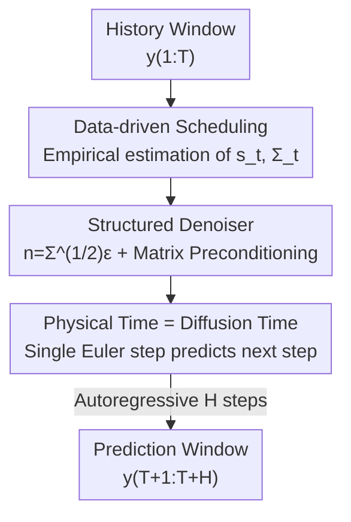

# TEDM: Elucidated Diffusion Models for Time Series Forecasting

**Conference**: ICLR 2026  
**OpenReview**: [https://openreview.net/forum?id=kQee8MObMc](https://openreview.net/forum?id=kQee8MObMc)  
**Code**: https://gitlab.com/dlr-dw/tedm  
**Area**: Diffusion Models / Time Series Forecasting  
**Keywords**: Diffusion forecasting, EDM, Data-driven noise scheduling, Autoregressive, Probabilistic forecasting

## TL;DR
TEDM ports the EDM (Elucidated Diffusion Models) framework from image generation to multivariate time series forecasting. The key is to **align the diffusion time axis with the physical time axis** and replace manually preset schedules with **empirically estimated noise/scale schedules from data**. This reduces sampling complexity from $O(SH)$ to $O(H)$, achieving SOTA results across multiple long-sequence forecasting benchmarks using a lightweight network.

## Background & Motivation

**Background**: Multivariate time series forecasting currently follows two main tracks: Transformer-based models (Informer, Autoformer, iTransformer), which rely on attention mechanisms to top leaderboards; and Diffusion-based models (TimeGrad, TimeDiff, TSDiff, ARMD), which leverage generative modeling for inherent support of probabilistic forecasting and uncertainty quantification.

**Limitations of Prior Work**: Transformers suffer from $O(T^2)$ time/memory overhead, and long-range predictions often degenerate or only provide point estimates. Diffusion models inherit two burdens from the image-domain DDPM: first, sampling requires $S$ diffusion steps which must be repeated for each prediction step, leading to a slow $O(SH)$ total complexity; second, they directly adopt **manually preset** noise schedules $\sigma_t$ and scale schedules $s_t$ from the image domain, injecting noise as i.i.d. Gaussian, which is unsuitable for time series with strong autocorrelation and vast scale/variance differences across features.

**Key Challenge**: The success of diffusion models stems from the EDM methodology of "decoupling architecture, training, and sampling into a modular design space." However, when moved to time series, this design space has not been truly "elucidated"—the **sequential structure** of time series is fundamentally different from the **unordered structure** of images. Adopting schedules blindly forces an incorrect inductive bias onto the data.

**Goal**: To extend EDM theory from images to time series forecasting, allowing noise/scale schedules, time discretization, and solvers to be optimized specifically for sequence structures while drastically reducing sampling complexity.

**Key Insight**: The authors re-derive the reverse ODE of the diffusion process and discover that once the noise covariance is written in matrix form $\Sigma_t$, the **time increment $dt$ disappears from the reverse ODE**. This implies that no strategy for "how to discretize diffusion steps" is needed; the physical time axis of the time series can directly serve as the diffusion time axis.

**Core Idea**: Replace "manual scheduling + independent diffusion steps" with "Physical Time = Diffusion Time + Data-driven Scheduling," allowing a single Euler step to simultaneously perform "one-step-ahead prediction" and "one-step denoising."

## Method

### Overall Architecture

TEDM is an autoregressive diffusion forecasting framework: it takes a historical window $y_{1:T}\in\mathbb{R}^{C\times T}$ ($C$ features, $T$ time steps) as input and outputs the future $H$ steps $\hat y_{T+1:T+H}$. It treats prediction as "numerical integration of diffusion along the physical time axis": each historical point is imagined as a particle "pushed" to the corresponding future point by the diffusion process, and the entire window of particles is processed in parallel by the same denoising network.

The pipeline consists of three components: ① **Empirically estimating** the scale $s_t$ and noise covariance $\Sigma_t$ from the input window (without external scheduling); ② Training a **denoiser** $D_\theta$ that learns to restore data corrupted by structured noise $n=\Sigma^{1/2}\varepsilon$, extending EDM preconditioning to matrix-valued $\Sigma$; ③ During inference, since the diffusion and physical axes are aligned, **one Euler step predicts the next time step**, moving autoregressively for $H$ steps to obtain the full prediction with $O(H)$ complexity instead of $O(SH)$.

### Key Designs

**1. Data-driven Noise and Scale Scheduling: Giving diffusion schedules physical meaning**

Prior diffusion forecasting models borrowed manual schedules for $\sigma_t$ and $s_t$ from the image domain (e.g., linear, log-normal), which is an incorrect inductive bias—features have different variances and importance, making uniform noise injection irrational. TEDM defines noise as a matrix $\Sigma_t := s_t^{-2}\mathrm{Cov}(x_t)$, transforming the generalized forward ODE into $\frac{dx_t}{dt}=\frac{\dot s_t}{s_t}x_t-\frac12 s_t^2\dot\Sigma_t\nabla_x\log p_t(x_t)$. When diffusion unfolds along the sequence's time axis, $s_t$ and $\Sigma_t$ gain physical meaning and can be **directly estimated from input data**. The authors prove $\mathbb{E}(x_t)=s_t\,\mathbb{E}(x_0)$ and $\mathrm{Cov}(x_t)=s_t^2\Sigma_t$, providing two estimation methods:

$$\hat s_t = \mathrm{Mean}(y_{1:t})\odot y_{1:1}^{-1},\qquad \hat\Sigma_t = \hat S_t\,\mathrm{Cov}(y_{1:t})\,\hat S_t^{\top}$$

Namely, **cumulative estimation** (using mean/covariance of the first $t$ steps, with $\hat S_t=\mathrm{diag}(\hat s_{t}^{-1})$ for scaling to ensure positive-definiteness) and **sliding window estimation** (using fixed-length windows), the latter of which better captures local statistical changes and avoids numerical issues at the window start. This is the first diffusion model to use entirely empirical data-driven scheduling, removing manual bias—an ablation showing this component alone improves MSE by up to 85% relative to EDM.

**2. Structured Noise Denoiser and Matrix-valued Preconditioning: Porting EDM training to sequences**

EDM assumes i.i.d. noise, but time series noise levels vary per step and feature; i.i.d. noise would destroy the autocorrelation structure. TEDM uses structured noise $n=\Sigma^{1/2}\varepsilon$ ($\varepsilon\sim\mathcal{N}(0,I)$), training the denoiser $D_\theta$ to recover the clean signal under non-i.i.d. noise. To stabilize training, scalar preconditioning in EDM is generalized to matrix-valued $\Sigma$: the denoiser is formulated as $D_\theta(x,\Sigma)=C_{\Sigma;\text{skip}}\,x + c_{\Sigma;\text{out}}\,F_\theta(C_{\Sigma;\text{in}}\,x;\,C_{\Sigma;\text{noise}})$, where

$$C_{\Sigma;\text{in}}=(\mathrm{Cov}(y)+\Sigma)^{-1/2},\quad C_{\Sigma;\text{skip}}=\mathrm{Cov}(y)(\mathrm{Cov}(y)+\Sigma)^{-1}$$

These coefficients are derived analytically to ensure unit variance for $F_\theta$ inputs and targets while minimizing error amplification. When $\Sigma=\sigma^2 I$, the formula reverts to the EDM scalar form. Crucially, the denoiser's role (score estimation) is **decoupled** from the prediction task, allowing flexible architecture choices—from Linear networks with $O(Td)$ space complexity to UNets.

**3. Aligning Physical and Diffusion Axes: Reducing sampling complexity from $O(SH)$ to $O(H)$**

This is the core observation of TEDM. Writing the reverse ODE as a difference equation $dx_t=-(d\log s_t)x_t+\frac12 s_t(d\Sigma_t)\Sigma_t^{-1}[D(x_t/s_t,\Sigma_t)-x_t/s_t]$, **$dt$ no longer appears**. Consequently, no discretization strategy for time increments is needed, and the physical time axis of the time series can be treated as the diffusion time axis. A single Euler step thus simultaneously moves "one physical time step forward" and completes "one denoising step." The inference rule (under diagonal approximation) simplifies to:

$$\hat y_{t+1}=\Big[I-\log\tfrac{s_t}{s_{t-1}}\Sigma_t^{1/2}\Sigma_{t-1}^{-1/2}\Big]\hat y_t + s_t\Big[\log\Sigma_t^{1/2}\Sigma_{t-1}^{-1/2}\Big]D_\theta(\hat y_t/s_t;\Sigma_t)$$

Starting from a window $\hat y_1:=y_{1:T}$, one Euler step pushes it to $\hat y_2:=y_{2:T+1}$. Assuming $T=H$, the full prediction $y_{T+1:T+H}$ is obtained in $H$ steps. Since **one Euler step replaces one diffusion step**, inference is $O(H)$ rather than the traditional $O(SH)$. This rule is exact if the principal axes of $\Sigma_t$ remain stationary over time.

### Loss & Training

Training follows denoising score matching: given a clean subsequence $y\sim p_\text{data}$, calculate the empirical $\Sigma$, sample structured noise $n=\Sigma^{1/2}\varepsilon$, and minimize $\mathbb{E}_{y,\varepsilon}\big[\lambda_\Sigma\|D_\theta(y+n;\Sigma)-y\|^2\big]$, with loss weight $\lambda_\Sigma=1/c_{\Sigma;\text{out}}^2$. Data is normalized via z-score. The window length is $T=H$ during training and $2H$ during evaluation (first $T$ steps for input, last $H$ for ground truth).

## Key Experimental Results

### Main Results

Comparison with diffusion methods on 8 multivariate benchmarks ($H=96$, MSE/MAE under z-score, lower is better):

| Dataset | Metric | TEDM | Best Diffusion Baseline | Note |
|--------|------|------|--------------|------|
| ETTh2 | MSE/MAE | **0.214 / 0.319** | ARMD 0.311 / 0.338 | TEDM Best |
| ETTm2 | MSE/MAE | **0.135 / 0.253** | ARMD 0.181 / 0.255 | TEDM Best |
| Exchange | MSE/MAE | **0.069 / 0.183** | ARMD 0.093 / 0.203 | TEDM Best |
| ETTm1 | MSE/MAE | 0.419 / 0.421 | ARMD 0.337 / 0.376 | 2nd, slightly below ARMD |
| Weather | MSE/MAE | 0.223 / 0.261 | TMDM 0.180 / 0.241 | 2nd |
| ETTh1 | MSE/MAE | 0.595 / 0.524 | TimeDiff 0.417 / 0.456 | Falls behind in oscillatory scenarios |

Compared to non-diffusion SOTA (iTransformer, PatchTST, DLinear), TEDM still leads on ETTh2, ETTm2, Exchange, and Stock, but performs poorly on the high-dimensional Solar dataset (137 dims) where diagonal approximation fails (MSE 1.061).

### Ablation Study

Comparison of elucidated models (ETTh2/ETTm2/Exchange, relative MSE Gain over EDM in parentheses):

| Configuration | ETTh2 MSE | ETTm2 MSE | Exchange MSE | Description |
|------|-----------|-----------|--------------|------|
| iDDPM+DDIM | 0.730 | 0.756 | 1.276 | Weakest baseline |
| EDM | 0.419 | 0.293 | 0.448 | Elucidated but with preset schedule |
| TEDM (Cumul. $\Sigma_t$, $s_t=1$) | 0.303 (28%) | 0.137 (53%) | 0.110 (75%) | With structured noise |
| TEDM (Cumul. $\Sigma_t$, Empir. $s_t$) | 0.242 (42%) | 0.135 (54%) | 0.068 (85%) | Plus empirical scale |
| TEDM (Sliding $\Sigma_t$, Empir. $s_t$) | 0.216 (49%) | 0.142 (52%) | 0.075 (83%) | Sliding window optimal |

Efficiency Comparison (ETTm2, per batch average): TEDM Training 0.004s / 21.3MB, Inference 0.11s / 23.9MB, MSE 0.135. It is the most resource-efficient method among all compared models.

### Key Findings
- **Data-driven scheduling is the primary driver of performance**: Moving from EDM to "Cumulative $\Sigma_t + s_t=1$" accounts for the majority of the gain. Removing manual schedule bias is the core benefit.
- **Physical axis alignment yields extreme efficiency**: Reducing complexity from $O(SH)$ to $O(H)$ puts overhead on par with lightweight models like ARMD, but TEDM outperforms them by elucidating the design space.
- **Clear failure cases**: Highly oscillatory sequences like ETTh1 violate the "smooth flow" assumption (Assumption A.1); diagonal covariance approximation fails in high-dimensional spaces like Solar.

## Highlights & Insights
- **The "disappearance of $dt$" is the theoretical crux**: By defining noise as a matrix, the reverse ODE becomes independent of the time increment, allowing a single step to merge "diffusion" and "physical prediction." This is a more elegant reduction of $O(SH)$ to $O(H)$ than mere engineering tricks.
- **"Grounded" diffusion scheduling**: Transforming $\sigma_t/s_t$ from abstract hyperparameters into physical quantities estimated from data (mean and covariance) suggests a new paradigm for other generative tasks: read schedules from data rather than searching for them.
- **Decoupling denoiser and prediction**: Since score estimation is independent of the forecasting task, simple Linear architectures ($O(Td)$) can achieve SOTA results, making it highly suitable for real-time deployment.

## Limitations & Future Work
- Based on Itô diffusion processes, it **cannot model long-memory dynamics** (fractional Brownian motion), heavy-tailed/power-law noise (α-stable), or jump processes, which violate regularity assumptions.
- Effectiveness is primarily shown under **diagonal covariance approximation**; it likely fails in high-dimensional feature spaces.
- Known weakness in highly oscillatory sequences (ETTh1) where the "smooth flow" assumption fails.
- Future work includes skill analysis for probabilistic forecasts, sampling prediction intervals without ensembles, and extending TEDM to anomaly detection and data imputation.

## Related Work & Insights
- **vs EDM (Karras et al. 2022)**: EDM elucidates design space in the image domain but uses preset schedules and i.i.d. noise; TEDM extends it to matrix-valued $\Sigma$, empirical scheduling, and structured noise, yielding up to 85% MSE improvement.
- **vs ARMD (Gao et al. 2025)**: ARMD uses a supervised devolution network to "skip" diffusion steps, but lacks an elucidated design space; TEDM matches its efficiency while achieving higher accuracy through optimized scheduling.
- **vs TimeDiff / TSDiff / NsDiff**: These are mostly direct adaptations of image-domain DDPM; TEDM reworks scheduling and noise structure from the ground up to fit the multivariate temporal structure.

## Rating
- Novelty: ⭐⭐⭐⭐⭐ Physical/Diffusion axis alignment is a paradigm-level insight.
- Experimental Thoroughness: ⭐⭐⭐⭐ 8 datasets and dual comparisons, though high-dim scenarios are weaker.
- Writing Quality: ⭐⭐⭐⭐ Solid derivations and clear ablation, though relies heavily on the Appendix.
- Value: ⭐⭐⭐⭐⭐ Lightweight, low latency, SOTA—perfect for real-time deployment and opens a new design space for diffusion forecasting.

<!-- RELATED:START -->

## Related Papers

- [\[ICLR 2026\] Latent-to-Data Cascaded Diffusion Models for Unconditional Time Series Generation](latent-to-data_cascaded_diffusion_models_for_unconditional_time_series_generatio.md)
- [\[ICLR 2026\] MMPD: Diverse Time Series Forecasting via Multi-Mode Patch Diffusion Loss](mmpd_diverse_time_series_forecasting_via_multi-mode_patch_diffusion_loss.md)
- [\[ICLR 2026\] A Study of Posterior Stability in Time-Series Latent Diffusion](a_study_of_posterior_stability_in_time-series_latent_diffusion.md)
- [\[ICLR 2026\] Semantic-Enhanced Time-Series Forecasting via Large Language Models](semantic-enhanced_time-series_forecasting_via_large_language_models.md)
- [\[ICLR 2026\] ICDiffAD: Implicit Conditioning Diffusion Model for Time Series Anomaly Detection](icdiffad_implicit_conditioning_diffusion_model_for_time_series_anomaly_detection.md)

<!-- RELATED:END -->
