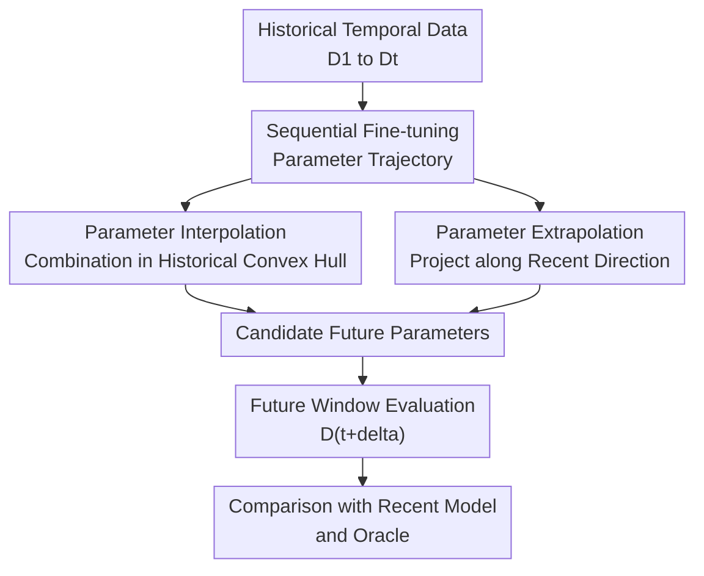

# Temporal Generalization: A Reality Check

**Conference**: ICLR 2026  
**OpenReview**: [https://openreview.net/forum?id=Wz0ILlbh9U](https://openreview.net/forum?id=Wz0ILlbh9U)  
**Code**: https://github.com/divyam3897/TG  
**Area**: Time Series / Temporal Generalization / Distribution Shift  
**Keywords**: Temporal Generalization, Distribution Shift, Parameter Interpolation, Parameter Extrapolation, Continual Learning  

## TL;DR
This paper systematically evaluates the practice of interpolating or extrapolating future model parameters using historical checkpoints under a strict "no future data" setting. It finds that model averaging and Taylor extrapolation are generally inferior to simply using the most recent model; while simple parameter scaling is relatively stable for some language tasks, it is not a universal solution.

## Background & Motivation
**Background**: Many machine learning systems are trained on historical data and then deployed in future environments. Data distributions in scenarios such as news, medicine, finance, remote sensing, and academic texts change over time; thus, "performing well at training time" does not equate to "remaining reliable in subsequent months or years." Existing temporal domain generalization works attempt to maintain model performance across time, with common approaches including continuous updates, domain generalization, continual learning, and inferring future states from historical model trajectories.

**Limitations of Prior Work**: The issue is that many methods appearing to "predict the future" do not operate under strictly realistic deployment settings. Some methods require unlabeled future data, others use future validation sets for hyperparameter tuning, and some are only validated on small models or toy setups. Once applied to real-world scale models like T5, DistilBERT, or DenseNet, learning the nonlinear trajectory of a full parameter set over time becomes prohibitively expensive and requires much denser temporal sampling than is available in reality.

**Key Challenge**: The fundamental contradiction of temporal generalization is that models can only see the past, while future distributions may change arbitrarily. Although parameter trajectories of historical checkpoints seem to carry temporal information, the non-convexity and non-identifiability of deep network parameters mean that the same function can be represented by multiple different parameter sets. Consequently, the intuition that "parameters move smoothly over time" may not translate into reliable future predictions.

**Goal**: The authors narrow the problem into a reality check: given a sequence of parameters trained over time $\{\theta_1, \ldots, \theta_t\}$, can a $\widetilde{\theta}_{t+\delta}$ be constructed—without future data, future validation sets, or assumptions about the data generation process—that outperforms the direct deployment of the most recent model $\theta_t$ on future data $D_{t+\delta}$?

**Key Insight**: Instead of proposing a complex new predictor, the paper categorizes schemes that rely solely on historical parameters into two classes: conservative interpolation within the convex hull of past parameters, and explicit extrapolation along the direction of historical parameter changes. This classification is valuable as it covers many lightweight and scalable realistic candidates such as model averaging, parameter scaling, and Taylor extrapolation.

**Core Idea**: Conduct large-scale stress tests on parameter interpolation and extrapolation using a unified, strictly future-blind evaluation framework to examine if they truly withstand temporal drift better than the "Recent Model."

## Method
### Overall Architecture
The overall workflow of the paper can be understood as "generating historical model trajectories over time, then using these trajectories to construct candidate future models, and finally evaluating them on a future window." At each time step $t$, the model is trained or fine-tuned using only data that has already occurred to obtain $\theta_t$. During evaluation, the method can only see $\theta_1$ through $\theta_t$ to generate $\widetilde{\theta}_{t+\delta}$ for the next $\delta$ future time steps.

The importance of this framework lies in its complete severance of future access: no future training samples, no future validation sets, and no hyperparameter tuning for a specific future test point. Therefore, for any method to outperform the Recent Model, it must truly extract transferable temporal structures from the historical parameter sequence.

### Key Designs
**1. Strict Future-Blind Evaluation: Moving temporal generalization from "post-hoc tuning" back to real deployment**

The most critical design in this paper is not a specific complex model but the evaluation constraints themselves. The authors restrict the available information to the historical checkpoint sequence $\{\theta_1, \ldots, \theta_t\}$, targeting the evaluation of $\widetilde{\theta}_{t+\delta}$ on future data at $t+\delta$. This setup explicitly excludes two common shortcuts: adapting language models with unlabeled future data or selecting hyperparameters using a labeled future validation set.

These constraints make many previous temporal generalization findings harder to sustain. In real deployment, future validation sets do not exist; if a method's advantage depends on future tuning, it measures "performance after future leakage" rather than deployable temporal generalization. The paper uses this setting to draw a hard line for all subsequent comparisons.

**2. Parameter Interpolation Family: Seeking conservative future models within the convex hull of historical checkpoints**

Parameter interpolation defines the future parameters as a weighted combination of historical models: $\widetilde{\theta}_{t+\delta}=\sum_i \alpha_i \theta_i$, where $\alpha_i \ge 0$ and $\sum_i \alpha_i=1$. This covers approaches like using the most recent model, historical averaging, and exponential moving averages. The intuition is that past models might each preserve knowledge from different time intervals, and combining them might reduce overfitting to the most recent distribution.

However, the paper notes that this intuition is unstable under natural temporal drift. Old parameters may originate from obsolete distributions, and averaging them in introduces noise. More problematic is that if models from different times fall into different basins of the loss surface, a linear connection will pass through high-loss regions. Even if models are functionally similar, their parameter representations may not be aligned due to the non-identifiability of neural networks; thus, "averaging parameters" does not necessarily equate to "averaging capabilities."

**3. Parameter Scaling: Shrinking the recent model toward the origin to reduce overconfidence in the current distribution**

Parameter scaling is the simplest and most interesting branch of the interpolation family: it keeps the direction of the recent model and defines parameters as $\widetilde{\theta}_{t+\delta}=\alpha\theta_t$, where $\alpha\in[0,1]$. It does not attempt to predict where the future will go but rather acknowledges the future is unknown and weakens the model's "certainty" about the current time point.

The paper provides an empirical observation: during the temporal training process of continual learning, the $L_2$ norm of parameters increases over time; larger norms may correspond to sharper solutions or stronger dependence on the current distribution. Slightly downscaling $\theta_t$ is equivalent to preserving the directional knowledge of the recent model while reducing the bet on current data details. This explains why downscaling can match or slightly outperform the recent model in NewsRoom language modeling and summarization tasks, though it remains essentially a conservative calibration strategy rather than a universal future predictor.

**4. Taylor Extrapolation and Sequential Fine-tuning: Making parameter trajectories as readable as possible without assuming they are predictable**

Extrapolation schemes assume parameters can be viewed as a differentiable function of time, using a first-order approximation $\widetilde{\theta}_{t+\delta}\approx\theta_t+\alpha(\theta_t-\theta_{t-\Delta t})/\Delta t$ to project along the recent direction of change. This design explicates the idea that "temporal information is in the weights": if model parameters evolve along a stable trajectory, finite differences might provide the future direction.

To make this direction at least meaningful, the paper employs sequential fine-tuning: when training $D_t$, the model is initialized from $\theta_{t-1}$ rather than training each time point independently from the same pre-trained model. This keeps adjacent checkpoints closer and makes PCA/UMAP visualizations smoother. However, experiments show this is merely a necessary condition to prevent the trajectory from shattering, not a sufficient one; the optimal extrapolation coefficient $\alpha$ is often less than 1 or even negative, indicating that the true future sometimes requires backward or more conservative movement.

### Loss & Training
The training process uses sequential continual learning-style fine-tuning. For each time step $t$, the model is initialized with the previous parameters $\theta_{t-1}$ and minimizes cross-entropy loss on the current data $D_t$: $\theta_t=\arg\min_{\theta_t}\sum_{(x_i^t,y_i^t)\in D_t} CE(f(x_i^t;\theta_t),y_i^t)$. This choice aims not to optimize replay but to make parameter trajectories more continuous over time, reducing random basin jumping caused by independent training.

Hyperparameter selection also follows deployment logic via "within-history simulation." For example, for the scaling or extrapolation coefficient $\alpha$, the authors simulate how hyperparameters would have been chosen for the previous step using currently visible data, and then apply that choice to generate future candidates. Formally, $\alpha^*=\arg\min_{\alpha\in S} L(f(\cdot;\widetilde{\theta}_t(\alpha)),D_t^{val})$, where the validation set is from the current rather than future time. This detail ensures results are not tuned using future validation sets.

Experiments cover two types of models and tasks. T5-small and T5-large are used for language modeling and news summarization on NewsRoom. On WILDS-Time, Yearbook, HuffPost, arXiv, and FMoW are used to evaluate temporal drift in images, text, and remote sensing scenarios. Metrics include perplexity, ROUGE-L, accuracy, and $\delta$-forward transfer, which measures the average or worst-case performance of the model migrating from training time to several steps into the future.

## Key Experimental Results

### Main Results
NewsRoom results indicate that the simple Recent Model is very difficult to beat consistently. For T5-small in language modeling, the average perplexity of the Recent Model is 32.51, Downscaling is 32.37, Parameter Averaging is 34.04, and Taylor Extrapolation is 35.69. In news summarization, the perplexity of Downscaling is 5.82, outperforming the Recent Model's 6.05, while Taylor and Averaging are significantly worse. The Oracle represents an upper bound trained on future data, making it a non-deployable method.

| Task / Model | Metric | Oracle | Recent Model | Average | Downscaling | Taylor |
|-------------|------|--------|----------|----------|-------------|-------------|
| NewsRoom LM / T5-small | Perplexity ↓ | 30.02±0.02 | 32.51±0.02 | 34.04±0.02 | 32.37±0.02 | 35.69±0.05 |
| NewsRoom Summarization / T5-small | Perplexity ↓ | 5.53±0.06 | 6.05±0.07 | 6.37±0.04 | 5.82±0.05 | 6.42±0.12 |
| NewsRoom Summarization / T5-large | Perplexity ↓ | 3.45±0.02 | 3.67±0.03 | 3.78±0.02 | 3.64±0.02 | 3.78±0.04 |
| NewsRoom Summarization / T5-large | ROUGE-L ↑ | 41.92±0.86 | 40.50±0.86 | 38.02±0.60 | 40.51±0.90 | 39.59±1.21 |

On WILDS-Time, the conclusions even less support a unified winner. Across four datasets (Yearbook, HuffPost, arXiv, FMoW) spanning vision, text, and remote sensing, the authors compare ERM, GroupDRO, IRM, DeepCORAL, AGEM, EWC, Average, Downscaling, Recent, and Taylor. Overall (Figure 3), no method consistently outperforms others across all datasets; downscaling is stable on NewsRoom but not always strong on WILDS-Time.

| Dataset | Task | Model | Future Eval Span | Observation |
|--------|------|------|--------------|----------|
| Yearbook | Binary photo classification | 4-layer CNN | 10 Years | Changing visual styles; no unified winner among DG/CL/Interpolation. |
| HuffPost | Headline topic classification | DistilBERT | 3 Years | Topics and language drift; Recent Model remains highly competitive. |
| arXiv | Title discipline classification | DistilBERT | 6 Years | Significant terminology and popularity shifts; parameter prediction is unstable. |
| FMoW | Satellite land-use classification | DenseNet-121 | 6 Years | Infrastructure changes; general methods struggle against simple Recent baseline. |

### Ablation Study
The most explanatory analyses come from three directions: parameter norms, extrapolation coefficients, and continual learning. Analysis of parameter norms explains why downscaling is sometimes effective; extrapolation coefficient analysis shows why Taylor projection is unreliable; and the continual learning analysis demonstrates that without sequential trajectories, parameter operations perform even worse.

| Analysis Item | Phenomenon | Implication for Temporal Generalization |
|--------|------|------------------|
| Parameter Norm Growth | T5 $L_2$ norm increases over time during CL | Recent models may overfit current distributions; scaling mitigates overconfidence. |
| Extrapolation Coeff $\alpha$ | Optimal $\alpha$ is often $<1$ or negative | Historical finite differences don't necessarily point to a useful future. |
| CL vs. Independent | CL significantly outperforms monthly independent fine-tuning | Smooth trajectories are a necessary foundation for interpolation/extrapolation. |
| Higher-order/Learned Offsets | Learning global parameter shifts or temporal coeffs fails to beat Recent | More parameters do not solve the fundamental unpredictability of the future. |

### Key Findings
- The Recent Model $\theta_t$ is a very strong baseline; many complex or seemingly "time-aware" methods degrade performance by introducing noise from old distributions.
- Parameter averaging is unstable under natural temporal drift, especially when past time periods differ significantly from the future distribution; old checkpoints act as contaminants rather than regularizers.
- The value of Downscaling lies in its conservatism: it does not predict a future direction but lowers the current model's norm and overconfidence, thus remaining robust on NewsRoom.
- Taylor extrapolation exposes a fundamental difficulty in predicting parameter trajectories: even if low-dimensional projections look structured, effective directions in high-dimensional space remain unreliable.
- Continual learning keeps adjacent parameters closer and smoother, but this only makes parameter operations "not entirely meaningless"; it does not guarantee future generalization.

## Highlights & Insights
- The highlight of this paper is placing "temporal generalization" back into a very strict realistic deployment setting. Many methods that seem to "predict the future" in papers actually borrow future signals; once these are removed, the conclusions are far more sober.
- "The Recent Model is hard to beat" is an important but easily underestimated finding. It reminds researchers that temporal generalization methods must be compared against $\theta_t$ without future information, not just obsolete models.
- The simple method of Parameter Scaling provides an inspired direction: when the future is unknown, it may be better to reduce certainty in the current distribution than to attempt bold extrapolation. This connects to calibration, sharpness, norm control, and plasticity in continual learning.
- The negative results for Taylor extrapolation are valuable. They show that "time being encoded in weights" does not imply "weight trajectories can be linearly predicted," especially with non-identifiable parameters, coarse data granularity, or arbitrary future shifts.
- For other tasks, the lesson is that robustness research should clarify future access boundaries and hyperparameter selection rules. Otherwise, gains may come from evaluation leaks rather than generalization ability.

## Limitations & Future Work
- This work primarily evaluates lightweight, scalable parameter interpolation and extrapolation; it does not cover all possible explicit temporal modeling methods, though it explains why RNN/autoencoder approaches for large model parameters are difficult to scale.
- While covering news, yearbooks, arXiv, and FMoW, the granularity of public temporal data is limited. Many datasets only have annual slices, which makes it hard to support reliable estimation of complex non-linear temporal dynamics.
- Hyperparameters for Downscaling still need to be selected across different models and datasets, and it remains unstable on WILDS-Time. Future work needs more robust within-history selection strategies and clearer conditions of applicability.
- The paper lacks theoretical guarantees, which is consistent with its findings: without future data and strong generative assumptions, No Free Lunch constraints mean no universal future predictor exists. Future research might focus on explicitly modeling domain-specific temporal assumptions rather than seeking unconditional universal algorithms.

## Related Work & Insights
- **vs. Time Vectors**: Time Vectors suggests that temporal directions are encoded in fine-tuned language model weights and can be used for extrapolation. This paper points out that such success depends on future signals; under strict blind settings, simple Taylor extrapolation is unstable.
- **vs. Classic Domain Generalization**: Methods like IRM, GroupDRO, and DeepCORAL attempt to learn stable features across domains. This paper treats timestamps as ordered domains and finds these methods have no unified advantage on WILDS-Time, suggesting the unknown future of temporal sequences is more demanding than standard multi-domain generalization.
- **vs. Continual Learning**: EWC and AGEM focus on avoiding forgetting the past. Here, the concern is forward transfer: surviving the future after updates stop. Continual learning is treated as a training mechanism for smooth trajectories rather than a final solution.
- **vs. Model Merging / Model Soups**: Model merging is effective for similar tasks or accessible validation data. This paper shows that when checkpoints come from natural temporal drift without future data for filtering, averaging past models may blend in obsolete distributions and hurt future performance.
- **Insight**: Temporal generalization research should specify the boundaries of usable information and include the Recent Model as a mandatory baseline. Without domain-level temporal evolution assumptions, conservative calibration is often more reliable than aggressive extrapolation.

## Rating
- **Novelty**: ⭐⭐⭐⭐ Re-examines temporal generalization claims under a strict setting rather than proposing a flashy new algorithm; strong problem awareness.
- **Experimental Thoroughness**: ⭐⭐⭐⭐⭐ Covers multiple tasks, models, and temporal granularities, including analysis of norms, coefficients, and trajectories.
- **Writing Quality**: ⭐⭐⭐⭐ Clear logic and thorough explanation of negative results; some data relies on curves rather than full tables, requiring appendix consultation for exact values.
- **Value**: ⭐⭐⭐⭐⭐ Serves as a cautionary tale for temporal generalization, continual learning, and model deployment; provides a baseline protocol to prevent future information leakage.

<!-- RELATED:START -->

## Related Papers

- [\[ICLR 2026\] Benchmarking ECG FMs: A Reality Check Across Clinical Tasks](benchmarking_ecg_fms_a_reality_check_across_clinical_tasks.md)
- [\[ICLR 2026\] Tackling Time-Series Forecasting Generalization via Mitigating Concept Drift](tackling_time-series_forecasting_generalization_via_mitigating_concept_drift.md)
- [\[NeurIPS 2025\] StRap: Spatio-Temporal Pattern Retrieval for Out-of-Distribution Generalization](../../NeurIPS2025/time_series/strap_spatio-temporal_pattern_retrieval_for_out-of-distribution_generalization.md)
- [\[ICLR 2026\] A General Spatio-Temporal Backbone with Scalable Contextual Pattern Bank for Urban Continual Forecasting](a_general_spatio-temporal_backbone_with_scalable_contextual_pattern_bank_for_urb.md)
- [\[ICLR 2026\] SONATA: Synergistic Coreset Informed Adaptive Temporal Tensor Factorization](sonata_synergistic_coreset_informed_adaptive_temporal_tensor_factorization.md)

<!-- RELATED:END -->
