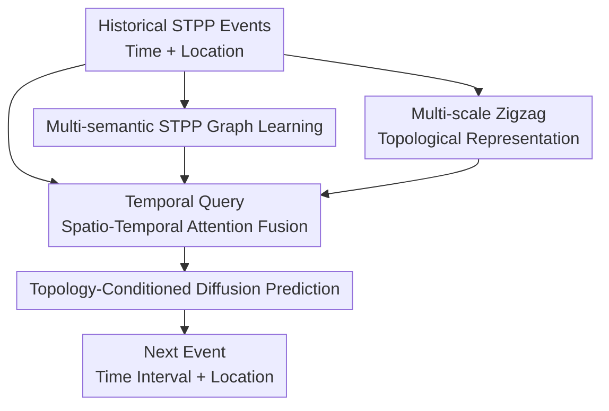

# TEN-DM: Topology-Enhanced Diffusion Model for Spatio-Temporal Event Prediction

**Conference**: ICLR 2026  
**OpenReview**: [https://openreview.net/forum?id=BZ1vutP53o](https://openreview.net/forum?id=BZ1vutP53o)  
**Code**: https://github.com/yl3564/TEN-DM  
**Area**: Time Series / Graph Learning / Spatio-Temporal Point Processes  
**Keywords**: Spatio-temporal point processes, Diffusion models, zigzag persistence, Graph neural networks, Event prediction  

## TL;DR
TEN-DM transforms spatio-temporal point processes (STPP) simultaneously into multi-semantic event graphs and multi-scale temporal sequence images. It utilizes graph representations, zigzag topological features, and temporal query attention to jointly condition the diffusion denoising process, enabling more accurate prediction of the time intervals and spatial locations of future events.

## Background & Motivation
**Background**: Spatio-temporal point processes (STPP) are used to describe "when and where events occur," with typical applications including earthquakes, epidemics, urban crime, and 311 service requests. Traditional statistical models often revolve around conditional intensity functions or influence kernels, such as Poisson, Hawkes, Cox, Neyman-Scott models and their spatio-temporal extensions. Recent deep learning methods utilize RNNs, Transformers, normalizing flows, neural latent processes, or diffusion models to learn complex historical dependencies.

**Limitations of Prior Work**: The challenge of STPP lies not only in time series prediction or spatial density estimation, but in the simultaneous evolution of high-order relationships between time, space, and events. Many deep STPP methods encode time and space separately before performing concatenation or conditional generation at the backend, which tends to overlook structures formed jointly by geographical proximity, temporal similarity, and periodic patterns. This issue is particularly pronounced when data is sparse or noisy: models can observe individual event coordinates and timestamps but struggle to stably identify the overall shapes and relationships that persist over time.

**Key Challenge**: STPP prediction requires simultaneous modeling of local interactions and global structures. Locally, certain events may influence each other due to proximity in time, latitude, or longitude. Globally, event clouds exhibit topological shapes like connected components, holes, and clusters across different time windows. Relying solely on sequential attention lacks spatial structure; using only graphs may ignore time-varying shapes; and employing standard diffusion models lacks explicit conditioning on STPP structures.

**Goal**: The authors aim to construct a unified framework that utilizes three types of information to predict the next event: first, multi-semantic graph relationships between events; second, topological features of the spatio-temporal event distribution as they evolve over time; and third, periodicity and trend variations in the temporal dimension. The final output is the time interval and spatial location of the next event.

**Key Insight**: The paper observes that while STPP consists of discrete event sequences, it can be re-expressed as two objects more suitable for deep learning: a graph between events and an image sequence rasterized by time windows. The former allows GNNs to capture multi-type event dependencies, while the latter enables cubical zigzag persistence to extract topological shapes that persist or disappear across time windows. By injecting these representations as conditions into a diffusion model, generative predictions are not only fitted to coordinate distributions but are also constrained by structural information.

**Core Idea**: Use "multi-semantic event graphs + multi-scale zigzag topological images" to condition the STPP diffusion model, enabling next-event prediction to perceive local event relationships, temporal periodicity, and dynamic topological structures simultaneously.

## Method

### Overall Architecture
The input to TEN-DM is a history of events $H_t=\{x_1,\dots,x_n\}$, where each event $x_i=(t_i,g_i)$ includes a timestamp and a geographical location. The model extracts multiple views from the same event history: constructing multi-semantic event graphs using time, latitude, and longitude; rasterizing events into image sequences by temporal patches; and performing separate temporal and spatial encoding. Subsequently, graph representations, topological representations, temporal representations, and spatial representations are fed into a topology-guided multi-head attention module, which serves as a condition to guide the diffusion model in recovering the next event's time interval and location from noise.

The key to this framework is that TEN-DM does not treat topological features as post-hoc analysis metrics. Instead, the topological embedding $\tilde z$ acts directly as the query for the topology-guided spatio-temporal multi-head attention; spatial, temporal, and graph embeddings serve as the keys/values. The resulting integrated representation enters the conditional denoising diffusion process, where every reverse sampling step refers to the structural context of historical events.

### Key Designs
**1. Multi-semantic STPP Graph Learning: Transforming discrete events into learnable relational structures**

Standard STPP sequences explicitly provide event times and coordinates but do not inform the model which events should influence each other. TEN-DM treats each event as a graph node and constructs $R=3$ types of $\epsilon$-graphs based on time, latitude, and longitude respectively. For any two events $u,v$, similarity under the $r$-th relation is calculated via cosine similarity: $s^r_{uv}=(x^r_u\odot x^r_v)/(\|x^r_u\|_2\|x^r_v\|_2)$; an edge $e^r_{uv}$ is connected when $s^r_{uv}>R_r$. Thus, events that are temporally close or geographically proximal in latitude/longitude can express different semantics via different edge types.

Multi-relational graphs are aggregated using learnable weights: $A=\sum_{r=1}^R \alpha_r A_r$. The model then uses a GNN to pre-train a graph-level representation $o_G=Pool(GNN(X,A))$, where node features $X$ are concatenated multi-view features. This design addresses the lack of "natural edges" in STPP by proactively supplementing events with a relational structure, allowing the diffusion model to perceive high-order interactions of historical events rather than just isolated coordinates.

**2. Multi-scale Zigzag Topological Representation: Capturing spatial shapes appearing and disappearing over time**

The spatial distribution of STPP often manifests as regions, clusters, or holes evolving over time. TEN-DM segments the event sequence into patches of length $P$ and stride $S$, then rasterizes the coordinates within each patch into a binary image: spatial cells with events are marked as 1, and those without as 0. An STPP segment is thus converted into an image sequence $M=\{m^{(1)},m^{(2)},\dots,m^{(N)}\}$.

Performing persistent homology on images independently only captures static shapes. The paper employs cubical zigzag persistence: introducing a bidirectional zigzag structure $m^{(i)} \rightarrow m^{(i)}\cup m^{(i+1)} \leftarrow m^{(i+1)}$ between adjacent images to track the birth and death of 0D connected components and 1D holes across time. The resulting zigzag persistence diagram is vectorized into a zigzag persistence image (ZPI).

Multi-scale temporal windows are also considered, using multiple patch lengths $P_1,\dots,P_Q$ to generate ZPIs at different scales, mixed as $PI_Z=\sum_{q=1}^{Q}\beta_q PI_Z^{P_q}$. By default, 4 scales are used with $\beta_q=0.25$. Finally, a two-layer CNN and LayerNorm map the mixed ZPI to a dynamic topological embedding $\tilde z$. This design renders "how event clouds change shape over time" into a condition usable by neural networks.

**3. Temporal Query Spatio-Temporal Attention Fusion: Aligning time, space, and graph information with topological embeddings**

Graph and topological embeddings alone are insufficient because next-event prediction is sensitive to periodic patterns (e.g., crime spikes during holidays). TEN-DM uses sine/cosine position encoding for event times and introduces a learnable temporal query matrix $W_{TQ}$ in self-attention. Specifically, the query is $Q_{TQ}=W_{TQ}W^Q$, while keys/values come from temporal encoding $\tilde t$, yielding $Self\text{-}Attention_{TQ}(\tilde t)=Softmax(Q_{TQ}K_{\tilde t}^\top/\sqrt{d_{\tilde t}})V_{\tilde t}$. After residual connections and LayerNorm, a temporal representation $\tilde o_t$ is formed.

Spatial positions are processed via a lightweight MLP and standard self-attention to yield $\tilde o_s$. Integration occurs in the topology-guided spatio-temporal multi-head attention (TST-MHA): the topological embedding $\tilde z$ acts as the query, while the concatenated temporal, spatial, and graph embeddings $\tilde r=\oplus(\tilde t,\tilde g,o_G)$ act as key/value. Intuitively, this lets dynamic topological shapes "query" which temporal patterns, spatial patterns, and graph relations are most relevant.

**4. Topology-Conditioned Diffusion Prediction: Injecting structural context into next-event generation**

The prediction head of TEN-DM is a diffusion model. For each event $x_i=(\tau_i,g_i)$, where $\tau_i$ is the time interval from the previous event, the forward process adds Gaussian noise to time and space variables: $q_{st}(x_i^k|x_i^{k-1})=(q(\tau_i^k|\tau_i^{k-1}),q(g_i^k|g_i^{k-1}))$. The basic form is $q(x^k|x^{k-1})=\mathcal N(x^k;\sqrt{1-\beta_k}x^k,\beta_k I)$ (implementation details should follow the code regarding dependence on $x^{k-1}$).

The reverse process recovers the clean next event from noise, explicitly conditioned on historical context $\tilde o_{i-1}$: $p_\theta(x_i^{k-1}|x_i^k,\tilde o_{i-1})=p_\theta(\tau_i^{k-1}|\tau_i^k,g_i^k,\tilde o_{i-1})p_\theta(g_i^{k-1}|\tau_i^k,g_i^k,\tilde o_{i-1})$. The paper uses a cross-attentive conditional denoising decoder. The final prediction is not a simple regression but a conditional generation process guided by graph structures and topological shapes.

### Loss & Training
The model is trained using AdamW ($\beta_1=0.9, \beta_2=0.99$). The learning rate warms up to a peak between $\{10^{-3}, 3\times10^{-4}\}$ and linearly decays to $5\times10^{-5}$ over 1000 epochs. Diffusion steps are selected from $\{200, 500\}$, batch size from $\{32, 64\}$, and diffusion targets include $\ell_1$, $\ell_2$, and Euclidean loss.

ZPI grid size is $50\times50$. Graph pre-training uses a graph auto-encoder with GAT as the encoder, trained for 400 epochs with Adam at a 0.01 learning rate. Experiments use 4 NVIDIA RTX A5000 GPUs. Mean and standard deviation across 3 random seeds are reported, using Euclidean distance for spatial error and RMSE for temporal error.

## Key Experimental Results

### Main Results
The paper compares TEN-DM with 17 baselines on 5 datasets. Below is a comparison between TEN-DM and the STPP runner-up, DSTPP (lower is better; * indicates statistical significance).

| Dataset | Metric | TEN-DM | DSTPP | Improvement |
|--------|------|--------|-------|------|
| JPN Earthquake | Spatial Euclidean | 6.649±0.041 | 6.770±0.000 | Lower |
| JPN Earthquake | Temporal RMSE | 0.371±0.003 | 0.375±0.000 | Lower |
| COVID-19 | Spatial Euclidean | 0.391±0.001* | 0.419±0.000 | Significantly Lower |
| COVID-19 | Temporal RMSE | 0.087±0.001* | 0.093±0.000 | Significantly Lower |
| US Earthquake | Spatial Euclidean | 38.543±0.200* | 38.892±0.104 | Lower |
| US Earthquake | Temporal RMSE | 0.077±0.000* | 0.078±0.000 | Slightly Lower |
| Theft | Spatial Euclidean | 0.0700±0.0001 | 0.0701±0.0001 | Near parity |
| Theft | Temporal RMSE | 0.363±0.017* | 0.425±0.002 | Significantly Lower |
| 311 Service | Spatial Euclidean | 0.0547±0.0002* | 0.0551±0.0001 | Slightly Lower |
| 311 Service | Temporal RMSE | 0.792±0.026* | 0.821±0.001 | Lower |

Compared to SPP runners-up, TEN-DM achieves relative improvements in spatial metrics of 21.97% to 42.97%. Compared to TPP runners-up, relative improvements in temporal metrics range from 6.74% to 57.14%.

### Ablation Study
Ablations on JPN Earthquake, COVID-19, 311 Service, and Theft validate the contributions of Graph learning, TQ-SA, and TTL (Topology).

| Dataset | Configuration | Spatial | Temporal | Note |
|--------|------|---------|----------|------|
| JPN Earthquake | Full TEN-DM | 6.649±0.041 | 0.371±0.003 | Full model |
| JPN Earthquake | w/o Graph | 6.665±0.054 | 0.372±0.000 | Degradation in both dimensions |
| COVID-19 | Full TEN-DM | 0.391±0.001 | 0.087±0.001 | Full model |
| COVID-19 | w/o TQ-SA | 0.396±0.004 | 0.088±0.000 | Spatial error +1.28% |
| COVID-19 | w/o TTL | 0.405±0.003 | 0.091±0.001 | Most significant degradation |
| 311 Service | Full TEN-DM | 0.0547±0.0002 | 0.792±0.026 | Full model |
| 311 Service | w/o TTL | 0.0549±0.0002 | 0.816±0.004 | Temporal RMSE +3.03% |

### Key Findings
- TTL is the most impactful module. Removing TTL leads to significant temporal error increases, proving dynamic topological features provide structural information missed by standard encodings.
- Graph learning provides stable gains by offering event relationship priors, particularly in multi-semantic scenarios.
- TQ-SA aids in periodicity and trends, showing practical utility beyond increasing parameter count.
- Additional experiments show robustness across human mobility, wildfire, and Twitter datasets, and stability across ZPI resolutions and repetition sensitivity.

## Highlights & Insights
- **STPP graph construction as a first-class component**: The paper proactively defines event relationships rather than relying on sequential assumptions. Constructing graphs from time and coordinates is a highly reusable modeling step.
- **Appropriate application of zigzag persistence**: While standard PH describes static images, STPP core is temporal evolution. Zigzag filtration tracks topological features through bidirectional inclusions, capturing temporal dynamics effectively.
- **Topology as an attention query**: Instead of simply concatenating features, TEN-DM lets $\tilde z$ query spatio-temporal representations, ensuring topological information actively drives fusion.
- **Rich conditional information for diffusion**: Moving beyond DSTPP, TEN-DM structuralizes denoising conditions by integrating graph structures, topological images, and temporal queries.
- **High transferability**: The framework is applicable to any discrete spatio-temporal event data, such as traffic accidents, disease cases, or urban service requests.

## Limitations & Future Work
- **High method complexity**: The pipeline involves graph pre-training, offline ZPI generation, and diffusion sampling, leading to higher engineering and tuning costs compared to simpler models.
- **Empirical hyperparameter dependency**: Selection of $\epsilon$-graph thresholds, ZPI resolution, and patch sizes still relies on experience and cross-validation.
- **Topological interpretability**: While performance gains are clear, the mapping between specific topological features and real-world spatio-temporal patterns needs further investigation.
- **Notation clarity**: Forward diffusion formulas require careful verification against implementation details.
- **Systematic analysis of sparsity/noise**: Further curves showing performance across varying levels of sparsity and event intensity would be beneficial.

## Related Work & Insights
- **vs. Traditional STPP (Hawkes/Poisson)**: Traditional methods are restricted by simple kernel functions. TEN-DM uses graphs and topology to learn complex non-linear dependencies, trading statistical interpretability for expressive power.
- **vs. DeepSTPP / NSTPP**: Unlike methods focusing on hidden state embeddings, TEN-DM introduces explicit structural descriptors (graphs and topology) to capture high-order event distribution shapes.
- **vs. DSTPP**: TEN-DM is an evolution of DSTPP that replaces simple historical embeddings with a structured spatio-temporal topological fusion as the diffusion condition.
- **vs. STG Diffusion (DiffSTG)**: While STG models assume pre-existing road networks, TEN-DM constructs its own graph structures, making it suitable for event data without fixed sensor networks.

## Rating
- Novelty: ⭐⭐⭐⭐☆ Combines STPP graph construction, cubical zigzag persistence, and conditional diffusion into a distinct, high-performance paradigm.
- Experimental Thoroughness: ⭐⭐⭐⭐☆ Robust comparisons across 5 datasets and 17 baselines, although interpretive visualizations could be expanded.
- Writing Quality: ⭐⭐⭐⭐☆ Clear structure and detailed components, with minor notation inconsistencies.
- Value: ⭐⭐⭐⭐☆ Highly relevant for research into structural conditional generation for sparse or noisy spatio-temporal event data.

<!-- RELATED:START -->

## Related Papers

- [\[ICLR 2026\] ST-HHOL: Spatio-Temporal Hierarchical Hypergraph Online Learning for Crime Prediction](st-hhol_spatio-temporal_hierarchical_hypergraph_online_learning_for_crime_predic.md)
- [\[ICLR 2026\] ICDiffAD: Implicit Conditioning Diffusion Model for Time Series Anomaly Detection](icdiffad_implicit_conditioning_diffusion_model_for_time_series_anomaly_detection.md)
- [\[ICLR 2026\] GTM: A General Time-series Model for Enhanced Representation Learning](gtm_a_general_time-series_model_for_enhanced_representation_learning_of_time-series.md)
- [\[ICLR 2026\] Enabling Arbitrary Inference in Spatio-Temporal Dynamic Systems: A Physics-Inspired Perspective](enabling_arbitrary_inference_in_spatio-temporal_dynamic_systems_a_physics-inspir.md)
- [\[ICLR 2026\] TRIDENT: Cross-Domain Trajectory Spatio-Temporal Representation via Distance-Preserving Triplet Learning](trident_cross-domain_trajectory_spatio-temporal_representation_via_distance-pres.md)

<!-- RELATED:END -->
