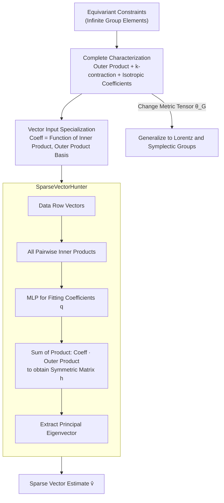

# Tensor learning with orthogonal, Lorentz, and symplectic symmetries

**Conference**: ICLR 2026  
**arXiv**: [2406.01552](https://arxiv.org/abs/2406.01552)  
**Code**: [https://github.com/WilsonGregory/TensorPolynomials](https://github.com/WilsonGregory/TensorPolynomials)  
**Area**: Time Series  
**Keywords**: Equivariant learning, Tensor functions, Orthogonal groups, Lorentz groups, Symplectic groups, Sparse vector recovery

## TL;DR

This paper provides a complete parametrization of equivariant polynomial functions under the diagonal action of the orthogonal group $O(d)$, indefinite orthogonal groups (including the Lorentz group), and the symplectic group $Sp(d)$ on tensors. These characterizations are applied to design learnable sparse vector recovery algorithms that outperform existing sum-of-squares spectral methods across various data-generating assumptions.

## Background & Motivation

Incorporating symmetry constraints into machine learning has become a major trend; fields such as Graph Neural Networks, Geometric Deep Learning, and AI for Science utilize equivariant/invariant structures to improve generalization and sample efficiency. While existing work (e.g., Villar et al., NeurIPS 2021) has investigated the construction of $O(d)$-equivariant functions from vector inputs to tensor outputs, a unified theoretical framework for processing high-order tensor inputs, varying parities, and broader Lie groups (such as Lorentz and symplectic groups) remains missing.

Sparse vector recovery (the planted sparse vector problem) is a widely studied problem in theoretical computer science. Hopkins et al. (2016) and Mao & Wein (2022) proposed spectral methods based on sum-of-squares (SoS) to recover sparse vectors, but these methods only offer theoretical guarantees under specific assumptions (e.g., identity covariance matrices). Real-world data distributions are more diverse and require more flexible algorithms.

The Core Motivation of this paper: Can equivariant machine learning models be constructed from a theoretical basis such that they respect underlying symmetries while learning algorithms from data that surpass hand-designed ones?

## Method

### Overall Architecture

The paper follows a trajectory of "rigorously deriving the mathematics first, then letting the data learn the algorithm." The first step is to provide a **complete parametrization** of a class of equivariant polynomial functions: Any function that remains equivariant under the diagonal action of $O(d)$, indefinite orthogonal groups (including the Lorentz group), or the symplectic group $Sp(d)$ on tensors is expressed as a linear combination of a finite set of "building blocks." These blocks consist of outer products of input tensors followed by $k$-contractions, augmented with fixed metric tensors. The second step specializes this parametrization for vector inputs, finding that the combination coefficients depend only on the pairwise inner products of the input vectors; thus, an MLP is used to fit these coefficients, making the network architecture naturally equivariant. The third step applies this framework to construct a learnable equivariant network, SparseVectorHunter, to solve the planted sparse vector problem: it takes data row vectors as input, constructs a symmetric matrix, and uses its principal eigenvector as the estimate, allowing the network to learn algorithms superior to manual SoS spectral methods.

### Key Designs

**1. Complete characterization of $O(d)$-equivariant tensor polynomials: Transforming abstract constraints into enumerable building blocks**

"Equivariance" is a constraint imposed over infinitely many group elements and cannot be directly encoded into a network. Theorem 1 proves that any $O(d)$-equivariant polynomial function $f$ from several tensor inputs to a tensor output can be written as a linear combination of tensor products of input tensors followed by $k$-contractions, where the coefficient tensor $c$ must be an $O(d)$-isotropic tensor. Lemma 1 further clarifies the abstract space of "isotropic tensors": they are entirely composed of tensor products and permutations of the Kronecker delta $\delta$ and the Levi-Civita symbol $\epsilon$. Thus, constructing equivariant models no longer requires trial and error but follows a finite, enumerable list of bases—the "complete characterization" step in the framework.

**2. Programmable specialization for vector inputs: Compressing the characterization into "inner products + outer products"**

While Theorem 1 is complete, it remains somewhat abstract for direct implementation. Corollary 1 restricts inputs to vectors (1-tensors), the most common case, providing a minimalist expression: the rank-$k'$ tensor output is a linear combination of various permutations of Kronecker deltas and outer products of input vectors, where each coefficient $q_{t,\sigma,J}$ depends only on the set of scalar invariants—the pairwise inner products $\langle v_i, v_j\rangle$. This step is critical—since coefficients are merely functions of inner products, they can be approximated directly by an MLP (Remark 1: by relaxing polynomial coefficients to learnable continuous functions, the Stone-Weierstrass theorem ensures approximation of any continuous equivariant function). Consequently, equivariance is guaranteed by the network structure itself; regardless of how the MLP is trained, the overall output remains naturally equivariant.

**3. Generalization to Lorentz and symplectic groups: Only changing the metric tensor**

To extend the conclusions from $O(d)$ to groups preserving indefinite bilinear forms (indefinite orthogonal groups $O(s,d-s)$, including the Lorentz group in relativity) and the symplectic group $Sp(d)$ preserving antisymmetric forms, the challenge lies in the non-compactness of these groups, which prevents direct Haar measure integration. The authors bypass non-compactness using complexification paired with Haar averaging over Zariski-dense compact subgroups, yielding Theorem 2 and Corollaries 2/3. The final modifications are clean: replace the Euclidean inner product with the group-preserved inner product $\langle\cdot,\cdot\rangle_G$, and replace the Kronecker delta with the corresponding group's metric tensor $\theta_G$ ($I_{s,d-s}$ for $O(s,d-s)$ and the symplectic form $J_d$ for $Sp(d)$). The building blocks remain otherwise identical.

**4. SparseVectorHunter (SVH): Assembling a learnable spectral estimator with equivariant parametrization**

The first three designs provide the theoretical recipe, while this design implements it as a specific network for sparse vector recovery, aligning with the algorithmic skeleton of classical spectral methods—"construct a matrix and extract the principal eigenvector"—but replacing the manual matrix with a learnable equivariant one. As shown in the SVH workflow: the network takes row vectors $a_i$ of the data matrix as input and learns a $d\times d$ symmetric matrix $h$ per Corollary 1. $h$ is a linear combination of symmetric outer products $a_i\otimes a_j$ of all input row vectors, with each coefficient provided by an MLP taking all pairwise inner products as input. The eigenvector corresponding to the maximum eigenvalue of $h$ is retrieved as the sparse vector estimate $\hat v$. The paper also introduces a lightweight variant, **SVH-Diag**, which only retains diagonal terms $a_i\otimes a_i$; thus, coefficients only depend on the squared norms $\|a_\ell\|^2$, significantly reducing parameters. When the data covariance itself is diagonal, this inductive bias matching the data structure proves more accurate than the full model.

### Loss & Training

Training directly optimizes the alignment between the predicted vector and the ground truth sparse vector using the loss $1 - \langle \hat{v}, v_0 \rangle^2$. Data is partitioned into a training set of 5000, and validation and test sets of 500 each. Optimization uses Adam with a batch size of 100 and an exponential learning rate decay of $0.999/\text{epoch}$, with early stopping if validation error does not improve for 20 consecutive epochs. In terms of scale, SVH has approximately 99K parameters and SVH-Diag about 59K, whereas the non-equivariant baseline (BL) reaches approximately 1.33M—the equivariant models succeed with less than one-tenth of the parameter count. All experiments were completed in approximately 18 hours on a single RTX 6000 Ada GPU.

## Key Experimental Results

### Main Results

Experimental settings: $n=100$, $d=5$, $\epsilon=0.25$, with four sparse vector sampling methods (AR, BG, CBG, BR) across three covariance matrix types (Identity, Diagonal, Random). The evaluation metric is $\langle v_0, \hat{v} \rangle^2$ (higher is better, closer to 1).

| Sampling | Covariance | SOS-I | SOS-II | BL | SVH-Diag | SVH |
|---------|--------|-------|--------|------|----------|-----|
| BR | Random | 0.526 | 0.526 | 0.923 | 0.437 | **0.957** |
| BR | Diagonal | 0.334 | 0.334 | 0.864 | **0.588** | 0.903 |
| BR | Identity | 0.524 | 0.524 | 0.845 | 0.317 | **0.889** |
| CBG | Random | 0.412 | 0.412 | 0.239 | 0.372 | **0.935** |
| A/R | Random | 0.610 | 0.610 | 0.241 | 0.493 | **0.938** |
| BG | Identity | **0.962** | **0.962** | 0.196 | 0.908 | 0.342 |

### Ablation Study

| Configuration | Key Performance | Description |
|------|---------|------|
| SVH (Full Inner Product) | Best for Random Covariance | Advantage of utilizing all pairwise information |
| SVH-Diag (Norm Only) | Best for Diagonal Covariance | Fewer parameters, performs well when matching data structure |
| BL (Non-equivariant) | Severe Training Overfitting | 1.33M parameters but poor generalization |
| SOS-I / SOS-II | Best for Identity Covariance | Hand-designed methods with theoretical guarantees |

### Key Findings

- **Equivariance significantly improves generalization**: The non-equivariant baseline (BL) often achieves the best fit on the training set but performs significantly worse on the test set compared to equivariant models, vividly validating theoretical predictions that symmetry improves generalization.
- **Learning methods outperform SOS in regimes without theoretical guarantees**: In scenarios with non-identity covariance (diagonal, random), SVH/SVH-Diag significantly outperform SoS methods, for which theoretical analyses are currently unavailable.
- **Distinct performance regimes**: SVH is optimal under Random covariance, SVH-Diag is optimal under Diagonal covariance, and SOS is optimal under Identity covariance; the only exception is Bernoulli-Rademacher sampling, where SVH wins across the board.

## Highlights & Insights

- An elegant example of combining theory and practice: first establishing mathematical characterizations, then deriving computable architectures.
- Corollary 1 transforms highly abstract equivariant function parametrization into practical programming—coefficients depend only on scalar invariants (inner products), learned via MLP.
- Consistent with the philosophy of neural algorithmic reasoning: matching ML model structures to known algorithmic strategies.
- The path to generalizing to Lorentz and symplectic groups is very clear: simply replace the metric tensor and the bilinear form.
- Although the experimental scale is small ($n=100, d=5$), it is sufficient to reveal the value of equivariance.

## Limitations & Future Work

- Experiments were only validated in small-scale settings ($n=100, d=5$); larger scales were not tested.
- Implementation efficiency decreases when inputs are high-order tensors or have mixed parities.
- Additional permutation invariance between input tensors (e.g., $S_n$-invariance) is not handled, which relates to graph isomorphism problems.
- In the SVH model, each pair of vectors $(i,j)$ has an independent coefficient function, limiting scalability.
- Lack of comparison with other equivariant architectures (e.g., EGNN, SE(3)-Transformers).

## Related Work & Insights

- Villar et al. (2021) "Scalars are universal" is the direct precursor; this work extends it from vectors to tensors.
- Hopkins et al. (2016) sum-of-squares methods provide the baseline algorithms.
- Complementary to the work on tensor cumulants by Kunisky, Moore & Wein, which focuses on symmetric tensors.
- The Stone-Weierstrass theorem ensures that polynomial equivariant functions can approximate continuous equivariant functions.
- Insight: This approach of "theory-driven architecture design" can be applied to more problems involving physical or mathematical symmetries.

## Rating
- Novelty: ⭐⭐⭐⭐
- Experimental Thoroughness: ⭐⭐⭐
- Writing Quality: ⭐⭐⭐⭐⭐
- Value: ⭐⭐⭐⭐

<!-- RELATED:START -->

## Related Papers

- [\[ICLR 2026\] Learning Mixtures of Linear Dynamical Systems via Hybrid Tensor-EM Method](learning_mixtures_of_linear_dynamical_systems_via_hybrid_tensor-em_method.md)
- [\[ICLR 2026\] SONATA: Synergistic Coreset Informed Adaptive Temporal Tensor Factorization](sonata_synergistic_coreset_informed_adaptive_temporal_tensor_factorization.md)
- [\[ICLR 2026\] Learning Koopman Representations with Controllability Guarantees](learning_koopman_representations_with_controllability_guarantees.md)
- [\[ICLR 2026\] End-to-End Probabilistic Framework for Learning with Hard Constraints](end-to-end_probabilistic_framework_for_learning_with_hard_constraints.md)
- [\[ICLR 2026\] Improving Extreme Wind Prediction with Frequency-Informed Learning](improving_extreme_wind_prediction_with_frequency-informed_learning.md)

<!-- RELATED:END -->
