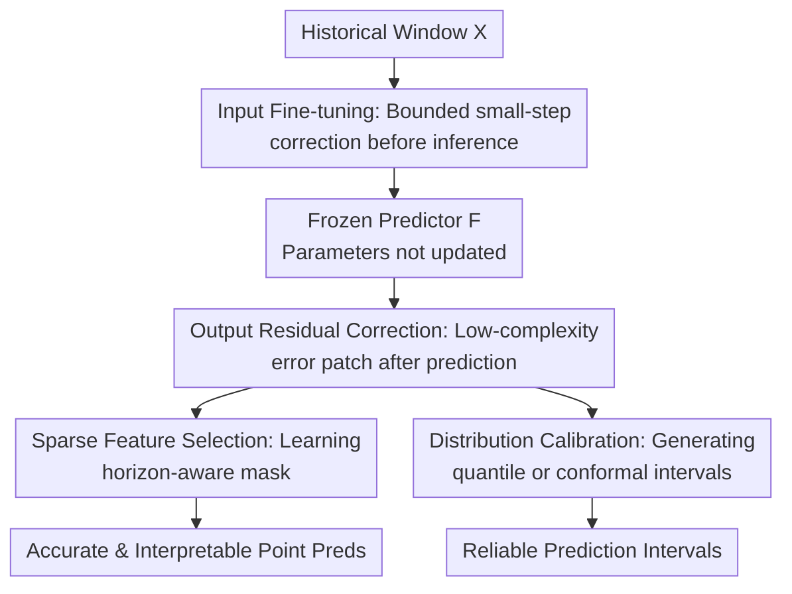

# The Forecast After the Forecast: A Post-Processing Shift in Time Series

**Conference**: ICLR2026  
**OpenReview**: [https://openreview.net/forum?id=syfWdclGE1](https://openreview.net/forum?id=syfWdclGE1)  
**Code**: To be confirmed  
**Area**: Time Series Forecasting  
**Keywords**: Post-processing adapter, Time series forecasting, Distribution calibration, Feature selection, Concept drift  

## TL;DR
This paper proposes $\delta$-Adapter: a lightweight post-processing module constrained by $\delta$, added before and after a frozen time series forecasting backbone. By utilizing input fine-tuning, output residual correction, sparse feature selection, and uncertainty calibration, it consistently improves prediction accuracy and interval coverage quality without modifying the model architecture or retraining the backbone.

## Background & Motivation
**Background**: Over the past few years, progress in time series forecasting has primarily been driven by developing stronger backbones, moving from TCN and Transformer to PatchTST, iTransformer, and recently to pre-trained or foundation-style models like TimeMixer, Sundial, and TTM. Most core efforts focus on "how the predictor itself models the historical window." While these methods successfully lower average errors, in real-world deployment, forecasting systems are often already live with fixed interfaces, latency requirements, and maintenance workflows, making it impractical to retrain the entire model for a new season, market, or sensor distribution.

**Limitations of Prior Work**: Post-deployment time series continuously encounter conditional drift, such as changes in seasonal electricity demand, shifts in traffic sensor distributions, or fluctuating exchange rate scales. Traditional remedies include full fine-tuning, online updates, ensemble methods, or dynamic test-time adjustments. However, these suffer from high training/inference costs, alterations to validated production models, or reliance on future labels during experiments, which risks label leakage in actual deployment.

**Key Challenge**: Many errors do not stem from the backbone’s inability to model data, but rather from "last-mile" low-complexity residuals that remain unabsorbed: systematic biases on certain horizons, underestimation of peak scales, or lack of reliable prediction intervals. While these issues might not warrant retraining a large model, ignoring them leads to accumulated errors and unreliable uncertainty estimation in production.

**Goal**: The authors aim to address a more engineering-oriented question: Can we keep the existing predictor $F$ completely frozen and only learn a small, controllable, low-cost module near the I/O interfaces to perform limited post-processing corrections? Specific objectives include reducing point prediction error, ensuring a stable correction process, making the module plug-and-play for different backbones, and providing more trustworthy prediction intervals and interpretable input selection.

**Key Insight**: The paper observes that post-deployment errors often exhibit structure, such as horizon-wise bias, scale miscalibration, phase lag, or deviations caused by calendars/local windows. Such structures do not necessarily require high-capacity models to capture; a small MLP, low-rank head, or sparse mask—if aligned with the residual and constrained by a small step size $\delta$—can provide stable gains similar to shrinkage residual learning.

**Core Idea**: Replace backbone retraining with a post-processing adapter under trust-region constraints, transforming "model modification" into "a slight nudge to the input, a residual patch to the output, and interval calibration."

## Method
### Overall Architecture
The basic setting of $\delta$-Adapter is straightforward: given a historical window $X \in \mathbb{R}^{L \times d}$ and a frozen predictor $F$, the original prediction is $\hat{Y}=F(X)$. Instead of updating parameters of $F$, the paper trains a tiny adapter $A_\theta$ at the input side, output side, or a combination of both. The input side modifies $X$ into $\tilde{X}$, while the output side transforms the prediction into a residual-corrected $\tilde{Y}$, with all modifications controlled in magnitude by a small coefficient $\delta$.

Beyond error correction, the paper extends the "frozen backbone + constrained post-processing" philosophy to three use cases: Ada-X/Ada-Y for improving point predictions; a mask adapter to select critical time-variable positions from the input window; and Quantile/Conformal Calibrators to extend point predictions into intervals with reliable coverage guarantees.

In this framework, input fine-tuning and output residual correction form the core predictive path; sparse feature selection is an interpretable instance of the input adapter, and distribution calibration is an uncertainty instance of the output adapter. The theoretical analysis centers on this: as long as the adapter direction aligns positively with the residual or loss gradient, a small $\delta$ ensures a local decrease in risk; if $F$ is Lipschitz and the adapter output is bounded, the prediction shift is $O(\delta)$.

### Key Designs
**1. Input Fine-tuning: Converting Test-time Drift into Bounded Input Space Movement**

The input-side adapter does not rewrite the history but performs slight "soft-editing" near the original window. The additive form is $\tilde{X}=X+\delta A^{in}_\theta(X)$, and the multiplicative form is $\tilde{X}=X \odot (1+\delta A^{in}_\theta(X))$. In implementation, $\|A^{in}_\theta(X)\|_\infty \le 1$ is enforced via $\tanh$ or clipping. Thus, $\delta$ is not just a hyperparameter but a direct constraint on the maximum permissible modification at each input position.

This design targets post-deployment covariate shift: if certain variables in recent inputs shift slightly in scale, phase, or local patterns relative to the training period, retraining $F$ is excessive, but nudging the input towards a state $F$ "understands" better can suffice. Using a first-order expansion, $F(X+\delta u) \approx F(X)+\delta J_F(X)u$. Thus, input fine-tuning is equivalent to an effective correction in the prediction space mapped by the Jacobian. If $J_Fu$ aligns with the residual $r=Y-F(X)$, a sufficiently small $\delta$ reduces risk.

**2. Output Residual Correction: Learning Low-complexity Errors Left by the Backbone**

The output-side adapter acts as a conservative residual learner. The additive form is $\tilde{Y}=F(X)+\delta A^{out}_\theta(F(X),X)$. This targets systematic errors, such as horizon-wise bias or peak underestimation. For squared error, if $g(X)=A^{out}_\theta(F(X),X)$ and $r(X)=Y-F(X)$, the adapter's risk expands as $\frac{1}{2}\mathbb{E}\|r-\delta g\|^2$, where the first-order gain comes from $\mathbb{E}\langle r,g\rangle$.

This implies the adapter does not need to re-model all time series patterns like a new backbone; it only needs to capture simple structures in the residuals. The shrinkage effect of $\delta$ ensures that even slight learning errors do not catastrophicially degrade the original model, while a positive correlation between $g$ and the residual theoretically guarantees a range of $\delta$ where the risk is lower than that of the original model.

**3. Sparse Feature Selection: Interpretable Input Correction via Mask Adapter**

The paper implements an instance of the input adapter as a feature selector: it outputs $M(X;\theta) \in [0,1]^{L\times d}$ and feeds $X'=X\odot M(X;\theta)$ to the frozen predictor. Positions where $M \approx 1$ represent retained information. To keep the mask trainable yet close to discrete selection, Gumbel-Sigmoid or straight-through estimators are used.

This addresses a common critique: if post-processing only reduces error, it remains a "black box." The mask adapter explicitly exposes which historical positions actually influence the prediction through sparsity, low entropy, and budget constraints. The training objective includes prediction loss, an $\|M\|_1$ penalty, entropy, temporal variation, and a budget term $({\bar m}-\kappa)_+$. The resulting mask is not just an explanation map but an active participant; experiments show that keeping these learned features reduces error, while removing them harms performance significantly.

**4. Distribution Calibration: Adding Reliable Intervals without Modifying the Point Predictor**

A production point-forecaster is often insufficient; users need to know prediction confidence. The paper extends output-side adaptation into two calibrators: a Quantile Calibrator that learns horizon-wise quantiles directly, and a Conformal Calibrator that learns a heteroscedastic scale function for normalized residual conformal prediction.

The Quantile Calibrator defines quantiles as $q_{\tau,\theta}(X)=\hat{Y}+\epsilon a_\theta(X,\hat{Y},\tau)\odot s_\theta(X,\hat{Y})$. To prevent quantile crossing, it uses $q_{\tau_{j+1}}=q_{\tau_j}+\mathrm{softplus}(d_{j,\theta})$. The Conformal Calibrator learns $w_\theta(X,\hat{Y})>0$ to estimate residual scales. On a calibration set, it calculates the normalized residual quantile $\kappa_\alpha$, yielding the final interval $\{y:\|y-\hat{Y}\|\le \kappa_\alpha w_\theta(X,\hat{Y})\}$. The former is a learned distribution calibration, while the latter retains finite-sample coverage guarantees under exchangeability.

### Mechanism
Consider a deployed power load forecasting system where the backbone $F$ predicts the next $H$ hours based on the past $L$ hours. During summer, air conditioning leads to new peak patterns; the original model captures daily cycles but underestimates evening peaks, with varying error scales across sensors.

With $\delta$-Adapter, the system first applies the input fine-tuning module to perform bounded corrections on the history—for instance, slightly amplifying recent temperature-related covariates. The frozen $F$ then generates an initial prediction. The output residual module subsequently applies a horizon-specific correction based on $F(X)$ and the current window, adjusting the underestimation in specific steps (e.g., hours 8-12). If enabled, the mask adapter highlights critical temperature variables before the peak. If uncertainty is required, the calibrators generate personalized intervals. Throughout this process, $F$ remains unchanged.

### Loss & Training
The backbone $F$ is frozen while only adapter parameters are updated. Point prediction uses MSE/MAE or horizon-aware losses. The combined Ada-X+Y can be optimized end-to-end: first compute $\hat{Y}=F(X+\delta A^{in}_\theta(X))$, then $\tilde{Y}=\hat{Y}+\delta A^{out}_\theta(\hat{Y})$, followed by a single backward pass.

Adapters are small MLPs or low-rank heads, typically trained with Adam at a learning rate of $10^{-4}$. In main experiments, $\delta=0.1$ (or $0.01$ for ETT). The mask adapter targets: $\mathcal{L}_{pred}+\lambda_1\|M\|_1+\lambda_{ent}\mathcal{H}(M)+\lambda_{tv}\mathrm{TV}(M)+\lambda_{bud}(\bar m-\kappa)_+$. Quantile Calibrators use pinball loss with reliability regularization.

## Key Experimental Results

### Main Results
Testing spans ETT, Electricity (ELC), Exchange, Traffic, and Weather datasets, covering pre-trained models, SOTA backbones, and uncertainty calibration.

| Setup | Dataset / Backbone | Original MSE | δ-Adapter Result | Main Conclusion |
|------|-------------------|--------------|----------------|----------|
| Pre-trained | Sundial-S / Weather | 0.427 | Ada-X 0.025, Ada-Y 0.039 | Significant gains on Weather via both I/O post-processing |
| Pre-trained | Sundial-S / ETTm2 | 0.348 | Ada-X 0.201, Ada-Y 0.254 | Input fine-tuning is stronger, indicating covariate shift |
| Pre-trained | TTM-R2 / ELC | 0.180 | Ada-X 0.167, Ada-Y 0.168 | Consistent small gains even on multivariate pre-trained models |
| SOTA Backbone | DistPred / Exchange | 0.350 | Ada-X 0.302, Ada-Y 0.319 | Substantial improvement on Exchange |
| SOTA Backbone | Autoformer / Traffic | 0.972 | Ada-X 0.959, Ada-Y 0.918 | Output correction helps weaker backbones more |
| Joint Training | DistPred / Weather | 0.1710 | Ada-X+Y Online 0.1560 | Online joint adapter achieves the lowest error |

### Ablation Study
| Configuration | Key Metrics | Description |
|------|----------|------|
| PatchTST (Frozen) | ELC MSE 0.167, Traffic 0.463 | Baseline backbone for ablation |
| PatchTST + Ada-X+Y | ELC 0.159, Traffic 0.451 | Additive combination leads to ~5.6% MSE reduction |
| PatchTST + Ada-X×Y | ELC 0.159, Traffic 0.448 | Multiplicative combination yields ~5.1% MSE reduction |
| Mask Adapter | ELC 0.163 → 0.159 | Optimal mask ratio is 92%-98% without strict budget |
| $\delta$ Sensitivity | Stable around $\delta=0.1$ | Excessively large $\delta$ degrades consistency by violating trust region |

### Key Findings
- Input-side Ada-X is often stronger than Ada-Y, especially on Weather, ETTm2, and Exchange, suggesting that nudging the input back into the backbone's familiar "local region" is highly effective.
- Output-side Ada-Y is crucial for models with structural residuals (e.g., Autoformer on Traffic), compensating for systematic biases.
- Ada-X+Y is generally more stable than individual modules, aligning with the theoretical stability of combined adaptation.
- Mask adapter interpretability experiments are compelling: keeping learned features results in lower error than random selection, and removing them significantly hurts performance.
- Calibration: Quantile (QC) and Conformal (CC) Calibrators achieve the highest PICP (Prediction Interval Coverage Probability). QC is more conservative, while CC provides tighter intervals with coverage guarantees.

## Highlights & Insights
- **Ours**: This work shifts the focus from "reinventing the backbone" to "cheaply fixing the last mile" after deployment, which is highly practical for production systems that cannot tolerate frequent retraining.
- **Novelty**: The $\delta$ constraint ensures the adapter behaves like an optimization within a trust region rather than an unbounded patch network, enhancing theoretical stability and engineering control.
- **Value**: The separation of Ada-X (handling contexts the model doesn't recognize) and Ada-Y (handling systematic output residuals) provides a clear division of labor that could generalize to other regression tasks or anomaly detection.
- **Mechanism**: The mask adapter couples error reduction with interpretability in a single objective, making the explanation more trustworthy than post-hoc saliency maps.

## Limitations & Future Work
- **Limitations**: The adapter still requires labeled data for training/calibration. Handling strong unlabeled shifts without label leakage remains a challenge.
- **Theoretical Constraints**: Guarantees rely on smoothness/Lipschitz conditions and may not hold for all non-convex backbones or extreme drift types.
- **Interpretability**: The mask ratio is often quite high (92%-98%). Achieving sparse, human-auditable explanations might require stricter budgets or inductive biases.
- **Calibration**: Conformal guarantees depend on exchangeability; non-stationary online scenarios might require rolling calibration or drift-aware conformal prediction.

## Related Work & Insights
- **vs SOLID / TAFAS / DynaTTA**: These test-time adaptation methods often update internal layers or rely on future labels. $\delta$-Adapter limits changes to I/O interfaces and explicitly addresses label leakage risks.
- **vs LoRA / Prefix Tuning**: While LoRA is for white-box model internal fine-tuning, $\delta$-Adapter is better suited for black-box or production-fixed forecasters by treating the backbone as an immutable interface.
- **vs Residual Boosting**: Ada-Y resembles shrinkage boosting but is systematized for multi-step forecasting with combined Jacobian-induced input corrections and interval calibration.

## Rating
- Novelty: ⭐⭐⭐⭐☆ 
- Experimental Thoroughness: ⭐⭐⭐⭐☆ 
- Writing Quality: ⭐⭐⭐⭐☆ 
- Value: ⭐⭐⭐⭐⭐ 

<!-- RELATED:START -->

## Related Papers

- [\[ICLR 2026\] Quadratic Direct Forecast for Training Multi-Step Time-Series Forecast Models](quadratic_direct_forecast_for_training_multi-step_time-series_forecast_models.md)
- [\[ICLR 2026\] Panda: A Pretrained Forecast Model for Chaotic Dynamics](panda_a_pretrained_forecast_model_for_chaotic_dynamics.md)
- [\[ICLR 2026\] Aurora: Towards Universal Generative Multimodal Time Series Forecasting](aurora_towards_universal_generative_multimodal_time_series_forecasting.md)
- [\[ICLR 2026\] Characteristic Root Analysis and Regularization for Linear Time Series Forecasting](characteristic_root_analysis_and_regularization_for_linear_time_series_forecasti.md)
- [\[ICLR 2026\] Bridging Past and Future: Distribution-Aware Alignment for Time Series Forecasting](bridging_past_and_future_distribution-aware_alignment_for_time_series_forecastin.md)

<!-- RELATED:END -->
