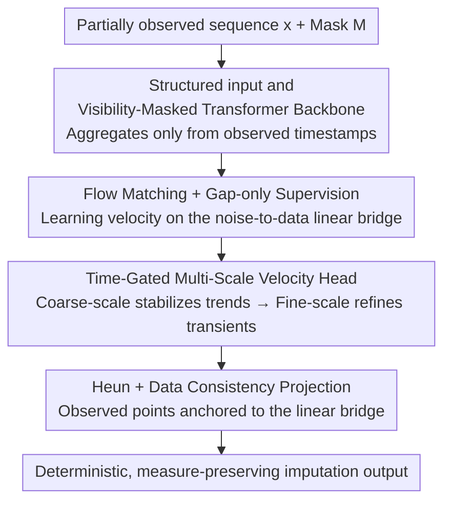

# Time-Gated Multi-Scale Flow Matching for Time-Series Imputation

**Conference**: ICLR 2026  
**OpenReview**: [https://openreview.net/forum?id=txvc61ONbs](https://openreview.net/forum?id=txvc61ONbs)  
**Code**: None  
**Area**: Time Series / Missing Value Imputation / Flow Matching  
**Keywords**: Time-Series Imputation, Flow Matching, Multi-Scale Velocity Field, Data Consistency Projection, Deterministic ODE

## TL;DR
This paper models multivariate time-series imputation as a "noise $\to$ data" data-conditional ODE. It utilizes flow matching to learn the velocity field, prevents information leakage via visibility-masked attention, schedules "coarse-to-fine" frequency content through time-gated multi-scale velocity heads, and anchors observed points to a linear bridge using the Heun integrator with data consistency projection. This approach achieves competitive or superior imputation accuracy across ten benchmarks with deterministic, low-compute inference.

## Background & Motivation

**Background**: Multivariate time series in sensors, healthcare, transportation, and finance commonly suffer from missing values. Early methods used RNNs with decay mechanisms (e.g., GRU-D, BRITS) for irregular observations. Recent mainstream approaches are self-attention-based encoder-decoders (SAITS, PatchTST, iTransformer, TimesNet, etc.) that treat missing positions as point estimation regression tasks. Another line of research involves diffusion-based probabilistic imputation (CSDI, PriSTI, SSSD), which treats observations as conditions and performs reverse denoising on missing coordinates to naturally provide uncertainty.

**Limitations of Prior Work**: Discriminative point estimators do not explicitly model the trajectory of "evolving from noise to data," often leading to boundary drift and error propagation into gaps during long blockwise missing scenarios. Although diffusion models provide distributions, they require dozens or hundreds of reverse sampling steps and suffer from sampling variance noise under deterministic evaluation protocols. Additionally, applying Transformers directly to imputation risks "label leakage," where attention aggregates information from **unobserved** timestamps.

**Key Challenge**: Imputation faces three coupled difficulties: irregular sampling/blockwise gaps that break short-range continuity, the coexistence of slow trends and sharp transients (testing the model's spectral bias), and the need for reproducible, reliable inference with moderate computational cost. Point estimation and diffusion each address part of these issues, but no existing work effectively handles all three with a deterministic, lightweight, and frequency-aware approach.

**Goal**: To provide a lightweight, task-aligned deterministic solution for long-gap imputation, where the training objective focuses solely on missing positions, inference strictly preserves observations, and a single knob (Heun steps) allows for a smooth trade-off between accuracy and computation.

**Key Insight**: The authors observe that flow matching (rectified flow) learns a **constant-velocity** field on a "noise-data" linear bridge. Integrating this ODE during testing enables deterministic sampling with a competitive speed-quality trade-off. They reformulate imputation as a "data-conditional ODE" and introduce three task-specific components: visibility-masked attention, time-gated multi-scale velocity parameterization, and Heun integration with stepwise data consistency projection.

**Core Idea**: Utilize "data-conditional ODE + Flow Matching" instead of point estimation or diffusion. This allows the velocity field to **stabilize global trends first and then refine high-frequency details** along the trajectory while hard-projecting observed coordinates back onto the linear bridge for deterministic, measure-preserving imputation.

## Method

### Overall Architecture
The input consists of a partially observed multivariate sequence $x \in \mathbb{R}^{T\times D}$ and a binary observation mask $M$; the output is the deterministic reconstruction of missing positions. The process begins by wrapping the observed sequence into "structured endpoints" $\tilde{x}$, which are fed into a Time-aware Transformer with visibility masking to obtain a shared representation $h$. Velocity is extracted from $h$ at different scales using a fixed 1D pyramid, and a time gate blends these multi-scale velocities into the final velocity field $v_\theta$, defining the ODE $\dot z_t = v_\theta(z_t,t;\tilde x)$. During inference, starting from Gaussian noise $z_0$, a second-order Heun integrator progresses forward, applying a data consistency projection at each step to anchor observed coordinates to the linear bridge, resulting in a deterministic, measure-preserving imputation trajectory. Training supervises velocity only at missing coordinates (gap-only), while observed coordinates are handled by the hard projection constraint during inference.

### Key Designs

**1. Structured Input + Visibility-Masked Transformer Backbone: Preventing leakage from the source**

Naively applying Transformers to imputation allows attention to aggregate information from missing timestamps that should be inferred, effectively "peeking" at the answer. The authors expand the input into structured endpoints $\tilde x = [\,x\odot M,\, m,\, x^L,\, x^R\,] \in \mathbb{R}^{T\times(D+3)}$. Beyond the masked observed values, they include a timestamp visibility flag $m_t$ (1 if any channel at that time is observed) and moving averages $x^L, x^R$ of observed points to the left and right (window $w=10$, summarizing local context). These three auxiliary channels are treated as "known" and participate in both attention and inference-time data consistency. The backbone is a time-aware Transformer $f_\phi$ that consumes $(z_t, t, \tilde x)$ to produce $h$, with self-attention masked by visibility: a query $\tau$ can only attend to keys where $m_t=1$. Logits $a_{\tau t} = q_\tau^\top k_t/\sqrt{d_k}$ if $m_t=1$, else $-\infty$, equivalent to adding a $-\infty$ bias matrix $B$ before softmax. Scalar time $t$ is added to token features via sinusoidal/timestep embeddings. This ensures information flows only from true observed timestamps, structurally eliminating leakage.

**2. Gap-only Supervised Flow Matching: Focusing capacity on the "part to be inferred"**

The authors perform deterministic flow matching on a linear bridge between "Gaussian noise" and "data endpoints." For each sample, $z_0\sim\mathcal N(0,I)$ is drawn, and let $z_1=\tilde x$, $z_t=(1-t)z_0+t z_1$, with $t\sim\mathrm{Uniform}[0,1]$. The teacher velocity on this bridge is constant $v(z_t,t)=z_1-z_0$. Training forces $v_\theta$ to match this, but the supervision set is restricted to missing coordinates $\Omega=\{(t,d)\mid M_{t,d}=0,\,d\in\mathcal D\}$:

$$\mathcal L_{\mathrm{FM}} = \frac{1}{|\Omega|}\sum_{(t,d)\in\Omega}\big\|\,[v_\theta(z_t,t;\tilde x)]_{t,d} - [z_1-z_0]_{t,d}\,\big\|_2^2.$$

Why not supervise observed coordinates? Because observed coordinates are already hard-constrained by the data consistency mechanism during inference (Design 4). Adding this to the loss would be redundant and could introduce conflicting gradients, harming the reconstruction of unknown parts. Optional stability regularizations (1st/2nd order time difference, mild high-frequency suppression) are included in the appendix but excluded from the main objective. This aligns the training signal strictly with the imputation goal—"only learn the gap."

**3. Time-Gated Multi-Scale Velocity Head: Deterministic evolution of spectral bias**

Coexisting slow trends and sharp transients cannot be reconciled by a single receptive field. The authors fan out the shared representation $h$ to multiple velocity heads on a fixed 1D pyramid (strides $S=\{1,2,4\}$, downsampled via average pooling + linear upsampling). For each scale, $h^{(s)}=\mathrm{Down}_s(h)$ passes through a lightweight local module $\mathrm{Head}_s$ (e.g., Conv-GELU-Conv) to extract scale-specific velocity $u^{(s)}$, which is upsampled back to $\tilde u^{(s)}$. Final velocity is blended via a **time-dependent gate**:

$$\alpha(t)=\mathrm{softmax}(\mathrm{MLP}(t))\in\Delta^{|S|-1},\qquad v_\theta(z_t,t;\tilde x)=\sum_{s\in S}\alpha_s(t)\,\tilde u^{(s)}.$$

The gate shifts the spectral center of gravity as $t$ progresses: when $t\approx 0$, it favors coarse scales to stabilize the global trajectory; as $t\to 1$, weight shifts to fine branches to resolve sharp transients. To suppress high-frequency ringing in the finest branches, a fixed 1D anti-aliasing filter (3–5 taps, unit DC gain) and element-wise squeezing (like tanh) limit velocity magnitude (without affecting ODE fixed points). Instead of just merging multi-scale features in the encoder, this directly equips the **velocity field** with scale-specific heads and a time gate, allowing the solver to follow a "coarse-to-fine" trajectory.

**4. Heun + Stepwise Data Consistency Projection: Deterministic integration and strict measure preservation**

During testing, the learned velocity is treated as an ODE and integrated from $t=0$ to 1 starting from $z_0\sim\mathcal N(0,I)$. A second-order Heun (predictor-corrector) method is used: first predict $\hat z = z_n + \Delta t\, v_\theta(z_n,t_n)$, then correct $z^{\mathrm{ode}}_{n+1}=z_n+\tfrac{\Delta t}{2}(v_\theta(z_n,t_n)+v_\theta(\hat z,t_n+\Delta t))$, with an optional monotonic time warp $t_{\mathrm{eff}}(t)=t^k,\,k\ge 1$. After each step, a Data Consistency (DC) projection is applied: let $K$ be the coordinates of observed data plus conditioning channels (viewed as known for all $t$). Ensure observed coordinates follow the exact linear bridge $z_{n+1}[K]\leftarrow(1-t_{\mathrm{eff}})z_0[K]+t_{\mathrm{eff}}z_1[K]$, while unknown coordinates use the ODE result $z_{n+1}[\bar K]\leftarrow z^{\mathrm{ode}}_{n+1}[\bar K]$. Thus, known terms stay exactly on the linear bridge while unknown terms evolve under the ODE. The authors prove a property: if $v_\theta\equiv z_1-z_0$ (perfect velocity), Heun is exact for constant velocity, and DC keeps $K$ on the same line; the entire Heun+DC scheme will recover the exact linear bridge for all coordinates. This aligns constraints across training (gap-only) and inference (preserving observations), significantly reducing boundary artifacts and drift, especially in long gaps. The number of steps $N$ acts as an accuracy-compute knob (recommended $N\in[200,300]$).

### Loss & Training
The primary objective is the gap-only flow matching loss $\mathcal L_{\mathrm{FM}}$ mentioned above. Hyperparameters are **fixed across all datasets**: pyramid strides $S=\{1,2,4\}$, sliding window $w=10$, anti-aliasing 3–5 taps with unit DC gain, time warp $k\in[1,2]$, and inference steps $N\in[200,400]$ (default $N=300$). Computationally, the backbone is $O(LT^2Hd)$ time and $O(T^2)$ memory for attention (masking does not change magnitude). Multi-scale heads add $O(|S|TD)$ per forward pass, and Heun requires two velocity evaluations per step (approx $2N$ forward passes for $N$ steps). DC projection is linear to $|K|$.

## Key Experimental Results

### Main Results
Ten public benchmarks (ETTh1/h2/m1/m2, Electricity, Traffic, Weather, Illness, Exchange, PEMS03) were used. Metrics (MSE/MAE) were calculated only at missing positions, averaged over missing rates $\{0.1, 0.3, 0.5, 0.7\}$ and 5 random seeds. Hyperparameters were not tuned per dataset.

| Dataset | Metric | Ours (TG-MSFM) | Prev. SOTA | Note |
|--------|------|------|----------|------|
| ETTh2 | MSE | **0.044** | 0.093 (Mtsci) | Significant lead |
| ETTm2 | MSE | **0.020** | 0.030 (PatchTST) | |
| Illness | MSE | **0.064** | 0.167 (SAITS) | Stable in long gaps/high variance |
| Exchange | MSE | **0.029** | 0.067 (PriSTI) | Large Gain in burst+trend |
| PEMS03 | MSE | **0.047** | 0.065 (PatchTST) | |
| Electricity | MSE/MAE | **0.101 / 0.198** | 0.114 / 0.216 (SAITS) | |

Across ten datasets, TG-MSFM performed strongest on average for both MSE and MAE without per-dataset tuning. Gains on periodic families (ETTh/m) were steady but moderate—visibility-masked attention already transfers seasonal info from observed points; most improvements came from gap boundaries (Heun+DC prevents drift and inhibits error back-propagation). Gains were larger for burst+trend families (Traffic/Exchange)—early coarse scales stabilize the global trajectory, while fine heads with light anti-aliasing perform local corrections near endpoints, mitigating overshoot. Compared to stochastic diffusion (CSDI), the deterministic ODE consistently achieved lower MAE by eliminating sampling variance.

### Ablation Study
Tested on Electricity and ETTh1 by removing main components (MS=Multi-scale head / Gate=Time gate / Heun=Integrator):

| Configuration | Electricity MSE/MAE | ETTh1 MSE/MAE | Note |
|------|------|------|------|
| Full (MS✓ Gate✓ Heun✓) | **0.101 / 0.198** | **0.126 / 0.231** | Complete model |
| Single Scale (s=1) | 0.116 / 0.227 | 0.158 / 0.276 | Single RF cannot handle trend + transients |
| Static Mix (No Gate) | 0.212 / 0.223 | 0.147 / 0.261 | Spectral bias doesn't evolve with flow phase |
| Euler (No Heun) | 0.115 / 0.218 | 0.143 / 0.257 | 1st-order Euler increases boundary error |

### Key Findings
- The three components are complementary: the gate handles "what to emphasize," and Heun+DC handles "how updates propagate in gaps." Removing any component leads to a performance drop; removing multi-scale features caused the largest drop on ETTh1 (MSE rose from 0.126 to 0.158).
- Replacing Heun with Euler increases boundary error—the predictor-corrector average reduces local truncation error precisely where DC anchors observed coordinates, reducing leakage to missing neighbors.
- Step Efficiency: On ETTh1, returns diminish after $N\approx 250$. Even at $N\lesssim 100$, the model degrades gracefully thanks to the coarse-to-fine gating. TG-MSFM's speed-quality AUPC (0.626) is much higher than CSDI's (0.380).
- Robustness: As center gaps elongated from 12 to 72 hours, error increased for all methods, but TG-MSFM grew the slowest and remained the most accurate at all lengths.

## Highlights & Insights
- Making "gap-only training supervision" and "inference-time hard DC projection" a pair of interlocking constraints is the most clever aspect. Since observed coordinates are anchored during inference, the training process ignores them, dedicating all model capacity to the parts that actually need inference while avoiding conflicting gradients.
- Injecting multi-scale modeling into the **velocity field** rather than encoder features: This forces the ODE solver to follow a path of "coarse trend stabilization then fine transient refinement." The time gate transforms spectral bias into a deterministic scheduler evolving with $t$, a concept transferable to other flow matching/diffusion tasks.
- The property that "Heun+DC exactly recovers the linear bridge under perfect velocity" provides a clean theoretical anchor for deterministic imputation—the method introduces no extra bias in the ideal limit.
- A single knob (Heun steps) for accuracy-computation trade-off is very engineer-friendly: $N\in[200,300]$ for accuracy, $[80,120]$ for speed.

## Limitations & Future Work
- The authors explicitly perform **deterministic single-trajectory** imputation: each window uses a fixed $z_0$ and deterministic Heun+DC. It does not perform multi-sample aggregation and **does not provide calibrated uncertainty**. It is not a substitute for diffusion/consistency models in risk-sensitive scenarios.
- Pyramid strides, sliding windows, and anti-aliasing taps are hand-set; adaptive scales or learned gating structures were not explored. Optimal $k$ and $N$ may vary by dataset but were fixed to highlight "parameter-free" utility.
- Evaluations are on standard multivariate benchmarks and do not involve explicit graph structures/spatial relationships (positioned as graph-agnostic). It wasn't compared directly against strong graph-aware baselines like GRIN or ImputeFormer.
- Future improvements: Extending single trajectories to multi-sample $z_0$ for conditional distributions/calibration, or learning the time gates/scale sets.

## Related Work & Insights
- **vs CSDI / PriSTI (Diffusion Imputation)**: These use stochastic reverse processes for uncertainty but are slower and suffer from sampling variance. Ours uses a deterministic flow matching ODE for reproducible point estimation, achieving lower MAE and better speed-quality trade-offs.
- **vs SAITS / PatchTST / iTransformer (Discriminative)**: These regress missing values directly without noise-data evolution. Ours learns a velocity field for ODE evolution, using DC projection to prevent boundary drift in long gaps.
- **vs Sinkhorn OT / TDM (Alignment-based)**: These rely on manual matching costs. Ours implicitly uses OT ideas (linear bridge + DC) while providing a transparent continuous-time generation trajectory.
- **vs Consistency Models / CoSTI**: These approximate probability flow ODEs for few-step sampling with uncertainty. Ours is simpler, focusing on long-gap, reproducible point estimation rather than posterior sampling.

## Rating
- Novelty: ⭐⭐⭐⭐ Combines flow matching, time-gated multi-scale velocity, and stepwise DC projection into a clear, cohesive package for imputation.
- Experimental Thoroughness: ⭐⭐⭐⭐ Ten benchmarks, fixed hyperparameters, covering ablation, step counts, and gap lengths, though lacking direct comparison with graph-aware baselines.
- Writing Quality: ⭐⭐⭐⭐ Motivation, positioning, and property statements are clear; formulas correspond well to components.
- Value: ⭐⭐⭐⭐ Provides a practical, task-aligned solution for "deterministic, lightweight, reproducible" long-gap imputation.

<!-- RELATED:START -->

## Related Papers

- [\[ICML 2026\] Spatiotemporal Imputation with Graph-Informed Flow Matching](../../ICML2026/time_series/spatiotemporal_imputation_with_graph-informed_flow_matching.md)
- [\[ICLR 2026\] TrajFlow: Nationwide Pseudo GPS Trajectory Generation with Flow Matching Models](trajflow_nation-wide_pseudo_gps_trajectory_generation_with_flow_matching_models.md)
- [\[ICLR 2026\] Flow-based Conformal Prediction for Multi-dimensional Time Series](flow-based_conformal_prediction_for_multi-dimensional_time_series.md)
- [\[ICLR 2026\] T1: One-to-One Channel-Head Binding for Multivariate Time-Series Imputation](t1_one-to-one_channel-head_binding_for_multivariate_time-series_imputation.md)
- [\[ICLR 2026\] Learning Recursive Multi-Scale Representations for Irregular Multivariate Time Series Forecasting](learning_recursive_multi-scale_representations_for_irregular_multivariate_time_s.md)

<!-- RELATED:END -->
