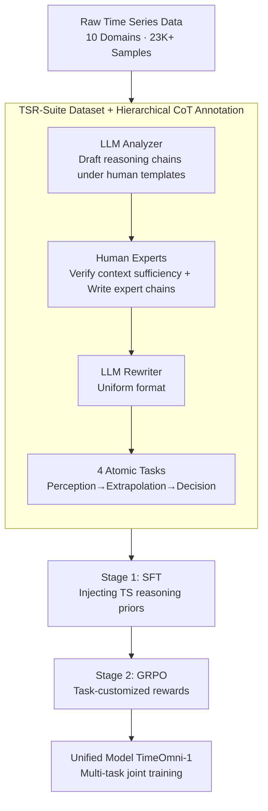

# TimeOmni-1: Incentivizing Complex Reasoning with Time Series in Large Language Models

**Conference**: ICLR 2026  
**arXiv**: [2509.24803](https://arxiv.org/abs/2509.24803)  
**Code**: [GitHub](https://github.com/AntonGuan/TimeOmni-1)  
**Area**: Human Understanding/Time Series  
**Keywords**: Time Series Reasoning, LLM, Reinforcement Learning, Multi-task Joint Training, Causal Discovery

## TL;DR

TimeOmni-1 proposes the first unified time series reasoning model. Through TSR-Suite (the first reasoning-oriented time series dataset suite) and a two-stage training process (SFT for injecting time series priors + RL for refining reasoning), it significantly outperforms GPT-4.1 across multiple time series reasoning tasks.

## Background & Motivation

Time series understanding is shifting from basic pattern analysis to advanced reasoning, yet two major bottlenecks persist:

**Scarcity of High-Quality Data**: Existing time series QA datasets (e.g., Time-MQA) remain at a superficial question-answering level. They suffer from: (a) Overly simple questions where the gap between reasoning and non-reasoning models is minimal; (b) Insufficient context, where missing key information forces models to guess rather than reason.

**Lack of Viable Reasoning Paths**: It remains unclear which tasks truly necessitate time series reasoning capabilities. Existing methods are restricted to narrow tasks (e.g., TimeMaster training six models for six datasets), lacking cross-task transferability.

The authors propose two core **Design Principles**:
- **Principle 1 — QA Must Reward Reasoning**: Reasoning models should significantly outperform non-reasoning models $\bar{S}(M_{RM}) \gg \bar{S}(M_{NRM})$.
- **Principle 2 — Context Must Be Sufficient**: Sufficient time series input $X$ and auxiliary context $C$ must be provided to avoid ambiguity.

## Method

### Overall Architecture

TimeOmni-1 decomposes the objective of "enabling LLMs to truly reason with time series" into two complementary phases. First, using TSR-Suite, three types of temporal capabilities—perception, extrapolation, and decision-making—are fed into the model in the form of human-guided Chain-of-Thought (CoT). These reasoning chains are produced via a hierarchical annotation workflow: "LLM drafting → Human expert verification → LLM normalization." Second, a two-stage curriculum learning process solidifies these priors: Stage 1 utilizes Supervised Fine-Tuning (SFT) to teach the model "how to think," while Stage 2 employs GRPO with task-customized rewards to make the model "think more accurately." Throughout this process, four tasks are integrated into a single model for joint training, ultimately converging into the unified TimeOmni-1.

### Key Designs

**1. TSR-Suite: Embedding "Reasoning Necessity" and "Context Sufficiency" into the Dataset**

Existing time series QA datasets often have shallow questions and sparse contexts, offering reasoning models little advantage over non-reasoning ones and forcing models to rely on guessing. TSR-Suite directly embeds two design principles into the data: first, reasoning models must significantly outperform non-reasoning models $\bar{S}(M_{RM}) \gg \bar{S}(M_{NRM})$; second, sufficient time series input $X$ and auxiliary context $C$ are provided to eliminate ambiguity. Based on these, it constructs 4 atomic tasks covering three layers of capability: Perception (Task 1: Scene Understanding/Single-sequence Attribution, Task 2: Causal Discovery/Multi-sequence Causal Relationships), Extrapolation (Task 3: Event-aware Prediction/Inferring future trends under event perturbations), and Decision-making (Task 4: Decision Formulation/Integrating previous capabilities for action selection). The suite contains 23K+ samples across 10 domains, with 2.3K meticulously curated via human guidance. This pipeline encodes the cognitive logic of "understand first, then predict, then act," carving a genuine reasoning path for the model.

**2. Hierarchical CoT Annotation Workflow: Reducing Noise and Cost via Human-AI Collaboration**

High-quality reasoning chains cannot rely solely on humans (too expensive) or LLMs (prone to error). TimeOmni-1 addresses this gap with a three-step division of labor: the LLM Analyzer generates initial versions (Step-1 CoT) under human-guided templates; human experts then verify context sufficiency and write expert chains (Step-2 CoT) specifically for cases where the LLM failed; finally, the LLM Rewriter normalizes these into a uniform format. Human-guided templates are critical—GPT-4.1's zero-shot causal discovery improved from 28.7% to 71.1% when using these templates, demonstrating that templates provide the necessary reasoning scaffolding rather than direct answers.

**3. Task-Customized RL Rewards: Differentiated Scoring for Discrete and Sequential Tasks**

Output formats vary significantly across the four tasks, meaning a single reward function would cause distortion. Therefore, the Stage 2 GRPO splits scoring by task type. All tasks undergo a format reward $\mathcal{R}_{format}$, enforcing the `<think></think><answer></answer>` structure. Discrete tasks (Tasks 1, 2, 4) use an accuracy reward based on exact matching $\mathcal{R}_{discrete} \in \{0,1\}$. Sequence prediction (Task 3) is split into two parts: a count reward $\mathcal{R}_{count}=0.1$ for correct sequence length, plus a normalized reward derived from MAE via exponential decay, separately incentivizing length accuracy and numerical precision.

**4. Multi-task Joint Training: Mutual Benefit Across Three Capability Layers**

Prior narrow-task methods (e.g., TimeMaster training 6 models for 6 datasets) fail to transfer across tasks. TimeOmni-1 incorporates all tasks into a single model and demonstrates positive transfer through two progressive experiments: Progressive Capability Transfer—even without direct training on the decision task, training on perception and extrapolation alone raised decision accuracy from 25.5% to 31.3%; and Progressive Capability Supplementation—gradually adding prerequisite tasks to joint training further improved decision accuracy from 40.9% to 47.9%. Together, these support the paradigm of "train once, reuse across tasks."

### Loss & Training

Stage 1 uses standard SFT cross-entropy loss on human-guided CoT data to inject time series reasoning priors. Stage 2 employs GRPO (Group Relative Policy Optimization) with rewards combined by task type: for discrete tasks, $R = \mathcal{R}_{format} + \mathcal{R}_{discrete}$; for sequence prediction, $R = \mathcal{R}_{format} + \mathcal{R}_{count} + \text{exp-decay}(\text{MAE})$.

## Key Experimental Results

### Main Results

**ID/OOD Tests Across Four Tasks (ACC %, MAE↓ for Task 3):**

| Method | Scene Understanding (ID) | Causal Discovery (ID) | Event Prediction (ID/MAE) | Decision (ID) |
|------|------------|------------|----------------|---------|
| GPT-4.1 | 85.5 | 28.7 | 13.79 | 25.5 |
| Qwen2.5-7B | 48.5 | 21.6 | 23.28 | 25.5 |
| Time-R1 | 30.9 | 30.2 | 17.61 | 27.8 |
| **TimeOmni-1** | **90.7** | **69.3** | **14.30** | **47.9** |

TimeOmni-1 outperforms GPT-4.1 by 40.6% in causal discovery (ID) and by 22.4% in decision tasks.

### Ablation Study

| Configuration | Causal Discovery (ID) | Decision (ID) | Description |
|------|------------|---------|------|
| Base model | 21.6 | 25.5 | LLMs lack temporal priors |
| ANS-SFT (Answer Supervised) | 30.5 | 51.0 | Fits answer distribution only, no reasoning |
| CoT-SFT (Stage 1) | 67.7 | 40.9 | CoT injection significantly boosts causal discovery |
| CoT-SFT+RL (Stage 2) | 69.3 | 47.9 | RL refinement provides further gains |
| Single-task (CoT-SFT+RL) | 67.5 | 40.9 | Joint training outperforms single-task |

### Key Findings

- **LLMs Inherently Lack Time Series Reasoning Priors**: Base models achieved only 21.6% in causal discovery (near the 33.3% random baseline); RL alone cannot establish this capability.
- **Human-Guided Templates are Crucial**: GPT-4.1 zero-shot causal discovery rose from 28.7% to 71.1% when using human-guided templates.
- **Mutual Benefits from Joint Training**: Cross-task joint training outperformed single-task training across all categories, supporting the "train once, use across tasks" paradigm.
- **General Reasoning Capabilities are Preserved**: TimeOmni-1's average accuracy on general reasoning benchmarks (DROP, GPQA, ReClor) increased by 16.5% compared to the base model.
- **SR (Successful Response Rate)**: TimeOmni-1 achieved SR $\geq$ 93.8% across all tasks, far surpassing current specialized models (e.g., ChatTS had SR=0% on event prediction).

## Highlights & Insights

1. **Systematic Definition of Time Series Reasoning Tasks**: First to explicitly propose "reasoning necessity" and "context sufficiency" as design principles, building a task system that genuinely requires reasoning.
2. **Progressive Path: Perception → Extrapolation → Decision**: Reflects the cognitive logic of "understanding before predicting before acting," providing depth in task design.
3. **Complementary Relationship in Two-Stage Training**: SFT handles "knowing how to think," while RL handles "thinking more accurately"—both are indispensable.
4. **Empirical Evidence of Cross-Task Positive Transfer**: Carefully designed progressive experiments prove the intrinsic links between the three core temporal reasoning capabilities.

## Limitations & Future Work

1. **Limited Data Scale**: TSR-Suite contains only 23K samples (2.3K human-annotated), which is small compared to general NLP datasets.
2. **Concentrated Task Types**: The 4 tasks focus on classification and prediction, lacking diverse reasoning tasks like anomaly detection or trend interpretation.
3. **OOD Generalization Gap**: Event prediction OOD MAE is 145.53 (vs 14.30 ID), indicating cross-domain generalization needs improvement.
4. **Base Model Constraints**: Validated only on Qwen2.5-7B; scaling behavior of larger models remains unexplored.
5. **Human-Template Dependency**: Data construction relies heavily on human-guided templates, limiting scalability.

## Related Work & Insights

- **Time-R1** is the closest reasoning model but is limited to classical forecasting; TimeOmni-1 extends this to multi-task reasoning.
- **DeepSeek-R1** proved that RL can enhance reasoning; TimeOmni-1 brings this paradigm to the time series domain.
- **Time-MQA** is large but suffers from simple tasks and insufficient context; TSR-Suite provides targeted improvements.
- Key insight for **Time Series Intelligence**: General temporal models require the injection of reasoning priors rather than just pattern fitting.

## Rating

- **Novelty**: ⭐⭐⭐⭐⭐ First systematic construction of a TS reasoning task system + first unified TS reasoning model.
- **Experimental Thoroughness**: ⭐⭐⭐⭐⭐ Comprehensive evaluation across four tasks (ID/OOD), progressive experiments, ablations, and general capability assessments.
- **Writing Quality**: ⭐⭐⭐⭐ Clear structure driven by design principles, though some charts have high information density.
- **Value**: ⭐⭐⭐⭐⭐ Opens a new direction for time series reasoning; data, models, and code are all open-sourced.

<!-- RELATED:START -->

## Related Papers

- [\[ICLR 2026\] Semantic-Enhanced Time-Series Forecasting via Large Language Models](semantic-enhanced_time-series_forecasting_via_large_language_models.md)
- [\[ICLR 2026\] Multi-Scale Hypergraph Meets LLMs: Aligning Large Language Models for Time Series Analysis](multi-scale_hypergraph_meets_llms_aligning_large_language_models_for_time_series.md)
- [\[ICLR 2026\] Reasoning on Time-Series for Financial Technical Analysis](reasoning_on_time-series_for_financial_technical_analysis.md)
- [\[ICML 2026\] Building Social World Models with Large Language Models](../../ICML2026/time_series/building_social_world_models_with_large_language_models.md)
- [\[ICLR 2026\] TimeSeriesExamAgent: Creating Time Series Reasoning Benchmarks at Scale](timeseriesexamagent_creating_time_series_reasoning_benchmarks_at_scale.md)

<!-- RELATED:END -->
