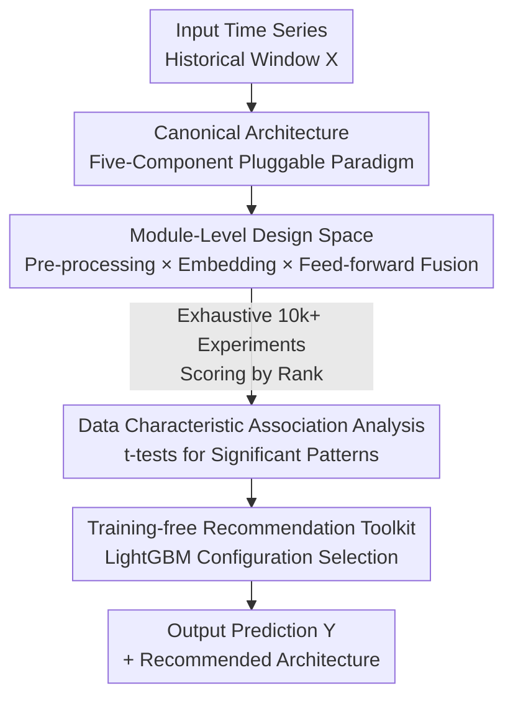

# TimeRecipe: A Time-Series Forecasting Recipe via Benchmarking Module Level Effectiveness

**Conference**: ICLR 2026  
**OpenReview**: [https://openreview.net/forum?id=CsoR8ztROC](https://openreview.net/forum?id=CsoR8ztROC)  
**Code**: https://github.com/AdityaLab/TimeRecipe  
**Area**: Time-Series Forecasting / Benchmarking / AutoML  
**Keywords**: Time-series forecasting, module-level benchmark, canonical architecture, design space search, training-free model selection

## TL;DR
The authors decompose modern time-series forecasting models into a five-component "Canonical Architecture" (pre-processing, embedding, feed-forward modeling, projection, and post-processing). By conducting over 10,000 experiments to systematically evaluate the effectiveness of each design at a modular granularity across different data/tasks, they found that combinations obtained through exhaustive design space search outperform existing SOTA models in over 90% of scenarios. Based on these findings, they trained a training-free LightGBM toolkit that directly recommends architecture configurations according to data characteristics.

## Background & Motivation
**Background**: Deep learning for time-series forecasting is flourishing, with Transformer-based (Informer, PatchTST, iTransformer), MLP-based (DLinear, FITS, TimeMixer), and various modules like sequence decomposition and instance normalization emerging constantly. However, as these methods stack modules end-to-end, the community continues to debate "which component is useful under what conditions."

**Limitations of Prior Work**: Existing time-series forecasting benchmarks (such as FoundTS, GiftEval, TFB) almost exclusively stay at the **model-level** evaluation—concluding that "a certain complete model performs best on a specific dataset." Such conclusions are not transferable to real-world scenarios outside the benchmark and only indicate "who won" without explaining "why" or "which module contributed."

**Key Challenge**: The performance of time-series forecasting models is actually determined by internal modules (e.g., whether to use normalization, token vs. patch embedding, MLP vs. Transformer, temporal vs. feature fusion). However, current evaluations treat models as black boxes, where the contribution of individual modules is masked by the overall performance, leading to design choices based purely on empirical intuition.

**Goal**: To answer the question of "which modules and designs are most effective in which time-series forecasting scenarios" by shifting from the model-level down to the **module-level**, and transforming these answers into actionable tools.

**Key Insight**: The authors observed that mainstream models following Informer have converged into a common paradigm—all can be decomposed into five standard components. Consequently, this paradigm can be abstracted into a unified "Canonical Architecture," treating candidate modules for each component as pluggable hyperparameters. This transforms hundreds of models into different coordinate points within the same design space for exhaustive evaluation under a fair, unified pipeline.

**Core Idea**: Replace "complete model comparison" with "Canonical Architecture + module-level exhaustive benchmark + data characteristic association analysis + training-free recommender," shifting time-series forecasting from "experimenting with models" to "selecting modules based on data characteristics."

## Method

### Overall Architecture
TimeRecipe is not just another forecasting model but a **unified module-level evaluation framework**. Its core involves abstracting the shared structure of mainstream forecasting models into a **Canonical Architecture** comprising five components: pre-processing, embedding, feed-forward modeling, projection, and post-processing (paired with pre-processing). The framework treats the selection of modules within each component as controllable hyperparameters. Given a set of hyperparameters, the framework automatically adjusts hidden dimensions, initializes module connections, and arranges tensor operations for forward propagation to assemble a fully trainable forecasting model.

The authors primarily benchmark the first three components (pre-processing, embedding, and feed-forward modeling) because projection is usually a single linear layer and post-processing is naturally paired with pre-processing. Exhaustive search within this design space covers over 100 architectures; published models like iTransformer, PatchTST, DLinear, Autoformer, and Informer are merely specific coordinate points. After running over 10,000 experiments, the framework distills the rules of "data characteristics $\rightarrow$ optimal module configuration" via association analysis and trains a LightGBM as a training-free architecture recommender.

### Key Designs

**1. Canonical Architecture: Unifying hundreds of models into a five-component pluggable paradigm**

Existing benchmarks treat each model as an independent black box, making it impossible to align modules across models for fair comparison. The authors resolve this by observing that mainstream models have converged to a common paradigm, defining a Canonical Architecture: inputs undergo **pre-processing** (normalization/decomposition), followed by **embedding** to map raw series to a representation space, then **feed-forward modeling** to capture dependencies, and finally **projection** to restore dimensions and **post-processing** to map predictions back to the original space. Post-processing is paired with pre-processing—for instance, RevIN's denormalization $\hat{Y}_t = \hat{Y}_t^{\text{Norm}}\sqrt{\sigma^2(X_t)+\epsilon}+\mu(X_t)$ or sequence decomposition's addition of trend/seasonal components $\hat{Y}=\hat{Y}^{\text{Trend}}+\hat{Y}^{\text{Season}}$. Thus, iTransformer, PatchTST, DLinear, Autoformer, and Informer become instances with "different switches" within this architecture (e.g., DLinear = No IN + SD + Temporal Fusion + No Embedding + MLP), allowing them to be aligned and compared at the module level for the first time.

**2. Module-Level Design Space: Treating component candidates as hyperparameters to cover 100+ architectures**

To determine which modules are effective, one must be able to combine them freely. The authors enumerate mainstream candidates for the three benchmarked components: Pre-processing includes **Instance Normalization (IN)** (mapping to 0–1 distribution per sample via $X_t^{\text{Norm}}=\frac{X_t-\mu(X_t)}{\sqrt{\sigma^2(X_t)+\epsilon}}$) and **Series Decomposition (SD)** (splitting trend and seasonal parts via moving averages: $X_t^{\text{Trend}}=\text{AvgPool}(\text{Padding}(X_t))$, $X_t^{\text{Season}}=X_t-X_t^{\text{Trend}}$). Embedding includes **Token** (convolution along the time axis), **Patch** (segmenting and treating segments as tokens with channel-independence), **Invert** (treating the entire lookback of a single variable as a token to model inter-variable dependencies), **Frequency** (rFFT transformation, non-parametric operation), and None (control baseline). Feed-forward modeling uses **MLP / Transformer / RNN** architectures and distinguishes between **temporal fusion** (modeling temporal dependencies) and **feature fusion** (modeling feature correlations). TimeRecipe controls these choices with a set of switches, automatically adapting tensor shapes (which implicitly covers channel-independence, such as Invert + MLP + temporal fusion).

**3. Rank Normalization + Data Characteristic Association Analysis: Upgrading "who is useful" to "useful on what data"**

Error scales vary significantly across datasets, making direct MSE/MAE comparisons unfair. The authors use an **average rank score**—if a configuration ranks 1st in MSE and 2nd in MAE, its rank score is 1.5—to unify comparability. On this basis, the authors establish a taxonomy of time-series data characteristics (seasonality, trend, stationarity, transition, shifting, correlation, plus multivariability, N-Feature, and HL-Ratio) and use **t-tests** to determine if a module configuration is significantly better under specific data conditions (retained if $p \leq 0.05$). This analysis yields human-readable rules: for example, IN is most effective when shifting is high and seasonality is low (consistent with its design for distribution shift), RNN is more flexible when the HL-Ratio is low (as long-horizon errors accumulate), and Patch embedding excels when the trend is strong.

**4. Training-free Recommendation Toolkit: Using LightGBM to turn empirical rules into an accessible selector**

To make these rules practical, the authors implement a training-free model selector: a **LightGBM regression model** is trained with "data characteristics + model configuration" as input and the benchmarked rank score as output. For a new forecasting task, one only needs to calculate its data characteristics and predict rank scores for a set of candidate configurations, selecting the one with the lowest predicted rank—**without training any forecasting models**. Even with this simple tree model, it selects architectures closer to the global optimum than existing best models in both in-distribution (ETTh1) and out-of-distribution (unemployment rate forecasting) scenarios.

## Key Experimental Results

Experiments cover dozens of datasets including LTSF (ETT series, ILI, ECL, Weather, Exchange), PEMS (03/04/07/08), and M4, spanning four task types: univariate/multivariate and short/long-term. Over 10,000 experiments were conducted, with results averaged over 4 random seeds on a 32GB V100.

### Main Results: Exhausting Design Space Outperforms SOTA

| Scenario | Configuration | Key Result | Description |
|------|------|---------|------|
| PEMS03, horizon=12 Short-term MV | TimeRecipe Optimal | MSE **0.714** | Rank 1 in design space |
| Same as above | iTransformer | MSE 0.739 | Ranked 7th only |
| 102 Scenarios Statistics | TimeRecipe Best vs. Prev. SOTA | 92/102 scenarios won (>90%) | Average error reduced by **5.4%** (std 2.88%, t-test p=0.0069) |
| Same as above | — | Prev. SOTA average lag: 13.66 ranks | Existing SOTA is far from the optimal coordinate |

### Ablation Study: Toolkit Selection (OOD Unemployment Social_12_S)

| Source | Config (IN/SD/Fusion/Embed/FF) | Rank | MSE | Relative |
|------|------|------|------|------|
| TimeRecipe Global Optimum | ✓/✗/Feature/Patch/MLP | 1.0 | 0.0854 | Baseline |
| Prev. SOTA (PatchTST) | ✓/✗/Temporal/Patch/Trans | 25.5 | 0.0994 | -16.4% |
| One of Top-3 Recommended | ✓/✓/Temporal/Invert/RNN | 5.5 | 0.0897 | Only -5.0% from global opt |

At least one of the Top-3 training-free recommendations consistently outperforms existing best models and approaches the global optimum found via exhaustive search.

### Key Findings
- **No Universal Architecture**: Optimal configurations change significantly across datasets—ETT multivariate prefers Patch + MLP/RNN, while Invert + Transformer is better for Electricity. IN is beneficial for most LTSF datasets but degrades performance on PEMS.
- **Module Effectiveness is Strongly Correlated with Data Characteristics**: The t-test results provide a readable rule table (e.g., SD is useful for multivariate data with low shifting but for univariate data with high shifting), shifting design choices to align with data properties.
- **Existing SOTA is Generally Sub-optimal**: Averaging 13.66 ranks behind the optimal combination, indicating that the design space has not been fully explored by current models.

## Highlights & Insights
- **Reframing "Comparing Models" as "Comparing Modules"**: The abstraction of the Canonical Architecture is the pivot of the paper—it transforms hundreds of seemingly different models into coordinates in the same space, enabling fair module-level exhaustive evaluation for the first time.
- **Rank Normalization for Cross-Dataset Comparability**: Using average rank scores instead of raw error values cleverly bypasses the issue of varying scales across datasets, a trick applicable to any cross-dataset benchmark.
- **Closed Loop from Insight to Tool**: Beyond providing rules, the light LightGBM "data characteristics $\rightarrow$ recommended architecture" selector makes the benchmark's conclusions truly usable for downstream tasks rather than just staying in paper tables.
- **Transferability**: This paradigm—"define canonical architecture $\rightarrow$ enumerate modules $\rightarrow$ exhaustive evaluation $\rightarrow$ correlate data characteristics $\rightarrow$ train selector"—can be directly applied to other fields with "combinatorial design explosion" like time-series classification or GNN design.

## Limitations & Future Work
- **Intentional Pruning of Design Space**: To avoid combinatorial explosion, highly specialized designs (e.g., Crossformer's entangled temporal-feature fusion) and data augmentation (e.g., TimeMixer's downsampling) were omitted; "covering 100+ architectures" does not equal covering all SOTA designs.
- **Restricted to Supervised Learning**: The framework explicitly excludes foundation models or prompting methods (Time-MOE, TimesFM, Chronos), as modifying a single module would break pre-trained components, limiting relevance to the current trend of TSF foundation models.
- **Correlation, Not Causality**: The "significantly better" findings from t-tests represent statistical correlations. The authors noted that interactions like SD and shifting have opposite directions in univariate vs. multivariate data, requiring further research into the underlying mechanisms.
- **Recommender Dependence on Benchmark Coverage**: The reliability of the LightGBM selector is limited by the range of configurations and data characteristics seen during training, making its extrapolation to entirely new tasks with different structures uncertain.

## Related Work & Insights
- **vs. Model-level Benchmarks (FoundTS / GiftEval / TFB)**: These evaluate whole models and provide case-specific best results. This work goes down to the module level to explain "why" and provide transferable selection rules.
- **vs. Single-Architecture Papers (DLinear / PatchTST / iTransformer / TimeMixer)**: These claim superiority for specific modules (MLP, patch, invert, decomposition). This work remains neutral, unifying them into a Canonical Architecture for exhaustive testing, concluding that "there is no universal design; it depends on data characteristics."
- **vs. Time-Series AutoML (AutoForecast, etc.)**: Traditional AutoML often performs model-level search and hyperparameter optimization. This work refines the search space to the module level, providing infrastructure for fine-grained TS-AutoML.

## Rating
- Novelty: ⭐⭐⭐⭐⭐ First systematic module-level TSF benchmark; Canonical Architecture is a genuine conceptual contribution.
- Experimental Thoroughness: ⭐⭐⭐⭐⭐ 10k+ experiments, dozens of datasets, four task types, 4 seeds averaged; extremely high coverage.
- Writing Quality: ⭐⭐⭐⭐ Clear motivation and readable rules; some module details require checking the appendix.
- Value: ⭐⭐⭐⭐⭐ Challenges the "one-size-fits-all" narrative while providing a practical training-free selection tool.

<!-- RELATED:START -->

## Related Papers

- [\[ICLR 2026\] Unlocking the Value of Text: Event-Driven Reasoning and Multi-Level Alignment for Time Series Forecasting](unlocking_the_value_of_text_event-driven_reasoning_and_multi-level_alignment_for.md)
- [\[ICLR 2026\] Benchmarking ECG FMs: A Reality Check Across Clinical Tasks](benchmarking_ecg_fms_a_reality_check_across_clinical_tasks.md)
- [\[ICML 2026\] Position: Current Benchmarking Hinders Real Progress in Deep Learning for Time Series](../../ICML2026/time_series/position_current_benchmarking_hinders_real_progress_in_deep_learning_for_time_se.md)
- [\[ICLR 2026\] Understanding Transformers in Time Series Forecasting: A Case Study on MOIRAI](understanding_transformers_for_time_series_forecasting_a_case_study_on_moirai.md)
- [\[ICLR 2026\] MMPD: Diverse Time Series Forecasting via Multi-Mode Patch Diffusion Loss](mmpd_diverse_time_series_forecasting_via_multi-mode_patch_diffusion_loss.md)

<!-- RELATED:END -->
